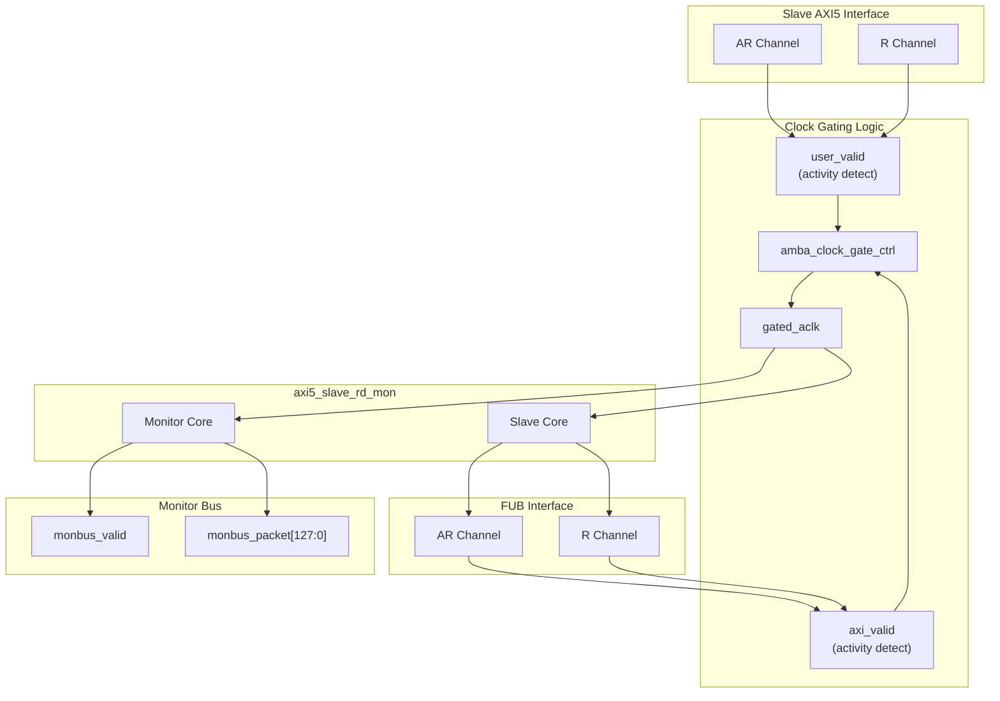

<!-- RTL Design Sherpa Documentation Header -->
<table>
<tr>
<td width="80">
  <a href="https://github.com/sean-galloway/RTLDesignSherpa">
    
  </a>
</td>
<td>
  <strong>RTL Design Sherpa</strong> · <em>Learning Hardware Design Through Practice</em><br>
  <sub>
    <a href="https://github.com/sean-galloway/RTLDesignSherpa">GitHub</a> ·
    <a href="https://github.com/sean-galloway/RTLDesignSherpa/blob/main/docs/DOCUMENTATION_INDEX.md">Documentation Index</a> ·
    <a href="https://github.com/sean-galloway/RTLDesignSherpa/blob/main/LICENSE">MIT License</a>
  </sub>
</td>
</tr>
</table>

---

<!-- End Header -->

# AXI5 Slave Read Monitor with Clock Gating

**Module:** `axi5_slave_rd_mon_cg.sv`
**Location:** `rtl/amba/axi5/` (protocol monitors live with their protocol; only the monitor CORE pieces are in `rtl/amba/monitor/`)
**Status:** Production Ready

---

## Overview

The AXI5 Slave Read Monitor with Clock Gating module puts both power management and observability on the slave read path: it wraps `axi5_slave_rd_mon` with clock gating logic, so transaction monitoring and automatic clock gating come in one block.

### Key Features

- Full AMBA AXI5 slave read protocol compliance
- **Integrated filtered monitoring** - real-time transaction visibility
- **Integrated clock gating** for dynamic power reduction
- All AXI5 extensions supported (NSAID, TRACE, MPAM, MECID, UNIQUE, CHUNKING, MTE, POISON)
- Configurable idle count before gating
- Transaction tracking with error detection
- Performance metrics and filtering
- Transparent gating - no protocol changes
- Gating status outputs for system monitoring

### Module Architecture



---

## Parameters

| Parameter | Type | Default | Description |
|-----------|------|---------|-------------|
| SKID_DEPTH_AR | int | 2 | AR channel SKID buffer depth |
| SKID_DEPTH_R | int | 4 | R channel SKID buffer depth |
| AXI_ID_WIDTH | int | 8 | Transaction ID width |
| AXI_ADDR_WIDTH | int | 32 | Address bus width |
| AXI_DATA_WIDTH | int | 32 | Data bus width |
| AXI_USER_WIDTH | int | 1 | User signal width |
| AXI_NSAID_WIDTH | int | 4 | Non-secure access ID width |
| AXI_MPAM_WIDTH | int | 11 | MPAM width |
| AXI_MECID_WIDTH | int | 16 | Memory encryption context width |
| AXI_TAG_WIDTH | int | 4 | Memory tag width per 16 bytes |
| AXI_TAGOP_WIDTH | int | 2 | Tag operation width |
| AXI_CHUNKNUM_WIDTH | int | 4 | Chunk number width |
| ENABLE_NSAID | bit | 1 | Enable non-secure access ID |
| ENABLE_TRACE | bit | 1 | Enable trace signals |
| ENABLE_MPAM | bit | 1 | Enable memory partitioning |
| ENABLE_MECID | bit | 1 | Enable memory encryption |
| ENABLE_UNIQUE | bit | 1 | Enable unique ID indicator |
| ENABLE_CHUNKING | bit | 1 | Enable data chunking |
| ENABLE_MTE | bit | 1 | Enable Memory Tagging Extension |
| ENABLE_POISON | bit | 1 | Enable poison indicator |
| UNIT_ID | int | 1 | Monitoring unit identifier |
| AGENT_ID | int | 12 | Agent identifier |
| MAX_TRANSACTIONS | int | 16 | Transaction table size |
| ENABLE_FILTERING | bit | 1 | Enable packet filtering |
| ADD_PIPELINE_STAGE | bit | 0 | Add pipeline stage for timing |
| USE_MONITOR | bit | 1 | Synthesis-time monitor enable (forwarded to inner monitor). |
| N_ADDR_RANGES | int | 0 | Number of address-range comparators (forwarded to base module). |
| ENABLE_ERROR_LOGIC | bit | 1 | Synthesis-cone enable for error detection (forwarded to base module) |
| ENABLE_TIMEOUT_LOGIC | bit | 1 | Synthesis-cone enable for timeout detection (forwarded to base module) |
| ENABLE_COMPL_LOGIC | bit | 1 | Synthesis-cone enable for completion tracking (forwarded to base module) |
| ENABLE_THRESHOLD_LOGIC | bit | 1 | Synthesis-cone enable for threshold detection (forwarded to base module) |
| ENABLE_PERF_LOGIC | bit | 1 | Synthesis-cone enable for the REPORTER's legacy perf-packet cone and the two lifetime counters only -- the window FSM and bucket/beat/byte/burst counters are unconditional (always compiled, always live) |
| ENABLE_DEBUG_LOGIC | bit | 0 | Synthesis-cone enable for the debug/trace cone (forwarded to base module) |
| `ACLK_MHZ` | int | 100 | Clock frequency in MHz. Builds the microsecond tick LUT in `counter_freq_invariant`. **Leave this at 100 on a 90 MHz part and every us-denominated timeout is wrong, silently** -- it was unreachable through this wrapper until 2026-09-01. |
| `CFI_MIN_FREQ_MHZ` | int | `ACLK_MHZ` | Lowest frequency the tick LUT must cover (dynamic-frequency builds). |
| `CFI_MAX_FREQ_MHZ` | int | `ACLK_MHZ` | Highest frequency the tick LUT must cover. |
| `USE_WDATA_ORDER_Q` | bit | 0 | Write-data ordering queue. Required (=1) whenever `NUM_BANKS` > 1. |
| `NUM_BANKS` | int | 1 | Transaction-table banking. >1 needs `USE_WDATA_ORDER_Q`=1; the inner module's elaboration guard fires otherwise. |
| `ADDR_FILTER_ENABLE` | bit | 0 | Synthesises the address-range report filter. **The parameter only decides whether the logic EXISTS** -- a build that sets it and leaves `cfg_addr_filter_enable` low filters nothing and looks broken. |
| `ID_FILTER_ENABLE` | bit | 0 | Synthesises the ID report filter (see `cfg_id_*` for the runtime override). |
| `ID_MATCH_BASE` | int | 0 | First ID this instance owns. |
| `ID_MATCH_COUNT` | int | 0 | How many IDs; `0` means ALL, so a zeroed register block does not silently filter everything away. |
| CG_IDLE_COUNT_WIDTH | int | 4 | Clock gating idle counter width |

---

## Ports


### Filter configuration (forwarded)

These reach the inner monitor through this wrapper; before 2026-09-01 they did not.

| Port | Direction | Width | Description |
|------|-----------|-------|-------------|
| `cfg_addr_filter_enable` | Input | 1 | High: suppress packets for transactions outside the window. Low: inert, whatever `ADDR_FILTER_ENABLE` says |
| `cfg_addr_filter_low` | Input | ADDR_WIDTH | Window base, inclusive |
| `cfg_addr_filter_high` | Input | ADDR_WIDTH | Window limit, inclusive |
| `cfg_id_filter_enable` | Input | 1 | High: use the runtime window below instead of the `ID_MATCH_*` parameters |
| `cfg_id_match_base` | Input | ID_WIDTH | First ID to accept |
| `cfg_id_match_count` | Input | ID_WIDTH+1 | How many; `0` means ALL |

### Clock and Reset

| Port | Width | Direction | Description |
|------|-------|-----------|-------------|
| aclk | 1 | Input | AXI clock (ungated) |
| aresetn | 1 | Input | AXI active-low reset |

### Clock Gating Configuration

| Port | Width | Direction | Description |
|------|-------|-----------|-------------|
| cfg_cg_enable | 1 | Input | Enable clock gating |
| cfg_cg_idle_count | CG_IDLE_COUNT_WIDTH | Input | Idle cycles before gating |

### Slave AXI5 Interface

Same as `axi5_slave_rd` - see [AXI5 Slave Read](../axi5/axi5_slave_rd.md) for complete port list.

### FUB Interface

Same as `axi5_slave_rd` - see [AXI5 Slave Read](../axi5/axi5_slave_rd.md) for complete port list.

### Monitor Configuration

Same as `axi5_slave_rd_mon` - see [AXI5 Slave Read Monitor](axi5_slave_rd_mon.md) for complete list.

### Monitor Bus Output

| Port | Width | Direction | Description |
|------|-------|-----------|-------------|
| monbus_valid | 1 | Output | Monitor packet valid |
| monbus_ready | 1 | Input | Monitor packet ready |
| monbus_packet | 128 | Output | `monitor_packet_t` (see format below) |
| monbus_timestamp | 64 | Output | `monbus_timestamp_t` paired atomically with `monbus_packet` |
| i_mon_time | 64 | Input | Free-running counter from `monbus_group_core`, sampled at packet emission |

### Status Outputs

| Port | Width | Direction | Description |
|------|-------|-----------|-------------|
| busy | 1 | Output | Module busy indicator |
| active_transactions | 8 | Output | Current outstanding transactions |
| error_count | 16 | Output | Total errors detected |
| transaction_count | 32 | Output | Total transactions completed |
| cfg_conflict_error | 1 | Output | Configuration conflict detected |
| cg_gating | 1 | Output | Clock is currently gated |
| cg_idle | 1 | Output | Module is idle |

---

## Functional Description

### Clock Gating Behavior

**Activity Detection:**
- **user_valid:** Asserted when slave interface has activity (arvalid, rvalid, internal busy, a monitor packet pending on the monitor bus, or monitor CAM entries still live -- peer VALID)
- **axi_valid:** Asserted when FUB interface has activity (arvalid, rvalid)

**Key Points:**
- Clock gating disabled when `cfg_cg_enable = 0`
- Ready signals forced to 0 when gated (prevents new transactions)
- Gating only occurs after configured idle period
- Any activity immediately ungates the clock
- Monitor state IS a wake term: both a packet pending on the monitor bus (`w_monbus_valid`) and live monitor CAM entries (`|active_transactions`, which covers the reporter's few-cycle emission window) hold the block awake, and the external `monbus_valid` is masked with `!cg_gating` -- so monitor-bus delivery is exactly-once across gating at any idle count (`val/amba/test_mon_cg_gating.py` phase 6)

### Performance Monitoring

The clock-gated wrapper exposes the full perfmon interface of the base module and **forwards every port unchanged** to the inner `axi5_slave_rd_mon`. The measurement-window state machine, the four R-channel utilization buckets (productive / back-pressure / starvation / idle), and the beat/byte/burst throughput counters behave exactly as documented in the base module — see [Performance Monitoring in axi5_slave_rd_mon](axi5_slave_rd_mon.md#performance-monitoring) for the full narrative and per-bit semantics.

Forwarded perfmon ports (identical width and direction to the base module):

- **Inputs:** `cfg_perf_enable`, `cfg_start_event_sel` (3), `cfg_end_event_sel` (3), `cfg_start_trigger`, `cfg_end_trigger`, `cfg_window_force_close`
- **Outputs:** `window_active`, `window_cycles` (32), `perf_prod_cycles` (32), `perf_bp_cycles` (32), `perf_starv_cycles` (32), `perf_idle_cycles` (32), `perf_beat_count` (32), `perf_byte_count` (64), `perf_burst_count` (32)

The `perf_burst_count` output tracks AR (read address) handshakes.
**WARNING:** an open measurement window is NOT a wake term -- the window
FSM and all counters run on the gated clock, so if the bus idles past
`cfg_cg_idle_count` mid-window the counters FREEZE while wall-clock time
passes, and trigger pulses arriving while gated are DROPPED. For exact
wall-clock windows hold `cfg_cg_enable` low around the measurement, or
use the base module.

Alongside perfmon, the wrapper forwards the `cfg_compl_enable`, `cfg_threshold_enable`, and `cfg_debug_enable` control inputs, plus the six `ENABLE_*_LOGIC` synthesis-cone parameters (see [Parameters](#parameters)), straight through to the base monitor.

---

## Usage Example

```systemverilog
axi5_slave_rd_mon_cg #(
    .AXI_ID_WIDTH       (8),
    .AXI_ADDR_WIDTH     (32),
    .AXI_DATA_WIDTH     (64),
    .UNIT_ID            (1),
    .AGENT_ID           (12),
    .MAX_TRANSACTIONS   (16),
    .CG_IDLE_COUNT_WIDTH(4),
    .ENABLE_FILTERING   (1),
    .ENABLE_NSAID       (1),
    .ENABLE_TRACE       (1),
    .ENABLE_MPAM        (1),
    .ENABLE_MECID       (1),
    .ENABLE_UNIQUE      (1),
    .ENABLE_CHUNKING    (1),
    .ENABLE_MTE         (1),
    .ENABLE_POISON      (1)
) u_axi5_slave_rd_mon_cg (
    .aclk               (axi_clk),
    .aresetn            (axi_rst_n),

    // Clock gating config
    .cfg_cg_enable      (1'b1),          // Enable gating
    .cfg_cg_idle_count  (4'd3),          // Gate after 4 idle cycles (count+1; a LITERAL count, not a power of two)

    // Slave interface (from external master)
    .s_axi_arid         (s_axi_arid),
    .s_axi_araddr       (s_axi_araddr),
    // ... (connect all slave AR/R signals)

    // FUB interface (to backend)
    .fub_axi_arid       (mem_arid),
    .fub_axi_araddr     (mem_araddr),
    // ... (connect to memory controller)

    // Monitor configuration
    .cfg_monitor_enable (1'b1),
    .cfg_error_enable   (1'b1),
    .cfg_timeout_enable (1'b1),
    .cfg_perf_enable    (1'b0),
    .cfg_timeout_cycles (16'd10),   // 10 microseconds per phase (full 16-bit range)
    .cfg_latency_threshold (32'd500),
    .cfg_axi_pkt_mask   (16'hFFF4),  // set bit = DROP; pass ERROR|COMPL|TIMEOUT

    // Monitor bus
    .monbus_valid       (mon_valid),
    .monbus_ready       (mon_ready),
    .monbus_packet      (mon_packet),

    // Status
    .busy               (slave_rd_busy),
    .active_transactions(active_txns),
    .error_count        (total_errors),
    .transaction_count  (total_txns),
    .cfg_conflict_error (cfg_conflict),

    // Clock gating status
    .cg_gating          (slave_rd_gating),
    .cg_idle            (slave_rd_idle)
);

// Power management integration
assign system_power_save = slave_rd_gating &&
                          slave_wr_gating;

// Monitor packet handling
gaxi_fifo_sync #(.DATA_WIDTH(128), .DEPTH(256)) u_mon_fifo (
    .axi_aclk      (axi_clk),
    .axi_aresetn    (axi_rst_n),
    .wr_valid    (mon_valid),
    .wr_data     (mon_packet),
    .wr_ready    (mon_ready),
    .rd_valid    (fifo_valid),
    .rd_data     (fifo_data),
    .rd_ready    (consumer_ready)
);
```

---

## Design Notes

### Power Optimization

**Power Savings Estimation:**
- Base slave logic: ~40% of total power *(first-order estimates -- no power/area analysis has been run)*
- Monitor logic: ~60% of total power
- With gating at 50% duty cycle: ~50% dynamic power savings
- Actual savings depend on traffic pattern and idle_count setting

### Observability

**Monitoring Capabilities:**
- Error detection (SLVERR, timeout, orphan)
- Performance tracking (latency, throughput)
- Transaction completion tracking
- Protocol violation detection
- All monitoring continues when ungated

### When to Use This Module

**Ideal for:**
- Power-constrained systems needing visibility
- Debug/validation builds with power budgets
- Systems with sporadic transaction patterns
- SoC integration requiring both monitoring and power optimization

**Avoid when:**
- Interface is continuously active (minimal gating opportunities)
- Monitoring overhead unacceptable (use non-monitored version)
- Deterministic latency critical (use high idle count or disable gating)

### Configuration Recommendations

**Low-Power Debug Mode:**
```systemverilog
.cfg_cg_enable      (1'b1),
.cfg_cg_idle_count  (4'd1),   // Aggressive gating
.cfg_monitor_enable (1'b1),   // Full monitoring
.cfg_error_enable   (1'b1),
.cfg_perf_enable    (1'b0)    // Reduce packet traffic
```

**Performance Analysis Mode:**
```systemverilog
.cfg_cg_enable      (1'b1),
.cfg_cg_idle_count  (4'd4),   // Conservative gating
.cfg_monitor_enable (1'b1),   // Master gate MUST stay 1 (0 disables ALL monitoring); disable completions via cfg_compl_enable
.cfg_perf_enable    (1'b1)    // Enable performance metrics
```

### Area and Timing Impact

- **Area:** ~5-8% increase over non-monitored slave (monitoring + clock gating)
- **Timing:** Clock gating adds <50ps, monitoring is off critical path
- **Power:** Net savings depends on activity factor (typically 30-50% at 50% duty cycle)

---

## Related Modules

- **[AXI5 Slave Read](../axi5/axi5_slave_rd.md)** - Non-monitored, non-gated version
- **[AXI5 Slave Read CG](../axi5/axi5_slave_rd_cg.md)** - Clock-gated without monitoring
- **[AXI5 Slave Read Monitor](axi5_slave_rd_mon.md)** - Monitored without clock gating
- **[AXI5 Slave Write Monitor CG](axi5_slave_wr_mon_cg.md)** - Write variant
- **[AMBA Clock Gate Control](../shared/amba_clock_gate_ctrl.md)** - Clock gating controller

---

## Navigation

- **[← Back to AXI5 Index](../_book_monitor_index.md)**
- **[← Back to rtl-amba Index](../index.md)**
- **[← Back to Main Documentation Index](../../index.md)**
