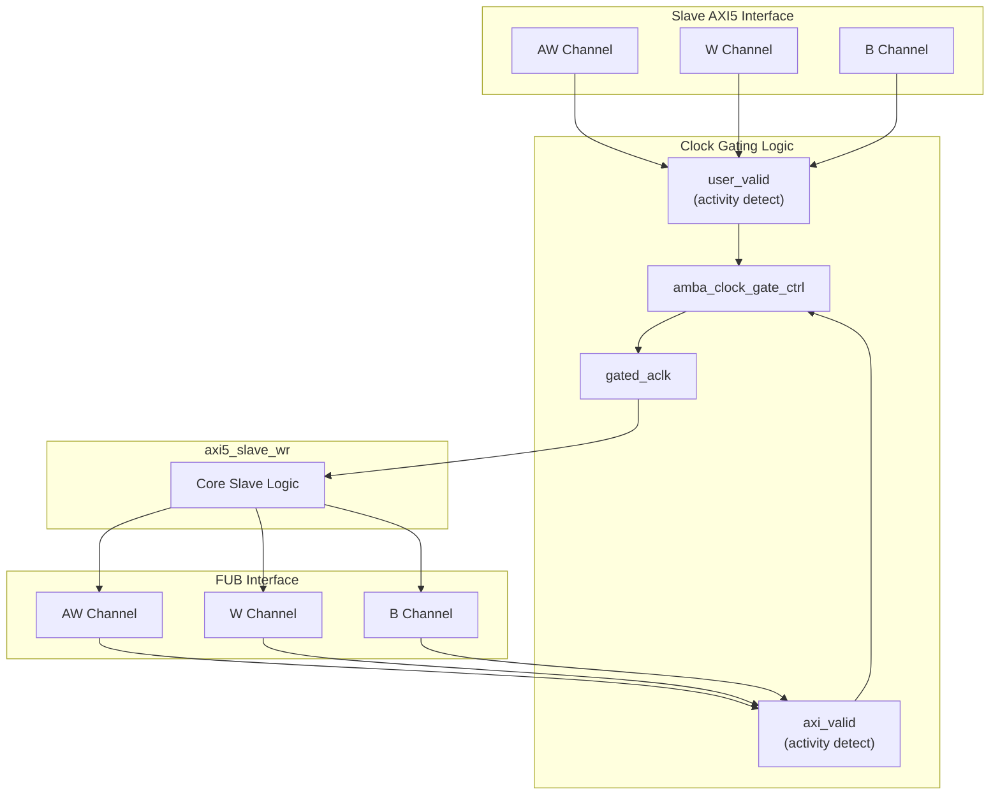

<!-- RTL Design Sherpa Documentation Header -->
<table>
<tr>
<td width="80">
  <a href="https://github.com/sean-galloway/RTLDesignSherpa">
    
  </a>
</td>
<td>
  <strong>RTL Design Sherpa</strong> · <em>Learning Hardware Design Through Practice</em><br>
  <sub>
    <a href="https://github.com/sean-galloway/RTLDesignSherpa">GitHub</a> ·
    <a href="https://github.com/sean-galloway/RTLDesignSherpa/blob/main/docs/DOCUMENTATION_INDEX.md">Documentation Index</a> ·
    <a href="https://github.com/sean-galloway/RTLDesignSherpa/blob/main/LICENSE">MIT License</a>
  </sub>
</td>
</tr>
</table>

---

<!-- End Header -->

# AXI5 Slave Write with Clock Gating

**Module:** `axi5_slave_wr_cg.sv`
**Location:** `rtl/amba/axi5/`
**Status:** Production Ready

---

## Overview

The AXI5 Slave Write with Clock Gating module wraps the standard `axi5_slave_wr` module with integrated clock gating for power optimization. It automatically gates the internal clock when the module is idle.

**Scope:** this module transports AXI5 signals; it does not implement AXI5 transaction semantics. `AWATOP` is carried through unmodified but no atomic read-modify-write is performed, no MTE tag checking or `BTAGMATCH` generation is performed, and no outstanding-transaction tracking is done. Those behaviors belong to the endpoints on either side. See [Scope of This Implementation](README.md) in the AXI5 index for the full coverage statement.

### Key Features

- Carries the full AXI5 write signal set listed below, unmodified, across the SKID buffers
- **Integrated clock gating** for dynamic power reduction
- Configurable idle count before gating
- All AXI5 extensions supported (ATOMIC, NSAID, TRACE, MPAM, MECID, UNIQUE, MTE, POISON)
- Transparent gating - no protocol changes
- Gating status outputs for system monitoring
- SKID buffering for AW, W, and B channels

---

## Module Architecture



---

## Parameters

| Parameter | Type | Default | Description |
|-----------|------|---------|-------------|
| SKID_DEPTH_AW | int | 2 | AW channel SKID buffer depth |
| SKID_DEPTH_W | int | 4 | W channel SKID buffer depth |
| SKID_DEPTH_B | int | 2 | B channel SKID buffer depth |
| AXI_ID_WIDTH | int | 8 | Transaction ID width |
| AXI_ADDR_WIDTH | int | 32 | Address bus width |
| AXI_DATA_WIDTH | int | 32 | Data bus width |
| AXI_USER_WIDTH | int | 1 | User signal width |
| AXI_ATOP_WIDTH | int | 6 | Atomic operation width |
| AXI_NSAID_WIDTH | int | 4 | Non-secure access ID width |
| AXI_MPAM_WIDTH | int | 11 | MPAM width |
| AXI_MECID_WIDTH | int | 16 | Memory encryption context width |
| AXI_TAG_WIDTH | int | 4 | Memory tag width per 16 bytes |
| AXI_TAGOP_WIDTH | int | 2 | Tag operation width |
| ENABLE_ATOMIC | bit | 1 | Enable atomic operations |
| ENABLE_NSAID | bit | 1 | Enable non-secure access ID |
| ENABLE_TRACE | bit | 1 | Enable trace signals |
| ENABLE_MPAM | bit | 1 | Enable memory partitioning |
| ENABLE_MECID | bit | 1 | Enable memory encryption |
| ENABLE_UNIQUE | bit | 1 | Enable unique ID indicator |
| ENABLE_MTE | bit | 1 | Enable Memory Tagging Extension |
| ENABLE_POISON | bit | 1 | Enable poison indicator |
| CG_IDLE_COUNT_WIDTH | int | 4 | Clock gating idle counter width |

### Derived Parameters

These are computed inside the module from the parameters above. Do not override them.

| Parameter | Expression | Description |
|-----------|------------|-------------|
| SW | AXI_WSTRB_WIDTH | Write strobe width, one bit per data byte |
| NUM_TAGS | max(AXI_DATA_WIDTH / 128, 1) | MTE tags carried per beat (one tag per 16 bytes) |
| TW | AXI_TAG_WIDTH * NUM_TAGS | Total width of the `awtag` / `wtag` / `btag` fields |
| AWSize | Sum of the enabled AW fields | AW SKID buffer payload width |
| WSize | Sum of the enabled W fields | W SKID buffer payload width |
| BSize | Sum of the enabled B fields | B SKID buffer payload width |

---

## Ports

### Clock and Reset

| Port | Width | Direction | Description |
|------|-------|-----------|-------------|
| aclk | 1 | Input | AXI clock (ungated) |
| aresetn | 1 | Input | AXI active-low reset |

### Clock Gating Configuration

| Port | Width | Direction | Description |
|------|-------|-----------|-------------|
| cfg_cg_enable | 1 | Input | Enable clock gating |
| cfg_cg_idle_count | CG_IDLE_COUNT_WIDTH | Input | Idle cycles before gating |

### Slave AXI5 Interface

Same as `axi5_slave_wr` - see [AXI5 Slave Write](axi5_slave_wr.md) for complete port list.

### FUB Interface

Same as `axi5_slave_wr` - see [AXI5 Slave Write](axi5_slave_wr.md) for complete port list.

### Clock Gating Status

| Port | Width | Direction | Description |
|------|-------|-----------|-------------|
| cg_gating | 1 | Output | Clock is currently gated |
| cg_idle | 1 | Output | Module is idle |

---

## Functionality

### Clock Gating Behavior

**Activity Detection:**
- **user_valid:** Asserted when slave interface has activity (awvalid, wvalid, bvalid, or internal busy -- peer VALID, post-fix)
- **axi_valid:** Asserted when FUB interface has activity (awvalid, wvalid, bvalid)

**Gating State Machine:**
```mermaid
stateDiagram-v2
    [*] --> ACTIVE

    ACTIVE --> COUNTING : !user_valid && !axi_valid
    COUNTING --> ACTIVE : user_valid || axi_valid
    COUNTING --> GATED : count == cfg_cg_idle_count
    GATED --> ACTIVE : user_valid || axi_valid

    state ACTIVE {
        note right of ACTIVE : Clock enabled<br/>cg_gating = 0
    }
    state COUNTING {
        note right of COUNTING : Idle countdown<br/>cg_gating = 0
    }
    state GATED {
        note right of GATED : Clock gated<br/>cg_gating = 1
    }
```

**Key Points:**
- Clock gating disabled when `cfg_cg_enable = 0`
- Ready signals (awready, wready) forced to 0 when gated (prevents new transactions)
- bready forced to 0 when gated (prevents accepting responses)
- Gating only occurs after configured idle period
- Any activity immediately ungates the clock


### Ready Deassertion and Wake Behavior

While `cg_gating` is asserted, the ready outputs listed above are forced low.

This is legal AXI. A READY output may be deasserted for any number of cycles, and neither side may assume READY asserts within a bounded time, so holding it low is ordinary backpressure rather than a protocol violation. It cannot deadlock either: the same VALID being held off also feeds the activity detector, so gating releases and READY returns to the core's value.

Two consequences are worth designing around:

- **Wake latency adds to first-transfer latency.** Activity is registered once (AXI4, AXI5, AXI4-Lite, AXI4-Stream) or twice (APB, APB5, AXI5-Stream -- with one exception: `apb4_slave_cdc_cg` drives `amba_clock_gate_ctrl` combinationally and so registers once, not twice) before reaching the ICG enable, which is combinational. The AXI5 `_cg` wrappers drive the activity terms combinationally, so there is 1 register stage and the first usable gated-clock edge arrives 2 cycles after activity asserts. Size `cfg_cg_idle_count` so that cost is amortized over the traffic burst that follows.
- **READY is a combinational function of `cg_gating`.** The path from the idle counter to the `s_axi_awready` and `s_axi_wready` outputs may need attention during timing closure, particularly at high frequency.

### Integration Caveat: `s_axi_bready` in the Activity Term

The activity detector uses the corresponding VALID (`s_axi_bvalid`), never the peer's READY. (Historically this term was `s_axi_bready`, which meant a peer parking its ready high -- a common and entirely correct style -- pinned the block permanently awake and defeated gating; that defect was fixed family-wide, matching the rule the mon_cg wrappers always carried.)

An always-ready consumer no longer prevents gating.

---

## Clock Gating Configuration

### Idle Count Selection

| cfg_cg_idle_count | Idle Cycles | Use Case |
|-------------------|-------------|----------|
| 0 | 1 | Aggressive power saving, frequent gating |
| 1-3 | 2-4 | Balanced, reduces gate churn |
| 4-7 | 5-8 | Conservative, for bursty traffic |
| 8-15 | 9-16 | Minimal gating (the 4-bit field maxes at 16 cycles -- the count is LITERAL, gating at count+1, not a power of two) |

**Recommendations:**
- **Burst writes:** Higher count (4-8) to avoid gating mid-burst
- **Sporadic writes:** Lower count (0-2) for maximum power savings
- **Real-time systems:** Disable gating or use high count to ensure deterministic latency

---

## Timing Diagrams

### Clock Gating During Write Burst

> **Timing diagram pending.** The signals and sequence this scenario
> exercises:
>
> - ACLK (ungated)
> - GATED_ACLK
> - AWVALID, WVALID, BVALID across a burst write
> - user_valid, axi_valid activity terms
> - cg_idle, cg_gating
> - Gating engaging after the burst and its B response complete


---

## Usage Example

```systemverilog
axi5_slave_wr_cg #(
    .AXI_ID_WIDTH       (8),
    .AXI_ADDR_WIDTH     (32),
    .AXI_DATA_WIDTH     (64),
    .SKID_DEPTH_AW      (2),
    .SKID_DEPTH_W       (4),
    .SKID_DEPTH_B       (2),
    .CG_IDLE_COUNT_WIDTH(4),
    .ENABLE_ATOMIC      (1),
    .ENABLE_NSAID       (1),
    .ENABLE_TRACE       (1),
    .ENABLE_MPAM        (1),
    .ENABLE_MECID       (1),
    .ENABLE_UNIQUE      (1),
    .ENABLE_MTE         (1),
    .ENABLE_POISON      (1)
) u_axi5_slave_wr_cg (
    .aclk               (axi_clk),
    .aresetn            (axi_rst_n),

    // Clock gating config
    .cfg_cg_enable      (1'b1),          // Enable gating
    .cfg_cg_idle_count  (4'd3),          // Gate after 4 idle cycles (count+1; a LITERAL count, not a power of two)

    // Slave interface (from external master)
    .s_axi_awid         (s_axi_awid),
    .s_axi_awaddr       (s_axi_awaddr),
    // Every remaining s_axi_aw*/s_axi_w*/s_axi_b* port mirrors the fub_axi_* list,
    // same names and widths, opposite directions. All must be connected.

    // FUB interface (to backend)
    .fub_axi_awid       (mem_awid),
    .fub_axi_awaddr     (mem_awaddr),
    // ... (connect to memory controller)

    // Clock gating status
    .cg_gating          (slave_wr_gating),
    .cg_idle            (slave_wr_idle)
);

// Optional: Monitor power savings
always @(posedge axi_clk) begin
    if (slave_wr_gating)
        $display("AXI5 Slave WR clock gated - saving power");
end

// Power management integration
assign system_low_power = slave_wr_gating &&
                         slave_rd_gating;
```

---

## Design Notes

### Power Savings Estimation

Worked example, assuming the module is active 60% of the time:
- **Without gating:** 100% of this module's dynamic power
- **With gating (idle_count=2):** roughly 50%, allowing for wake/sleep transitions
- **With gating (idle_count=0):** roughly 60%; more aggressive gating, but more transition overhead

All power figures on this page are first-order estimates derived from duty cycle, not measured results. No power analysis (gate-level or otherwise) has been run against these modules. Actual savings depend on the gated logic's share of total design power, the technology library's clock-gate cell, and leakage, which clock gating does not reduce at all. Treat these numbers as a sizing aid and characterize your own instance before quoting a savings figure.


### Write-Specific Considerations

**Burst Handling:**
- W channel SKID depth (4) larger than AW/B (2) to accommodate burst data
- Gating should not occur mid-burst (use adequate idle_count)
- Burst latency unaffected if gating disabled during active bursts

**Atomic Operations:**
- Atomic writes may have longer latencies
- Consider higher idle_count when ENABLE_ATOMIC=1
- Gating safe between atomic transactions

### Clock Gating Overhead

- **Area:** ~2-5% increase (clock gate cells, idle counter)
- **Timing:** Clock gating adds minimal delay (typically <50ps)
- **Power:** Overhead from gate control logic usually <1% of savings

### When to Use Clock Gating

**Good candidates:**
- Low-duty-cycle interfaces (sporadic transactions)
- Systems with strict power budgets
- Battery-operated devices
- Write-infrequent applications (logging, configuration)

**Avoid when:**
- Interface is continuously active (streaming writes)
- Gate/ungate transitions exceed power savings
- Deterministic latency required (use high idle count instead)
- Write bursts dominate (minimal idle periods)

---

## Related Documentation

- **[AXI5 Slave Write](axi5_slave_wr.md)** - Non-clock-gated version
- **[AXI5 Slave Read CG](axi5_slave_rd_cg.md)** - Clock-gated read variant
- **[AXI5 Slave Write Monitor CG](../axi5/axi5_slave_wr_mon_cg.md)** - With monitoring
- **[AMBA Clock Gate Control](../shared/amba_clock_gate_ctrl.md)** - Clock gating controller

---

## Navigation

- **[← Back to AXI5 Index](README.md)**
- **[← Back to rtl-amba Index](../index.md)**
- **[← Back to Main Documentation Index](../../index.md)**
