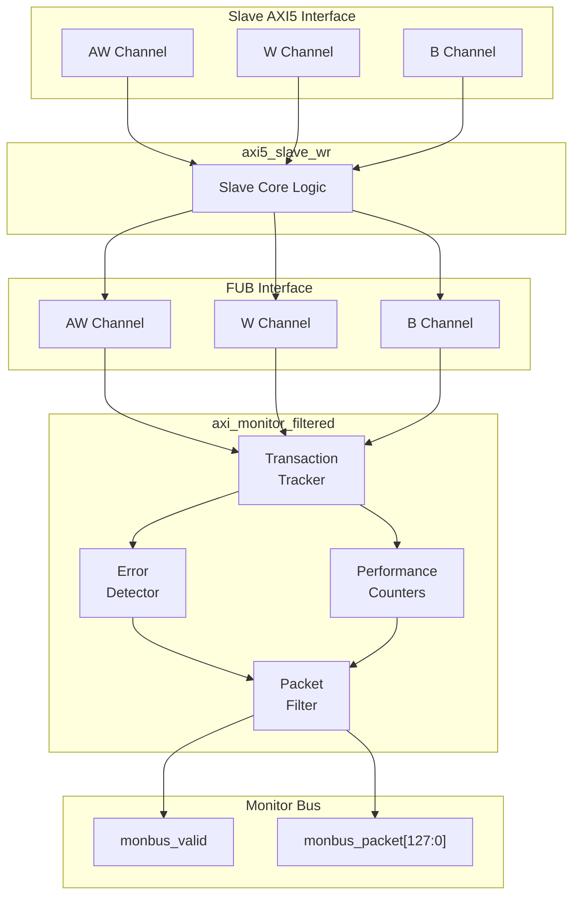

<!-- RTL Design Sherpa Documentation Header -->
<table>
<tr>
<td width="80">
  <a href="https://github.com/sean-galloway/RTLDesignSherpa">
    
  </a>
</td>
<td>
  <strong>RTL Design Sherpa</strong> · <em>Learning Hardware Design Through Practice</em><br>
  <sub>
    <a href="https://github.com/sean-galloway/RTLDesignSherpa">GitHub</a> ·
    <a href="https://github.com/sean-galloway/RTLDesignSherpa/blob/main/docs/DOCUMENTATION_INDEX.md">Documentation Index</a> ·
    <a href="https://github.com/sean-galloway/RTLDesignSherpa/blob/main/LICENSE">MIT License</a>
  </sub>
</td>
</tr>
</table>

---

<!-- End Header -->

# AXI5 Slave Write Monitor

**Module:** `axi5_slave_wr_mon.sv`
**Location:** `rtl/amba/axi5/` (protocol monitors live with their protocol; only the monitor CORE pieces are in `rtl/amba/monitor/`)
**Status:** Production Ready

---

## Overview

Most designs don't want a separate monitor bolted onto the bus — you want the slave to tell you what it's seeing. That's what this module does. It takes the `axi5_slave_wr` interface and builds the transaction monitor directly into the wrapper, giving you real-time visibility into slave write operations with configurable packet filtering and error detection. No external monitor block, no extra wiring beyond the monitor bus itself.

**Scope:** this module transports AXI5 signals; it does not implement AXI5 transaction semantics. It performs no MTE tag checking or `RTAGMATCH` generation, no chunk reassembly, no poison generation, and no atomic read-modify-write -- `AWATOP` is transported, not executed. The monitor observes handshakes, responses and timing; it performs no protocol checking of handshake stability, ID width, burst length or address alignment. See [Scope of This Implementation](README.md) in the AXI5 index for the full coverage statement.

### Key Features

- Full AMBA AXI5 slave write protocol compliance
- **Integrated filtered monitoring** — no external monitor needed
- All AXI5 extensions supported (ATOMIC, NSAID, TRACE, MPAM, MECID, UNIQUE, MTE, POISON)
- Transaction tracking with configurable table size
- Error detection (SLVERR, timeout, orphan transactions — poison is NOT observable by the monitor)
- Performance metrics (latency, throughput)
- Configurable packet filtering to reduce bandwidth
- 128-bit monitor bus packet output paired with 64-bit side-band timestamp
- Active transaction count tracking

### Block Diagram



---

## Parameters

| Parameter | Type | Default | Description |
|-----------|------|---------|-------------|
| SKID_DEPTH_AW | int | 2 | AW channel SKID buffer depth |
| SKID_DEPTH_W | int | 4 | W channel SKID buffer depth |
| SKID_DEPTH_B | int | 2 | B channel SKID buffer depth |
| AXI_ID_WIDTH | int | 8 | Transaction ID width |
| AXI_ADDR_WIDTH | int | 32 | Address bus width |
| AXI_DATA_WIDTH | int | 32 | Data bus width |
| AXI_USER_WIDTH | int | 1 | User signal width |
| AXI_ATOP_WIDTH | int | 6 | Atomic operation width |
| AXI_NSAID_WIDTH | int | 4 | Non-secure access ID width |
| AXI_MPAM_WIDTH | int | 11 | MPAM width |
| AXI_MECID_WIDTH | int | 16 | Memory encryption context width |
| AXI_TAG_WIDTH | int | 4 | Memory tag width per 16 bytes |
| AXI_TAGOP_WIDTH | int | 2 | Tag operation width |
| ENABLE_ATOMIC | bit | 1 | Enable atomic operations |
| ENABLE_NSAID | bit | 1 | Enable non-secure access ID |
| ENABLE_TRACE | bit | 1 | Enable trace signals |
| ENABLE_MPAM | bit | 1 | Enable memory partitioning |
| ENABLE_MECID | bit | 1 | Enable memory encryption |
| ENABLE_UNIQUE | bit | 1 | Enable unique ID indicator |
| ENABLE_MTE | bit | 1 | Enable Memory Tagging Extension |
| ENABLE_POISON | bit | 1 | Enable poison indicator |
| UNIT_ID | int | 1 | Monitoring unit identifier |
| AGENT_ID | int | 13 | Agent identifier |
| MAX_TRANSACTIONS | int | 16 | Transaction table size |
| ACLK_MHZ | int | 100 | Clock frequency in MHz — keeps the 1 us tick exact, including off-100MHz operation |
| CFI_MIN_FREQ_MHZ / CFI_MAX_FREQ_MHZ | int | = ACLK_MHZ | Freq-invariant counter LUT bounds (`cfg_freq_sel` indexes within them) |
| USE_WDATA_ORDER_Q | bit | 0 | Write-data ordering queue |
| NUM_BANKS | int | 1 | Banked transaction tables. **>1 on a WRITE monitor requires `USE_WDATA_ORDER_Q=1`** -- `axi_monitor_trans_mgr` fails elaboration otherwise |
| ID_FILTER_ENABLE | bit | 0 | Synthesises the per-instance ID-slice filter |
| ID_MATCH_BASE | int | 0 | First ID this instance owns |
| ID_MATCH_COUNT | int | 0 | How many; `0` means ALL, so a zeroed register block does not silently filter everything away |
| ACTIVE_TRANS_THRESHOLD | int | MAX_TRANSACTIONS/2 | Active-transaction count that trips a threshold packet when cfg_threshold_enable=1. Replaces the former hardwired 8/4; threshold packets now scale with the table sizing |
| ENABLE_FILTERING | bit | 1 | Enable packet filtering: two active drop levels (packet type, then event code). Level 2 is reserved and routes nothing |
| ADD_PIPELINE_STAGE | bit | 0 | Add pipeline stage for timing |
| USE_MONITOR | bit | 1 | Synthesis-time monitor enable. 0 = omit monitor and tie outputs to safe non-blocking defaults; 1 = full monitor functionality. |
| N_ADDR_RANGES | int | 0 | Number of address-range comparators. 0 = checker omitted (zero area). >0 = N independent [low, high] ranges; feeds the shared allowlist checker: a debug-range hit -> AddrMatch, an error-allowlist miss -> Error/ADDR_RANGE (see axi_monitor_addr_check.md). |
| ENABLE_ERROR_LOGIC | bit | 1 | Compile-in the error-detection cone (0 drops it for area). |
| ENABLE_TIMEOUT_LOGIC | bit | 1 | Compile-in the timeout cone and the `axi_monitor_timeout` instance. |
| ENABLE_COMPL_LOGIC | bit | 1 | Compile-in the completion cone. |
| ENABLE_THRESHOLD_LOGIC | bit | 1 | Compile-in the threshold cone. |
| ENABLE_PERF_LOGIC | bit | 1 | Synthesis-cone enable for the REPORTER's legacy perf-packet cone and the two lifetime counters only -- the window FSM and bucket/beat/byte/burst counters are unconditional (always compiled, always live) |
| ENABLE_DEBUG_LOGIC | bit | 0 | Compile-in the debug cone (off by default). |

> **Synthesis-cone note:** the six `ENABLE_*_LOGIC` parameters gate each detection cone at synthesis via generate-if, so unused logic drops to zero area (classic cones default on, debug off). Inside the wrapper's `axi_monitor_filtered` instance the perf/debug master switches are fixed (`ENABLE_PERF_PACKETS = 1`, `ENABLE_DEBUG_MODULE = 0`). The former `CAM_PIPELINE` / `TRANS_CAM_PIPELINE` parameters were removed — the transaction CAM is now always pipelined.

---

### Derived Parameters (do not override)

These are declared as `parameter` so the elaborator can compute them, not so callers can set them. Each defaults to an expression over the parameters above; overriding one desynchronises it from its source and the design fails to elaborate or silently mis-sizes a bus. Set the parameters they are derived FROM and leave these alone.

| Derived parameter | Default expression |
|---|---|
| `AXI_WSTRB_WIDTH` | `AXI_DATA_WIDTH / 8` |
| `DW` | `AXI_DATA_WIDTH` |
| `IW` | `AXI_ID_WIDTH` |
| `SW` | `AXI_WSTRB_WIDTH` |
| `UW` | `AXI_USER_WIDTH` |
| `NUM_TAGS` | `(AXI_DATA_WIDTH / 128) > 0 ? (AXI_DATA_WIDTH / 128) : 1` |
| `TW` | `AXI_TAG_WIDTH * NUM_TAGS` |

## Ports

### Clock and Reset

| Port | Width | Direction | Description |
|------|-------|-----------|-------------|
| aclk | 1 | Input | AXI clock |
| aresetn | 1 | Input | AXI active-low reset |

### Slave AXI5 Interface

Identical to `axi5_slave_wr` — see [AXI5 Slave Write](../axi5/axi5_slave_wr.md) for the complete port list.

### FUB Interface

Identical to `axi5_slave_wr` — see [AXI5 Slave Write](../axi5/axi5_slave_wr.md) for the complete port list.

### Monitor Configuration

| Port | Width | Direction | Description |
|------|-------|-----------|-------------|
| cfg_monitor_enable | 1 | Input | Master runtime gate. 0 = monitor inert: no allocation, transaction CAM held clear, and the upstream ready is never stalled (a disabled monitor cannot block the datapath). 1 = normal operation |
| cam_clear | 1 | Input | Synchronous clear of the monitor transaction CAM (driven from the harness clear control bit, e.g. CTRL[4]) |
| cfg_error_enable | 1 | Input | Enable error packets |
| cfg_timeout_enable | 1 | Input | Enable timeout packets |
| cfg_perf_enable | 1 | Input | Enable performance packets (see [Performance Monitoring](#performance-monitoring)) |
| cfg_compl_enable | 1 | Input | Enable transaction-completion packets |
| cfg_threshold_enable | 1 | Input | Enable threshold-crossed packets |
| cfg_debug_enable | 1 | Input | Enable debug/trace packets (gates the debug cone — the 6th reporter sub-block) |
| cfg_timeout_cycles | 16 | Input | Unified coarse timeout control, a MICROSECOND count passed through at FULL 16-bit width: 1..65535 us per phase; 0 = 16'hFFFF (~65 ms, effectively never). One value drives all three phase counts (addr/data/resp). The old 4-bit squash that saturated >= 16 at 15 us is retired |
| cfg_latency_threshold | 32 | Input | High latency threshold (cycles) |
| cfg_freq_sel | 4 | Input | `counter_freq_invariant` LUT index scaling the 1 us timer tick |
| cfg_axi_pkt_mask | 16 | Input | Packet type filter mask |
| cfg_axi_err_select | 16 | Input | Error selection mask |
| cfg_axi_error_mask | 16 | Input | Error event filter |
| cfg_axi_timeout_mask | 16 | Input | Timeout event filter |
| cfg_axi_compl_mask | 16 | Input | Completion event filter |
| cfg_axi_thresh_mask | 16 | Input | Threshold event filter |
| cfg_axi_perf_mask | 16 | Input | Performance event filter |
| cfg_axi_addr_mask | 16 | Input | Address event filter |
| cfg_axi_debug_mask | 16 | Input | Debug event filter |

> **Detection-cone enables:** `cfg_compl_enable`, `cfg_threshold_enable`, and `cfg_debug_enable` turn on the completion, threshold, and debug reporter sub-blocks respectively. `cfg_debug_enable` gates the **debug cone** — the 6th reporter sub-block (`axi_monitor_reporter_debug`). In this wrapper the debug module's `cfg_debug_level` (4) and `cfg_debug_mask` (16) inputs are tied to `4'h0` / `16'h0`; `cfg_active_trans_threshold` is driven from the `ACTIVE_TRANS_THRESHOLD` parameter (default `MAX_TRANSACTIONS/2`). None are wrapper ports.

### Monitor Bus Output

| Port | Width | Direction | Description |
|------|-------|-----------|-------------|
| monbus_valid | 1 | Output | Monitor packet valid |
| monbus_ready | 1 | Input | Monitor packet ready |
| monbus_packet | 128 | Output | `monitor_packet_t` (see format below) |
| monbus_timestamp | 64 | Output | `monbus_timestamp_t` paired atomically with `monbus_packet` |
| debug_block_ready | 1 | Output | Observability tap for the block_ready gating net (drives nothing internally; leave unconnected if unused) |
| i_mon_time | 64 | Input | Free-running counter from `monbus_group_core`, sampled at packet emission |

### Status Outputs

| Port | Width | Direction | Description |
|------|-------|-----------|-------------|
| busy | 1 | Output | Module busy indicator |
| active_transactions | 8 | Output | Current outstanding transactions |
| error_count | 16 | Output | Lifetime count of error+timeout packets actually emitted (reporter perf counter; reads 0 when `ENABLE_PERF_LOGIC=0` or `USE_MONITOR=0`) |
| transaction_count | 32 | Output | Lifetime count of completion packets actually emitted (zero-extended 16-bit reporter perf counter; reads 0 when `ENABLE_PERF_LOGIC=0` or `USE_MONITOR=0`) |
| cfg_conflict_error | 1 | Output | Configuration conflict detected |

---

### Packet filters

Two independent runtime filters cut monbus traffic without touching the
datapath. Both are inert until driven, which is the failure to watch for: the
build-time parameter only decides whether the logic is SYNTHESISED, and a
design that sets the parameter but leaves the `cfg_*` ports tied low filters
nothing and looks like the feature is broken.

**Address-range filter** — `ADDR_FILTER_ENABLE` (bit, default 0) builds it.

| Port | Width | Description |
|---|---|---|
| `cfg_addr_filter_enable` | 1 | High: suppress packets for transactions outside the window. Low: inert, whatever the parameter says |
| `cfg_addr_filter_low` | `ADDR_WIDTH` | Window base, inclusive |
| `cfg_addr_filter_high` | `ADDR_WIDTH` | Window limit, inclusive |

The verdict is latched per table entry at ALLOCATION, from the command
address, and held for that entry's life. Widening the window mid-flight does
not un-filter entries already admitted — which is exactly what makes it safe
to reprogram live, since an entry's fate is decided when it is admitted and
the retire accounting cannot be corrupted afterwards. Contrast the
address-range CHECKER (`N_ADDR_RANGES`), which re-evaluates per command.

**Runtime ID filter** — overrides the `ID_MATCH_BASE`/`ID_MATCH_COUNT`
elaboration constants so an instance can be retargeted at a different master
without a rebuild.

| Port | Width | Description |
|---|---|---|
| `cfg_id_filter_enable` | 1 | High: use the window below. Low: use the parameters, bit-identical to a build without this feature |
| `cfg_id_match_base` | `ID_WIDTH` | First ID owned |
| `cfg_id_match_count` | `ID_WIDTH+1` | How many; `0` means ALL, matching the parameter rule so a zeroed register block does not silently filter everything away |

The window is half-open: `[base, base + count)`.

## Functional Description

### Monitor Backpressure (block_ready)

`block_ready` is the monitor's throttle signal, and the wrapper deliberately exports it as the `debug_block_ready` output port so the gating contract stays observable (the `_mon_cg` wrapper ties it off rather than forwarding it). It goes low when the monitor's transaction-table occupancy reaches its blocking threshold — a function of `MAX_TRANSACTIONS`; the reporter FIFO depth `INTR_FIFO_DEPTH` has no path to it. The wrapper ANDs it into the upstream-facing `s_axi_awready`, so a saturated monitor throttles new transactions at the handshake instead of dropping events.

- **Where the stall lands**: the upstream `s_axi_awready` is forced low until the monitor drains.
- **When `USE_MONITOR=0`**: `block_ready` is internally tied high, so the wrapper imposes no stall and runs at full bandwidth.
- **When `cfg_monitor_enable=0`**: the wrapper gate forces the upstream ready open, so a runtime-disabled monitor can never stall the datapath (the AXI4 monitors assert this as an in-RTL formal property,
  `ap_disabled_never_stalls`; this module has no `ifdef FORMAL` block of its
  own, so here the guarantee rests on the gate expression above, not a proof).
- **For axi5 slave variants**: the monitor watches the FUB-side handshake, so there is a `SKID_DEPTH_AW` cycle lag between block_ready going low and new events ceasing. `MAX_TRANSACTIONS` should be sized to cover this margin.

Recovery is guaranteed by the **saturation-recovery contract** — and this is the clever part. Command-originated table entries are capped at `MAX_TRANSACTIONS - cmd_entry_reserve(MAX_TRANSACTIONS)` (reserve = 4 for tables of 16 or more, 0 below; the function lives in `monitor_common_pkg`), and `block_ready` re-asserts at occupancy `< MAX_TRANSACTIONS - (reserve - 1)` — a threshold strictly ABOVE the command cap — so a saturated table always drains back below the reopen point. Blocking throttles; it never deadlocks. Tables smaller than 16 keep full legacy allocation (small tables cannot spare slots) and trade the recovery guarantee for tracking capacity. The contract is verified by in-RTL formal properties (mutation-checked) and a 100-seed deliberately-undersized-table stream sweep; see [axi_monitor_base](../monitor/axi_monitor_base.md#flow-control-and-the-saturation-recovery-contract) for the canonical description.

Sizing note: a monitor on a bus shared by several channels/requesters must size `MAX_TRANSACTIONS` to cover `NUM_CHANNELS x per-channel outstanding` plus margin — the per-channel limit alone makes the monitor throttle the shared master. Tables deeper than 64 also need Verilator's `--unroll-count` raised (default 64) in sim builds.

### Address-Range Checker

With `N_ADDR_RANGES > 0` the wrapper instantiates the shared allowlist checker
([`axi_monitor_addr_check`](../monitor/axi_monitor_addr_check.md)). Each range carries a
DEBUG/ERROR flavor:

- **DEBUG range** — a hit emits a `PktTypeAddrMatch` (`4'h8`) packet with event
  code `AXI_ADDR_RANGE_MATCH` (`8'h01`), gated by `cfg_debug_enable`.
- **ERROR range** — the enabled ERROR ranges form an allowlist; an address in
  NONE of them emits a `PktTypeError` (`4'h0`) packet with event code
  `AXI_ERR_ADDR_RANGE` (`8'h0D`), gated by `cfg_error_enable`.

This wrapper does not expose `ADDR_RANGE_IS_ERROR`; all ranges default to the DEBUG (match) flavor.

**Config inputs (active only when `N_ADDR_RANGES > 0`):**
- `cfg_addr_check_enable` — master on/off for the checker.
- `cfg_addr_range_enable[N-1:0]` — per-range enable bit.
- `cfg_addr_range_low/high[N-1:0][AXI_ADDR_WIDTH-1:0]` — inclusive bounds.

**Event encoding:** `event_data[63:60]` = `range_index` (matching DEBUG range, or
`4'hF` sentinel on an ERROR miss); `event_data[59:0]` = full address. **Filtering:**
AddrMatch is dropped by `cfg_axi_addr_mask[1]`, the ADDR_RANGE error by
`cfg_axi_error_mask[13]`. See the checker page for coalescing + formal properties.

### Monitor Packet Format

The 128-bit `monbus_packet` (paired with the 64-bit `monbus_timestamp` side-band signal) follows the standardized AMBA monitor bus format:

```
Bits [127:124] - Packet Type:
  0x0 = ERROR      Error events (SLVERR, DECERR, protocol violations)
  0x1 = COMPL      Completion events (transaction finished)
  0x2 = THRESH     Threshold events
  0x3 = TIMEOUT    Timeout events
  0x4 = PERF       Performance metrics
  0x8 = ADDR_MATCH Address match events
  0x9 = APB        APB-specific events
  0xF = DEBUG      Debug events
Bits [123:109] - Reserved (15 bits, forward-compat slack)
Bits [108:105] - Protocol (4 bits): 0x0=AXI, 0x1=AXIS, 0x2=APB, 0x3=ARB, 0x4=CORE
Bits [104:97]  - Event Code (8 bits, protocol-specific)
Bits [96:88]   - Channel ID (9 bits — AXI ID or channel index)
Bits [87:72]   - Agent ID (16 bits, from AGENT_ID parameter)
Bits [71:64]   - Unit ID (8 bits, from UNIT_ID parameter)
Bits [63:0]    - Event Data (64 bits — full address, latency, etc.)
```

### Event Types

#### Error Packets (Type=0)

| Event Code | Description | Event Data |
|------------|-------------|------------|
| 0x1 | SLVERR response | Zero-extended 32-bit ADDRESS |
| 0x2 | DECERR response | Zero-extended 32-bit ADDRESS |
| 0x3 | Orphan data/response | Zero-extended 32-bit ADDRESS |
| 0x4 | Protocol violation | Zero-extended 32-bit ADDRESS |

(Event codes 0x5 "poison", 0x6 "tag mismatch" and 0x7 "missing WLAST"
were documented here but are NOT implemented — no poison/tag/WLAST
signal reaches the monitor; these codes are never emitted.)

#### Completion Packets (Type=1)

| Event Code | Description | Event Data |
|------------|-------------|------------|
| 0x0 | Write completion | Zero-extended 32-bit ADDRESS (the reporter cones carry address only -- no ID/length/latency in event_data) |

#### Timeout Packets (Type=3)

| Event Code | Description | Event Data |
|------------|-------------|------------|
| 0x1 | AW channel timeout | Zero-extended 32-bit ADDRESS (no ID/cycle count in event_data) |
| 0x2 | W channel timeout | Zero-extended 32-bit ADDRESS |
| 0x3 | B channel timeout | Zero-extended 32-bit ADDRESS |

#### Performance Packets (Type=4)

| Event Code | Description | Event Data |
|------------|-------------|------------|
| (only two exist) | AXI_PERF_COMPLETED_COUNT | 64'(completed-packet lifetime count) |
| | AXI_PERF_ERROR_COUNT | 64'(error-packet lifetime count) |

(High-latency / bandwidth-sample / outstanding-count packets were never
implemented — the reporter's own comment marks those states placeholders.
Latency and utilization data come from the perfmon WINDOW outputs, not
packets.)

### Performance Monitoring

When performance tracking is compiled in (`ENABLE_PERF_LOGIC = 1`, the wrapper default, with `ENABLE_PERF_PACKETS` fixed to 1 inside the monitor instance) and `cfg_perf_enable` is asserted at runtime, the monitor runs a **measurement-window state machine** plus a bank of data-channel utilization counters. All counters accumulate **only while a window is open** (`window_active = 1`) and hold their values between windows so the host can read a completed window's totals.

#### The Measurement Window

A window is opened by a **start event** and closed by an **end event**. The event sources are selected by `cfg_start_event_sel` / `cfg_end_event_sel` (3-bit; e.g. `3'b010` selects the `cfg_perf_enable` edge) and can also be fired directly by the `cfg_start_trigger` / `cfg_end_trigger` pulses (from an engine or CSR write). `cfg_window_force_close` is a software override that closes the window immediately. While the window is open:

- `window_active` is high.
- `window_cycles` free-runs, counting every clock elapsed inside the window.

#### Utilization Buckets (W Data Channel)

Every cycle inside the window is classified by the **W** data channel's valid/ready handshake into exactly one of four buckets:

| Output | Width | Condition | Meaning |
|--------|:-----:|-----------|---------|
| `perf_prod_cycles`  | 32 | `wvalid && wready`   | productive beat transferred |
| `perf_bp_cycles`    | 32 | `wvalid && !wready`  | back-pressure (data offered, sink not ready) |
| `perf_starv_cycles` | 32 | `!wvalid && wready`  | starvation (sink ready, no data) |
| `perf_idle_cycles`  | 32 | `!wvalid && !wready` | idle |

The four buckets sum to `window_cycles - 1` (the start cycle seeds window_cycles to 1 while the buckets reset to 0); utilization = `perf_prod_cycles / window_cycles` is off by one count — negligible for long windows, use `window_cycles - 1` for exactness.

#### Throughput Counters

| Output | Width | Meaning |
|--------|:-----:|---------|
| `perf_beat_count`  | 32 | W data beats transferred (= `perf_prod_cycles`, 1 beat/cycle) |
| `perf_byte_count`  | 64 | bytes transferred = beats x (1 << latched AWSIZE), using the AWSIZE captured at the most recent AW address phase |
| `perf_burst_count` | 32 | AW address-phase handshakes |

Average burst length is `perf_beat_count / perf_burst_count`. (Transaction completion is still tracked on the B channel; the throughput counters measure the W data phase.)

#### Performance Monitoring Ports

| Port | Width | Direction | Description |
|------|-------|-----------|-------------|
| cfg_perf_enable | 1 | Input | Enable performance-metric packet generation (also listed under Monitor Configuration) |
| cfg_start_event_sel | 3 | Input | Window **start** event source select |
| cfg_end_event_sel | 3 | Input | Window **end** event source select |
| cfg_start_trigger | 1 | Input | Pulse: open the measurement window |
| cfg_end_trigger | 1 | Input | Pulse: close the measurement window |
| cfg_window_force_close | 1 | Input | Software override: force the window closed |
| window_active | 1 | Output | High while a measurement window is open |
| window_cycles | 32 | Output | Cycles elapsed in the current window |
| perf_prod_cycles | 32 | Output | `wvalid && wready` cycles |
| perf_bp_cycles | 32 | Output | `wvalid && !wready` cycles (back-pressure) |
| perf_starv_cycles | 32 | Output | `!wvalid && wready` cycles (starvation) |
| perf_idle_cycles | 32 | Output | `!wvalid && !wready` cycles |
| perf_beat_count | 32 | Output | W data beats transferred |
| perf_byte_count | 64 | Output | bytes transferred |
| perf_burst_count | 32 | Output | AW address-phase handshakes |

When `USE_MONITOR = 0` all perfmon outputs are tied to 0. With `USE_MONITOR = 1` and `ENABLE_PERF_LOGIC = 0`, only error_count / transaction_count read 0 — the window and bucket/throughput outputs remain LIVE.

---

## Timing Characteristics

| Skid parameter | Default depth |
|---|---|
| `SKID_DEPTH_AW` | 2 entries |
| `SKID_DEPTH_W` | 4 entries |
| `SKID_DEPTH_B` | 2 entries |

Each channel traverses one `gaxi_skid_buffer`, which registers both `rd_valid`
and its storage. The **1-cycle input-to-output latency therefore applies on
every transfer, including the unstalled case** -- there is no combinational
bypass. Depth buys backpressure absorption, not throughput; full rate is
sustained once the pipeline is primed. Legal range is 2..8 inclusive, odd
values included.

Clocking: `aclk`, reset `aresetn` (active-low asynchronous).

No synthesis numbers are quoted here. Frequency and area depend on the target
device and the parameters you elaborate with; run your own build.

---

## Usage Examples

Every parameter and port below is read from the module declaration.

```systemverilog
axi5_slave_wr_mon #(
    .SKID_DEPTH_AW         (2),
    .SKID_DEPTH_W          (4),
    .SKID_DEPTH_B          (2),
    .AXI_ID_WIDTH          (8),
    .AXI_ADDR_WIDTH        (32),
    .AXI_DATA_WIDTH        (32),
    .AXI_USER_WIDTH        (1),
    .AXI_ATOP_WIDTH        (6),
    .AXI_NSAID_WIDTH       (4),
    .AXI_MPAM_WIDTH        (11)
) u_axi5_slave_wr_mon (
    .aclk                  (aclk),
    .aresetn               (aresetn),
    .cam_clear             (cam_clear),
    .s_axi_awid            (s_axi_awid),
    .s_axi_awaddr          (s_axi_awaddr),
    .s_axi_awlen           (s_axi_awlen),
    .s_axi_awsize          (s_axi_awsize),
    .s_axi_awburst         (s_axi_awburst),
    .s_axi_awlock          (s_axi_awlock),
    .s_axi_awcache         (s_axi_awcache),
    .s_axi_awprot          (s_axi_awprot),
    .s_axi_awqos           (s_axi_awqos),
    .s_axi_awuser          (s_axi_awuser),
    .s_axi_awvalid         (s_axi_awvalid),
    .s_axi_awready         (s_axi_awready),
    .s_axi_awatop          (s_axi_awatop),
    .s_axi_awnsaid         (s_axi_awnsaid),
    .s_axi_awtrace         (s_axi_awtrace),
    .s_axi_awmpam          (s_axi_awmpam),
    .s_axi_awmecid         (s_axi_awmecid),
    .s_axi_awunique        (s_axi_awunique),
    .s_axi_awtagop         (s_axi_awtagop),
    .s_axi_awtag           (s_axi_awtag),
    .s_axi_wdata           (s_axi_wdata),
    .s_axi_wstrb           (s_axi_wstrb),
    .s_axi_wlast           (s_axi_wlast),
    .s_axi_wuser           (s_axi_wuser),
    .s_axi_wvalid          (s_axi_wvalid),
    .s_axi_wready          (s_axi_wready),
    .s_axi_wpoison         (s_axi_wpoison),
    .s_axi_wtag            (s_axi_wtag),
    .s_axi_wtagupdate      (s_axi_wtagupdate),
    .s_axi_bid             (s_axi_bid),
    .s_axi_bresp           (s_axi_bresp),
    .s_axi_buser           (s_axi_buser),
    .s_axi_bvalid          (s_axi_bvalid),
    .s_axi_bready          (s_axi_bready),
    .s_axi_btrace          (s_axi_btrace),
    .s_axi_btag            (s_axi_btag),
    .s_axi_btagmatch       (s_axi_btagmatch),
    .fub_axi_awid          (fub_axi_awid),
    .fub_axi_awaddr        (fub_axi_awaddr),
    .fub_axi_awlen         (fub_axi_awlen),
    .fub_axi_awsize        (fub_axi_awsize),
    .fub_axi_awburst       (fub_axi_awburst),
    .fub_axi_awlock        (fub_axi_awlock),
    .fub_axi_awcache       (fub_axi_awcache),
    .fub_axi_awprot        (fub_axi_awprot),
    .fub_axi_awqos         (fub_axi_awqos),
    .fub_axi_awuser        (fub_axi_awuser),
    .fub_axi_awvalid       (fub_axi_awvalid),
    .fub_axi_awready       (fub_axi_awready),
    .fub_axi_awatop        (fub_axi_awatop),
    .fub_axi_awnsaid       (fub_axi_awnsaid),
    .fub_axi_awtrace       (fub_axi_awtrace),
    .fub_axi_awmpam        (fub_axi_awmpam),
    .fub_axi_awmecid       (fub_axi_awmecid),
    .fub_axi_awunique      (fub_axi_awunique),
    .fub_axi_awtagop       (fub_axi_awtagop),
    .fub_axi_awtag         (fub_axi_awtag),
    .fub_axi_wdata         (fub_axi_wdata),
    .fub_axi_wstrb         (fub_axi_wstrb),
    .fub_axi_wlast         (fub_axi_wlast),
    .fub_axi_wuser         (fub_axi_wuser),
    .fub_axi_wvalid        (fub_axi_wvalid),
    .fub_axi_wready        (fub_axi_wready),
    .fub_axi_wpoison       (fub_axi_wpoison),
    .fub_axi_wtag          (fub_axi_wtag),
    .fub_axi_wtagupdate    (fub_axi_wtagupdate),
    .fub_axi_bid           (fub_axi_bid),
    .fub_axi_bresp         (fub_axi_bresp),
    .fub_axi_buser         (fub_axi_buser),
    .fub_axi_bvalid        (fub_axi_bvalid),
    .fub_axi_bready        (fub_axi_bready),
    .fub_axi_btrace        (fub_axi_btrace),
    .fub_axi_btag          (fub_axi_btag),
    .fub_axi_btagmatch     (fub_axi_btagmatch),
    .cfg_monitor_enable    (cfg_monitor_enable),
    .cfg_error_enable      (cfg_error_enable),
    .cfg_timeout_enable    (cfg_timeout_enable),
    .cfg_perf_enable       (cfg_perf_enable),
    .cfg_compl_enable      (cfg_compl_enable),
    .cfg_threshold_enable  (cfg_threshold_enable),
    .cfg_debug_enable      (cfg_debug_enable),
    .cfg_timeout_cycles    (cfg_timeout_cycles),
    .cfg_freq_sel          (cfg_freq_sel),
    .cfg_latency_threshold (cfg_latency_threshold),
    .cfg_axi_pkt_mask      (cfg_axi_pkt_mask),
    .cfg_axi_err_select    (cfg_axi_err_select),
    .cfg_axi_error_mask    (cfg_axi_error_mask),
    .cfg_axi_timeout_mask  (cfg_axi_timeout_mask),
    .cfg_axi_compl_mask    (cfg_axi_compl_mask),
    .cfg_axi_thresh_mask   (cfg_axi_thresh_mask),
    .cfg_axi_perf_mask     (cfg_axi_perf_mask),
    .cfg_axi_addr_mask     (cfg_axi_addr_mask),
    .cfg_axi_debug_mask    (cfg_axi_debug_mask),
    .cfg_addr_check_enable (cfg_addr_check_enable),
    .cfg_addr_range_enable (cfg_addr_range_enable),
    .cfg_addr_range_low    (cfg_addr_range_low),
    .cfg_addr_range_high   (cfg_addr_range_high),
    .cfg_id_filter_enable  (cfg_id_filter_enable),
    .cfg_id_match_base     (cfg_id_match_base),
    .cfg_id_match_count    (cfg_id_match_count),
    .cfg_addr_filter_enable(cfg_addr_filter_enable),
    .cfg_addr_filter_low   (cfg_addr_filter_low),
    .cfg_addr_filter_high  (cfg_addr_filter_high),
    .i_mon_time            (i_mon_time),
    .monbus_valid          (monbus_valid),
    .monbus_ready          (monbus_ready),
    .monbus_packet         (monbus_packet),
    .monbus_timestamp      (monbus_timestamp),
    .busy                  (busy),
    .active_transactions   (active_transactions),
    .error_count           (error_count),
    .transaction_count     (transaction_count),
    .debug_block_ready     (debug_block_ready),
    .cfg_conflict_error    (cfg_conflict_error),
    .cfg_start_event_sel   (cfg_start_event_sel),
    .cfg_end_event_sel     (cfg_end_event_sel),
    .cfg_start_trigger     (cfg_start_trigger),
    .cfg_end_trigger       (cfg_end_trigger),
    .cfg_window_force_close(cfg_window_force_close),
    .window_active         (window_active),
    .window_cycles         (window_cycles),
    .perf_prod_cycles      (perf_prod_cycles),
    .perf_bp_cycles        (perf_bp_cycles),
    .perf_starv_cycles     (perf_starv_cycles),
    .perf_idle_cycles      (perf_idle_cycles),
    .perf_beat_count       (perf_beat_count),
    .perf_byte_count       (perf_byte_count),
    .perf_burst_count      (perf_burst_count)
);
```

## Design Notes

### W-Channel Wiring into the Monitor Core

The wrapper feeds the shared `axi_monitor_base` data channel from the W
channel with `data_id = AWID` (the W channel itself carries no WID in
AXI4/AXI5) and `data_resp = 2'b00` (write data carries no response; the
response arrives on B). This matches the AXI4 write-monitor convention.
Before commit `95c9490a` the AXI5 write monitors wired `data_id = BID` and
`data_resp = BRESP` onto W beats (cross-channel), which mis-keyed write-data
attribution; that defect is fixed.

### Write-Specific Monitoring

**Poison Detection:** NOT implemented — WPOISON never reaches the monitor; no poison packet can be emitted.

**Burst Completions:**
- Tracks AWLEN to verify complete bursts
- (Missing-WLAST detection is NOT implemented — WLAST drives completion, not validation)
- Monitors AW/W channel synchronization

**Atomic Operations:**
- AWATOP is NOT monitored (ENABLE_ATOMIC shapes the transport only)
- (Atomic latency is not separately tracked — atomics time out / complete like ordinary writes)
- (Atomic failures surface only as ordinary SLVERR/DECERR — no ATOP-specific detection)

### Best Practices

- Monitor packets provide real-time transaction visibility without external logic
- Filtering reduces monitor bus bandwidth — critical for high-throughput systems
- Transaction table size (MAX_TRANSACTIONS) must accommodate peak outstanding transactions
- Performance packets can generate high traffic — use sparingly or with filtering
- UNIT_ID and AGENT_ID identify this monitor in multi-agent systems
- Error count WRAPS at 16'hFFFF (plain increment, no saturation — the perfmon BUCKET counters are the ones that saturate)

---

## Related Modules

- **[AXI5 Slave Write](../axi5/axi5_slave_wr.md)** - Non-monitored version
- **[AXI5 Slave Write Monitor CG](axi5_slave_wr_mon_cg.md)** - Clock-gated variant
- **[AXI5 Slave Read Monitor](axi5_slave_rd_mon.md)** - Read monitor
- **[AXI Monitor Filtered](../monitor/axi_monitor_filtered.md)** - Monitor core
- **[Monitor Package Spec](../includes/monitor_package_spec.md)** - Packet format details

---

## Testing

`val/amba/test_axi5_slave_wr_mon.py` exercises this module. It collects 3 parameter cases at the default `REG_LEVEL`.

```bash
source env_python
pytest val/amba/test_axi5_slave_wr_mon.py -v
```

---

## Navigation

- **[← Back to AXI5 Index](../_book_monitor_index.md)**
- **[← Back to rtl-amba Index](../index.md)**
- **[← Back to Main Documentation Index](../../index.md)**
