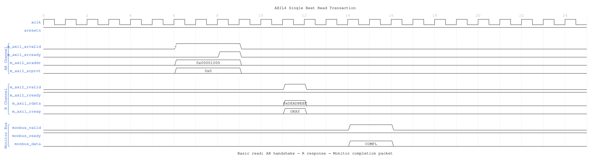
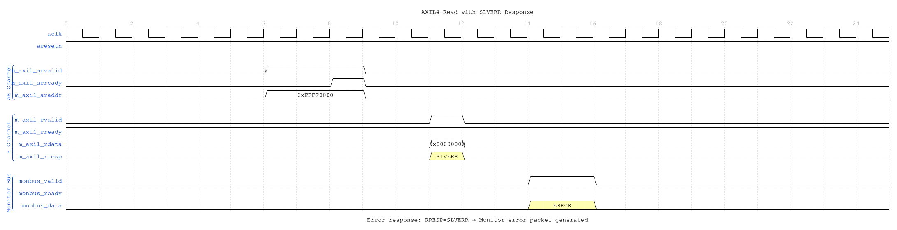
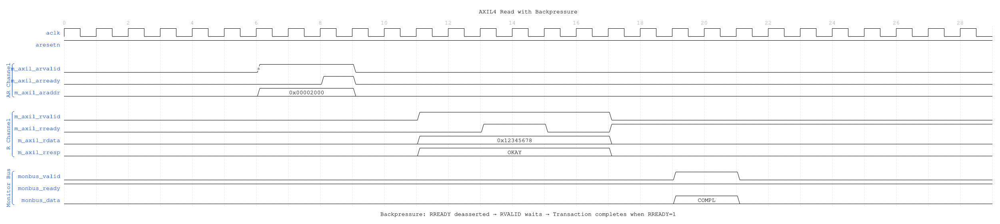

<!-- RTL Design Sherpa Documentation Header -->
<table>
<tr>
<td width="80">
  <a href="https://github.com/sean-galloway/RTLDesignSherpa">
    
  </a>
</td>
<td>
  <strong>RTL Design Sherpa</strong> · <em>Learning Hardware Design Through Practice</em><br>
  <sub>
    <a href="https://github.com/sean-galloway/RTLDesignSherpa">GitHub</a> ·
    <a href="https://github.com/sean-galloway/RTLDesignSherpa/blob/main/docs/DOCUMENTATION_INDEX.md">Documentation Index</a> ·
    <a href="https://github.com/sean-galloway/RTLDesignSherpa/blob/main/LICENSE">MIT License</a>
  </sub>
</td>
</tr>
</table>

---

<!-- End Header -->

# AXIL4 Master Read with Monitoring

**Module:** `axil4_master_rd_mon.sv`
**Location:** `rtl/amba/axil4/`
**Status:** ✅ Production Ready

---

## Overview

Combines **[axil4_master_rd](../axil4/axil4_master_rd.md)** with the core **axi_monitor_filtered** for transaction monitoring. Simplified for AXI4-Lite (single-beat, no burst, fixed ID=0).

### Key Features

- ✅ All features of base **axil4_master_rd** module
- ✅ **Integrated Monitoring:** Uses shared axi_monitor_filtered (rtl/amba/monitor/)
- **2-Level Filtering:** packet-type masks, then per-event-code masks. `err_select` is RESERVED -- it feeds only the conflict check and routes nothing.
- ✅ **Error Detection:** SLVERR/DECERR, timeouts, orphaned read data
  (protocol-violation events are write-monitor only)
- ✅ **128-bit Monitor Bus:** Standardized packet format paired with 64-bit side-band timestamp
- ✅ **Reduced Complexity:** MAX_TRANSACTIONS=8 (vs 16-32 for AXI4)

---

## Additional Parameters (Beyond Base Module)

| Parameter | Type | Default | Description |
|-----------|------|---------|-------------|
| `UNIT_ID` | logic [7:0] | 8'h01 | 8-bit unit identifier emitted in the `unit_id` packet field |
| `AGENT_ID` | logic [15:0] | 16'h000A | 16-bit agent identifier emitted in the `agent_id` packet field |
| `MAX_TRANSACTIONS` | int | 8 | Max outstanding transactions. Reduced for AXI4-Lite; the AXI4 wrappers default to 16. |
| `ACTIVE_TRANS_THRESHOLD` | int | MAX_TRANSACTIONS/2 | Active-transaction count that trips a threshold packet when `cfg_threshold_enable=1`. Replaces the former hardwired 8/4; threshold packets now scale with the table sizing |
| `ENABLE_FILTERING` | bit | 1 | Enable packet filtering: two active drop levels (packet type, then event code). Level 2 is reserved and routes nothing |
| `ADD_PIPELINE_STAGE` | bit | 0 | Add register stage for timing closure |
| `USE_MONITOR` | bit | 1 | Synthesis-time monitor enable. 0 = omit monitor and tie outputs to safe non-blocking defaults; 1 = full monitor functionality. |
| `N_ADDR_RANGES` | int | 0 | Number of address-range comparators. 0 = checker omitted (zero area). >0 = N independent [low, high] ranges; feeds the shared allowlist checker: a debug-range hit -> AddrMatch, an error-allowlist miss -> Error/ADDR_RANGE (see axi_monitor_addr_check.md). |
| `ACLK_MHZ` | int | 100 | Clock frequency in MHz. Builds the microsecond tick LUT in `counter_freq_invariant`. **Leave this at 100 on a 90 MHz part and every us-denominated timeout is wrong, silently.** |
| `CFI_MIN_FREQ_MHZ` / `CFI_MAX_FREQ_MHZ` | int | `ACLK_MHZ` | Bounds of the freq-invariant counter LUT (`cfg_freq_sel` indexes within them). Equal bounds means one entry and `cfg_freq_sel` has no effect. |
| `USE_WDATA_ORDER_Q` | bit | 0 | Write-data ordering queue, forwarded to `axi_monitor_base`. |
| `NUM_BANKS` | int | 1 | Banked transaction tables. **>1 on a WRITE monitor requires `USE_WDATA_ORDER_Q=1`** -- `axi_monitor_trans_mgr` fails elaboration otherwise. |
| `ID_FILTER_ENABLE` | bit | `1'b0` | Per-instance ID-slice filter, inherited from the shared monitor core. **Leave at 0 on AXI4-Lite.** The wrapper hardwires `cmd_id`/`data_id`/`resp_id` to `1'b0`, so enabling this with `ID_MATCH_BASE` above 0 makes `id_owned(0)` false for every transaction and drops ALL monitoring. |
| `ID_MATCH_BASE` | int | `0` | First ID this instance owns when `ID_FILTER_ENABLE=1`. Must stay 0 on AXI4-Lite -- every transaction reports ID 0. |
| `ID_MATCH_COUNT` | bit | `0` | Number of IDs this instance owns from `ID_MATCH_BASE`. 0 = all IDs. |

### Synthesis-Cone Parameters

Each detection cone can be compiled out to save area. These are forwarded to `axi_monitor_base`; by default the classic cones are on and the debug cone is off.

| Parameter | Type | Default | Effect when 0 |
|-----------|------|---------|---------------|
| `ENABLE_ERROR_LOGIC` | bit | 1 | Drop the error-detection cone |
| `ENABLE_TIMEOUT_LOGIC` | bit | 1 | Drop the timeout cone **and** the `axi_monitor_timeout` instance |
| `ENABLE_COMPL_LOGIC` | bit | 1 | Drop the completion cone |
| `ENABLE_THRESHOLD_LOGIC` | bit | 1 | Drop the threshold cone |
| `ENABLE_PERF_LOGIC` | bit | 1 | Gates only the reporter's legacy perf-packet cone and the two lifetime counters -- the window FSM and meters are unconditional |
| `ENABLE_DEBUG_LOGIC` | bit | 0 | (off by default) drop the debug cone |

> The former `CAM_PIPELINE` / `TRANS_CAM_PIPELINE` parameters were removed — the transaction CAM is now always pipelined. Inside this wrapper `ENABLE_PERF_PACKETS` is tied to `1'b1` (perf packet path always instantiated, gated by `ENABLE_PERF_LOGIC`) and `ENABLE_DEBUG_MODULE` is tied to `1'b0`.

---

### Derived Parameters (do not override)

These are declared as `parameter` so the elaborator can compute them, not so callers can set them. Each defaults to an expression over the parameters above; overriding one desynchronises it from its source and the design fails to elaborate or silently mis-sizes a bus. Set the parameters they are derived FROM and leave these alone.

| Derived parameter | Default expression |
|---|---|
| `AW` | `AXIL_ADDR_WIDTH` |
| `DW` | `AXIL_DATA_WIDTH` |

## Performance Monitoring

When performance monitoring is enabled, the wrapper forwards a **measurement-window state machine** plus a bank of R-channel (read-data) utilization counters to `axi_monitor_base`. All counters accumulate **only while a window is open** (`window_active = 1`) and hold their values between windows so the host can read a completed window's totals. `cfg_perf_enable` does NOT gate them: it selects the window start/end event (it is edge-detected for `cfg_start_event_sel` modes 010/011) and enables the perf PACKET class. The counters themselves advance whenever a window is open, enabled or not. `ENABLE_PERF_LOGIC = 0` does NOT drop them: the window FSM and its counters are unconditional `always_ff` blocks in `axi_monitor_base`, outside every generate. That parameter gates only `g_perf` in the reporter -- the legacy perf-packet cone and the two lifetime counters. `USE_MONITOR = 0` is what ties the perfmon outputs off.

> Avoid enabling completion (`cfg_compl_enable`) and performance (`cfg_perf_enable`) packets simultaneously under heavy traffic — the monitor bus sustains at most one packet per two cycles. Runtime-disabling either class is safe (terminal entries auto-retire; see [axi_monitor_reporter](../monitor/axi_monitor_reporter.md)); alternatively, `cfg_axi_pkt_mask` drops the packets while keeping marking and counting. See `docs/user-guides/AXI_Monitor_Configuration_Guide.md`.

### The Measurement Window

A window is opened by a **start event** and closed by an **end event**:

- `cfg_start_event_sel` / `cfg_end_event_sel` (3-bit) select the event source (e.g. `3'b010` selects the `cfg_perf_enable` edge).
- `cfg_start_trigger` / `cfg_end_trigger` pulses fire the window directly from an engine or CSR.
- `cfg_window_force_close` is a software override that closes the window immediately.

While the window is open, `window_active` is high and `window_cycles` [31:0] free-runs, counting every clock elapsed inside the window.

### Utilization Counters (R channel)

Every in-window cycle is classified by the R-channel valid/ready into exactly one of four buckets:

| Output | Width | Condition | Meaning |
|--------|:-----:|-----------|---------|
| `perf_prod_cycles`  | 32 | rvalid && rready   | productive beat transferred |
| `perf_bp_cycles`    | 32 | rvalid && !rready  | back-pressure (data offered, consumer not ready) |
| `perf_starv_cycles` | 32 | !rvalid && rready  | starvation (consumer ready, no valid data) |
| `perf_idle_cycles`  | 32 | !rvalid && !rready | idle |

The four buckets sum to `window_cycles`, so utilization = `perf_prod_cycles / window_cycles`.

### Throughput Counters

| Output | Width | Meaning |
|--------|:-----:|---------|
| `perf_beat_count`  | 32 | data beats transferred (= `perf_prod_cycles`, 1 beat/cycle) |
| `perf_byte_count`  | 64 | bytes transferred = beats × (1 << AxSIZE); AXIL is fixed at `AxSIZE=3'b010` (4 bytes) |
| `perf_burst_count` | 32 | AR (read-address) handshakes |

**AXI4-Lite note:** every transaction is a single data beat (ARLEN is implicitly 0), so `perf_burst_count` counts AR handshakes = transactions and `perf_beat_count` equals the transaction count. Average burst length (`perf_beat_count / perf_burst_count`) is therefore always 1.

---

## Monitor Backpressure (block_ready)

`block_ready` is a flow-control net inside the wrapper, and it IS brought out: `debug_block_ready` is an output port of this module (the `_cg` wrapper ties it off, so use the base module when you need the tap). It goes low when the monitor's transaction-table occupancy reaches its blocking threshold (a function of `MAX_TRANSACTIONS`; the reporter FIFO depth `INTR_FIFO_DEPTH` has no path to it). The wrapper ANDs it into the upstream-facing `fub_axil_arready` so a saturated monitor throttles new transactions at the handshake instead of dropping events.

- **Where the stall lands**: the upstream `fub_axil_arready` is forced low until the monitor drains.
- **When `USE_MONITOR=0`**: `block_ready` is internally tied high, so the wrapper imposes no stall and runs at full bandwidth.
- **When `cfg_monitor_enable=0`**: the wrapper gate forces the upstream ready open, so a runtime-disabled monitor can never stall the datapath (the AXI4 monitors assert this as an in-RTL formal property,
  `ap_disabled_never_stalls`; this module has no `ifdef FORMAL` block of its
  own, so here the guarantee rests on the gate expression above, not a proof).

Recovery is guaranteed by the **saturation-recovery contract**: command-originated table entries are capped at `MAX_TRANSACTIONS - cmd_entry_reserve(MAX_TRANSACTIONS)` (reserve = 4 for tables of 16 or more, 0 below; the function lives in `monitor_common_pkg`), and `block_ready` re-asserts at occupancy `< MAX_TRANSACTIONS - (reserve - 1)` -- a threshold strictly ABOVE the command cap -- so a saturated table always drains back below the reopen point. Blocking throttles; it never deadlocks. Tables smaller than 16 keep full legacy allocation (small tables cannot spare slots) and trade the recovery guarantee for tracking capacity. The contract is verified by in-RTL formal properties (mutation-checked) and a 100-seed deliberately-undersized-table stream sweep; see [axi_monitor_base](../monitor/axi_monitor_base.md#flow-control-and-the-saturation-recovery-contract) for the canonical description.

Sizing note: a monitor on a bus shared by several channels/requesters must size `MAX_TRANSACTIONS` to cover `NUM_CHANNELS x per-channel outstanding` plus margin -- the per-channel limit alone makes the monitor throttle the shared master. Tables deeper than 64 also need Verilator's `--unroll-count` raised (default 64) in sim builds.

---

## Address-Range Checker

With `N_ADDR_RANGES > 0` the wrapper instantiates the shared allowlist checker
([`axi_monitor_addr_check`](../monitor/axi_monitor_addr_check.md)). Each range carries a
DEBUG/ERROR flavor:

- **DEBUG range** — a hit emits a `PktTypeAddrMatch` (`4'h8`) packet with event
  code `AXI_ADDR_RANGE_MATCH` (`8'h01`), gated by `cfg_debug_enable`.
- **ERROR range** — the enabled ERROR ranges form an allowlist; an address in
  NONE of them emits a `PktTypeError` (`4'h0`) packet with event code
  `AXI_ERR_ADDR_RANGE` (`8'h0D`), gated by `cfg_error_enable`.

This wrapper does not expose `ADDR_RANGE_IS_ERROR`; all ranges default to the DEBUG (match) flavor.

**Config inputs (active only when `N_ADDR_RANGES > 0`):**
- `cfg_addr_check_enable` — master on/off for the checker.
- `cfg_addr_range_enable[N-1:0]` — per-range enable bit.
- `cfg_addr_range_low/high[N-1:0][AXI_ADDR_WIDTH-1:0]` — inclusive bounds.

**Event encoding:** `event_data[63:60]` = `range_index` (matching DEBUG range, or
`4'hF` sentinel on an ERROR miss); `event_data[59:0]` = full address. **Filtering:**
AddrMatch is dropped by `cfg_axi_addr_mask[1]`, the ADDR_RANGE error by
`cfg_axi_error_mask[13]`. See the checker page for coalescing + formal properties.

---

### Packet filters

Two independent runtime filters cut monbus traffic without touching the
datapath. Both are inert until driven, which is the failure to watch for: the
build-time parameter only decides whether the logic is SYNTHESISED, and a
design that sets the parameter but leaves the `cfg_*` ports tied low filters
nothing and looks like the feature is broken.

**Address-range filter** — `ADDR_FILTER_ENABLE` (bit, default 0) builds it.

| Port | Width | Description |
|---|---|---|
| `cfg_addr_filter_enable` | 1 | High: suppress packets for transactions outside the window. Low: inert, whatever the parameter says |
| `cfg_addr_filter_low` | `ADDR_WIDTH` | Window base, inclusive |
| `cfg_addr_filter_high` | `ADDR_WIDTH` | Window limit, inclusive |

The verdict is latched per table entry at ALLOCATION, from the command
address, and held for that entry's life. Widening the window mid-flight does
not un-filter entries already admitted — which is what makes it safe to
reprogram live. Contrast the address-range CHECKER above, which re-evaluates
per command.

There is no runtime ID filter here. AXI-Lite has no transaction IDs, so this
wrapper ties `cfg_id_filter_enable` / `cfg_id_match_base` /
`cfg_id_match_count` off on the inner monitor rather than exposing them — a
filter keyed on a field the protocol lacks has nothing to match against.

## Additional Ports (Beyond Base Module)

### Monitor Configuration
| Port | Direction | Width | Description |
|------|-----------|-------|-------------|
| `cfg_monitor_enable` | Input | 1 | Master runtime gate. 0 = monitor inert: no allocation, transaction CAM held clear, and the upstream ready is never stalled (a disabled monitor cannot block the datapath). 1 = normal operation |
| `cam_clear` | Input | 1 | Synchronous clear of the monitor transaction CAM (driven from the harness clear control bit, e.g. CTRL[4]) |
| `cfg_error_enable` | Input | 1 | Enable error packets |
| `cfg_timeout_enable` | Input | 1 | Enable timeout detection |
| `cfg_compl_enable` | Input | 1 | Enable transaction-completion packets |
| `cfg_threshold_enable` | Input | 1 | Enable threshold-crossed packets |
| `cfg_perf_enable` | Input | 1 | Enable performance packets |
| `cfg_debug_enable` | Input | 1 | Enable debug/trace packets (the 6th "debug cone" reporter sub-block) |
| `cfg_timeout_cycles` | Input | 16 | Unified coarse timeout control: 0 = legacy full-scale (15 ticks), 1-15 = that many timer ticks per phase, >15 saturates at 15. One value drives all three phase counts (addr/data/resp), measured in `cfg_freq_sel`-scaled timer ticks, not raw clock cycles |
| `cfg_latency_threshold` | Input | 32 | Latency alert threshold |

> The debug cone is the 6th reporter sub-block (`axi_monitor_reporter_debug`), enabled by `cfg_debug_enable` and synthesized only when `ENABLE_DEBUG_LOGIC = 1`. The related `cfg_debug_level` (4b) and `cfg_debug_mask` (16b) inputs of `axi_monitor_base` are **not** exposed on this AXIL wrapper — they are tied to `4'h0` / `16'h0` internally; `cfg_active_trans_threshold` is driven from the `ACTIVE_TRANS_THRESHOLD` parameter (default `MAX_TRANSACTIONS/2`).

### Performance Monitoring Ports

| Port | Direction | Width | Description |
|------|-----------|-------|-------------|
| `cfg_start_event_sel` | Input | 3 | Window **start** event source select |
| `cfg_end_event_sel` | Input | 3 | Window **end** event source select |
| `cfg_start_trigger` | Input | 1 | Pulse: open the measurement window |
| `cfg_end_trigger` | Input | 1 | Pulse: close the measurement window |
| `cfg_window_force_close` | Input | 1 | Software override: force the window closed |
| `window_active` | Output | 1 | High while a measurement window is open |
| `window_cycles` | Output | 32 | Cycles elapsed in the current window |
| `perf_prod_cycles` | Output | 32 | valid && ready cycles |
| `perf_bp_cycles` | Output | 32 | valid && !ready cycles (back-pressure) |
| `perf_starv_cycles` | Output | 32 | !valid && ready cycles (starvation) |
| `perf_idle_cycles` | Output | 32 | !valid && !ready cycles |
| `perf_beat_count` | Output | 32 | data beats transferred |
| `perf_byte_count` | Output | 64 | bytes transferred |
| `perf_burst_count` | Output | 32 | AR (address-phase) handshakes |

> When perfmon is unused, the integrating block ties `cfg_start_event_sel`/`cfg_end_event_sel` to `3'b111` and the remaining `cfg_*` perfmon inputs to 0. When `USE_MONITOR = 0` all perfmon outputs are tied to 0.

### Filtering Masks (9 masks total)

All nine are 16-bit inputs. `cfg_axi_pkt_mask` is indexed by the 4-bit
`packet_type` field; the per-type event masks are indexed by the low nibble of
`event_code`. In every case a **set bit drops** the matching packet.

| Port | Width | Description |
|------|-------|-------------|
| `cfg_axi_pkt_mask` | 16 | Level 1: drop mask indexed by `packet_type` |
| `cfg_axi_err_select` | 16 | Route selected packet types to the error path. Overlapping a bit with `cfg_axi_pkt_mask` raises `cfg_conflict_error`. |
| `cfg_axi_error_mask` | 16 | Level 3: mask individual error events |
| `cfg_axi_timeout_mask` | 16 | Level 3: mask individual timeout events |
| `cfg_axi_compl_mask` | 16 | Level 3: mask individual completion events |
| `cfg_axi_thresh_mask` | 16 | Level 3: mask individual threshold events |
| `cfg_axi_perf_mask` | 16 | Level 3: mask individual performance events |
| `cfg_axi_addr_mask` | 16 | Level 3: mask individual address-match events |
| `cfg_axi_debug_mask` | 16 | Level 3: mask individual debug events |

There is no `cfg_axi_full_mask` port.

### Monitor Bus Output
| Port | Direction | Width | Description |
|------|-----------|-------|-------------|
| `monbus_valid` | Output | 1 | Monitor packet valid |
| `monbus_ready` | Input | 1 | Downstream ready |
| `monbus_packet` | Output | 128 | `monitor_packet_t` (128-bit format) |
| `monbus_timestamp` | Output | 64 | `monbus_timestamp_t` paired atomically with `monbus_packet` |
| `i_mon_time` | Input | 64 | Free-running counter from `monbus_group_core`, sampled at packet emission |

### Status
| Port | Direction | Width | Description |
|------|-----------|-------|-------------|
| `busy` | Output | 1 | Interface active |
| `active_transactions` | Output | 8 | Current outstanding count |
| `error_count` | Output | 16 | Lifetime count of error+timeout packets actually emitted (reporter perf counter; reads 0 when `ENABLE_PERF_LOGIC=0` or `USE_MONITOR=0`) |
| `transaction_count` | Output | 32 | Lifetime count of completion packets actually emitted (zero-extended 16-bit reporter perf counter; reads 0 when `ENABLE_PERF_LOGIC=0` or `USE_MONITOR=0`) |
| `cfg_conflict_error` | Output | 1 | Set when `cfg_axi_pkt_mask` and `cfg_axi_err_select` overlap |

---

## Usage Example

```systemverilog
axil4_master_rd_mon #(
    // Base parameters
    .AXIL_ADDR_WIDTH(32),
    .AXIL_DATA_WIDTH(32),
    .SKID_DEPTH_AR(2),
    .SKID_DEPTH_R(4),

    // Monitor parameters
    .UNIT_ID(1),
    .AGENT_ID(10),
    .MAX_TRANSACTIONS(8),
    .ENABLE_FILTERING(1)
) u_axil_rd_mon (
    .aclk(axi_clk),
    .aresetn(axi_resetn),

    // AXIL interfaces (same as axil4_master_rd)
    .fub_axil_araddr(cpu_araddr),
    // ... other AR/R signals ...

    // Monitor configuration
    .cfg_monitor_enable(1'b1),
    .cfg_error_enable(1'b1),
    .cfg_timeout_enable(1'b1),
    .cfg_perf_enable(1'b0),      // Avoid congestion
    .cfg_timeout_cycles(16'd10),  // 10 timer ticks per phase (>15 saturates)
    .cfg_freq_sel    (4'd0),   // counter_freq_invariant LUT index; scales the 1 us tick
    .cam_clear       (1'b0),   // hold high one cycle while idle to clear the CAM -- do NOT leave unconnected
    .cfg_latency_threshold(32'd500),

    // Filtering masks - a SET bit DROPS that packet type
    .cfg_axi_pkt_mask(16'b1111_1111_1111_0110),  // Keep Error (bit 0) + Timeout (bit 3)
    // ... other masks ...

    // Monitor bus
    .monbus_valid(mon_valid),
    .monbus_ready(mon_ready),
    .monbus_packet(mon_data),
    .monbus_timestamp(mon_time)
);
```

**Mask polarity.** `cfg_axi_pkt_mask` is 16 bits because it is indexed by the
4-bit `packet_type` field — one bit per packet type — not by the 128-bit packet
width. `axi_monitor_filtered` computes
`pkt_drop = cfg_axi_pkt_mask[pkt_type]`, so a set bit **drops** that type. To
pass only `PktTypeError` (4'h0) and `PktTypeTimeout` (4'h3), clear bits 0 and 3
and set the rest: `16'b1111_1111_1111_0110`. See the
[Monitor Packet Specification](../includes/monitor_package_spec.md) for the
full packet-type enum.

---

## Timing Diagrams

### Scenario 1: Single-Beat Read Transaction



**WaveJSON:** [single_beat_read_001.json](../../assets/WAVES/axil4_master_rd_mon/single_beat_read_001.json)

**Key Observations:**
- AR channel handshake: ARVALID asserted, ARREADY responds
- R channel response: Slave returns data with RRESP=OKAY
- Monitor generates completion packet when R phase completes
- Single-beat transaction: No burst length (implicit ARLEN=0)

### Scenario 2: Read Error (SLVERR)



**WaveJSON:** [read_error_slverr_001.json](../../assets/WAVES/axil4_master_rd_mon/read_error_slverr_001.json)

**Key Observations:**
- Invalid address triggers RRESP=SLVERR
- Monitor detects error response and generates ERROR packet
- Transaction completes despite error (data may be undefined)
- Error packet includes address and response code

### Scenario 3: Read with Backpressure



**WaveJSON:** [read_backpressure_001.json](../../assets/WAVES/axil4_master_rd_mon/read_backpressure_001.json)

**Key Observations:**
- Master not ready: RREADY deasserted
- Slave holds RVALID until RREADY=1
- Monitor tracks extended latency
- Completion packet generated after handshake

---

## AXI4-Lite Simplifications

**vs Full AXI4 Monitoring:**
- **Fixed ID:** Always ID=0 (no out-of-order tracking)
- **Single-Beat:** No burst handling (ARLEN implicitly 0)
- **Reduced Tables:** MAX_TRANSACTIONS=8 (vs 16-32 for AXI4)
- **Same Infrastructure:** Uses axi_monitor_filtered like AXI4

---

## Related Documentation

### Base Module
- **[axil4_master_rd](../axil4/axil4_master_rd.md)** - Functional module documentation

### Monitor Infrastructure
- **[AXI4 Master Read Mon](../axi4/axi4_master_rd_mon.md)** - Full AXI4 monitoring (detailed reference)
- **[axi_monitor_filtered](../monitor/axi_monitor_filtered.md)** - Core monitor engine (`rtl/amba/monitor/`)
- **[Monitor Configuration Guide](../monitor/axi_monitor_base.md)** - Configuration strategies

### Related Modules
- **[axil4_master_wr_mon](axil4_master_wr_mon.md)** - Master write with monitoring
- **[axil4_slave_rd_mon](axil4_slave_rd_mon.md)** - Slave read with monitoring

---

**Last Updated:** 2026-07-19

---

## Navigation

- **[← Back to AXIL4 Index](../axil4/README.md)**
- **[← Back to rtl-amba Index](../index.md)**
