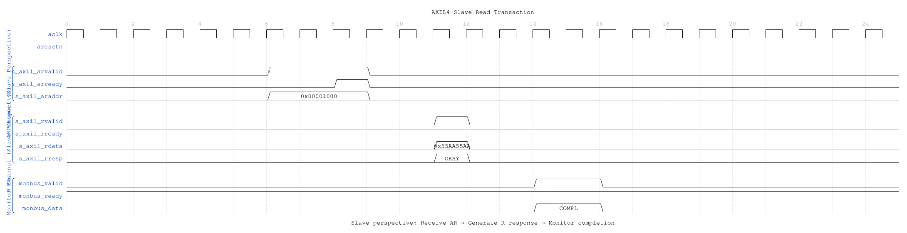
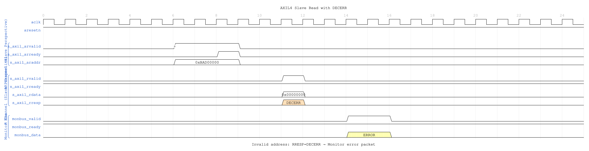
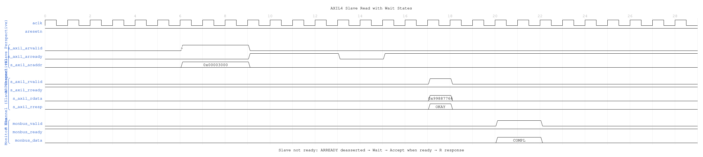

<!-- RTL Design Sherpa Documentation Header -->
<table>
<tr>
<td width="80">
  <a href="https://github.com/sean-galloway/RTLDesignSherpa">
    
  </a>
</td>
<td>
  <strong>RTL Design Sherpa</strong> · <em>Learning Hardware Design Through Practice</em><br>
  <sub>
    <a href="https://github.com/sean-galloway/RTLDesignSherpa">GitHub</a> ·
    <a href="https://github.com/sean-galloway/RTLDesignSherpa/blob/main/docs/DOCUMENTATION_INDEX.md">Documentation Index</a> ·
    <a href="https://github.com/sean-galloway/RTLDesignSherpa/blob/main/LICENSE">MIT License</a>
  </sub>
</td>
</tr>
</table>

---

<!-- End Header -->

# AXIL4 Slave Read with Monitoring

**Module:** `axil4_slave_rd_mon.sv`
**Location:** `rtl/amba/monitor/`
**Status:** ✅ Production Ready

---

## Overview

Combines **[axil4_slave_rd](../axil4/axil4_slave_rd.md)** with **axi_monitor_filtered** for slave-side read monitoring.

### Key Features

- ✅ All features of **axil4_slave_rd**
- ✅ Slave-side monitoring (backend latency tracking)
- ✅ 3-level filtering and error detection
- ✅ Simplified for AXI4-Lite (MAX_TRANSACTIONS=8)

---

## Additional Parameters

Identical to **[axil4_master_rd_mon](axil4_master_rd_mon.md#additional-parameters)** including `N_ADDR_RANGES`, but typically:
- `UNIT_ID = 2` (slaves use different unit ID)
- `AGENT_ID = 20` (slave agent IDs)
- `USE_MONITOR` (synthesis-time monitor enable)
- `ACTIVE_TRANS_THRESHOLD` (default `MAX_TRANSACTIONS/2`): threshold-packet trip point, replaces the former hardwired value

Also includes the synthesis-cone parameters `ENABLE_ERROR_LOGIC`, `ENABLE_TIMEOUT_LOGIC`, `ENABLE_COMPL_LOGIC`, `ENABLE_THRESHOLD_LOGIC`, `ENABLE_PERF_LOGIC` (all default 1) and `ENABLE_DEBUG_LOGIC` (default 0), each dropping its detection cone when set to 0. `ENABLE_PERF_PACKETS` is tied `1'b1` and `ENABLE_DEBUG_MODULE` `1'b0` internally; the removed `CAM_PIPELINE` / `TRANS_CAM_PIPELINE` parameters no longer exist.

For complete parameter descriptions including `N_ADDR_RANGES` and the synthesis-cone parameters, see **[axil4_master_rd_mon](axil4_master_rd_mon.md#synthesis-cone-parameters)**.

---

## Performance Monitoring

When performance monitoring is enabled, the wrapper forwards a **measurement-window state machine** plus a bank of R-channel (read-data) utilization counters to `axi_monitor_base`. All counters accumulate **only while a window is open** (`window_active = 1`) and hold their values between windows so the host can read a completed window's totals. The counters advance only while `cfg_perf_enable = 1`; `ENABLE_PERF_LOGIC = 0` drops the whole block at synthesis.

> Avoid enabling completion (`cfg_compl_enable`) and performance (`cfg_perf_enable`) packets simultaneously under heavy traffic — the monitor bus sustains at most one packet per two cycles. Runtime-disabling either class is safe (terminal entries auto-retire; see [axi_monitor_reporter](../monitor/axi_monitor_reporter.md)); alternatively, `cfg_axi_pkt_mask` drops the packets while keeping marking and counting. See `docs/user-guides/AXI_Monitor_Configuration_Guide.md`.

### The Measurement Window

A window is opened by a **start event** and closed by an **end event**:

- `cfg_start_event_sel` / `cfg_end_event_sel` (3-bit) select the event source (e.g. `3'b010` selects the `cfg_perf_enable` edge).
- `cfg_start_trigger` / `cfg_end_trigger` pulses fire the window directly from an engine or CSR.
- `cfg_window_force_close` is a software override that closes the window immediately.

While the window is open, `window_active` is high and `window_cycles` [31:0] free-runs, counting every clock elapsed inside the window.

### Utilization Counters (R channel)

Every in-window cycle is classified by the R-channel valid/ready into exactly one of four buckets:

| Output | Width | Condition | Meaning |
|--------|:-----:|-----------|---------|
| `perf_prod_cycles`  | 32 | rvalid && rready   | productive beat transferred |
| `perf_bp_cycles`    | 32 | rvalid && !rready  | back-pressure (data offered, consumer not ready) |
| `perf_starv_cycles` | 32 | !rvalid && rready  | starvation (consumer ready, no valid data) |
| `perf_idle_cycles`  | 32 | !rvalid && !rready | idle |

The four buckets sum to `window_cycles`, so utilization = `perf_prod_cycles / window_cycles`.

### Throughput Counters

| Output | Width | Meaning |
|--------|:-----:|---------|
| `perf_beat_count`  | 32 | data beats transferred (= `perf_prod_cycles`, 1 beat/cycle) |
| `perf_byte_count`  | 64 | bytes transferred = beats × (1 << AxSIZE); AXIL is fixed at `AxSIZE=3'b010` (4 bytes) |
| `perf_burst_count` | 32 | AR (read-address) handshakes |

**AXI4-Lite note:** every transaction is a single data beat (ARLEN is implicitly 0), so `perf_burst_count` counts AR handshakes = transactions and `perf_beat_count` equals the transaction count. Average burst length (`perf_beat_count / perf_burst_count`) is therefore always 1.

The perfmon config/status ports and the `cfg_compl_enable` / `cfg_threshold_enable` / `cfg_debug_enable` control inputs have the same directions/widths and semantics as the **[read-monitor port table](axil4_master_rd_mon.md#performance-monitoring-ports)**. As there, `cfg_debug_level`/`cfg_debug_mask`/`cfg_active_trans_threshold` are tied to constants internally and not exposed.

---

## Monitor Backpressure (block_ready)

`block_ready` is an internal flow-control net inside the wrapper -- it is not a port. It goes low when the monitor's transaction-table occupancy reaches its blocking threshold (a function of `MAX_TRANSACTIONS`; the reporter FIFO depth `INTR_FIFO_DEPTH` has no path to it). The wrapper ANDs it into the upstream-facing `s_axil_arready` so a saturated monitor throttles new transactions at the handshake instead of dropping events.

- **Where the stall lands**: the upstream `s_axil_arready` is forced low until the monitor drains.
- **When `USE_MONITOR=0`**: `block_ready` is internally tied high, so the wrapper imposes no stall and runs at full bandwidth.
- **When `cfg_monitor_enable=0`**: the wrapper gate forces the upstream ready open, so a runtime-disabled monitor can never stall the datapath (in-RTL formal property `ap_disabled_never_stalls`).

Recovery is guaranteed by the **saturation-recovery contract**: command-originated table entries are capped at `MAX_TRANSACTIONS - cmd_entry_reserve(MAX_TRANSACTIONS)` (reserve = 2 for tables of 16 or more, 0 below; the function lives in `monitor_common_pkg`), and `block_ready` re-asserts at occupancy `< MAX_TRANSACTIONS - (reserve - 1)` -- a threshold strictly ABOVE the command cap -- so a saturated table always drains back below the reopen point. Blocking throttles; it never deadlocks. Tables smaller than 16 keep full legacy allocation (small tables cannot spare slots) and trade the recovery guarantee for tracking capacity. The contract is verified by in-RTL formal properties (mutation-checked) and a 100-seed deliberately-undersized-table stream sweep; see [axi_monitor_base](../monitor/axi_monitor_base.md#flow-control-and-the-saturation-recovery-contract) for the canonical description.

Sizing note: a monitor on a bus shared by several channels/requesters must size `MAX_TRANSACTIONS` to cover `NUM_CHANNELS x per-channel outstanding` plus margin -- the per-channel limit alone makes the monitor throttle the shared master. Tables deeper than 64 also need Verilator's `--unroll-count` raised (default 64) in sim builds.

---

## Address-Range Checker

Identical to **[axil4_master_rd_mon](axil4_master_rd_mon.md#address-range-checker)** — monitors AR (read address) handshakes and emits address-range violation packets. See the master read monitor's section for full details.

---

## Additional Ports

Same as **[axil4_master_rd_mon](axil4_master_rd_mon.md)**, including the `cam_clear` control input (Input, 1) - synchronous clear of the monitor transaction CAM (driven from the harness clear control bit, e.g. CTRL[4]), the `cfg_compl_enable` / `cfg_threshold_enable` / `cfg_debug_enable` control enables, and the performance-monitoring config/status ports (see the [Performance Monitoring](#performance-monitoring) section above).

---

## Usage

```systemverilog
axil4_slave_rd_mon #(
    .AXIL_ADDR_WIDTH(32),
    .AXIL_DATA_WIDTH(32),
    .UNIT_ID(2),    // Slave unit ID
    .AGENT_ID(20),  // Slave agent ID
    .MAX_TRANSACTIONS(8)
) u_axil_slave_rd_mon (
    // Slave AXIL interfaces (s_axil_*, fub_*)
    // Monitor configuration and bus
);
```

---

## Timing Diagrams

### Scenario 1: Slave Read Transaction



**WaveJSON:** [slave_read_basic_001.json](../../assets/WAVES/axil4_slave_rd_mon/slave_read_basic_001.json)

**Key Observations:**
- Slave perspective: Receive AR request from master
- Slave generates R response with data
- Monitor tracks backend read latency (AR → R delay)
- Completion packet indicates successful read

### Scenario 2: Slave Read Error (DECERR)



**WaveJSON:** [slave_read_decerr_001.json](../../assets/WAVES/axil4_slave_rd_mon/slave_read_decerr_001.json)

**Key Observations:**
- Invalid address detected by slave address decoder
- Slave returns RRESP=DECERR (decode error)
- Monitor generates ERROR packet
- Data value is don't-care when error occurs

### Scenario 3: Slave Read with Wait States



**WaveJSON:** [slave_read_wait_001.json](../../assets/WAVES/axil4_slave_rd_mon/slave_read_wait_001.json)

**Key Observations:**
- Slave not ready: ARREADY deasserted (wait states)
- Master holds ARVALID until slave accepts
- Backend read takes multiple cycles
- Monitor tracks full transaction latency

---

## Related Modules

- **[axil4_slave_rd](../axil4/axil4_slave_rd.md)** - Base functional module
- **[axil4_slave_wr_mon](axil4_slave_wr_mon.md)** - Write monitor counterpart
- **[AXI4 Slave Read Mon](../axi4/axi4_slave_rd_mon.md)** - Full AXI4 reference

---

**Last Updated:** 2026-07-19
