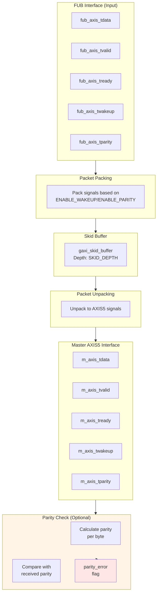

<!-- RTL Design Sherpa Documentation Header -->
<table>
<tr>
<td width="80">
  <a href="https://github.com/sean-galloway/RTLDesignSherpa">
    
  </a>
</td>
<td>
  <strong>RTL Design Sherpa</strong> · <em>Learning Hardware Design Through Practice</em><br>
  <sub>
    <a href="https://github.com/sean-galloway/RTLDesignSherpa">GitHub</a> ·
    <a href="https://github.com/sean-galloway/RTLDesignSherpa/blob/main/docs/DOCUMENTATION_INDEX.md">Documentation Index</a> ·
    <a href="https://github.com/sean-galloway/RTLDesignSherpa/blob/main/LICENSE">MIT License</a>
  </sub>
</td>
</tr>
</table>

---

<!-- End Header -->

# AXIS5 Master

**Module:** `axis5_master.sv`
**Location:** `rtl/amba/axis5/`
**Status:** Production Ready

---

## Overview

The AXIS5 Master module implements an AXI5-Stream master interface with AMBA5 extensions including wake-up signaling for power management and optional parity for data integrity. It provides buffering through an internal skid buffer for improved system performance.

### Key Features

- AXI4-Stream data path (TDATA, TSTRB, TLAST, TID, TDEST, TUSER, TVALID/TREADY)
- TWAKEUP: Wake-up signaling for power management
- TPARITY: Optional parity protection, 1 bit per byte (proprietary extension)
- Internal skid buffer for backpressure handling
- Configurable data, ID, destination, and user signal widths
- Parity error detection and reporting
- Busy status indication

**Signal coverage:** this module does not implement TKEEP, TPOISON, or any chunking sideband. See [Implemented Signal Set](README.md#implemented-signal-set) for the full list of deviations from the ARM signal set.

### AXIS5 Extensions Over AXIS4

| Feature | AXIS4 | AXIS5 | ARM standard signal? |
|---------|-------|-------|----------------------|
| Wake-up signal | None | TWAKEUP (configurable) | Yes, AXI5-Stream addition |
| Data parity | None | TPARITY (1 bit per byte, configurable) | No - RTL Design Sherpa extension |
| Parity error detection | None | Built-in sticky `parity_error` flag | No - implementation status output |

---

## Functional Description


---

### Skid Buffer Operation

The module uses an internal `gaxi_skid_buffer` to:
- Accept incoming transfers even when downstream is not ready
- Prevent backpressure propagation
- Provide registered outputs for timing closure
- Track buffer occupancy via `busy` signal

### Packet Packing/Unpacking

**Conditional packing based on configuration:**

```systemverilog
// Full feature set (ENABLE_WAKEUP=1, ENABLE_PARITY=1)
{tdata, tstrb, tlast, tid, tdest, tuser, twakeup, tparity}

// Wake-up only (ENABLE_WAKEUP=1, ENABLE_PARITY=0)
{tdata, tstrb, tlast, tid, tdest, tuser, twakeup}

// Parity only (ENABLE_WAKEUP=0, ENABLE_PARITY=1)
{tdata, tstrb, tlast, tid, tdest, tuser, tparity}

// Base AXIS4 (ENABLE_WAKEUP=0, ENABLE_PARITY=0)
{tdata, tstrb, tlast, tid, tdest, tuser}
```

### Parity Checking (Optional)

When `ENABLE_PARITY=1`:
1. Calculate **even** parity for each data byte: `parity[i] = ^m_axis_tdata[i*8 +: 8]`. The XOR reduction yields 1 for an odd number of set bits, so a correct byte plus its parity bit always has an even population count.
2. Compare the calculated parity with `m_axis_tparity`
3. Set `parity_error` flag on mismatch (sticky, cleared only by reset)
4. The check is sampled on accepted output transfers (`m_axis_tvalid && m_axis_tready`)

**This module does not generate parity.** TPARITY is supplied by the upstream FUB on `fub_axis_tparity`, carried through the skid buffer alongside TDATA, and presented on `m_axis_tparity`. The check on the output side therefore validates the data path *through this module* (packing, buffering, unpacking) against the parity the producer computed. It is not an end-to-end check of the downstream link - the receiving endpoint must run its own check, which is what `axis5_slave` does on its input side.

If the upstream FUB does not compute parity, leave `ENABLE_PARITY=0`; tying `fub_axis_tparity` to a constant while parity is enabled will assert `parity_error` on the first non-matching beat.

### Busy Signal

The `busy` output indicates:
- Input side has valid data (`fub_axis_tvalid`)
- Skid buffer contains data (`int_t_count > 0`)

## Parameters

| Parameter | Type | Default | Description |
|-----------|------|---------|-------------|
| SKID_DEPTH | int | 4 | Internal skid buffer depth |
| AXIS_DATA_WIDTH | int | 32 | AXIS data bus width (must be multiple of 8) |
| AXIS_ID_WIDTH | int | 8 | AXIS ID signal width (0 to disable) |
| AXIS_DEST_WIDTH | int | 4 | AXIS TDEST signal width (0 to disable) |
| AXIS_USER_WIDTH | int | 1 | AXIS TUSER signal width (0 to disable) |
| ENABLE_WAKEUP | bit | 1 | Enable TWAKEUP signal (1=enabled) |
| ENABLE_PARITY | bit | 0 | Enable TPARITY signal (1=enabled) |

**Note on `ENABLE_WAKEUP`:** the default is 1, so TWAKEUP ports exist and are carried through the buffer unless you explicitly set `ENABLE_WAKEUP=0`. Set it to 0 for an AXI4-Stream-compatible port list with no wake-up sideband and slightly less area. `ENABLE_PARITY` defaults to 0 because TPARITY is a proprietary extension.

### Derived Values (do not override)

These are declared in the parameter list so they can be used in port widths, but they are derived from the parameters above. Overriding them directly produces an inconsistent module.

| Name | Derivation | Meaning |
|------|------------|---------|
| DW | AXIS_DATA_WIDTH | Data width short name |
| IW | AXIS_ID_WIDTH | ID width short name |
| DESTW | AXIS_DEST_WIDTH | DEST width short name |
| UW | AXIS_USER_WIDTH | USER width short name |
| SW | DW/8 | Strobe width in bytes |
| PW | SW | Parity width - 1 bit per byte |
| IW_WIDTH / DESTW_WIDTH / UW_WIDTH | max(width, 1) | Zero-width avoidance for disabled sidebands |
| PW_WIDTH | ENABLE_PARITY ? PW : 1 | TPARITY port width |
| TSize | Sum of all enabled fields | Skid buffer payload width |

---

## Ports

### Clock and Reset

| Port | Width | Direction | Description |
|------|-------|-----------|-------------|
| aclk | 1 | Input | AXIS clock |
| aresetn | 1 | Input | AXIS active-low asynchronous reset |

### FUB AXIS5 Interface (Input Side)

| Port | Width | Direction | Description |
|------|-------|-----------|-------------|
| fub_axis_tdata | DW | Input | Transfer data |
| fub_axis_tstrb | SW | Input | Transfer byte strobes |
| fub_axis_tlast | 1 | Input | Last transfer in packet |
| fub_axis_tid | IW_WIDTH | Input | Transfer ID (optional) |
| fub_axis_tdest | DESTW_WIDTH | Input | Transfer destination (optional) |
| fub_axis_tuser | UW_WIDTH | Input | Transfer user-defined signals (optional) |
| fub_axis_tvalid | 1 | Input | Transfer valid |
| fub_axis_tready | 1 | Output | Transfer ready (skid buffer not full) |
| fub_axis_twakeup | 1 | Input | Wake-up signal (AXIS5 extension) |
| fub_axis_tparity | PW_WIDTH | Input | Data parity per byte (AXIS5 extension) |

### Master AXIS5 Interface (Output Side)

| Port | Width | Direction | Description |
|------|-------|-----------|-------------|
| m_axis_tdata | DW | Output | Transfer data |
| m_axis_tstrb | SW | Output | Transfer byte strobes |
| m_axis_tlast | 1 | Output | Last transfer in packet |
| m_axis_tid | IW_WIDTH | Output | Transfer ID (optional) |
| m_axis_tdest | DESTW_WIDTH | Output | Transfer destination (optional) |
| m_axis_tuser | UW_WIDTH | Output | Transfer user-defined signals (optional) |
| m_axis_tvalid | 1 | Output | Transfer valid |
| m_axis_tready | 1 | Input | Transfer ready from downstream |
| m_axis_twakeup | 1 | Output | Wake-up signal (AXIS5 extension) |
| m_axis_tparity | PW_WIDTH | Output | Data parity per byte (AXIS5 extension) |

### Status Outputs

| Port | Width | Direction | Description |
|------|-------|-----------|-------------|
| busy | 1 | Output | Module busy (data in buffer or input valid) |
| parity_error | 1 | Output | Parity error detected (sticky flag) |

---

## Timing Characteristics

### Basic Transfer with Wake-up

<!-- TODO: Add wavedrom timing diagram for AXIS5 transfer with wake-up -->
> **Timing diagram pending.** The signals and sequence this scenario
> exercises:
>
> - aclk
> - fub_axis_tvalid/tready
> - fub_axis_tdata
> - fub_axis_tlast
> - fub_axis_twakeup (AXIS5 extension)
> - m_axis_tvalid/tready
> - m_axis_tdata
> - m_axis_twakeup
> - busy

### Transfer with Parity Error

<!-- TODO: Add wavedrom timing diagram for parity error detection -->
> **Timing diagram pending.** The signals and sequence this scenario
> exercises:
>
> - aclk
> - m_axis_tdata
> - m_axis_tparity (received)
> - calculated_parity
> - parity_mismatch
> - parity_error (sticky flag)

### Skid Buffer Backpressure

<!-- TODO: Add wavedrom timing diagram for skid buffer operation -->
> **Timing diagram pending.** The signals and sequence this scenario
> exercises:
>
> - aclk
> - fub_axis_tvalid/tready
> - m_axis_tvalid/tready (downstream blocked)
> - int_t_count (buffer fill level)
> - busy

---

## Usage Examples

### Basic Configuration

```systemverilog
axis5_master #(
    .SKID_DEPTH       (4),
    .AXIS_DATA_WIDTH  (64),
    .AXIS_ID_WIDTH    (8),
    .AXIS_DEST_WIDTH  (4),
    .AXIS_USER_WIDTH  (1),
    .ENABLE_WAKEUP    (1),
    .ENABLE_PARITY    (0)
) u_axis5_master (
    .aclk                (axis_clk),
    .aresetn             (axis_rst_n),

    // FUB interface (from upstream)
    .fub_axis_tdata      (fub_tdata),
    .fub_axis_tstrb      (fub_tstrb),
    .fub_axis_tlast      (fub_tlast),
    .fub_axis_tid        (fub_tid),
    .fub_axis_tdest      (fub_tdest),
    .fub_axis_tuser      (fub_tuser),
    .fub_axis_tvalid     (fub_tvalid),
    .fub_axis_tready     (fub_tready),
    .fub_axis_twakeup    (fub_twakeup),
    .fub_axis_tparity    (8'h00),  // Not used when ENABLE_PARITY=0

    // Master AXIS5 interface (to downstream)
    .m_axis_tdata        (m_axis_tdata),
    .m_axis_tstrb        (m_axis_tstrb),
    .m_axis_tlast        (m_axis_tlast),
    .m_axis_tid          (m_axis_tid),
    .m_axis_tdest        (m_axis_tdest),
    .m_axis_tuser        (m_axis_tuser),
    .m_axis_tvalid       (m_axis_tvalid),
    .m_axis_tready       (m_axis_tready),
    .m_axis_twakeup      (m_axis_twakeup),
    .m_axis_tparity      (),  // Not used when ENABLE_PARITY=0

    // Status
    .busy                (axis_busy),
    .parity_error        ()  // Not used when ENABLE_PARITY=0
);
```

### With Parity Protection

```systemverilog
axis5_master #(
    .AXIS_DATA_WIDTH  (32),
    .ENABLE_WAKEUP    (1),
    .ENABLE_PARITY    (1)  // Enable parity checking
) u_axis5_master_parity (
    .aclk                (axis_clk),
    .aresetn             (axis_rst_n),

    // FUB interface with parity
    .fub_axis_tdata      (fub_tdata),
    .fub_axis_tstrb      (fub_tstrb),
    .fub_axis_tlast      (fub_tlast),
    .fub_axis_tid        (fub_tid),
    .fub_axis_tdest      (fub_tdest),
    .fub_axis_tuser      (fub_tuser),
    .fub_axis_tvalid     (fub_tvalid),
    .fub_axis_tready     (fub_tready),
    .fub_axis_twakeup    (fub_twakeup),
    .fub_axis_tparity    (fub_tparity),  // 4 bits for 32-bit data

    // Master AXIS5 interface
    .m_axis_tdata        (m_axis_tdata),
    .m_axis_tstrb        (m_axis_tstrb),
    .m_axis_tlast        (m_axis_tlast),
    .m_axis_tid          (m_axis_tid),
    .m_axis_tdest        (m_axis_tdest),
    .m_axis_tuser        (m_axis_tuser),
    .m_axis_tvalid       (m_axis_tvalid),
    .m_axis_tready       (m_axis_tready),
    .m_axis_twakeup      (m_axis_twakeup),
    .m_axis_tparity      (m_axis_tparity),

    // Status - monitor parity errors
    .busy                (axis_busy),
    .parity_error        (axis_parity_err)  // Sticky error flag
);

// Error handling
always_ff @(posedge axis_clk or negedge axis_rst_n) begin
    if (!axis_rst_n)
        error_count <= '0;
    else if (axis_parity_err && !prev_parity_err)
        error_count <= error_count + 1;
end
```

---

## Design Notes

### AXIS5 vs AXIS4 Differences

| Feature | AXIS4 | AXIS5 |
|---------|-------|-------|
| Wake-up signal | Not present | TWAKEUP (optional) |
| Data parity | Not present | TPARITY per byte (optional, proprietary) |
| Power management | Limited | Enhanced via TWAKEUP |
| Data integrity | CRC/checksum in TUSER | Built-in parity option |
| TKEEP | Not present | Not present |

### Skid Buffer Sizing

- **Typical depth:** 4-8 entries
- Deeper buffers:
  - Absorb longer downstream stalls
  - Increase area and latency
- Shallower buffers:
  - Lower latency
  - May cause upstream backpressure

**Recommendation:** Use depth 4 for most applications, increase if downstream frequently stalls.

### Parity Implementation

When `ENABLE_PARITY=1`:
- **Overhead:** 1 bit per data byte, so 12.5% extra wires regardless of bus width (a 512-bit bus adds 64 parity bits)
- **Detection:** Odd numbers of bit errors within a byte (even parity); two flipped bits in the same byte are undetected
- **Correction:** None - error flag only
- **Polarity:** Even parity only; there is no parameter to select odd parity
- **Use case:** Low-cost error detection in reliable environments

For stronger protection, use:
- CRC in TUSER field
- ECC (external module)
- End-to-end checksums at packet level

### Optional Signal Widths

Setting width parameters to 0 disables optional signals:
- `AXIS_ID_WIDTH=0` → TID tied to 0, saves area
- `AXIS_DEST_WIDTH=0` → TDEST tied to 0
- `AXIS_USER_WIDTH=0` → TUSER tied to 0

Internal logic uses `IW_WIDTH = (IW > 0) ? IW : 1` to avoid zero-width signals.

---

## Related Modules
- **[AXIS5 Slave](axis5_slave.md)** - AXIS5 slave interface
- **[AXIS5 Master CG](axis5_master_cg.md)** - Clock-gated variant with power management
- **[AXIS5 Slave CG](axis5_slave_cg.md)** - Clock-gated slave variant
- **[AXIS4 Master](../axis4/axis_master.md)** - AXIS4 version for comparison
- **[AMBA5 Overview](../overview.md)** - AMBA5 specifications and extensions

---

## Testing

`val/amba/test_axis5_master.py` exercises this module. It collects 3 parameter cases at the default `REG_LEVEL`.

```bash
source env_python
pytest val/amba/test_axis5_master.py -v
```

---

## Navigation

- **[← Back to AXIS5 Index](README.md)**
- **[← Back to rtl-amba Index](../index.md)**
- **[← Back to Main Documentation Index](../../index.md)**
