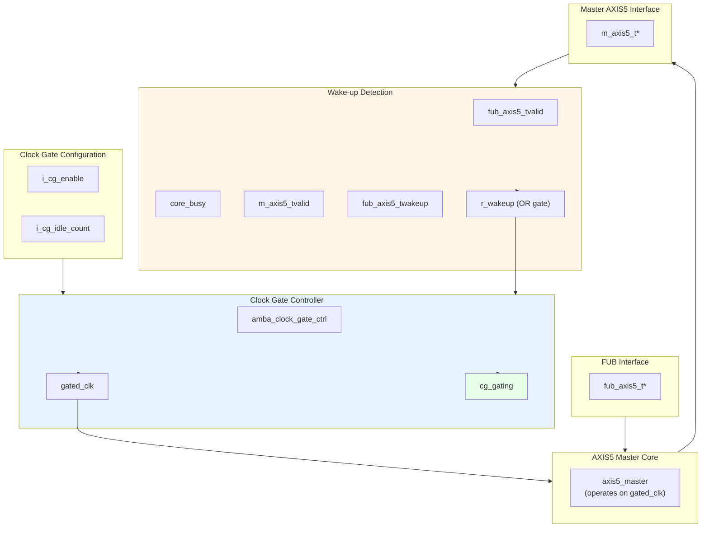

<!-- RTL Design Sherpa Documentation Header -->
<table>
<tr>
<td width="80">
  <a href="https://github.com/sean-galloway/RTLDesignSherpa">
    
  </a>
</td>
<td>
  <strong>RTL Design Sherpa</strong> · <em>Learning Hardware Design Through Practice</em><br>
  <sub>
    <a href="https://github.com/sean-galloway/RTLDesignSherpa">GitHub</a> ·
    <a href="https://github.com/sean-galloway/RTLDesignSherpa/blob/main/docs/DOCUMENTATION_INDEX.md">Documentation Index</a> ·
    <a href="https://github.com/sean-galloway/RTLDesignSherpa/blob/main/LICENSE">MIT License</a>
  </sub>
</td>
</tr>
</table>

---

<!-- End Header -->

# AXIS5 Master with Clock Gating

**Module:** `axis5_master_cg.sv`
**Location:** `rtl/amba/axis5/`
**Status:** Production Ready

---

## Overview

The AXIS5 Master CG (Clock Gated) wraps the standard AXIS5 master with the AMBA clock gate controller, giving you an AXI5-Stream master interface that gates its own clock during idle periods. Full AXIS5 functionality survives the wrapping — wake-up signaling, optional parity, the skid buffer, all of it.

### Key Features

- Same AXI5-Stream data path as `axis5_master` (see its [signal coverage note](axis5_master.md#key-features); TKEEP and TPOISON are not implemented)
- Automatic clock gating during idle periods for power savings
- TWAKEUP: Wake-up signaling integration with clock gate control
- TPARITY: Optional parity protection, 1 bit per byte (proprietary extension)
- Configurable idle count threshold for gating activation
- Internal skid buffer for backpressure handling
- Parity error detection and reporting
- Clock gating status output

### Power Management Features

| Feature | Implementation | Benefit |
|---------|---------------|---------|
| Clock gating | Automatic via idle detection | Reduces dynamic power |
| Wake-up integration | TWAKEUP prevents gating | Preserves responsiveness |
| Configurable threshold | Programmable idle count | Tune power vs. latency |
| Activity detection | Multi-source OR logic | Comprehensive coverage |

---

## Parameters

| Parameter | Type | Default | Description |
|-----------|------|---------|-------------|
| SKID_DEPTH | int | 4 | Internal skid buffer depth |
| AXIS_DATA_WIDTH | int | 32 | AXIS data bus width (must be multiple of 8) |
| AXIS_ID_WIDTH | int | 8 | AXIS ID signal width (0 to disable) |
| AXIS_DEST_WIDTH | int | 4 | AXIS TDEST signal width (0 to disable) |
| AXIS_USER_WIDTH | int | 1 | AXIS TUSER signal width (0 to disable) |
| ENABLE_WAKEUP | bit | 1 | Enable TWAKEUP signal (1=enabled) |
| ENABLE_PARITY | bit | 0 | Enable TPARITY signal (1=enabled) |
| CG_IDLE_COUNT_WIDTH | int | 4 | Clock gate idle counter width |

**Note on `ENABLE_WAKEUP`:** the default is 1, so TWAKEUP ports exist and are carried through the buffer unless you explicitly set `ENABLE_WAKEUP=0`. Set it to 0 for an AXI4-Stream-compatible port list with no wake-up sideband and slightly less area. `ENABLE_PARITY` defaults to 0 because TPARITY is a proprietary extension.

### Derived Values (do not override)

These are declared in the parameter list so they can be used in port widths, but they are derived from the parameters above. Overriding them directly produces an inconsistent module.

| Name | Derivation | Meaning |
|------|------------|---------|
| DW | AXIS_DATA_WIDTH | Data width short name |
| IW | AXIS_ID_WIDTH | ID width short name |
| DESTW | AXIS_DEST_WIDTH | DEST width short name |
| UW | AXIS_USER_WIDTH | USER width short name |
| SW | DW/8 | Strobe width in bytes |
| PW | SW | Parity width - 1 bit per byte |
| ICW | CG_IDLE_COUNT_WIDTH | Idle count width short name |
| IW_WIDTH / DESTW_WIDTH / UW_WIDTH | max(width, 1) | Zero-width avoidance for disabled sidebands |
| PW_WIDTH | ENABLE_PARITY ? PW : 1 | TPARITY port width |

---

## Ports

### Clock and Reset

| Port | Width | Direction | Description |
|------|-------|-----------|-------------|
| aclk | 1 | Input | AXIS ungated clock (always running) |
| aresetn | 1 | Input | AXIS active-low asynchronous reset |

### Clock Gating Configuration

| Port | Width | Direction | Description |
|------|-------|-----------|-------------|
| i_cg_enable | 1 | Input | Clock gating enable (1=allow gating, 0=force always on) |
| i_cg_idle_count | ICW | Input | Idle clock cycles before gating activates |

### FUB AXIS5 Interface (Input Side)

| Port | Width | Direction | Description |
|------|-------|-----------|-------------|
| fub_axis5_tdata | DW | Input | Transfer data |
| fub_axis5_tstrb | SW | Input | Transfer byte strobes |
| fub_axis5_tlast | 1 | Input | Last transfer in packet |
| fub_axis5_tid | IW_WIDTH | Input | Transfer ID (optional) |
| fub_axis5_tdest | DESTW_WIDTH | Input | Transfer destination (optional) |
| fub_axis5_tuser | UW_WIDTH | Input | Transfer user-defined signals (optional) |
| fub_axis5_tvalid | 1 | Input | Transfer valid |
| fub_axis5_tready | 1 | Output | Transfer ready (skid buffer not full) |
| fub_axis5_twakeup | 1 | Input | Wake-up signal (prevents clock gating) |
| fub_axis5_tparity | PW_WIDTH | Input | Data parity per byte (AXIS5 extension) |

### Master AXIS5 Interface (Output Side)

| Port | Width | Direction | Description |
|------|-------|-----------|-------------|
| m_axis5_tdata | DW | Output | Transfer data |
| m_axis5_tstrb | SW | Output | Transfer byte strobes |
| m_axis5_tlast | 1 | Output | Last transfer in packet |
| m_axis5_tid | IW_WIDTH | Output | Transfer ID (optional) |
| m_axis5_tdest | DESTW_WIDTH | Output | Transfer destination (optional) |
| m_axis5_tuser | UW_WIDTH | Output | Transfer user-defined signals (optional) |
| m_axis5_tvalid | 1 | Output | Transfer valid |
| m_axis5_tready | 1 | Input | Transfer ready from downstream |
| m_axis5_twakeup | 1 | Output | Wake-up signal |
| m_axis5_tparity | PW_WIDTH | Output | Data parity per byte (AXIS5 extension) |

### Status Outputs

| Port | Width | Direction | Description |
|------|-------|-----------|-------------|
| busy | 1 | Output | Module busy (data in buffer or input valid) |
| parity_error | 1 | Output | Parity error detected (sticky flag) |
| cg_gating | 1 | Output | Clock gating active status (1=gated, 0=running) |
| `cg_idle` | Out | 1 | Activity terms quiet (registered `~wakeup`). |

---

## Functional Description



### Clock Gating Control

**Wake-up detection logic:**
```systemverilog
r_wakeup <= fub_axis5_tvalid ||  // Input has data
            core_busy ||          // Core processing
            m_axis5_tvalid ||     // Output has data
            fub_axis5_twakeup;    // Explicit wake-up
```

The clock gate controller:
1. Monitors `r_wakeup` for activity
2. If idle (r_wakeup=0) for `i_cg_idle_count` cycles, gates the clock
3. On activity (r_wakeup=1), ungates the clock
4. Respects `i_cg_enable` (clock forced on when 0)

### Wake-up and Gating Latency

Activity is registered once (AXI4, AXI5, AXI4-Lite, AXI4-Stream) or twice (APB, APB5, AXI5-Stream -- with one exception: `apb4_slave_cdc_cg` drives `amba_clock_gate_ctrl` combinationally and so registers once, not twice) before reaching the ICG enable, which is combinational. AXI5-Stream is a **two-stage** family: `r_wakeup` in this wrapper, then a second `r_wakeup` inside `amba_clock_gate_ctrl`. The first gated-clock rising edge available to the core therefore arrives 3 `aclk` cycles after activity asserts. Budget accordingly:

| Event | Latency | Path |
|-------|---------|------|
| Activity to first usable gated-clock edge | 3 `aclk` cycles (2 register stages) | `fub_axis5_tvalid` to `r_wakeup` to controller `r_wakeup` to combinational ICG enable to next edge |
| Last activity to clock gated | `i_cg_idle_count` + 3 `aclk` cycles | `i_cg_idle_count` + 1 after the internal wakeup deasserts, plus two wake-up register stages |

The wake-up path is **not** zero-latency. Nothing is lost during those cycles: `fub_axis5_tready` is driven by the skid buffer on `gated_clk`, so it stays low while the clock is stopped and the producer simply holds TVALID until the clock resumes. Both registers and the idle counter run on the ungated `aclk`, so the wake-up path stays live even while the core clock is stopped.

### Reset Behavior

Reset is safe with respect to gating; the clock is guaranteed to be running whenever reset is asserted:

- `aresetn` is asynchronous and is passed **ungated** to both the clock gate controller and the core, so its assertion edge does not depend on the gated clock.
- `r_wakeup` in this wrapper and `r_wakeup` inside `amba_clock_gate_ctrl` both reset to 1, which forces the ICG enable active. The clock therefore runs during reset and for at least the idle countdown after reset deassertion.
- `clock_gate_ctrl` loads its idle counter with `i_cg_idle_count` on reset, so gating cannot re-engage until a full idle period has elapsed after release.

Because reset removal is asynchronous, apply the usual practice of releasing `aresetn` synchronously to `aclk` at the system level.

### Power Saving Mechanism

**Clock gating states:**

| Condition | r_wakeup | Clock State | Power State |
|-----------|----------|-------------|-------------|
| Active transfer | 1 | Running | Full power |
| Buffer has data | 1 | Running | Full power |
| Wake-up asserted | 1 | Running | Full power |
| Idle < threshold | 0 | Running | Full power |
| Idle ≥ threshold | 0 | Gated | Low power |

**Benefits:**
- Reduces dynamic power during idle periods
- Wake-up on new transfers costs 2 register stages; the first usable gated-clock edge arrives 3 `aclk` cycles after activity (see Wake-up and Gating Latency)
- No protocol impact (transparent to upstream/downstream)

### Integration with AXIS5 Extensions

**Wake-up signal dual purpose:**
1. **Protocol:** Power management hint to downstream
2. **Clock gating:** Prevents local clock gating

This dual use is what guarantees wake-up events are never missed because the clock happened to be gated.

### Idle Count Configuration

**Typical values for `i_cg_idle_count`:**
- **Aggressive power saving:** 2-4 cycles
  - Quick gating, may have frequent gate/ungate transitions
  - Best for bursty traffic with long idle periods
- **Balanced:** 8-16 cycles
  - Reduces gate/ungate overhead
  - Good for moderate traffic patterns
- **Conservative:** 32-64 cycles
  - Only gates during extended idle
  - Minimal gate/ungate overhead

**Trade-off:** lower count means more power savings but more gate transitions, and each transition has its own dynamic overhead.

---

## Timing Characteristics
### Clock Gating Activation

<!-- TODO: Add wavedrom timing diagram for clock gating activation -->
> **Timing diagram pending.** The signals and sequence this scenario
> exercises:
>
> - aclk (always running)
> - r_wakeup (activity detection)
> - i_cg_idle_count (threshold)
> - gated_clk (starts gating after threshold)
> - cg_gating (status)
> - fub_axis5_tvalid (new transfer wakes up)

### Wake-up Signal Preventing Gating

<!-- TODO: Add wavedrom timing diagram for wake-up preventing gating -->
> **Timing diagram pending.** The signals and sequence this scenario
> exercises:
>
> - aclk
> - fub_axis5_twakeup (asserted)
> - r_wakeup (stays high)
> - gated_clk (remains running)
> - cg_gating (stays 0)

### Transfer During Idle Period

<!-- TODO: Add wavedrom timing diagram for transfer arrival during idle -->
> **Timing diagram pending.** The signals and sequence this scenario
> exercises:
>
> - aclk
> - gated_clk (gated, then ungates on transfer)
> - fub_axis5_tvalid (new transfer)
> - r_wakeup (0 → 1 transition)
> - cg_gating (1 → 0)
> - m_axis5_tvalid (output after ungate)

---

## Usage Examples
### Basic Clock-Gated Configuration

```systemverilog
axis5_master_cg #(
    .SKID_DEPTH             (4),
    .AXIS_DATA_WIDTH        (64),
    .AXIS_ID_WIDTH          (8),
    .AXIS_DEST_WIDTH        (4),
    .AXIS_USER_WIDTH        (1),
    .ENABLE_WAKEUP          (1),
    .ENABLE_PARITY          (0),
    .CG_IDLE_COUNT_WIDTH    (4)
) u_axis5_master_cg (
    .aclk                   (axis_clk),
    .aresetn                (axis_rst_n),

    // Clock gating configuration
    .i_cg_enable            (1'b1),        // Enable clock gating
    .i_cg_idle_count        (4'd8),        // Gate after 8 idle cycles

    // FUB interface (from upstream)
    .fub_axis5_tdata        (fub_tdata),
    .fub_axis5_tstrb        (fub_tstrb),
    .fub_axis5_tlast        (fub_tlast),
    .fub_axis5_tid          (fub_tid),
    .fub_axis5_tdest        (fub_tdest),
    .fub_axis5_tuser        (fub_tuser),
    .fub_axis5_tvalid       (fub_tvalid),
    .fub_axis5_tready       (fub_tready),
    .fub_axis5_twakeup      (fub_twakeup),
    .fub_axis5_tparity      (8'h00),

    // Master AXIS5 interface (to downstream)
    .m_axis5_tdata          (m_axis_tdata),
    .m_axis5_tstrb          (m_axis_tstrb),
    .m_axis5_tlast          (m_axis_tlast),
    .m_axis5_tid            (m_axis_tid),
    .m_axis5_tdest          (m_axis_tdest),
    .m_axis5_tuser          (m_axis_tuser),
    .m_axis5_tvalid         (m_axis_tvalid),
    .m_axis5_tready         (m_axis_tready),
    .m_axis5_twakeup        (m_axis_twakeup),
    .m_axis5_tparity        (),

    // Status
    .busy                   (axis_busy),
    .parity_error           (),
    .cg_gating      (axis_clk_gated)  // Monitor gating status
);
```

### Dynamic Clock Gating Control

```systemverilog
// Runtime control of clock gating
logic cg_enable;
logic [3:0] cg_idle_count;

axis5_master_cg #(
    .AXIS_DATA_WIDTH        (32),
    .ENABLE_WAKEUP          (1),
    .ENABLE_PARITY          (1),
    .CG_IDLE_COUNT_WIDTH    (4)
) u_axis5_master_cg (
    .aclk                   (sys_clk),
    .aresetn                (sys_rst_n),

    // Dynamic configuration via registers
    .i_cg_enable            (cg_enable),
    .i_cg_idle_count        (cg_idle_count),

    // ... ports ...

    .busy                   (axis_busy),
    .parity_error           (parity_err),
    .cg_gating      (clk_gated_status)
);

// Configuration register interface
always_ff @(posedge cfg_clk or negedge cfg_rst_n) begin
    if (!cfg_rst_n) begin
        cg_enable <= 1'b1;      // Default: gating enabled
        cg_idle_count <= 4'd16; // Default: 16 cycle threshold
    end else if (cfg_write) begin
        case (cfg_addr)
            ADDR_CG_CTRL: cg_enable <= cfg_wdata[0];
            ADDR_CG_IDLE: cg_idle_count <= cfg_wdata[3:0];
        endcase
    end
end

// Monitor power savings
always_ff @(posedge sys_clk or negedge sys_rst_n) begin
    if (!sys_rst_n)
        gated_cycle_count <= '0;
    else if (clk_gated_status)
        gated_cycle_count <= gated_cycle_count + 1;
end
```

### Power Profiling Example

```systemverilog
// Instantiate both gated and non-gated versions for comparison
axis5_master_cg #(
    .AXIS_DATA_WIDTH    (64),
    .CG_IDLE_COUNT_WIDTH(4)
) u_gated (
    .aclk               (clk),
    .aresetn            (rst_n),
    .i_cg_enable        (1'b1),
    .i_cg_idle_count    (4'd8),
    // ... ports ...
    .cg_gating  (gated_status)
);

// Track gating statistics
always_ff @(posedge clk or negedge rst_n) begin
    if (!rst_n) begin
        total_cycles <= '0;
        gated_cycles <= '0;
    end else begin
        total_cycles <= total_cycles + 1;
        if (gated_status)
            gated_cycles <= gated_cycles + 1;
    end
end

// Calculate power savings percentage
assign gated_duty_pct = (gated_cycles * 100) / total_cycles;
```

**Read this metric carefully.** `gated_duty_pct` is the fraction of time the clock was gated, not a power saving. Actual dynamic power saved depends on the switching activity that would have occurred during those cycles; leakage is unaffected by gating; and the gating logic and its clock-tree branch consume power themselves. Use the number as a gating-effectiveness indicator, and get real figures from a power analysis tool fed a VCD or SAIF from a representative workload.

---

## Design Notes

### Clock Gating vs. Non-Gated Variant

| Aspect | axis5_master | axis5_master_cg |
|--------|-------------|-----------------|
| Area | Smaller | +5-10% (clock gate logic) |
| Dynamic power | Higher | Lower (gating reduces) |
| Static power | Same | Same |
| Latency | Lower | Same in steady state; +3 `aclk` cycles when waking from a gated state (two register stages) |
| Complexity | Lower | Higher (gating control) |
| Use case | Always-on systems | Power-sensitive designs |

**When to use clock-gated variant:**
- Battery-powered devices
- Bursty traffic patterns with idle periods
- Power budget constraints
- SoC integration with power domains

### Wake-up Integration Benefits

TWAKEUP integration with clock gating provides:
1. **Event preservation:** Wake-up events prevent clock gating
2. **Bounded restart:** Clock activation takes a fixed 2 `aclk` cycles, and no transfer is dropped while it happens
3. **Protocol compliance:** Wake-up propagated correctly
4. **Power efficiency:** Only wake when necessary

### Gate Transition Overhead

Each clock gate transition has overhead:
- **Gate activation:** `i_cg_idle_count` + 1 cycles after the internal wakeup deasserts, which is `i_cg_idle_count` + 3 cycles after the last bus activity
- **Ungate activation:** two wake-up register stages; first usable gated-clock edge 3 cycles after activity asserts
- **Dynamic power:** Gate/ungate switching consumes power

**Recommendation:** set `i_cg_idle_count` high enough to amortize the transition overhead.

### Clock Domain Considerations

- **Input signals:** Must be on `aclk` domain (always running)
- **Core logic:** Operates on `gated_clk` domain
- **Output signals:** Driven by `gated_clk` domain
- **Status outputs:** `cg_gating` on `aclk` domain

No CDC synchronizers are needed, because `gated_clk` is `aclk` passed through an ICG cell: same frequency, same phase, no independent clock source. There is still physical work to do:

- **Clock tree synthesis:** `gated_clk` must be balanced against `aclk`. The wake-up registers and `cg_gating` sit on `aclk` while the core sits on `gated_clk`, so uncontrolled skew between the two branches eats directly into the timing budget on every path that crosses between them.
- **ICG placement:** place the ICG cell close to the root of the gated branch so the insertion delay it adds is common to the whole core.
- **FPGA targets:** `clock_gate_ctrl` instantiates an ICG cell, which is an ASIC library primitive. On FPGAs use a clock-enable style implementation or a device buffer with an enable (for example `BUFGCE`) instead; a bare ICG will not map cleanly.

---

## Related Modules

- **[AXIS5 Master](axis5_master.md)** - Base AXIS5 master without clock gating
- **[AXIS5 Slave CG](axis5_slave_cg.md)** - Clock-gated slave variant
- **[AXIS5 Slave](axis5_slave.md)** - Base AXIS5 slave
- **[AMBA Clock Gate Controller](../shared/amba_clock_gate_ctrl.md)** - Clock gating controller
- **[AMBA5 Power Management](../overview.md#power-management)** - AMBA5 power features

---

## Testing

`val/amba/test_axis5_master_cg.py` exercises this module. It collects 3 parameter cases at the default `REG_LEVEL`.

```bash
source env_python
pytest val/amba/test_axis5_master_cg.py -v
```

---

## Navigation

- **[← Back to AXIS5 Index](README.md)**
- **[← Back to rtl-amba Index](../index.md)**
- **[← Back to Main Documentation Index](../../index.md)**
