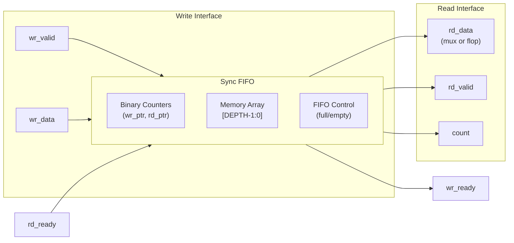

<!-- RTL Design Sherpa Documentation Header -->
<table>
<tr>
<td width="80">
  <a href="https://github.com/sean-galloway/RTLDesignSherpa">
    
  </a>
</td>
<td>
  <strong>RTL Design Sherpa</strong> · <em>Learning Hardware Design Through Practice</em><br>
  <sub>
    <a href="https://github.com/sean-galloway/RTLDesignSherpa">GitHub</a> ·
    <a href="https://github.com/sean-galloway/RTLDesignSherpa/blob/main/docs/DOCUMENTATION_INDEX.md">Documentation Index</a> ·
    <a href="https://github.com/sean-galloway/RTLDesignSherpa/blob/main/LICENSE">MIT License</a>
  </sub>
</td>
</tr>
</table>

---

<!-- End Header -->

# gaxi_fifo_sync

**Module:** `gaxi_fifo_sync.sv`
**Location:** `rtl/amba/gaxi/`
**Status:** Production Ready

---

## Overview

Unlike the skid buffer, this module is a true FIFO built on read/write pointers, which is what lets it support larger depths efficiently. Any depth works; a power of 2 is recommended.

### Key Features

- **Arbitrary Depth:** Any depth >= 2 (power of 2 optimal; DEPTH=1 does not elaborate -- the pointer math needs at least one address bit)
- **Two Read Modes:** Mux mode (combinatorial) or Flop mode (registered)
- **Counter-Based:** Binary counters with wrapping
- **Occupancy Count:** `count` output, `[AW:0]` wide
- **Single Clock Domain:** Synchronous design

---

## Module Interface

```systemverilog
module gaxi_fifo_sync #(
    parameter fifo_mem_t MEM_STYLE = FIFO_AUTO,  // FIFO_AUTO | FIFO_SRL | FIFO_BRAM
    parameter int REGISTERED = 0,           // 0=mux mode, 1=flop mode
    parameter int DATA_WIDTH = 4,
    parameter int DEPTH = 4,
    parameter int ALMOST_WR_MARGIN = 1,
    parameter int ALMOST_RD_MARGIN = 1,
    parameter int DW = DATA_WIDTH,
    parameter int D  = DEPTH,
    parameter int AW = $clog2(DEPTH)
) (
    input  logic            axi_aclk,
    input  logic            axi_aresetn,
    input  logic            wr_valid,
    output logic            wr_ready,      // not full
    input  logic [DW-1:0]   wr_data,
    input  logic            rd_ready,
    output logic [AW:0]     count,
    output logic            rd_valid,      // not empty
    output logic [DW-1:0]   rd_data
);
```

---

## Parameters

| Parameter | Type | Default | Description |
|-----------|------|---------|-------------|
| `MEM_STYLE` | fifo_mem_t | `FIFO_AUTO` | Memory inference hint. `FIFO_SRL` targets distributed RAM / MLAB, `FIFO_BRAM` targets block RAM and forces a synchronous read regardless of `REGISTERED`. `FIFO_AUTO` lets the tool choose. |
| `REGISTERED` | int | 0 | 0=mux mode (comb read), 1=flop mode (reg read) |
| `DATA_WIDTH` | int | 4 | Data bus width |
| `DEPTH` | int | 4 | FIFO depth (any value, power-of-2 optimal) |
| `ALMOST_WR_MARGIN` | int | 1 | Almost-full margin — internal only, no port |
| `ALMOST_RD_MARGIN` | int | 1 | Almost-empty margin — internal only, no port |

> The almost-full/almost-empty flags are computed inside `fifo_control` but are
> not brought out of `gaxi_fifo_sync`, so the two margins have no observable
> effect. Compare `count` against your own threshold instead.

---

## Ports

| Port | Dir | Width | Description |
|---|---|---|---|
| `axi_aclk` | In | 1 |  |
| `axi_aresetn` | In | 1 |  |
| `wr_valid` | In | 1 |  |
| `wr_ready` | Out | 1 | not full |
| `wr_data` | In | `[DW-1:0]` |  |
| `rd_ready` | In | 1 |  |
| `count` | Out | `[AW:0]` |  |
| `rd_valid` | Out | 1 | not empty |
| `rd_data` | Out | `[DW-1:0]` |  |

---

## Functional Description

### Read Modes

#### Mux Mode (REGISTERED=0)
- **Latency:** 1 cycle write → read
- **Read Path:** Combinatorial from memory
- **Use Case:** Low latency applications
- **Timing:** May create combinatorial path

#### Flop Mode (REGISTERED=1)
- **Latency:** 2 cycles write → read
- **Read Path:** Registered output
- **Use Case:** Timing closure, deep pipelines
- **Timing:** No combinatorial paths

### Architecture



### Dependencies

- `counter_bin.sv` - Binary counters for read/write pointers
- `fifo_control.sv` - Full/empty flag generation

---

### Resource Utilization

| DEPTH | Mode | Flops | LUTs | Memory Bits |
|-------|------|-------|------|-------------|
| 16 | Mux | 16×DW + ~20 | ~80 | 16×DW |
| 16 | Flop | 16×DW + DW + ~20 | ~80 | 16×DW |
| 64 | Mux | 64×DW + ~30 | ~120 | 64×DW |
| 64 | Flop | 64×DW + DW + ~30 | ~120 | 64×DW |
## Design Notes

**Depth need not be a power of two.** `fifo_control` computes its
flags through `counter_bin`'s MAX wrap, so any `DEPTH <= 2^ADDR_WIDTH` works. The
header once claimed DEPTH must EQUAL 2^ADDR_WIDTH, which overstated the constraint
and made non-power-of-two depths look illegal (COMMON-014).

**Almost-full and almost-empty margins are in entries, not percent**, and a margin
larger than the depth makes the flag unreachable rather than always-asserted.

---

## Timing Characteristics

| Mode | Write→Read Latency | Max Throughput | Read Path |
|------|-------------------|----------------|-----------|
| Mux (REGISTERED=0) | 1 cycle | 1/cycle | Combinatorial |
| Flop (REGISTERED=1) | 2 cycles | 1/cycle | Registered |

---

## Usage Examples

### Example 1: Mux Mode (Low Latency)

```systemverilog
gaxi_fifo_sync #(
    .DATA_WIDTH(64),
    .DEPTH(32),
    .REGISTERED(0)        // Mux mode: 1-cycle latency
) u_low_latency_fifo (
    .axi_aclk    (clk),
    .axi_aresetn (rst_n),
    .wr_valid    (wr_valid),
    .wr_ready    (wr_ready),
    .wr_data     (wr_data),
    .rd_ready    (rd_ready),
    .rd_valid    (rd_valid),
    .rd_data     (rd_data),  // Combinatorial read
    .count       (fifo_level)
);
```

### Example 2: Flop Mode (Timing Closure)

```systemverilog
gaxi_fifo_sync #(
    .DATA_WIDTH(128),
    .DEPTH(64),
    .REGISTERED(1)        // Flop mode: 2-cycle latency
) u_registered_fifo (
    .axi_aclk    (clk),
    .axi_aresetn (rst_n),
    .wr_valid    (wr_valid),
    .wr_ready    (wr_ready),
    .wr_data     (wr_data),
    .rd_ready    (rd_ready),
    .rd_valid    (rd_valid),
    .rd_data     (rd_data),  // Registered output
    .count       (fifo_level)
);
```

---

## Testing

One testbench covers both output modes:

```bash
# Test FIFO modes
pytest val/amba/test_gaxi_fifo_sync.py -k "fifo_mux" -v   # Mux mode
pytest val/amba/test_gaxi_fifo_sync.py -k "fifo_flop" -v  # Flop mode
```

---

## Related Modules

- [gaxi_skid_buffer](gaxi_skid_buffer.md) - Same 1-cycle latency, shallower elastic storage
- [gaxi_fifo_async](../../rtl-cdc/gaxi_fifo_async.md) - Clock domain crossing version
- [GAXI Index](index.md) - Overview of all GAXI modules

---

**Version:** 1.0
**Last Updated:** 2025-10-06

---

## Navigation

- **[← Back to GAXI Index](README.md)**
- **[← Back to rtl-amba Index](../index.md)**
