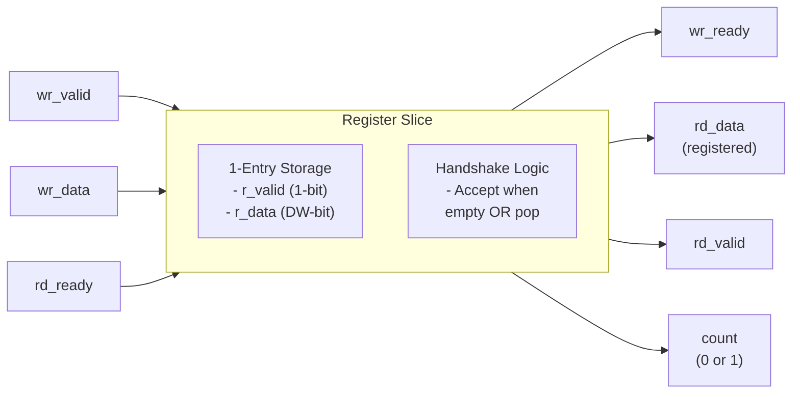

<!-- RTL Design Sherpa Documentation Header -->
<table>
<tr>
<td width="80">
  <a href="https://github.com/sean-galloway/RTLDesignSherpa">
    
  </a>
</td>
<td>
  <strong>RTL Design Sherpa</strong> · <em>Learning Hardware Design Through Practice</em><br>
  <sub>
    <a href="https://github.com/sean-galloway/RTLDesignSherpa">GitHub</a> ·
    <a href="https://github.com/sean-galloway/RTLDesignSherpa/blob/main/docs/DOCUMENTATION_INDEX.md">Documentation Index</a> ·
    <a href="https://github.com/sean-galloway/RTLDesignSherpa/blob/main/LICENSE">MIT License</a>
  </sub>
</td>
</tr>
</table>

---

<!-- End Header -->

# gaxi_regslice

**Module:** `gaxi_regslice.sv`
**Location:** `rtl/amba/gaxi/`
**Status:** Production Ready

---

## Overview

This is the classic register slice: a 1-deep elastic buffer that exists for one reason — pipeline timing isolation. Data transfer is always registered, so you get a guaranteed, predictable 1-cycle latency and consistent throughput.

### Key Features

- **Fixed 1-Cycle Latency:** Always registered, predictable timing
- **Full Throughput:** 1 beat/cycle in steady state
- **Elastic Buffering:** Absorbs single-cycle backpressure
- **Port Compatible:** Intentionally aligned with gaxi_skid_buffer
- **Ready/Valid Handshake:** Industry-standard AXI-like protocol
- **Minimal Resources:** Single register stage

---

## Parameters

| Parameter | Type | Default | Description |
|-----------|------|---------|-------------|
| `DATA_WIDTH` | int | 32 | Data bus width (arbitrary) |
| `DW` | int | DATA_WIDTH | Derived parameter (internal use) |

---

## Ports

```systemverilog
module gaxi_regslice #(
    parameter int DATA_WIDTH   = 32,
    parameter int DW           = DATA_WIDTH    // Derived
) (
    // Global Clock and Reset
    input  logic          axi_aclk,
    input  logic          axi_aresetn,

    // Write Interface (Input Side)
    input  logic          wr_valid,
    output logic          wr_ready,
    input  logic [DW-1:0] wr_data,

    // Read Interface (Output Side)
    output logic          rd_valid,
    input  logic          rd_ready,
    output logic [DW-1:0] rd_data,

    // Status/Monitoring
    output logic [3:0]    count,      // 0 or 1
    output logic [3:0]    rd_count    // mirror of count
);
```

| Port | Direction | Width | Description |
|------|-----------|-------|-------------|
| `axi_aclk` | input | 1 |  |
| `axi_aresetn` | input | 1 |  |
| `wr_valid` | input | 1 |  |
| `wr_ready` | output | 1 |  |
| `wr_data` | input | `[DW-1:0]` |  |
| `rd_valid` | output | 1 |  |
| `rd_ready` | input | 1 |  |
| `rd_data` | output | `[DW-1:0]` |  |
| `count` | output | `[3:0]` | 0 or 1 |
| `rd_count` | output | `[3:0]` | mirror of count |

---

## Functional Description

### Architecture

The register slice implements a single-entry elastic buffer with simultaneous push/pop capability:



### Ready/Valid Protocol

**Write Ready Conditions:**
```systemverilog
wr_ready = (!r_valid) || (r_valid && rd_ready)
```
- Accept when storage is **empty** (r_valid=0)
- Accept when storage is **full** AND downstream **consuming** (simultaneous transfer)

**Read Valid:**
```systemverilog
rd_valid = r_valid
```
- Valid when storage is occupied

### Transfer Scenarios

| Scenario | wr_valid | wr_ready | rd_valid | rd_ready | Action |
|----------|----------|----------|----------|----------|--------|
| **Idle** | 0 | 1 (empty) | 0 | X | Storage empty, ready to accept |
| **Fill** | 1 | 1 | 0 | X | Write data → storage, r_valid=1 |
| **Full** | 0 | 0 | 1 | 0 | Storage occupied, downstream not consuming |
| **Drain** | 0 | 1 (will empty) | 1 | 1 | Read consumes data, r_valid=0 |
| **Pass-through** | 1 | 1 | 1 | 1 | Simultaneous write+read, data passes through |

### Storage Update Logic

```systemverilog
unique case ({w_wxfer, w_rxfer})
    2'b10: begin  // Write only: fill
        r_valid <= 1'b1;
        r_data  <= wr_data;
    end
    2'b01: begin  // Read only: drain
        r_valid <= 1'b0;
    end
    2'b11: begin  // Simultaneous: pass through with register
        r_valid <= 1'b1;
        r_data  <= wr_data;
    end
    default: begin  // Idle: hold state
        r_valid <= r_valid;
        r_data  <= r_data;
    end
endcase
```

---

## Timing Characteristics

| Characteristic | Value | Notes |
|---------------|-------|-------|
| Write→Read Latency | **1 cycle** | Always registered, fixed latency |
| Max Throughput | **1 beat/cycle** | Sustained in steady state |
| Backpressure Absorption | **1 beat** | Single-entry elastic buffer |
| Read Path | **Registered** | No combinatorial paths |
| Write Path | **Combinatorial** | wr_ready depends on rd_ready |

### Latency Guarantee

The register slice introduces exactly 1 cycle of latency. So does `gaxi_skid_buffer` -- the two differ in depth and backpressure absorption, not in minimum latency:

```
Cycle:   1      2      3      4      5

wr_valid   ‾‾_____________________
wr_data  =[ A ]=====================

r_valid  ________‾‾‾‾‾‾‾‾‾_________
r_data   ========[ A ]================

rd_valid ________‾‾‾‾‾‾‾‾‾_________
rd_data  ========[ A ]================
         ↑
         1-cycle delay guaranteed
```

---

## Usage Examples

Every parameter and port below is read from the module declaration.

```systemverilog
gaxi_regslice #(
    .DATA_WIDTH            (32)
) u_gaxi_regslice (
    .axi_aclk              (axi_aclk),
    .axi_aresetn           (axi_aresetn),
    .wr_valid              (wr_valid),
    .wr_ready              (wr_ready),
    .wr_data               (wr_data),
    .rd_valid              (rd_valid),
    .rd_ready              (rd_ready),
    .rd_data               (rd_data),
    .count                 (count),
    .rd_count              (rd_count)
);
```

---

## Design Notes

### Port Compatibility

**Intentional alignment with gaxi_skid_buffer allows drop-in replacement:**

```systemverilog
// Both modules share identical port signatures
gaxi_regslice #(.DATA_WIDTH(64)) u_option1 (...);
gaxi_skid_buffer #(.DATA_WIDTH(64)) u_option2 (...);
```

This enables easy experimentation:
- Start with **gaxi_regslice** when a single pipeline break is all you need
- Swap to **gaxi_skid_buffer** when the consumer stalls and you want 2-8
  entries of backpressure absorption -- latency is identical either way

### Status Signals

**count and rd_count are 4-bit for interface compatibility:**
- Value 0: Storage empty
- Value 1: Storage occupied
- Both signals always equal (redundant, but matches skid buffer interface)

### Assertions

The module contains exactly one check — an occupancy sanity check on a
single-entry slice:

```systemverilog
$error("[%m] count > 1 (=%0d) @ %0t", count, $time);
```

There are no backpressure or invalid-read checks, and the file carries no
`translate_off` / `synopsys` pragmas, so nothing here is synthesis-guarded.
Backpressure and handshake legality are checked in verification, by the GAXI
BFMs in `val/amba/test_gaxi_regslice.py`.

### Resource Utilization

FPGA resource usage, typical:

| DATA_WIDTH | Flops | LUTs | Slice Registers |
|------------|-------|------|-----------------|
| 8 | 9 | ~6 | 9 |
| 32 | 33 | ~12 | 33 |
| 64 | 65 | ~18 | 65 |
| 128 | 129 | ~24 | 129 |

**Scaling:** Approximately DATA_WIDTH + 1 flops (data + valid flag)

---

## Related Modules

### gaxi_regslice vs gaxi_skid_buffer

| Feature | gaxi_regslice | gaxi_skid_buffer |
|---------|---------------|------------------|
| **Depth** | 1 entry | DEPTH entries, 2..8 inclusive (any integer) |
| **Latency** | **1 cycle (fixed)** | 1 cycle (fixed) |
| **Bypass Path** | No | No |
| **Throughput** | 1 beat/cycle | 1 beat/cycle |
| **Use Case** | **Timing isolation** | **Backpressure absorption** |
| **Registered Output** | Always | Always |
| **Timing Closure** | Good | Good |

**When to Choose:**
- **gaxi_regslice:** one entry is enough -- you only need a pipeline break
- **gaxi_skid_buffer:** you also need backpressure absorption (2-8 entries)

Latency does NOT differentiate them: both are fixed 1-cycle with registered
outputs (the table above and the RTL agree). Choose on depth.

### gaxi_regslice vs gaxi_fifo_sync

| Feature | gaxi_regslice | gaxi_fifo_sync |
|---------|---------------|----------------|
| **Depth** | 1 entry (fixed) | Parameterized (N entries) |
| **Latency** | 1 cycle | 1-2 cycles (mode-dependent) |
| **Resources** | Minimal (1 register) | Scales with depth |
| **Use Case** | Pipeline breaks | Buffering, rate matching |

- [gaxi_skid_buffer](gaxi_skid_buffer.md) - Same latency, deeper elastic storage
- [gaxi_fifo_sync](gaxi_fifo_sync.md) - Multi-entry FIFO version
- [gaxi_fifo_async](../../rtl-cdc/gaxi_fifo_async.md) - Clock domain crossing version
- [GAXI Index](index.md) - Overview of all GAXI modules

---

## Testing

**Test File:** `val/amba/test_gaxi_regslice.py`

**Test Methods:**
- Simple incremental loops (fill/drain cycles)
- Back-to-back transfers (sustained throughput)
- Comprehensive randomizer sweep (varied timing patterns)
- Stress test with random patterns

**Test Levels:**
- **basic:** Quick smoke test (~30s, 4 loops)
- **medium:** Moderate coverage (~2min, expanded patterns)
- **full:** Comprehensive validation (~5min, 100+ loops)

### Running Tests

```bash
# Basic test (quick validation)
TEST_LEVEL=basic pytest val/amba/test_gaxi_regslice.py -v

# Medium test (normal CI)
TEST_LEVEL=medium pytest val/amba/test_gaxi_regslice.py -v

# Full test (pre-release validation)
TEST_LEVEL=full pytest val/amba/test_gaxi_regslice.py -v
```

---

**Version:** 1.0
**Last Updated:** 2025-10-23

---

## Navigation

- **[← Back to GAXI Index](README.md)**
- **[← Back to rtl-amba Index](../index.md)**
