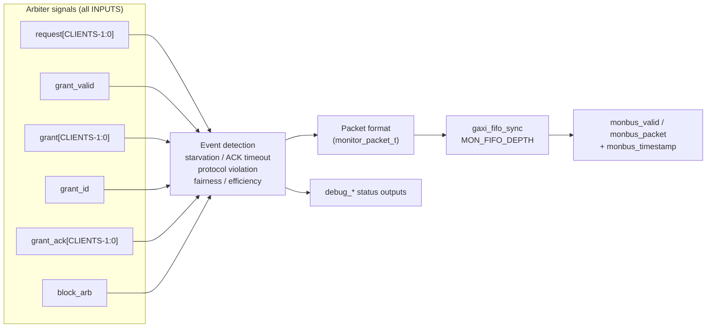

<!-- RTL Design Sherpa Documentation Header -->
<table>
<tr>
<td width="80">
  <a href="https://github.com/sean-galloway/RTLDesignSherpa">
    
  </a>
</td>
<td>
  <strong>RTL Design Sherpa</strong> · <em>Learning Hardware Design Through Practice</em><br>
  <sub>
    <a href="https://github.com/sean-galloway/RTLDesignSherpa">GitHub</a> ·
    <a href="https://github.com/sean-galloway/RTLDesignSherpa/blob/main/docs/DOCUMENTATION_INDEX.md">Documentation Index</a> ·
    <a href="https://github.com/sean-galloway/RTLDesignSherpa/blob/main/LICENSE">MIT License</a>
  </sub>
</td>
</tr>
</table>

---

<!-- End Header -->

# arbiter_monbus_common

**Module:** `arbiter_monbus_common.sv`
**Location:** `rtl/amba/monitor/`
**Category:** Core Infrastructure
**Status:** Production Ready

---

## Overview

`arbiter_monbus_common` is the shared **telemetry block** that watches an
arbiter and reports on it. It is instantiated inside `arbiter_rr_pwm_monbus`
and `arbiter_wrr_pwm_monbus` as `u_monitor`.

It performs **no arbitration of its own.** Every arbiter-facing signal
(`request`, `grant_valid`, `grant`, `grant_id`, `grant_ack`, `block_arb`) is an
**input**: the module snoops the decisions an external arbiter has already
made, measures them, and emits 128-bit monitor packets about what it saw. There
is no request/grant output, no data mux, and no client stream inputs.

> **Looking for the N:1 monitor-bus merge?** That is a different module:
> [`monbus_arbiter`](monbus_arbiter.md), which takes N `monbus_valid`/`packet`
> streams and arbitrates them onto one. This page has described that module in
> the past; it does not describe this one.

What it does, in five verbs:

1. **Observe:** sample the arbiter's request/grant/ACK activity without perturbing it
2. **Detect:** identify starvation, ACK timeouts, protocol violations, and threshold crossings
3. **Measure:** maintain fairness-deviation and grant-efficiency metrics
4. **Report:** format findings as `monitor_packet_t` records and queue them for the monitor bus
5. **Expose:** drive silicon-debug status outputs (`debug_*`) for direct observation

Feature summary:

- **Snoops any arbiter** — RR or WRR, with or without the grant-ACK handshake
- **Per-client ACK timeout tracking** with a configurable threshold
- **Protocol violation detection** — multiple simultaneous grants, spurious ACKs, grant without request
- **Starvation detection** with per-client timing
- **Fairness deviation** measured against configured client weights
- **Grant efficiency** tracking (grants issued vs. completed)
- **128-bit monitor packets** emitted through an internal FIFO, plus a 64-bit side-band timestamp

---

## Parameters

| Parameter | Type | Default | Description |
|---|---|---|---|
| `CLIENTS` | int | 4 | Width of the **snooped arbiter's** client vectors (`request`, `grant`, `grant_ack`). Nothing is arbitrated here -- this sizes what is observed |
| `WAIT_GNT_ACK` | int | 0 | 1 = require a grant-ACK handshake |
| `WEIGHTED_MODE` | int | 0 | **Dead** — declared but referenced by no logic. Fairness analysis always uses the `cfg_max_thresh` weights, and this module performs no arbitration for a mode switch to modulate. Setting it changes nothing |
| `MON_AGENT_ID` | logic [15:0] | 16'h0010 | Monitor agent identifier (16-bit) |
| `MON_UNIT_ID` | logic [7:0] | 8'h00 | Monitor unit identifier (8-bit) |
| `MON_FIFO_DEPTH` | int | 8 | Monitor packet FIFO depth |
| `MON_FIFO_ALMOST_MARGIN` | int | 1 | Almost-full margin for the monitor FIFO |
| `FAIRNESS_REPORT_CYCLES` | int | 256 | How often the fairness deviation is **recomputed** (cycles). **Not a sliding window:** `r_grant_counters` and `r_total_grants` are cleared on reset alone, so the deviation is always computed from grants accumulated since reset. `MIN_GRANTS_FOR_FAIRNESS` is likewise compared against the lifetime total. After a traffic-phase or weight change the figure converges toward the new distribution rather than snapping to it |
| `MIN_GRANTS_FOR_FAIRNESS` | int | 100 | Minimum grants before a fairness report is valid |
| `DEFAULT_ACK_TIMEOUT` | int | 64 | **Dead** — declared and referenced by no logic. The effective threshold is whatever is driven on the `cfg_mon_ack_timeout_thresh` **port** (`arbiter_rr_pwm_monbus` hardwires `16'h40`; `arbiter_wrr_pwm_monbus` passes its own port through). Overriding this parameter changes nothing |

`MAX_LEVELS` (default 16) is an independent parameter, not a derived one: it
sets the per-client weight resolution and therefore the width of the
`cfg_max_thresh` port (`CXMTW = CLIENTS * $clog2(MAX_LEVELS)`).
`arbiter_wrr_pwm_monbus` passes its own `MAX_LEVELS` down. Change it and the
port width changes with it.

`N` (`$clog2(CLIENTS)`), `MON_FIFO_COUNT_WIDTH`, `MAX_LEVELS_WIDTH` and the
weight-vector widths are derived from the parameters above. They are declared
with `parameter` rather than `localparam`, so they are overridable in
principle — don't, since they must stay consistent with what they are derived
from.

---

### Derived Parameters (do not override)

These are declared as `parameter` so the elaborator can compute them, not so callers can set them. Each defaults to an expression over the parameters above; overriding one desynchronises it from its source and the design fails to elaborate or silently mis-sizes a bus. Set the parameters they are derived FROM and leave these alone.

| Derived parameter | Default expression |
|---|---|
| `MFCW` | `MON_FIFO_COUNT_WIDTH` |
| `MTW` | `MAX_LEVELS_WIDTH` |

## Ports

All ports, from `rtl/amba/monitor/arbiter_monbus_common.sv`. Every arbiter-facing
signal is an INPUT: this module snoops and never drives the arbiter.

**Clock and reset**

| Port | Dir | Width | Description |
|---|---|---|---|
| `clk` | In | 1 | Clock. Note this module uses `clk`/`rst_n`, not the AMBA `aclk`/`aresetn` |
| `rst_n` | In | 1 | Active-low reset |

**Snooped arbiter interface (inputs only)**

| Port | Dir | Width | Description |
|---|---|---|---|
| `request` | In | `CLIENTS` | Client request vector |
| `grant_valid` | In | 1 | Grant is valid this cycle |
| `grant` | In | `CLIENTS` | One-hot grant vector |
| `grant_id` | In | `N` | Binary-encoded grant ID |
| `grant_ack` | In | `CLIENTS` | Per-client grant acknowledge |
| `block_arb` | In | 1 | Arbiter is blocked (optional; tie 0 if unused) |

**Configuration**

| Port | Dir | Width | Description |
|---|---|---|---|
| `cfg_mon_enable` | In | 1 | Master enable for the monitor |
| `cfg_mon_pkt_type_enable` | In | 16 | Per-packet-type enable mask |
| `cfg_mon_latency_thresh` | In | 16 | Grant-latency threshold |
| `cfg_mon_starvation_thresh` | In | 16 | Per-client starvation threshold |
| `cfg_mon_fairness_thresh` | In | 16 | Fairness-deviation threshold |
| `cfg_mon_active_thresh` | In | 16 | Active-client-count threshold |
| `cfg_mon_ack_timeout_thresh` | In | 16 | ACK timeout threshold |
| `cfg_mon_efficiency_thresh` | In | 16 | Grant-efficiency threshold |
| `cfg_mon_sample_period` | In | 8 | Sampling period for the periodic metrics |
| `cfg_max_thresh` | In | `CXMTW` | Packed per-client weight/threshold vector |
| `i_mon_time` | In | `monbus_timestamp_t` | Shared timestamp input |

**Monitor bus output**

| Port | Dir | Width | Description |
|---|---|---|---|
| `monbus_valid` | Out | 1 | Packet valid |
| `monbus_ready` | In | 1 | Downstream accepts the packet |
| `monbus_packet` | Out | `monitor_packet_t` | 128-bit monitor packet |
| `monbus_timestamp` | Out | `monbus_timestamp_t` | Side-band sampled time |

**Debug status outputs**

| Port | Dir | Width | Description |
|---|---|---|---|
| `debug_fifo_count` | Out | `$clog2(MON_FIFO_DEPTH)+1` | Occupancy of the packet FIFO |
| `debug_packet_count` | Out | 16 | Packets emitted |
| `debug_ack_timeout` | Out | `CLIENTS` | Per-client ACK timeout status |
| `debug_protocol_violations` | Out | 16 | Protocol-violation count |
| `debug_grant_efficiency` | Out | 16 | Grant efficiency, percent |
| `debug_client_starvation` | Out | `CLIENTS` | Per-client starvation flags |
| `debug_fairness_deviation` | Out | 16 | Fairness-deviation metric |
| `debug_monitor_state` | Out | 3 | Monitor internal state |

---

## Functional Description



The single monitor-bus output carries this module's **own** event packets. It
is not a merge of upstream streams — there are none.

This module is instantiated automatically within the higher-level monitor
modules (`arbiter_rr_pwm_monbus`, `arbiter_wrr_pwm_monbus`); you configure its
behavior through the top-level monitor parameters rather than instantiating it
yourself. See the individual monitor pages for configuration examples.

---

## Timing Characteristics
| Metric | Value | Notes |
|---|---|---|
| Latency | 1-2 cycles | Typical processing delay |
| Throughput | 1 operation/cycle | Maximum rate |

---

## Usage Examples

Every parameter and port below is taken from the module declaration.

```systemverilog
arbiter_monbus_common #(
    .CLIENTS               (4),
    .WAIT_GNT_ACK          (0),
    .WEIGHTED_MODE         (0),
    .MON_AGENT_ID          (16'h0010),
    .MON_UNIT_ID           (8'h00),
    .MON_FIFO_DEPTH        (8),
    .MON_FIFO_ALMOST_MARGIN(1),
    .FAIRNESS_REPORT_CYCLES(256),
    .MIN_GRANTS_FOR_FAIRNESS(100),
    .DEFAULT_ACK_TIMEOUT   (64)
) u_arbiter_monbus_common (
    .clk                   (clk),
    .rst_n                 (rst_n),
    .cfg_max_thresh        (cfg_max_thresh),
    .request               (request),
    .grant_valid           (grant_valid),
    .grant                 (grant),
    .grant_id              (grant_id),
    .grant_ack             (grant_ack),
    .block_arb             (block_arb),
    .cfg_mon_enable        (cfg_mon_enable),
    .cfg_mon_pkt_type_enable(cfg_mon_pkt_type_enable),
    .cfg_mon_latency_thresh(cfg_mon_latency_thresh),
    .cfg_mon_starvation_thresh(cfg_mon_starvation_thresh),
    .cfg_mon_fairness_thresh(cfg_mon_fairness_thresh),
    .cfg_mon_active_thresh (cfg_mon_active_thresh),
    .cfg_mon_ack_timeout_thresh(cfg_mon_ack_timeout_thresh),
    .cfg_mon_efficiency_thresh(cfg_mon_efficiency_thresh),
    .cfg_mon_sample_period (cfg_mon_sample_period),
    .i_mon_time            (i_mon_time),
    .monbus_valid          (monbus_valid),
    .monbus_ready          (monbus_ready),
    .monbus_packet         (monbus_packet),
    .monbus_timestamp      (monbus_timestamp),
    .debug_fifo_count      (debug_fifo_count),
    .debug_packet_count    (debug_packet_count),
    .debug_ack_timeout     (debug_ack_timeout),
    .debug_protocol_violations(debug_protocol_violations),
    .debug_grant_efficiency(debug_grant_efficiency),
    .debug_client_starvation(debug_client_starvation),
    .debug_fairness_deviation(debug_fairness_deviation),
    .debug_monitor_state   (debug_monitor_state)
);
```

---

## Design Notes

**This module snoops and never drives.** Every arbiter-facing port is an input;
it observes request/grant/ACK activity and cannot perturb the arbitration it is
measuring. That is the property that lets it be dropped into an existing
arbiter without changing behaviour.

**It uses `clk`/`rst_n`, not the AMBA `aclk`/`aresetn`.** An easy mis-wire in a
file where every neighbour uses the AMBA names.

**The compliance model belongs to the DV framework, not here.** Round-robin
order, starvation and fairness verdicts are computed in
`CocoTBFramework`'s `ArbiterCompliance`; several historical "violations" were
defects in that model rather than in any arbiter (COMMON-016 through
COMMON-019).

---

## Related Modules

**Used by:** `arbiter_rr_pwm_monbus`, `arbiter_wrr_pwm_monbus` (as `u_monitor`).

**See also:** [axi_monitor_reporter](./axi_monitor_reporter.md)

---

## Testing

Coverage targets:

- Functional correctness of core logic
- Boundary conditions (min/max values)
- Error handling and recovery
- Interface protocol compliance

**See:** `val/amba/test_arbiter_monbus_common.py` for verification tests

---

## References

- **Monitor Architecture:** `docs/markdown/rtl-amba/overview.md`
- **Monitor Configuration Guide:** [Monitor Base Configuration](./axi_monitor_base.md)
- **Packet Format Specification:** `docs/markdown/rtl-amba/includes/monitor_package_spec.md`

---

## Navigation

- **[← Back to Shared Infrastructure Index](../_book_monitor_index.md)**
- **[← Back to rtl-amba Index](../index.md)**
- **[← Back to Main Documentation Index](../../index.md)**
