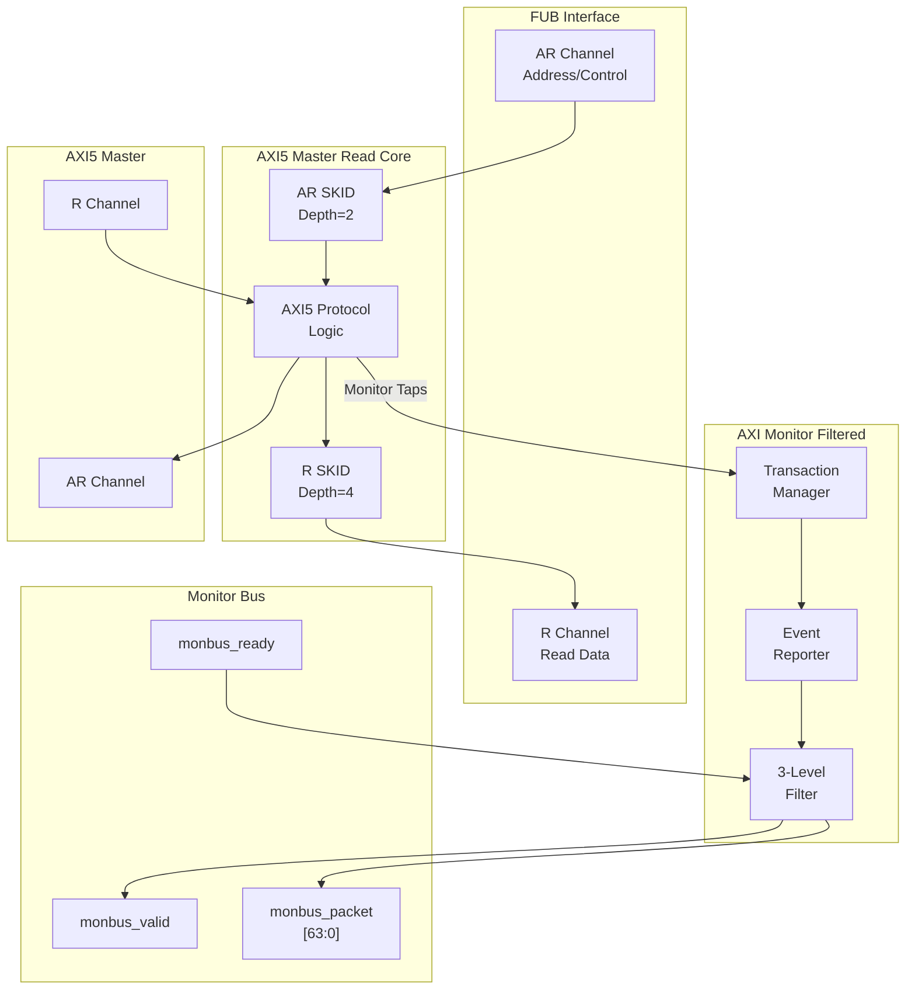

<!-- RTL Design Sherpa Documentation Header -->
<table>
<tr>
<td width="80">
  <a href="https://github.com/sean-galloway/RTLDesignSherpa">
    
  </a>
</td>
<td>
  <strong>RTL Design Sherpa</strong> · <em>Learning Hardware Design Through Practice</em><br>
  <sub>
    <a href="https://github.com/sean-galloway/RTLDesignSherpa">GitHub</a> ·
    <a href="https://github.com/sean-galloway/RTLDesignSherpa/blob/main/docs/DOCUMENTATION_INDEX.md">Documentation Index</a> ·
    <a href="https://github.com/sean-galloway/RTLDesignSherpa/blob/main/LICENSE">MIT License</a>
  </sub>
</td>
</tr>
</table>

---

<!-- End Header -->

# AXI5 Master Read with Monitor

**Module:** `axi5_master_rd_mon.sv`
**Location:** `rtl/amba/monitor/`
**Status:** Production Ready

---

## Overview

The AXI5 Master Read with Monitor module combines the standard `axi5_master_rd` core with an integrated `axi_monitor_filtered` for comprehensive transaction monitoring and error detection. This module provides real-time visibility into AXI5 read operations with configurable packet filtering.

### Key Features

- Full AMBA AXI5 protocol compliance (wraps `axi5_master_rd`)
- **ARNSAID:** Non-secure access identifier for security domains
- **ARTRACE:** Trace signal for debug and performance monitoring
- **ARMPAM:** Memory Partitioning and Monitoring (PartID + PMG)
- **ARMECID:** Memory Encryption Context ID for secure memory
- **ARUNIQUE:** Unique ID indicator for cache operations
- **ARCHUNKEN:** Read data chunking enable for partial data transfers
- **ARTAGOP:** Memory tag operation (MTE - Memory Tagging Extension)
- **RTRACE:** Read data trace signal
- **RPOISON:** Data poison indicator for corrupted data detection
- **RCHUNKV/RCHUNKNUM/RCHUNKSTRB:** Chunking control signals
- **RTAG/RTAGMATCH:** Memory tags and tag match response (MTE)
- **Integrated AXI monitor** with 3-level filtering hierarchy
- **Error detection:** Protocol violations, SLVERR, DECERR
- **Timeout monitoring:** Stuck transactions, stalled channels
- **Performance metrics:** Latency, throughput, outstanding transactions
- **MonBus output:** Standardized 128-bit monitor packet format paired with 64-bit side-band timestamp
- **Configuration validation:** Detects filter conflicts

---

## Module Architecture



---

## Parameters

| Parameter | Type | Default | Description |
|-----------|------|---------|-------------|
| SKID_DEPTH_AR | int | 2 | AR channel SKID buffer depth |
| SKID_DEPTH_R | int | 4 | R channel SKID buffer depth |
| AXI_ID_WIDTH | int | 8 | Transaction ID width |
| AXI_ADDR_WIDTH | int | 32 | Address bus width |
| AXI_DATA_WIDTH | int | 32 | Data bus width |
| AXI_USER_WIDTH | int | 1 | User signal width |
| AXI_WSTRB_WIDTH | int | DATA_WIDTH/8 | Write strobe width (calculated) |
| AXI_NSAID_WIDTH | int | 4 | Non-secure access ID width |
| AXI_MPAM_WIDTH | int | 11 | MPAM width (PartID + PMG) |
| AXI_MECID_WIDTH | int | 16 | Memory encryption context ID width |
| AXI_TAG_WIDTH | int | 4 | Memory tag width per 16 bytes |
| AXI_TAGOP_WIDTH | int | 2 | Tag operation width |
| AXI_CHUNKNUM_WIDTH | int | 4 | Chunk number width |
| ENABLE_NSAID | bit | 1 | Enable non-secure access ID |
| ENABLE_TRACE | bit | 1 | Enable trace signals |
| ENABLE_MPAM | bit | 1 | Enable memory partitioning |
| ENABLE_MECID | bit | 1 | Enable memory encryption context |
| ENABLE_UNIQUE | bit | 1 | Enable unique ID indicator |
| ENABLE_CHUNKING | bit | 1 | Enable data chunking |
| ENABLE_MTE | bit | 1 | Enable Memory Tagging Extension |
| ENABLE_POISON | bit | 1 | Enable poison indicator |
| **UNIT_ID** | int | 1 | Monitor unit identifier |
| **AGENT_ID** | int | 10 | Monitor agent identifier |
| **MAX_TRANSACTIONS** | int | 16 | Transaction table size |
| ACTIVE_TRANS_THRESHOLD | int | MAX_TRANSACTIONS/2 | Active-transaction count that trips a threshold packet when cfg_threshold_enable=1. Replaces the former hardwired 8/4; threshold packets now scale with the table sizing |
| **ENABLE_FILTERING** | bit | 1 | Enable 3-level packet filtering |
| **ADD_PIPELINE_STAGE** | bit | 0 | Add pipeline stage in monitor (latency vs. timing) |
| **USE_MONITOR** | bit | 1 | Synthesis-time monitor enable. 0 = omit monitor and tie outputs to safe non-blocking defaults; 1 = full monitor functionality. |
| **N_ADDR_RANGES** | int | 0 | Number of address-range comparators. 0 = checker omitted (zero area). >0 = N independent [low, high] ranges; hits emit PktTypeError + AXI_ERR_ADDR_RANGE on monbus. |
| **ENABLE_ERROR_LOGIC** | bit | 1 | Compile-in the error-detection cone (0 drops it for area). |
| **ENABLE_TIMEOUT_LOGIC** | bit | 1 | Compile-in the timeout cone and the `axi_monitor_timeout` instance. |
| **ENABLE_COMPL_LOGIC** | bit | 1 | Compile-in the completion cone. |
| **ENABLE_THRESHOLD_LOGIC** | bit | 1 | Compile-in the threshold cone. |
| **ENABLE_PERF_LOGIC** | bit | 1 | Compile-in the perfmon measurement window and utilization/throughput counters. |
| **ENABLE_DEBUG_LOGIC** | bit | 0 | Compile-in the debug cone (off by default). |

> **Synthesis-cone note:** the six `ENABLE_*_LOGIC` parameters gate each detection cone at synthesis via generate-if, so unused logic drops to zero area (classic cones default on, debug off). Inside the wrapper's `axi_monitor_filtered` instance the perf/debug master switches are fixed (`ENABLE_PERF_PACKETS = 1`, `ENABLE_DEBUG_MODULE = 0`). The former `CAM_PIPELINE` / `TRANS_CAM_PIPELINE` parameters were removed — the transaction CAM is now always pipelined.

---

## Monitor Backpressure (block_ready)

`block_ready` is an internal flow-control net inside the wrapper -- it is not a port. It goes low when the monitor's transaction-table occupancy reaches its blocking threshold (a function of `MAX_TRANSACTIONS`; the reporter FIFO depth `INTR_FIFO_DEPTH` has no path to it). The wrapper ANDs it into the upstream-facing `fub_axi_arready` so a saturated monitor throttles new transactions at the handshake instead of dropping events.

- **Where the stall lands**: the upstream `fub_axi_arready` is forced low until the monitor drains.
- **When `USE_MONITOR=0`**: `block_ready` is internally tied high, so the wrapper imposes no stall and runs at full bandwidth.
- **When `cfg_monitor_enable=0`**: the wrapper gate forces the upstream ready open, so a runtime-disabled monitor can never stall the datapath (in-RTL formal property `ap_disabled_never_stalls`).
- **For axi5 slave variants** (only applies to axi5_slave_rd_mon): the monitor watches the FUB-side handshake, so there is a `SKID_DEPTH_AR` cycle lag between block_ready going low and new events ceasing. `MAX_TRANSACTIONS` should be sized to cover this margin.

Recovery is guaranteed by the **saturation-recovery contract**: command-originated table entries are capped at `MAX_TRANSACTIONS - cmd_entry_reserve(MAX_TRANSACTIONS)` (reserve = 2 for tables of 16 or more, 0 below; the function lives in `monitor_common_pkg`), and `block_ready` re-asserts at occupancy `< MAX_TRANSACTIONS - (reserve - 1)` -- a threshold strictly ABOVE the command cap -- so a saturated table always drains back below the reopen point. Blocking throttles; it never deadlocks. Tables smaller than 16 keep full legacy allocation (small tables cannot spare slots) and trade the recovery guarantee for tracking capacity. The contract is verified by in-RTL formal properties (mutation-checked) and a 100-seed deliberately-undersized-table stream sweep; see [axi_monitor_base](axi_monitor_base.md#flow-control-and-the-saturation-recovery-contract) for the canonical description.

Sizing note: a monitor on a bus shared by several channels/requesters must size `MAX_TRANSACTIONS` to cover `NUM_CHANNELS x per-channel outstanding` plus margin -- the per-channel limit alone makes the monitor throttle the shared master. Tables deeper than 64 also need Verilator's `--unroll-count` raised (default 64) in sim builds.

---

## Address-Range Checker

The wrapper can be parameterized with `N_ADDR_RANGES > 0` to instantiate an N-comparator address-range checker that watches every accepted AR handshake and emits a `PktTypeError` monbus packet (event code `AXI_ERR_ADDR_RANGE = 8'h0D`) when an address falls inside any of the configured `[low, high]` inclusive ranges.

**Config inputs (active only when `N_ADDR_RANGES > 0`):**
- `cfg_addr_check_enable` — master on/off for the checker.
- `cfg_addr_range_enable[N-1:0]` — per-range enable bit.
- `cfg_addr_range_low[N-1:0][AXI_ADDR_WIDTH-1:0]` — inclusive low bound for each range.
- `cfg_addr_range_high[N-1:0][AXI_ADDR_WIDTH-1:0]` — inclusive high bound for each range.

**Event encoding** (within the standard 128-bit `monitor_packet_t`, event_data field):
- `packet_type` = `PktTypeError` (4'h0)
- `protocol`    = AXI (3'b000)
- `event_code`  = `AXI_ERR_ADDR_RANGE` (8'h0D)
- `event_data[63:60]` = `range_index` (4 bits; supports up to 16 ranges)
- `event_data[59:0]`  = full matched address (up to 60 bits, zero-padded if narrower)

**Exact match:** set `cfg_addr_range_low[i] == cfg_addr_range_high[i]`.

**Filtering:** the existing `cfg_axi_error_mask[13]` bit masks this event code; set it high to suppress range packets without disabling other errors. No new mask wiring needed.

**Per-range coalescing:** if a range hits again before its packet has been emitted, the latched address is overwritten (latest hit wins). One packet per cycle drains the pending mask via a lowest-index priority encoder. Distinct ranges never lose events; under sustained per-range bursts, only the latest address per range is reported per emission cycle.

---

## Ports

### Clock and Reset

| Port | Width | Direction | Description |
|------|-------|-----------|-------------|
| aclk | 1 | Input | AXI clock |
| aresetn | 1 | Input | AXI active-low reset |

### FUB AXI5 Interface (Slave Side)

Same as `axi5_master_rd` - see [AXI5 Master Read](../axi5/axi5_master_rd.md) for complete port listing.

### Master AXI5 Interface (Output Side)

Same as `axi5_master_rd` - see [AXI5 Master Read](../axi5/axi5_master_rd.md) for complete port listing.

### Monitor Configuration

| Port | Width | Direction | Description |
|------|-------|-----------|-------------|
| cfg_monitor_enable | 1 | Input | Master runtime gate. 0 = monitor inert: no allocation, transaction CAM held clear, and the upstream ready is never stalled (a disabled monitor cannot block the datapath). 1 = normal operation |
| cam_clear | 1 | Input | Synchronous clear of the monitor transaction CAM (driven from the harness clear control bit, e.g. CTRL[4]) |
| cfg_error_enable | 1 | Input | Enable error packet generation |
| cfg_timeout_enable | 1 | Input | Enable timeout packet generation |
| cfg_perf_enable | 1 | Input | Enable performance packet generation (see [Performance Monitoring](#performance-monitoring)) |
| cfg_compl_enable | 1 | Input | Enable transaction-completion packets |
| cfg_threshold_enable | 1 | Input | Enable threshold-crossed packets |
| cfg_debug_enable | 1 | Input | Enable debug/trace packets (gates the debug cone — the 6th reporter sub-block) |
| cfg_timeout_cycles | 16 | Input | Unified coarse timeout control: 0 = legacy full-scale (15 ticks), 1-15 = that many timer ticks per phase, >15 saturates at 15. One value drives all three phase counts (addr/data/resp), measured in `cfg_freq_sel`-scaled timer ticks, not raw clock cycles |
| cfg_latency_threshold | 32 | Input | Latency threshold for performance alerts |

> **Detection-cone enables:** `cfg_compl_enable`, `cfg_threshold_enable`, and `cfg_debug_enable` turn on the completion, threshold, and debug reporter sub-blocks respectively. `cfg_debug_enable` gates the **debug cone** — the 6th reporter sub-block (`axi_monitor_reporter_debug`). In this wrapper the debug module's `cfg_debug_level` (4) and `cfg_debug_mask` (16) inputs are tied to `4'h0` / `16'h0`; `cfg_active_trans_threshold` is driven from the `ACTIVE_TRANS_THRESHOLD` parameter (default `MAX_TRANSACTIONS/2`). None are wrapper ports.

### AXI Protocol Filtering Configuration

| Port | Width | Direction | Description |
|------|-------|-----------|-------------|
| cfg_axi_pkt_mask | 16 | Input | Packet type filter (Level 1) |
| cfg_axi_err_select | 16 | Input | Error routing configuration (Level 2) |
| cfg_axi_error_mask | 16 | Input | Error event filter (Level 3) |
| cfg_axi_timeout_mask | 16 | Input | Timeout event filter (Level 3) |
| cfg_axi_compl_mask | 16 | Input | Completion event filter (Level 3) |
| cfg_axi_thresh_mask | 16 | Input | Threshold event filter (Level 3) |
| cfg_axi_perf_mask | 16 | Input | Performance event filter (Level 3) |
| cfg_axi_addr_mask | 16 | Input | Address event filter (Level 3) |
| cfg_axi_debug_mask | 16 | Input | Debug event filter (Level 3) |

### Monitor Bus Output

| Port | Width | Direction | Description |
|------|-------|-----------|-------------|
| monbus_valid | 1 | Output | Monitor packet valid |
| monbus_ready | 1 | Input | Monitor packet ready (backpressure) |
| monbus_packet | 128 | Output | `monitor_packet_t` (see format below) |
| monbus_timestamp | 64 | Output | `monbus_timestamp_t` paired atomically with `monbus_packet` |
| i_mon_time | 64 | Input | Free-running counter from `monbus_axil_group`, sampled at packet emission |

### Status Outputs

| Port | Width | Direction | Description |
|------|-------|-----------|-------------|
| busy | 1 | Output | Core busy indicator |
| active_transactions | 8 | Output | Number of outstanding transactions |
| error_count | 16 | Output | Lifetime count of error+timeout packets actually emitted (reporter perf counter; reads 0 when `ENABLE_PERF_LOGIC=0` or `USE_MONITOR=0`) |
| transaction_count | 32 | Output | Lifetime count of completion packets actually emitted (zero-extended 16-bit reporter perf counter; reads 0 when `ENABLE_PERF_LOGIC=0` or `USE_MONITOR=0`) |
| cfg_conflict_error | 1 | Output | Configuration conflict detected |

---

## Performance Monitoring

When performance tracking is compiled in (`ENABLE_PERF_LOGIC = 1`, the wrapper default, with `ENABLE_PERF_PACKETS` fixed to 1 inside the monitor instance) and `cfg_perf_enable` is asserted at runtime, the monitor runs a **measurement-window state machine** plus a bank of data-channel utilization counters. All counters accumulate **only while a window is open** (`window_active = 1`) and hold their values between windows so the host can read a completed window's totals.

### The measurement window

A window is opened by a **start event** and closed by an **end event**. The event sources are selected by `cfg_start_event_sel` / `cfg_end_event_sel` (3-bit; e.g. `3'b010` selects the `cfg_perf_enable` edge) and can also be fired directly by the `cfg_start_trigger` / `cfg_end_trigger` pulses (from an engine or CSR write). `cfg_window_force_close` is a software override that closes the window immediately. While the window is open:

- `window_active` is high.
- `window_cycles` free-runs, counting every clock elapsed inside the window.

### Utilization buckets (R data channel)

Every cycle inside the window is classified by the **R** data channel's valid/ready handshake into exactly one of four buckets:

| Output | Width | Condition | Meaning |
|--------|:-----:|-----------|---------|
| `perf_prod_cycles`  | 32 | `rvalid && rready`   | productive beat transferred |
| `perf_bp_cycles`    | 32 | `rvalid && !rready`  | back-pressure (data offered, sink not ready) |
| `perf_starv_cycles` | 32 | `!rvalid && rready`  | starvation (sink ready, no data) |
| `perf_idle_cycles`  | 32 | `!rvalid && !rready` | idle |

The four buckets sum to `window_cycles`, so utilization = `perf_prod_cycles / window_cycles`.

### Throughput counters

| Output | Width | Meaning |
|--------|:-----:|---------|
| `perf_beat_count`  | 32 | R data beats transferred (= `perf_prod_cycles`, 1 beat/cycle) |
| `perf_byte_count`  | 64 | bytes transferred = beats x (1 << latched ARSIZE), using the ARSIZE captured at the most recent AR address phase |
| `perf_burst_count` | 32 | AR address-phase handshakes |

Average burst length is `perf_beat_count / perf_burst_count`.

### Performance Monitoring Ports

| Port | Width | Direction | Description |
|------|-------|-----------|-------------|
| cfg_perf_enable | 1 | Input | Enable performance-metric packet generation (also listed under Monitor Configuration) |
| cfg_start_event_sel | 3 | Input | Window **start** event source select |
| cfg_end_event_sel | 3 | Input | Window **end** event source select |
| cfg_start_trigger | 1 | Input | Pulse: open the measurement window |
| cfg_end_trigger | 1 | Input | Pulse: close the measurement window |
| cfg_window_force_close | 1 | Input | Software override: force the window closed |
| window_active | 1 | Output | High while a measurement window is open |
| window_cycles | 32 | Output | Cycles elapsed in the current window |
| perf_prod_cycles | 32 | Output | `rvalid && rready` cycles |
| perf_bp_cycles | 32 | Output | `rvalid && !rready` cycles (back-pressure) |
| perf_starv_cycles | 32 | Output | `!rvalid && rready` cycles (starvation) |
| perf_idle_cycles | 32 | Output | `!rvalid && !rready` cycles |
| perf_beat_count | 32 | Output | R data beats transferred |
| perf_byte_count | 64 | Output | bytes transferred |
| perf_burst_count | 32 | Output | AR address-phase handshakes |

When `USE_MONITOR = 0` (or `ENABLE_PERF_LOGIC = 0`) all perfmon outputs are tied to 0.

---

## Functionality

### Monitor Bus Packet Format

The 128-bit `monbus_packet` (paired with the 64-bit `monbus_timestamp` side-band signal) follows the standardized AMBA monitor bus format:

```
Bits [127:124] - Packet Type:
  0x0 = ERROR      Error events (SLVERR, DECERR, protocol violations)
  0x1 = COMPL      Completion events (transaction finished)
  0x2 = THRESH     Threshold events
  0x3 = TIMEOUT    Timeout events
  0x4 = PERF       Performance metrics
  0x8 = ADDR_MATCH Address match events
  0x9 = APB        APB-specific events
  0xF = DEBUG      Debug events
Bits [123:109] - Reserved (15 bits, forward-compat slack)
Bits [108:105] - Protocol (4 bits): 0x0=AXI, 0x1=AXIS, 0x2=APB, 0x3=ARB, 0x4=CORE
Bits [104:97]  - Event Code (8 bits, protocol-specific)
Bits [96:88]   - Channel ID (9 bits — AXI ID or channel index)
Bits [87:72]   - Agent ID (16 bits, from AGENT_ID parameter)
Bits [71:64]   - Unit ID (8 bits, from UNIT_ID parameter)
Bits [63:0]    - Event Data (64 bits — full address, latency, etc.)
```

### Three-Level Filtering Hierarchy

**Level 1: Packet Type Mask (cfg_axi_pkt_mask)**
```systemverilog
cfg_axi_pkt_mask[0] = 1 → Enable ERROR packets
cfg_axi_pkt_mask[1] = 1 → Enable COMPL packets
cfg_axi_pkt_mask[2] = 1 → Enable TIMEOUT packets
cfg_axi_pkt_mask[3] = 1 → Enable THRESH packets
cfg_axi_pkt_mask[4] = 1 → Enable PERF packets
cfg_axi_pkt_mask[5] = 1 → Enable ADDR packets
cfg_axi_pkt_mask[6] = 1 → Enable DEBUG packets
```

**Level 2: Error Routing (cfg_axi_err_select)**

Determines whether errors generate ERROR packets or COMPL packets with error status.

**Level 3: Event Masks (cfg_axi_*_mask)**

Fine-grained control over specific events within each packet type:
- `cfg_axi_error_mask`: SLVERR, DECERR, orphan detection, etc.
- `cfg_axi_timeout_mask`: AR timeout, R timeout, response timeout
- `cfg_axi_compl_mask`: Normal completion, error completion
- `cfg_axi_thresh_mask`: Outstanding transaction count, latency threshold
- `cfg_axi_perf_mask`: Average latency, peak bandwidth, utilization
- `cfg_axi_addr_mask`: Address range tracking
- `cfg_axi_debug_mask`: Internal state, debug events

### Error Detection Events

The monitor detects and reports:

**Protocol Errors:**
- AR handshake violations
- R handshake violations
- ID width mismatches
- Burst length violations
- Unaligned addresses

**Response Errors:**
- SLVERR (slave error response)
- DECERR (decode error response)
- Orphaned read data (no matching AR)
- ID mismatch (RID != ARID)

**Timeout Errors:**
- AR channel stall (no ARREADY)
- R channel stall (no RVALID)
- Transaction timeout (AR to RLAST)

**Threshold Violations:**
- Outstanding transaction count > threshold
- Transaction latency > cfg_latency_threshold

### Configuration Conflict Detection

The `cfg_conflict_error` output flags invalid configurations:

```systemverilog
// A packet type dropped by cfg_axi_pkt_mask must not also be selected
// for error routing by cfg_axi_err_select:
assign cfg_conflict_error = |(cfg_axi_pkt_mask & cfg_axi_err_select);
```

Recommended: enable only ONE high-traffic packet type (completions or perf)
at a time; the monitor bus sustains at most one packet per two cycles.

---

## Timing Diagrams

### Monitored Read Transaction with Error

> **Timing diagram pending.** The signals and sequence this scenario
> exercises:
>
> - ACLK
> - AR channel: ARID, ARADDR, ARVALID, ARREADY
> - R channel: RID, RDATA, RRESP (SLVERR), RVALID, RREADY
> - Monitor bus: monbus_valid, monbus_packet showing ERROR packet
> - Event sequence: AR → R error → ERROR packet generated


### Timeout Detection

> **Timing diagram pending.** The signals and sequence this scenario
> exercises:
>
> - ACLK
> - AR channel: ARVALID asserted, ARREADY stuck low
> - Timeout counter incrementing
> - cfg_timeout_cycles threshold
> - Monitor bus: monbus_valid, monbus_packet showing TIMEOUT packet


### Performance Monitoring

> **Timing diagram pending.** The signals and sequence this scenario
> exercises:
>
> - Multiple read transactions
> - Latency measurement (AR to RLAST)
> - Monitor bus: PERF packets with latency data
> - Threshold comparison with cfg_latency_threshold


---

## Usage Example

### Functional Verification Configuration

```systemverilog
axi5_master_rd_mon #(
    .AXI_ID_WIDTH       (8),
    .AXI_ADDR_WIDTH     (32),
    .AXI_DATA_WIDTH     (64),
    .AXI_USER_WIDTH     (4),
    .SKID_DEPTH_AR      (2),
    .SKID_DEPTH_R       (4),
    // Enable AXI5 features
    .ENABLE_NSAID       (1),
    .ENABLE_TRACE       (1),
    .ENABLE_MPAM        (1),
    .ENABLE_MECID       (1),
    .ENABLE_UNIQUE      (1),
    .ENABLE_CHUNKING    (1),
    .ENABLE_MTE         (1),
    .ENABLE_POISON      (1),
    // Monitor configuration
    .UNIT_ID            (1),
    .AGENT_ID           (10),
    .MAX_TRANSACTIONS   (16),
    .ENABLE_FILTERING   (1)
) u_axi5_master_rd_mon (
    .aclk               (axi_clk),
    .aresetn            (axi_rst_n),

    // FUB and Master interfaces
    // ... (connect AXI5 signals)

    // Monitor configuration - FUNCTIONAL DEBUG MODE
    .cfg_monitor_enable (1'b1),        // Master gate: monitor active
    .cfg_error_enable   (1'b1),        // Enable errors
    .cfg_compl_enable   (1'b1),        // Enable completions
    .cfg_timeout_enable (1'b1),        // Enable timeouts
    .cfg_perf_enable    (1'b0),        // DISABLE (high traffic)
    .cfg_timeout_cycles (16'd10),      // 10 timer ticks per phase (>15 saturates)
    .cfg_latency_threshold (32'd500),  // 500 cycle threshold

    // Level 1: Enable ERROR, COMPL, TIMEOUT packets
    .cfg_axi_pkt_mask   (16'hFFF4),    // Drop all but ERROR|COMPL|TIMEOUT (set bit = drop)

    // Level 2: Route errors to ERROR packets
    .cfg_axi_err_select (16'h0000),    // No error re-routing (must not overlap pkt_mask drops)

    // Level 3: Enable all error events
    .cfg_axi_error_mask (16'h0000),    // Pass all error events (set bit = drop)
    .cfg_axi_timeout_mask (16'h0000),  // Pass all timeout events
    .cfg_axi_compl_mask (16'h0000),    // Pass all completion events

    // Monitor bus output
    .monbus_valid       (mon_valid),
    .monbus_ready       (mon_ready),
    .monbus_packet      (mon_pkt),

    // Status
    .busy               (master_busy),
    .active_transactions (active_trans),
    .cfg_conflict_error (cfg_error)
);

// Downstream FIFO for monitor packets
gaxi_fifo_sync #(
    .DATA_WIDTH (128),
    .DEPTH      (256)
) u_mon_fifo (
    .axi_aclk      (axi_clk),
    .axi_aresetn    (axi_rst_n),
    .wr_valid    (mon_valid),
    .wr_data     (mon_pkt),
    .wr_ready    (mon_ready),
    .rd_valid    (fifo_valid),
    .rd_data     (fifo_pkt),
    .rd_ready    (consumer_ready)
);
```

### Performance Analysis Configuration

```systemverilog
// Monitor configuration - PERFORMANCE MODE
.cfg_monitor_enable (1'b1),        // Master gate MUST stay 1 (0 disables ALL monitoring)
.cfg_error_enable   (1'b1),        // Keep errors enabled
.cfg_compl_enable   (1'b0),        // Runtime-disable completions (safe: auto-retire)
.cfg_timeout_enable (1'b0),        // DISABLE timeouts
.cfg_perf_enable    (1'b1),        // ENABLE performance
.cfg_timeout_cycles (16'd10),
.cfg_latency_threshold (32'd500),

// Level 1: Enable ERROR and PERF packets only
.cfg_axi_pkt_mask   (16'hFFEE),    // Drop all but ERROR|PERF (set bit = drop)

// Level 3: Enable performance metrics
.cfg_axi_error_mask (16'h0000),    // Pass all error events (set bit = drop)
.cfg_axi_perf_mask  (16'h0000),    // Pass all perf events
```

---

## Design Notes

### Configuration Best Practices

**CRITICAL: Never enable COMPL + PERF simultaneously!**

High packet volume can overwhelm monitor bus and cause backpressure.

**Recommended Configurations:**

| Use Case | Enabled Packet Types | Notes |
|----------|---------------------|-------|
| Functional debug | ERROR + COMPL + TIMEOUT | Catches bugs, monitors correctness |
| Performance tuning | ERROR + PERF | Latency, throughput metrics |
| Protocol compliance | ERROR + TIMEOUT | Minimal overhead |
| Deep debug | ERROR + DEBUG | Internal state visibility |

### Transaction Table Sizing

`MAX_TRANSACTIONS` must accommodate maximum outstanding reads:

| AXI Configuration | Recommended MAX_TRANSACTIONS |
|------------------|------------------------------|
| Single outstanding | 4 |
| Moderate pipelining | 16 |
| Deep pipelining | 32-64 |
| High-performance | 128+ |

### Filtering Strategy

**Start broad, then narrow:**
1. Enable all packet types initially
2. Identify high-traffic events
3. Mask low-value events with Level 3 filters
4. Separate configurations for different test phases

### Monitor Bus Backpressure

The monitor respects `monbus_ready` backpressure:
- Packets buffered internally when `monbus_ready = 0`
- Oldest packets dropped if buffer full
- **Always add downstream FIFO** for robustness

---

## Related Documentation

- **[AXI5 Master Read](../axi5/axi5_master_rd.md)** - Base module without monitoring
- **[AXI5 Master Read CG](../axi5/axi5_master_rd_cg.md)** - With clock gating only
- **[AXI5 Master Read Monitor CG](axi5_master_rd_mon_cg.md)** - Monitor + clock gating
- **[AXI Monitor Filtered](axi_monitor_filtered.md)** - Monitor core specification
- **[Monitor Package Spec](../includes/monitor_package_spec.md)** - Packet format details
- **[AXI Monitor Configuration Guide](../../../guides/AXI_Monitor_Configuration_Guide.md)** - Complete configuration reference

---

## Navigation

- **[← Back to AXI5 Index](../_book_monitor_index.md)**
- **[← Back to rtl-amba Index](../index.md)**
- **[← Back to Main Documentation Index](../../index.md)**
