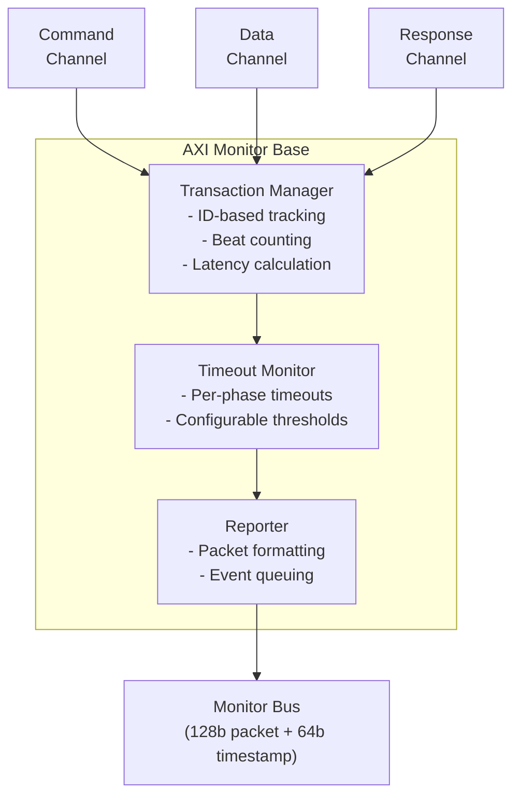

<!-- RTL Design Sherpa Documentation Header -->
<table>
<tr>
<td width="80">
  <a href="https://github.com/sean-galloway/RTLDesignSherpa">
    
  </a>
</td>
<td>
  <strong>RTL Design Sherpa</strong> · <em>Learning Hardware Design Through Practice</em><br>
  <sub>
    <a href="https://github.com/sean-galloway/RTLDesignSherpa">GitHub</a> ·
    <a href="https://github.com/sean-galloway/RTLDesignSherpa/blob/main/docs/DOCUMENTATION_INDEX.md">Documentation Index</a> ·
    <a href="https://github.com/sean-galloway/RTLDesignSherpa/blob/main/LICENSE">MIT License</a>
  </sub>
</td>
</tr>
</table>

---

<!-- End Header -->

# AXI Monitor Base

**Module:** `axi_monitor_base.sv`
**Location:** `rtl/amba/monitor/`
**Category:** Core Infrastructure
**Status:** Production Ready

---

## Overview

The `axi_monitor_base` module provides the core transaction tracking and event reporting behind every AXI/AXIL monitor.

This is a **shared infrastructure module** used internally by the AXI/AXIL monitors. You won't instantiate it directly — the wrappers do that — but it's the piece the whole monitor architecture hangs off, so it's worth understanding before you touch any wrapper.

Key features:

- Transaction-based tracking for AXI and AXI-Lite protocols
- Out-of-order transaction handling with ID-based tracking
- Data-before-address support (slave-side scenarios)
- 128-bit standardized monitor bus packet output, plus a 64-bit side-band timestamp
- Configurable performance metrics tracking
- Timeout detection and threshold monitoring
- Per-transaction state-change debug packets (via `ENABLE_DEBUG_LOGIC` + `cfg_debug_enable`; the verbosity-level/mask interface is dead — see the parameter notes)

Five jobs land in this module:

1. **Transaction Tracking:** maintains state for all outstanding AXI/AXIL transactions
2. **Event Detection:** identifies protocol errors, timeouts, threshold violations
3. **Packet Generation:** creates standardized 128-bit `monitor_packet_t` records paired with a 64-bit side-band timestamp
4. **Flow Control:** manages backpressure and transaction-table exhaustion
5. **Performance Metrics:** optional latency and throughput tracking

---

## Parameters

### Identity and Sizing

| Parameter | Type | Default | Description |
|---|---|---|---|
| `UNIT_ID` | logic [7:0] | 8'h09 | 8-bit unit identifier in monitor packets |
| `AGENT_ID` | logic [15:0] | 16'h0063 | 16-bit agent identifier in monitor packets |
| `MAX_TRANSACTIONS` | int | 16 | Maximum outstanding transactions in the CAM |
| `ADDR_WIDTH` | int | 32 | Address bus width |
| `ID_WIDTH` | int | 8 | Transaction ID width (0 for AXIL). **Hard maximum 8** — `bus_transaction_t.id` is an 8-bit field, so a wider key would disagree with the payload and mis-attribute transactions; `axi_monitor_trans_mgr` refuses `ID_WIDTH > 8` at elaboration with an `$error` |
| `ADDR_BITS_IN_PKT` | int | 38 | **Inert.** Intended as the number of address LSBs carried in a packet, but the derived `ADDR_BITS` is never referenced: `bus_transaction_t.addr` is 32 bits, so packets carry the low **32** address bits regardless. With `ADDR_WIDTH > 32` the upper bits are lost at table-allocation time |
| `IS_READ` | bit | 1 | 1=read monitor (R data channel, AR bursts), 0=write monitor (W data channel, AW bursts) |
| `IS_AXI` | bit | 1 | 1=AXI protocol, 0=AXI-Lite |
| `INTR_FIFO_DEPTH` | int | 8 | Depth of the reporter's outgoing interrupt/event FIFO |
| `DEBUG_FIFO_DEPTH` | int | 8 | **Dead.** No debug-trace FIFO is instantiated; referenced by no logic |
| `N_ADDR_RANGES` | int | 0 | Number of address-range comparators. `0` removes the `axi_monitor_addr_check` block entirely (zero area) |
| `ADDR_RANGE_IS_ERROR` | logic [N_ADDR_RANGES-1:0] | `'0` | Per-range flavor forwarded to `axi_monitor_addr_check`: bit i = 0 -> DEBUG range (hit -> AddrMatch, `cfg_debug_enable`); bit i = 1 -> ERROR range (allowlist miss -> Error/ADDR_RANGE, `cfg_error_enable`). Default all-0. |

### Master Switches

| Parameter | Type | Default | Description |
|---|---|---|---|
| `ENABLE_PERF_PACKETS` | bit | 0 | Master switch for the reporter's legacy perf-rollup packets. Setting it also defaults `ENABLE_PERF_LOGIC` on (see [Performance Monitoring](#performance-monitoring)) |
| `ENABLE_DEBUG_MODULE` | bit | 0 | **Inert / reserved.** The debug-trace sub-module it was meant to switch on does not exist in this design; the parameter is kept only because the wrapper family plumbs it. The live debug path is `ENABLE_DEBUG_LOGIC` + `cfg_debug_enable` (the reporter's state-change emitter) |

### Transaction-Table Shaping

These size and shape the transaction table. Defaults reproduce the classic
single-bank, age-ranked behaviour exactly.

| Parameter | Type | Default | Description |
|---|---|---|---|
| `USE_WDATA_ORDER_Q` | bit | 0 | **Write monitors only.** Recover AXI4's WID-less W-beat ordering with an AWID FIFO (push on the AW handshake, pop on W-last) instead of an O(N^2) oldest-select over the whole table. Required for banking on a write monitor |
| `NUM_BANKS` | int | 1 | Split the table into banks by low ID bits so the two O(N^2) structures (oldest-select, rank update) are restricted to same-bank pairs. Must be a power of 2 and divide `MAX_TRANSACTIONS` |

> **Sizing rule — this one bites.** Every transaction sharing an ID lands in the
> *same* bank, so per-ID concurrency is capped by the **bank** depth, not by
> `MAX_TRANSACTIONS`:
> `MAX_TRANSACTIONS / NUM_BANKS >= (IDs per bank) x (outstanding per ID)`.
> Undersize it and entries are refused rather than mis-tracked — which surfaces
> three layers up as missing packets.
>
> **`NUM_BANKS > 1` on a write monitor requires `USE_WDATA_ORDER_Q = 1`.** The
> combination without it refuses to elaborate (`$error` in
> `axi_monitor_trans_mgr`): the WID-less fallback is a state predicate spanning
> every bank, so the same-bank oldest-select returns one winner *per bank* and a
> single W beat advances one transaction in each. There is no correct fallback,
> so the build is refused rather than silently double-counting.

### ID-Range Filter

Lets several monitors snoop one ID-multiplexed bus, each owning a slice, so no
single table has to hold the whole concurrency. Default OFF — bit-identical to
an unfiltered build.

| Parameter | Type | Default | Description |
|---|---|---|---|
| `ID_FILTER_ENABLE` | bit | 0 | Enable the filter |
| `ID_MATCH_BASE` | int | 0 | First ID owned by this instance |
| `ID_MATCH_COUNT` | int | 0 | How many IDs; `0` means all (no filter) |
| `ADDR_FILTER_ENABLE` | bit | 0 | Address-range packet filter, forwarded to `axi_monitor_trans_mgr`. 0 leaves it inert |

The ID window can also be set **at runtime**, which matters because
`ID_MATCH_BASE`/`ID_MATCH_COUNT` are elaboration constants — retargeting which
master an instance watches otherwise means a rebuild:

| Port | Description |
|---|---|
| `cfg_id_filter_enable` | High: use the `cfg_id_*` window below. Low: use the parameters, bit-identical to a build without this feature |
| `cfg_id_match_base` | First ID owned, runtime |
| `cfg_id_match_count` | How many; `0` means all, matching the parameter rule so a zeroed register block does not silently filter everything away |

AXI-Lite has no transaction IDs, so the `axil4_*_mon` wrappers tie these off
rather than exposing them — a filter keyed on a field the protocol lacks has
nothing to match against.

The **address** filter is driven the same way. `ADDR_FILTER_ENABLE` only builds
the logic; without these three ports driven it stays inert, which is the
failure a reader hits when the parameter is the only thing documented:

| Port | Width | Description |
|---|---|---|
| `cfg_addr_filter_enable` | 1 | High: suppress packets for transactions outside the window. Low: filter inert, regardless of the parameter |
| `cfg_addr_filter_low` | `ADDR_WIDTH` | Window base, inclusive |
| `cfg_addr_filter_high` | `ADDR_WIDTH` | Window limit, inclusive |

The filter is live only when `ADDR_FILTER_ENABLE && cfg_addr_filter_enable`.
The verdict is latched per table entry at ALLOCATION (`filtered_mask`), not
re-evaluated at emission, so a transaction is judged once on its command
address and its data and response beats follow that verdict — see
[`axi_monitor_trans_mgr`](axi_monitor_trans_mgr.md).

This gates the monitor's **observation** inputs only, never the datapath the
wrapper drives, so a filtered instance stays transparent on the bus. All three
channels filter on the same range deliberately: filtering the command alone
would leave data/resp for other IDs arriving unmatched, and the unmatched path
allocates orphans — the table would fill with other channels' traffic, which is
the problem the filter exists to avoid.

### Timer LUT Sizing (`CFI_*`)

Forwarded to [`axi_monitor_timer`](axi_monitor_timer.md), which divides `aclk`
down to a 1 us tick. The divisor **is** the clock frequency in MHz, so a table
built for this design's clock gives an exact tick.

| Parameter | Type | Default | Description |
|---|---|---|---|
| `CFI_MIN_FREQ_MHZ` | int | 100 | Lowest frequency in the LUT |
| `CFI_MAX_FREQ_MHZ` | int | 100 | Highest frequency in the LUT |
| `CFI_NUM_FREQ_ENTRIES` | int | 16 | LUT entries. Note it does **not** size this module's `cfg_freq_sel`, which is a fixed 4-bit port here -- only `axi_monitor_timer` derives its select width from this |
| `CFI_FREQ_STRATEGY` | int | 0 | 0 = LINEAR spacing, 1 = POW2 |

The defaults set **every entry to 100 MHz**, so the tick is exactly 1 us at
100 MHz regardless of `cfg_freq_sel`. Override to a real MIN..MAX range only if
the design changes `aclk` at runtime.

### Synthesis-Cone Enables (`ENABLE_*_LOGIC`)

Each detection cone can be compiled out to save area. These gate the **logic**, not just packet emission — a disabled cone synthesizes away entirely. Defaults keep the classic cones on and perf/debug off.

| Parameter | Type | Default | Effect when 0 |
|---|---|---|---|
| `ENABLE_ERROR_LOGIC` | bit | 1 | Drop the error-detection cone (orphans, response errors) |
| `ENABLE_TIMEOUT_LOGIC` | bit | 1 | Drop the timeout cone **and** the `axi_monitor_timeout` instance |
| `ENABLE_COMPL_LOGIC` | bit | 1 | Drop the completion cone |
| `ENABLE_THRESHOLD_LOGIC` | bit | 1 | Drop the threshold cone (latency / active-count thresholds) |
| `ENABLE_PERF_LOGIC` | bit | = `ENABLE_PERF_PACKETS` | Drop the reporter's **legacy perf-rollup cone** (`axi_monitor_reporter_perf`: two 16-bit lifetime counters + the 5-state emit FSM). It does **not** gate the perfmon measurement window or its bucket counters — those are unconditional (see below) |
| `ENABLE_DEBUG_LOGIC` | bit | 0 | Drop the debug cone |

> **Removed:** the former `CAM_PIPELINE` / `TRANS_CAM_PIPELINE` parameters no longer
> exist. The transaction CAM is now **always pipelined** (one extra cycle of
> `active_count` latency). The `block_ready` margin is derived from
> `monitor_common_pkg::cmd_entry_reserve()` — see
> [Flow Control and the Saturation-Recovery Contract](#flow-control-and-the-saturation-recovery-contract).
> Overshoot past `MAX_TRANSACTIONS` is structurally impossible regardless of the
> margin: the CAM allocates from its exact combinational free vector.

---

## Ports

### Command Phase Interface (AW/AR)

| Port | Direction | Width | Description |
|---|---|---|---|
| `cmd_addr` | Input | ADDR_WIDTH | Command address value |
| `cmd_id` | Input | ID_WIDTH | Transaction ID |
| `cmd_len` | Input | 8 | Burst length (AXI only) |
| `cmd_size` | Input | 3 | Burst size (AXI only) |
| `cmd_burst` | Input | 2 | Burst type (AXI only) |
| `cmd_valid` | Input | 1 | Command valid |
| `cmd_ready` | Input | 1 | Command ready |

### Data Channel Interface (R/W)

| Port | Direction | Width | Description |
|---|---|---|---|
| `data_id` | Input | ID_WIDTH | Data transaction ID |
| `data_last` | Input | 1 | Last data beat indicator |
| `data_resp` | Input | 2 | Response code (OKAY/EXOKAY/SLVERR/DECERR) |
| `data_valid` | Input | 1 | Data valid |
| `data_ready` | Input | 1 | Data ready |

### Response Channel Interface (B)

| Port | Direction | Width | Description |
|---|---|---|---|
| `resp_id` | Input | ID_WIDTH | Response transaction ID |
| `resp_code` | Input | 2 | Response code |
| `resp_valid` | Input | 1 | Response valid |
| `resp_ready` | Input | 1 | Response ready |

### Configuration Interface

| Port | Direction | Width | Description |
|---|---|---|---|
| `clear` | Input | 1 | **Synchronous clear** — passes through to `axi_monitor_trans_mgr` to empty the transaction CAM and zero the active-count pipeline atomically, without a full `aresetn`. Pulse one cycle while the monitor is idle. |
| `cfg_freq_sel` | Input | 4 | Frequency selection for timeout scaling |
| `cfg_addr_cnt` | Input | 16 | Address phase timeout, in **microseconds** (1 us tick) |
| `cfg_data_cnt` | Input | 16 | Data phase timeout, in **microseconds** |
| `cfg_resp_cnt` | Input | 16 | Response phase timeout, in **microseconds** |
| `cfg_error_enable` | Input | 1 | Enable error event packets |
| `cfg_compl_enable` | Input | 1 | Enable completion packets |
| `cfg_threshold_enable` | Input | 1 | Enable threshold packets |
| `cfg_timeout_enable` | Input | 1 | Enable timeout packets |
| `cfg_perf_enable` | Input | 1 | Enable performance metric packets |
| `cfg_debug_enable` | Input | 1 | Enable debug/trace packets (feeds the debug reporter sub-block) |
| `cfg_active_trans_threshold` | Input | 16 | Active-transaction count that triggers a threshold packet |
| `cfg_latency_threshold` | Input | 32 | Latency value that triggers a threshold packet |
| `cfg_debug_level` | Input | 4 | **Dead** — referenced by no logic (interface to the absent debug sub-module) |
| `cfg_debug_mask` | Input | 16 | **Dead** — referenced by no logic |

### Address-Range Checker Interface

Active only when `N_ADDR_RANGES > 0`; otherwise these inputs are ignored and the
`axi_monitor_addr_check` block is not synthesized. Address-range violation packets
are the lowest-priority source on the monitor bus (reporter > debug > addr_check).

| Port | Direction | Width | Description |
|---|---|---|---|
| `cfg_addr_check_enable` | Input | 1 | Master enable for the address-range checker |
| `cfg_addr_range_enable` | Input | N_ADDR_RANGES | Per-range enable bit vector |
| `cfg_addr_range_low` | Input | N_ADDR_RANGES x ADDR_WIDTH | Per-range low (inclusive) address bounds |
| `cfg_addr_range_high` | Input | N_ADDR_RANGES x ADDR_WIDTH | Per-range high (inclusive) address bounds |

### Side-Band Timestamp Input

| Port | Direction | Width | Description |
|---|---|---|---|
| `i_mon_time` | Input | 64 | Free-running counter from the `monbus_group` family (any wrapper), sampled at packet emission |

### Monitor Bus Output

| Port | Direction | Width | Description |
|---|---|---|---|
| `monbus_valid` | Output | 1 | Monitor packet valid |
| `monbus_ready` | Input | 1 | Monitor packet ready (from downstream) |
| `monbus_packet` | Output | 128 | Standardized `monitor_packet_t` |
| `monbus_timestamp` | Output | 64 | `monbus_timestamp_t` paired atomically with `monbus_packet` |
| `block_ready` | Output | 1 | Flow control: 1 = upstream may proceed, 0 = transaction-table occupancy is at the blocking threshold. Derived from `active_count` vs `MAX_TRANSACTIONS`; the reporter's `INTR_FIFO_DEPTH` has **no** path to it. See [Flow Control and the Saturation-Recovery Contract](#flow-control-and-the-saturation-recovery-contract) |
| `busy` | Output | 1 | Monitor is busy indicator (`active_count > 0`) |
| `active_count` | Output | 8 | Number of live transaction-table entries (registered pop-count of CAM occupancy; lags true occupancy by 1 cycle) |
| `perf_completed_count` | Output | 16 | **Lifetime** completion count from `axi_monitor_reporter_perf` -- packets actually emitted, not window-scoped. Reads 0 when `ENABLE_PERF_LOGIC = 0` |
| `perf_error_count` | Output | 16 | **Lifetime** error/timeout count from the same block; 0 when `ENABLE_PERF_LOGIC = 0` |

The base module multiplexes three internal sources onto the monbus output —
reporter packets (highest priority), debug packets, and addr_check error
packets — driving `monbus_timestamp` from the source's sampled timestamp
(`i_mon_time` for reporter/debug; `addr_pkt_timestamp` from the addr_check
submodule).

### Performance-Window Control Inputs

These configure the measurement-window state machine. Tie the selectors to a
reserved code (e.g. `3'b111`) and the pulses/force-close low at instances that
don't use perfmon. See [Performance Monitoring](#performance-monitoring).

| Port | Direction | Width | Description |
|---|---|---|---|
| `cfg_start_event_sel` | Input | 3 | Window **start** event source select |
| `cfg_end_event_sel` | Input | 3 | Window **end** event source select |
| `cfg_start_trigger` | Input | 1 | Software/engine pulse: open the measurement window |
| `cfg_end_trigger` | Input | 1 | Software/engine pulse: close the measurement window |
| `cfg_window_force_close` | Input | 1 | Software override: force the window closed immediately |

### Performance-Window Status and Counter Outputs

All counters accumulate only while `window_active=1`, reset at window-start, and
hold their values through `WIN_CLOSING`/`WIN_IDLE` so the integrating block can
sample a completed window's totals after `window_active` deasserts.

| Port | Direction | Width | Description |
|---|---|---|---|
| `window_active` | Output | 1 | High while a measurement window is open |
| `window_cycles` | Output | 32 | Cycles elapsed inside the current window |
| `perf_prod_cycles` | Output | 32 | `data_valid && data_ready` cycles (productive beats) |
| `perf_bp_cycles` | Output | 32 | `data_valid && !data_ready` cycles (back-pressure) |
| `perf_starv_cycles` | Output | 32 | `!data_valid && data_ready` cycles (starvation) |
| `perf_idle_cycles` | Output | 32 | `!data_valid && !data_ready` cycles (idle) |
| `perf_beat_count` | Output | 32 | Data beats transferred (= `perf_prod_cycles`, 1 beat/cycle) |
| `perf_byte_count` | Output | 64 | Bytes transferred = beats x (1 << latched AXSIZE) |
| `perf_burst_count` | Output | 32 | Address-phase handshakes inside the window (AR for reads, AW for writes) |

---

## Functional Description

### Architecture



The module coordinates four sub-components:

1. **Transaction Manager:** tracks transactions, manages the table
2. **Timeout Monitor:** detects stuck transactions
3. **Performance Tracker:** optional latency/throughput metrics
4. **Reporter:** generates standardized packets

### Flow Control and the Saturation-Recovery Contract

This is the canonical statement of the monitor's flow-control behavior. The
wrapper pages (`axi4_*_mon`, `axi5_*_mon`, `axil4_*_mon`) link here.

`block_ready` is a positive-enable flow-control output: 1 = the upstream
handshake may proceed, 0 = stall. It is driven **solely by transaction-table
occupancy** (`active_count` vs `MAX_TRANSACTIONS`); the reporter's packet FIFO
(`INTR_FIFO_DEPTH`) has no path to it. In the `*_mon` wrappers, `block_ready`
is an internal net ANDed into the upstream-facing ready signal — it is **not**
a port on the wrappers.

The contract (single source of truth:
`monitor_common_pkg::cmd_entry_reserve()` in
`rtl/amba/includes/monitor_common_pkg.sv`):

- **Command-entry cap.** The transaction manager caps command-originated
  entries (allocated by AW/AR activity) at
  `MAX_TRANSACTIONS - cmd_entry_reserve(MAX_TRANSACTIONS)`. The reserve is 4
  for `MAX_TRANSACTIONS >= 16` and 0 below. Orphan entries (data/response
  beats with no matching command) may still use every slot commands are not
  entitled to; orphans always drain via error reporting, so they cannot pin
  occupancy.
- **Reopen threshold strictly above the cap.** `block_ready` re-asserts at
  `active_count < MAX_TRANSACTIONS - (cmd_entry_reserve - 1)`. Because this
  threshold sits **strictly above** the command cap, a saturated table always
  drains back below the reopen point: even if every command entry is
  permanently in flight, occupancy cannot reach the threshold once the orphan
  entries drain. Blocking therefore **throttles, never deadlocks**.
- **The blocking margin covers all three allocators.** `active_count` is a
  registered pop-count that lags true occupancy by one cycle, and three
  independent allocators (address, data, response) can each take a slot in
  that stale cycle. The derived margin (`cmd_entry_reserve - 1 = 3`) covers
  all three, so a command can never be admitted against stale occupancy and
  then find no free slot. The reserve of 4 is the only value that satisfies
  both this and the reopen constraint above simultaneously; with the earlier
  reserve of 2 the margin derived to 1, and commands admitted in the stale
  cycle went untracked while their un-backpressureable data beats were
  silently discarded (measured as an observer-vs-in-core burst-count gap of
  4096 vs 3073). `val/amba/test_axi_mon_block_ready.py` asserts no command
  is admitted without an allocation, on every wrapper.
- **Overshoot is impossible.** The CAM allocates from its exact combinational
  free vector, so the table can never hold more than `MAX_TRANSACTIONS`
  entries. A command that handshakes while the cap is reached is simply not
  tracked (lossy-but-honest degrade), never stalled forever.
- **Small tables trade recovery for capacity.** Tables with
  `MAX_TRANSACTIONS < 16` get `cmd_entry_reserve = 0` and keep the full legacy
  allocation (with the legacy flat margin of 3 on `block_ready`). Small tables
  cannot spare slots — even one reserved slot at `MAX=8` measurably starves
  oversubscribed same-ID tracking — so they give up the recovery guarantee in
  exchange for full tracking capacity.

Both `axi_monitor_trans_mgr` (the cap) and this module (the `block_ready`
margin) derive their constants from the same package function, so the two
cannot drift. The contract is enforced by in-RTL formal properties in
`axi_monitor_trans_mgr.sv` (`ap_cmd_entry_cap`, `ap_no_reopened_complete`,
mutation-checked) and by a 100-seed deliberately-undersized-table stream sweep
(`test_stream_core_mon_backpressure` in the STREAM project area, plus
`val/amba/test_axi_monitor_trans_mgr.py::phase_saturation_recovers`).

History: before commit `cb29e226`, a stray non-last data beat could poison a
terminal entry into an unclosable state, occupancy ratcheted to `MAX`, and the
old flat `MAX-3` margin placed the reopen threshold exactly AT the saturation
point — `block_ready` latched low forever and the monitored datapath wedged
(the stream_core multi-channel hang). Commit `95c9490a` extended the fix to
runtime-disabled packet classes (see the auto-retire notes in
[axi_monitor_reporter](./axi_monitor_reporter.md)).

**Sizing rule for shared masters:** a monitor watching a bus shared by
multiple channels/requesters must size `MAX_TRANSACTIONS` to cover the SUM of
outstanding transactions — `NUM_CHANNELS x per-channel outstanding`, plus
margin (the orphan reserve and the 1-cycle `active_count` lag). Sizing to the
per-channel limit alone makes the monitor throttle the shared master from two
channels up; this exact mistake shipped in stream_core (fixed in `95c9490a`
by making the monitor table parametric on channel count).

**Verilator note:** transaction tables deeper than 64 require raising
`--unroll-count` (default 64) in simulation builds, or the per-slot generate
loops fail with BLKLOOPINIT errors. The stream sim builds use
`--unroll-count 256`.

### Performance Monitoring

`axi_monitor_base` is the **canonical home** of the monitor's performance subsystem.
Every AXI/AXIL wrapper (`axi4_*_mon`, `axil4_*_mon`, and the `axi_monitor_filtered`
wrapper) forwards these ports straight through to this core. Because the base is
generic, the data channel it measures is chosen by `IS_READ`: the **R** channel and
**AR** bursts for read monitors, the **W** channel and **AW** bursts for write
monitors.

The perfmon logic is **always instantiated**: the measurement-window state machine
and the bank of data-channel utilization and throughput counters are plain
`always_ff` blocks in this module with no generate guard, so they cost their area
in every build. `ENABLE_PERF_LOGIC` gates only the reporter's legacy perf-rollup
sub-block (`axi_monitor_reporter_perf`), which is a different thing: two 16-bit
lifetime counters and the FSM that emits `PktTypePerf` rollup packets. Building
with `ENABLE_PERF_PACKETS=0` therefore removes the rollup packets, not the window.
All window counters accumulate **only while a window is open** and hold their
values between windows so the host can read a completed window's totals.

#### The Measurement Window

A window is opened by a **start event** and closed by an **end event**. Event
sources are chosen by the 3-bit `cfg_start_event_sel` / `cfg_end_event_sel`
selectors:

| Code | Start event | End event |
|---|---|---|
| `3'b000` | `cfg_start_trigger` pulse (software/CSR) | `cfg_end_trigger` pulse |
| `3'b001` | first command handshake (`cmd_valid && cmd_ready`) | last data (reads: `data_last` beat; writes: response handshake) |
| `3'b010` | `cfg_perf_enable` rising edge | `cfg_perf_enable` falling edge |
| `3'b011` | first data handshake (`data_valid && data_ready`) | `window_cycles` saturation |
| `3'b100` | `cfg_start_trigger` pulse (external-trigger convention) | `cfg_end_trigger` pulse |
| others | never fires (reserved) | never fires (reserved) |

`cfg_window_force_close` is a software override that closes an open window
immediately regardless of the end-event selector.

The state machine has three states:

- **WIN_IDLE** — waiting for a start event; `window_active=0`.
- **WIN_ACTIVE** — window open; `window_active=1`; `window_cycles` free-runs
  (starting at 1 so the total is inclusive of the first cycle). All counters
  accumulate.
- **WIN_CLOSING** — one-cycle hold before re-arming; counters are frozen and
  stable for sampling.

#### Utilization Buckets (data channel)

Every cycle inside the window is classified by the data channel's `valid`/`ready`
into exactly one of four mutually-exclusive buckets. The four buckets sum to
`window_cycles - 1` by construction (the start cycle seeds `window_cycles` to 1
while the buckets reset to 0), so utilization = `perf_prod_cycles / (window_cycles - 1)`
— **until a counter saturates.** `window_cycles` freezes at `32'hFFFF_FFFE` and
each bucket sticks at `32'hFFFF_FFFF` rather than wrapping, so on a window longer
than ~2^32 cycles (~43 s at 100 MHz) the identity and this formula both break. A
reader seeing `32'hFFFF_FFFF`, or a bucket sum below `window_cycles - 1`, is
looking at an overflowed window.

| Counter | Condition | Meaning |
|---|---|---|
| `perf_prod_cycles`  | `valid && ready`   | productive beat transferred |
| `perf_bp_cycles`    | `valid && !ready`  | back-pressure (data offered, sink not ready) |
| `perf_starv_cycles` | `!valid && ready`  | starvation (sink ready, no data) |
| `perf_idle_cycles`  | `!valid && !ready` | idle |

#### Throughput Counters

| Counter | Width | Meaning |
|---|---|---|
| `perf_beat_count`  | 32 | data beats transferred (= `perf_prod_cycles`, 1 beat/cycle) |
| `perf_byte_count`  | 64 | bytes transferred = beats x (1 << latched AXSIZE). AXSIZE is captured (`cmd_size`) at the most recent address-phase handshake and assumed constant within a burst per the AXI4 mandate. 64-bit width prevents wrap on long windows at wide buses |
| `perf_burst_count` | 32 | address-phase handshakes inside the window (AR for read monitors, AW for write monitors) |

The integrator computes average burst length as `perf_beat_count / perf_burst_count`.

> **Note:** the perfmon counters are exposed on the module interface for the
> integrating block to sample; the reporter's `PerfWin` packet emission is staged
> separately (RFC Stage B+). The four-bucket model follows
> `DMA_UTILIZATION_MEASUREMENT.md` Section 3.

---

## Timing

| Metric | Value | Notes |
|---|---|---|
| Latency | 2-3 cycles | Event detection to packet output |
| Throughput | 1 packet per 2 cycles | The reporter's registered output stage cannot load a new packet on the same cycle the previous one is accepted, so sustained rate is at most one packet every other cycle |
| Table Lookup | 1 cycle | ID-based transaction lookup |

---

## Usage Example

**Not typically instantiated directly by users.** Use the high-level monitors instead:

```systemverilog
// User instantiates this:
axi4_master_rd_mon #(...) u_mon (...);

// Which internally uses:
// - axi4_master_rd (frontend)
// - axi_monitor_base (this module)
// - axi_monitor_filtered
```

---

## Design Notes

### Transaction Table Sizing

| Design Scenario | MAX_TRANSACTIONS | Rationale |
|---|---|---|
| AXI4 Master (Burst) | 16-32 | Support multiple outstanding bursts |
| AXI4 Slave (Burst) | 16-32 | Handle out-of-order responses |
| AXI4-Lite Master | 4-8 | Single-beat, limited concurrency |
| AXI4-Lite Slave | 4-8 | Simple protocol, fewer outstanding |
| Shared master (multi-channel) | NUM_CHANNELS x per-channel outstanding + margin | Per-channel limit alone throttles the shared bus — see the sizing rule in [Flow Control and the Saturation-Recovery Contract](#flow-control-and-the-saturation-recovery-contract) |

Tables of 16 or more slots reserve `cmd_entry_reserve(MAX) = 4` slots (the
saturation-recovery guarantee plus a blocking margin wide enough for all
three same-cycle allocators); tables below 16 keep full legacy allocation. Tables deeper than 64 need `--unroll-count` raised above
Verilator's default of 64 in sim builds.

### Timeout Configuration

- **`cfg_addr_cnt`**: command phase timeout (AR/AW)
- **`cfg_data_cnt`**: data phase timeout (R/W)
- **`cfg_resp_cnt`**: response phase timeout (B)

**Typical values:**

- Burst traffic: `cfg_*_cnt = 4-8` (aggressive timeout)
- Memory controllers: `cfg_*_cnt = 10-15` (allow latency)
- External interfaces: a large `cfg_*_cnt` (the field is 16 bits, so up to
  65535 us ~= 65 ms; `0xFFFF` is effectively "never time out")

---

## Related Modules

- **[axi_monitor_filtered](./axi_monitor_filtered.md)**
- **[axi_monitor_trans_mgr](./axi_monitor_trans_mgr.md)**
- **[axi_monitor_reporter](./axi_monitor_reporter.md)**
- **[axi_monitor_timeout](./axi_monitor_timeout.md)**

**Used by:**

- **axi4_master_rd_mon**
- **axi4_master_wr_mon**
- **axi4_slave_rd_mon**
- **axi4_slave_wr_mon**
- **axil4_master_rd_mon**
- **axil4_master_wr_mon**
- **axil4_slave_rd_mon**
- **axil4_slave_wr_mon**

**See also:**

- **Monitor Architecture:** `docs/markdown/rtl-amba/overview.md`
- **Monitor Configuration Guide:** [Monitor Base Configuration](./axi_monitor_base.md)
- **Packet Format Specification:** `docs/markdown/rtl-amba/includes/monitor_package_spec.md`

---

## Testing

Key test scenarios:

1. **Transaction Table Management:**
   - Fill table to MAX_TRANSACTIONS
   - Verify table exhaustion handling
   - Test ID reuse after completion

2. **Out-of-Order Transactions:**
   - Issue multiple transactions with different IDs
   - Complete in random order
   - Verify correct ID matching

3. **Timeout Detection:**
   - Initiate transaction without completion
   - Verify timeout event at configured threshold
   - Check timeout packet contains correct ID

4. **Performance Metrics:**
   - Enable `ENABLE_PERF_PACKETS`
   - Verify latency calculations
   - Check throughput tracking

---

## Navigation

- **[Back to Shared Infrastructure Index](../_book_monitor_index.md)**
- **[Back to rtl-amba Index](../index.md)**
- **[Back to Main Documentation Index](../../index.md)**
