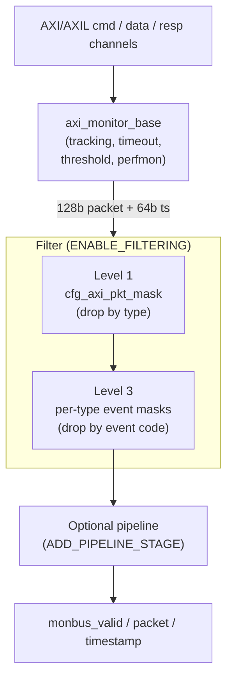

<!-- RTL Design Sherpa Documentation Header -->
<table>
<tr>
<td width="80">
  <a href="https://github.com/sean-galloway/RTLDesignSherpa">
    
  </a>
</td>
<td>
  <strong>RTL Design Sherpa</strong> · <em>Learning Hardware Design Through Practice</em><br>
  <sub>
    <a href="https://github.com/sean-galloway/RTLDesignSherpa">GitHub</a> ·
    <a href="https://github.com/sean-galloway/RTLDesignSherpa/blob/main/docs/DOCUMENTATION_INDEX.md">Documentation Index</a> ·
    <a href="https://github.com/sean-galloway/RTLDesignSherpa/blob/main/LICENSE">MIT License</a>
  </sub>
</td>
</tr>
</table>

---

<!-- End Header -->

# AXI Monitor Filtered

**Module:** `axi_monitor_filtered.sv`
**Location:** `rtl/amba/monitor/`
**Category:** Core Infrastructure
**Status:** ✅ Production Ready

---

## Overview

`axi_monitor_filtered` is a **filtering wrapper around [`axi_monitor_base`](./axi_monitor_base.md)**.
It instantiates one `axi_monitor_base` internally, taps the same AXI/AXIL command,
data, and response channels, and then applies a configurable drop filter to the
128-bit monitor packets the base emits before forwarding them downstream. It does
**not** take a monitor-bus input stream — it produces the monitor bus from the
channels it observes.

This is a **shared infrastructure module** used internally by AXI/AXIL monitors. It is not typically instantiated directly by users but is critical for understanding the monitor architecture.

---

## Key Features

- ✅ **Wraps `axi_monitor_base`:** all transaction tracking, timeout, threshold, and perfmon logic lives in the base; this module only filters its output stream.
- ✅ **Level 1 — packet-type drop mask** (`cfg_axi_pkt_mask`): drop entire packet types by index.
- ✅ **Level 2 — error select** (`cfg_axi_err_select`): reserved for cross-routing; in the AXI wrapper it is used only for **configuration-conflict validation** (see `cfg_conflict_error`), not applied to the stream.
- ✅ **Level 3 — per-event-code masking:** one 16-bit drop mask per packet type (`cfg_axi_error_mask`, `cfg_axi_timeout_mask`, `cfg_axi_compl_mask`, `cfg_axi_thresh_mask`, `cfg_axi_perf_mask`, `cfg_axi_addr_mask`, `cfg_axi_debug_mask`) indexed by the packet's event code.
- ✅ **Configuration conflict detection:** `cfg_conflict_error` flags overlapping `cfg_axi_pkt_mask` / `cfg_axi_err_select` bits.
- ✅ **Bypass mode:** `ENABLE_FILTERING=0` passes every packet straight through.
- ✅ **Optional pipeline stage:** `ADD_PIPELINE_STAGE=1` registers the filtered output for timing closure.

---

## Module Purpose

The `axi_monitor_filtered` module is the core building block for:

1. **Traffic Management:** Reduces monitor bus congestion by dropping unwanted packet types and event codes at the source.
2. **Granular Control:** Supports per-packet-type (Level 1) and per-event-code (Level 3) drop masking.
3. **Configuration Validation:** Flags conflicting mask settings via `cfg_conflict_error`.
4. **Protocol Isolation:** Drops any non-AXI-protocol packet (protocol field ≠ `4'h0`), which should never occur inside an AXI monitor.

---

## Parameters

| Parameter | Type | Default | Description |
|-----------|------|---------|-------------|
| `UNIT_ID` / `AGENT_ID` | logic | `8'h01` / `16'h000A` | Identity bits stamped into emitted monitor packets. |
| `MAX_TRANSACTIONS` | int | 16 | Outstanding transaction table depth (passed to `axi_monitor_base` → `axi_monitor_trans_mgr`). |
| `ADDR_WIDTH` / `ID_WIDTH` | int | 32 / 8 | Address and AXI ID widths. |
| `IS_READ` / `IS_AXI` | bit | 1 / 1 | Direction (read vs write) and protocol family (AXI4 vs AXIL). |
| `ENABLE_PERF_PACKETS` | bit | 1 | Emit perf packets onto the monitor bus. |
| `ENABLE_DEBUG_MODULE` | bit | 0 | **Inert / reserved** -- the debug-trace sub-module it names does not exist; forwarded to `axi_monitor_base` only because the wrapper family plumbs it. Real debug packets come from `ENABLE_DEBUG_LOGIC` + `cfg_debug_enable`. |
| **Reporter sub-block enables** | | | Each gates one of the six reporter sub-blocks (`axi_monitor_reporter_*`) at elaboration time. Pass-through to `axi_monitor_base`. |
| `ENABLE_ERROR_LOGIC` | bit | 1 | Error reporter (orphans, resp errors). |
| `ENABLE_TIMEOUT_LOGIC` | bit | 1 | Timeout reporter (addr/data/resp timers). |
| `ENABLE_COMPL_LOGIC` | bit | 1 | Completion reporter. |
| `ENABLE_THRESHOLD_LOGIC` | bit | 1 | Threshold reporter (latency / active-count thresholds). |
| `ENABLE_PERF_LOGIC` | bit | `ENABLE_PERF_PACKETS` | Perf reporter (the Stage B counters below). |
| `ENABLE_DEBUG_LOGIC` | bit | 0 | Debug reporter. |
| `ENABLE_FILTERING` | bit | 1 | Master enable for filtering. |
| `ADD_PIPELINE_STAGE` | bit | 0 | Add register stage for timing. |
| `N_ADDR_RANGES` | int | 0 | Number of address-range comparators in the [`axi_monitor_addr_check`](axi_monitor_addr_check.md) sub-block (0 = the comparator block is not synthesised at all). |
| `ADDR_RANGE_IS_ERROR` | logic [N_ADDR_RANGES-1:0] | `'0` | Per-range flavor forwarded to the checker: 0 = DEBUG (hit → AddrMatch), 1 = ERROR (allowlist miss → Error/ADDR_RANGE). Default all-0. |

---

## Port Groups

### Observed AXI/AXIL Channels (inputs to the wrapped base)

This module has **no monitor-bus input stream.** It taps the same command, data,
and response channels as `axi_monitor_base` and passes them through unchanged. See
[`axi_monitor_base`](./axi_monitor_base.md) for full descriptions.

| Group | Ports |
|-------|-------|
| Command (AW/AR) | `cmd_addr`, `cmd_id`, `cmd_len`, `cmd_size`, `cmd_burst`, `cmd_valid`, `cmd_ready` |
| Data (W/R) | `data_id`, `data_last`, `data_resp`, `data_valid`, `data_ready` |
| Response (B) | `resp_id`, `resp_code`, `resp_valid`, `resp_ready` |
| Timer / enables / thresholds | `cfg_freq_sel`, `cfg_addr_cnt`, `cfg_data_cnt`, `cfg_resp_cnt`, `cfg_error_enable`, `cfg_compl_enable`, `cfg_threshold_enable`, `cfg_timeout_enable`, `cfg_perf_enable`, `cfg_debug_enable`, `cfg_debug_level`, `cfg_debug_mask`, `cfg_active_trans_threshold`, `cfg_latency_threshold` |
| Address-range checker (when `N_ADDR_RANGES > 0`) | `cfg_addr_check_enable`, `cfg_addr_range_enable`, `cfg_addr_range_low`, `cfg_addr_range_high` |
| Side-band time | `i_mon_time` (`monbus_timestamp_t`) |

All of the above are passed through to the internal `axi_monitor_base` verbatim.

### Monitor Bus Output (filtered)

| Port | Direction | Width | Description |
|------|-----------|-------|-------------|
| `monbus_valid` | Output | 1 | Filtered packet valid (base valid AND not dropped) |
| `monbus_ready` | Input | 1 | Downstream ready |
| `monbus_packet` | Output | 128 | Filtered `monitor_packet_t` (unmodified; only passed or dropped) |
| `monbus_timestamp` | Output | 64 | `monbus_timestamp_t` paired atomically with `monbus_packet` |

### Reset and Synchronous Control

| Port | Direction | Width | Description |
|------|-----------|-------|-------------|
| `aclk` / `aresetn` | Input | 1 / 1 | Standard clock and active-low async reset. |
| `clear` | Input | 1 | **Synchronous clear** — passes through to `axi_monitor_base` → `axi_monitor_trans_mgr` to empty the transaction CAM and zero the active-count pipeline without `aresetn`. Pulse one cycle while idle. |

### Filter Configuration

All filter masks use **drop semantics**: a set bit drops the corresponding packet
type or event code. All masks are 16-bit.

| Port | Direction | Width | Description |
|------|-----------|-------|-------------|
| `cfg_axi_pkt_mask` | Input | 16 | **Level 1** packet-type drop mask. Bit `pkt_type` set → drop all packets of that type |
| `cfg_axi_err_select` | Input | 16 | **Level 2** error-select. Reserved for cross-routing; in the AXI wrapper it is consumed only by the conflict check, not applied to the stream |
| `cfg_axi_error_mask` | Input | 16 | **Level 3** per-event-code drop mask for Error packets |
| `cfg_axi_timeout_mask` | Input | 16 | Level 3 drop mask for Timeout packets |
| `cfg_axi_compl_mask` | Input | 16 | Level 3 drop mask for Completion packets |
| `cfg_axi_thresh_mask` | Input | 16 | Level 3 drop mask for Threshold packets |
| `cfg_axi_perf_mask` | Input | 16 | Level 3 drop mask for Performance packets |
| `cfg_axi_addr_mask` | Input | 16 | Level 3 drop mask for Address-Match packets |
| `cfg_axi_debug_mask` | Input | 16 | Level 3 drop mask for Debug packets |

The Level 3 masks are indexed by the packet's event code (low nibble). For each
packet the wrapper selects the mask matching its packet type, then drops the packet
if `mask[event_code[3:0]]` is set.

### Configuration Status Output

| Port | Direction | Width | Description |
|------|-----------|-------|-------------|
| `cfg_conflict_error` | Output | 1 | Asserted when `cfg_axi_pkt_mask & cfg_axi_err_select` is non-zero (overlapping type is both dropped and error-selected) |

### Performance Window Control (Stage A of perfmon RFC)

| Port | Direction | Width | Description |
|------|-----------|-------|-------------|
| `cfg_start_event_sel` | Input | 3 | Event selector that opens the perf window (e.g. command-handshake, first beat, software pulse). |
| `cfg_end_event_sel` | Input | 3 | Event selector that closes the perf window. |
| `cfg_start_trigger` | Input | 1 | Software-driven open pulse (combines with `cfg_start_event_sel`). |
| `cfg_end_trigger` | Input | 1 | Software-driven close pulse. |
| `cfg_window_force_close` | Input | 1 | **Synchronous** software override: forces the measurement window closed on the next clock edge. Perf totals are **held**, not dropped -- the counters keep their values through `WIN_CLOSING`/`WIN_IDLE` so a host can read the forced window, and reset only at the next window start. |
| `window_active` | Output | 1 | The perf window is currently open. |
| `window_cycles` | Output | 32 | Number of cycles the current window has been open. |

Tie `cfg_start_event_sel`/`cfg_end_event_sel` to `3'b111` and the
triggers + `cfg_window_force_close` to `1'b0` at instances that don't
use perfmon.

### Performance Counters (Stage B of perfmon RFC)

| Port | Direction | Width | Description |
|------|-----------|-------|-------------|
| `perf_prod_cycles` | Output | 32 | Productive cycles (valid + ready both high). |
| `perf_bp_cycles` | Output | 32 | Back-pressure cycles (valid high, ready low). |
| `perf_starv_cycles` | Output | 32 | Starvation cycles (valid low, ready high). |
| `perf_idle_cycles` | Output | 32 | Idle cycles (both low). |
| `perf_beat_count` | Output | 32 | Beat handshakes accumulated this window. |
| `perf_byte_count` | Output | 64 | Bytes transferred this window: productive beats x (1 << latched `cmd_size`). `cmd_len` is not involved. |
| `perf_burst_count` | Output | 32 | Bursts (command handshakes) this window. |

These counters latch on each `window_active` open and freeze on close;
software reads them after the close edge.

---

## Architecture



The base monitor generates every packet; the filter then drops unwanted ones. A
dropped packet is acknowledged back to the base (`base_monbus_ready`) so the base
never stalls on packets that will be discarded. Level 2 (`cfg_axi_err_select`) is a
validation-only input in this wrapper and is not shown in the drop path.

---

## Usage in Monitor System

This module is used by:

- **axi4_master_rd_mon**
- **axi4_master_wr_mon**
- **axi4_slave_rd_mon**
- **axi4_slave_wr_mon**

### Internal Integration

This module is instantiated automatically within higher-level monitor modules. Users configure behavior through top-level monitor parameters.

---

## Configuration Guidelines

### Filter Strategy

`cfg_axi_pkt_mask` uses **drop semantics** — a bit set at index `pkt_type` drops
that type. Leave a bit `0` to keep the type. Indices follow `monitor_common_pkg`
(`PktTypeError`, `PktTypeCompletion`, `PktTypeThreshold`, `PktTypeTimeout`,
`PktTypePerf`, `PktTypeAddrMatch`, `PktTypeDebug`). Tie the per-event Level 3 masks
to `16'h0000` unless you need to suppress specific event codes.

**Pass everything (no filtering):**
```systemverilog
.cfg_axi_pkt_mask   (16'h0000),  // drop nothing
// or set ENABLE_FILTERING = 0 at elaboration for full bypass
```

**Suppress performance packets (typical functional run):**
```systemverilog
.cfg_axi_pkt_mask   (16'h0000 | (16'h1 << PktTypePerf)),  // drop only Perf
```

**Performance-only capture (drop completions to cut traffic):**
```systemverilog
.cfg_axi_pkt_mask   ((16'h1 << PktTypeCompletion) |
                     (16'h1 << PktTypeTimeout)),          // keep Error + Perf
```

**Suppress one Error event code (Level 3):**
```systemverilog
.cfg_axi_pkt_mask   (16'h0000),                 // keep all types
.cfg_axi_error_mask (16'h1 << ERR_EVENT_CODE),  // drop just that error event
```

---

## Performance Characteristics

| Metric | Value | Notes |
|--------|-------|-------|
| Filtering Latency | 0-1 cycles | Combinatorial (0) or registered (1) |
| Throughput | 1 packet per 2 cycles | Limited by the reporter's registered output stage; the filter itself introduces no additional backpressure |
| Resource Usage | ~100 LUTs | Minimal overhead |

---

## Verification Considerations

### Key Test Scenarios

1. **Level 1 masking:**
   - Generate all packet types from the base
   - Set individual `cfg_axi_pkt_mask` bits and verify only the masked types are dropped

2. **Level 3 masking:**
   - Set a per-type event mask (e.g. `cfg_axi_error_mask`) and verify only packets whose event code matches the set bit are dropped

3. **Configuration conflict:**
   - Set the same bit in both `cfg_axi_pkt_mask` and `cfg_axi_err_select` and verify `cfg_conflict_error` asserts

4. **Packet integrity:**
   - Verify passed packets are bit-identical to the base output (filter only drops, never mutates)
   - Verify a dropped packet is acked to the base so it never stalls
   - Exercise `ADD_PIPELINE_STAGE=1` and confirm one-cycle latency with correct backpressure

---

## Related Modules

- **[axi_monitor_base](./axi_monitor_base.md)**

---

## See Also

- **Monitor Architecture:** `docs/markdown/rtl-amba/overview.md`
- **Monitor Configuration Guide:** [Monitor Base Configuration](./axi_monitor_base.md)
- **Packet Format Specification:** `docs/markdown/rtl-amba/includes/monitor_package_spec.md`

---

## Navigation

- **[← Back to Shared Infrastructure Index](../_book_monitor_index.md)**
- **[← Back to rtl-amba Index](../index.md)**
- **[← Back to Main Documentation Index](../../index.md)**
