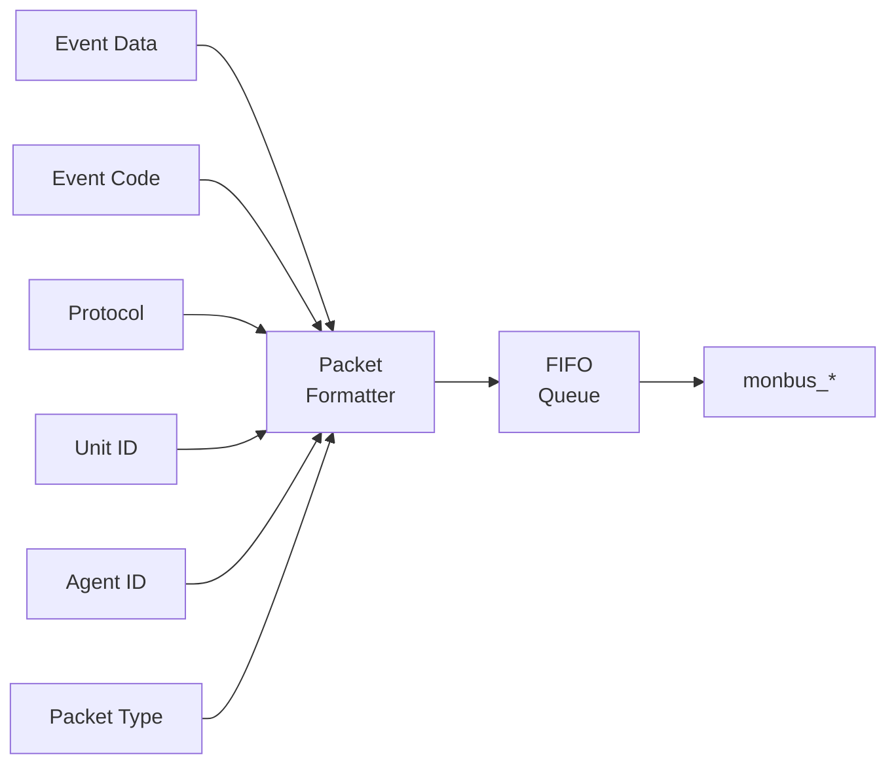

<!-- RTL Design Sherpa Documentation Header -->
<table>
<tr>
<td width="80">
  
</td>
<td>
  <strong>RTL Design Sherpa</strong> · <em>Learning Hardware Design Through Practice</em> 
  
    <a href="https://github.com/sean-galloway/RTLDesignSherpa">GitHub</a> ·
    <a href="https://github.com/sean-galloway/RTLDesignSherpa/blob/main/docs/DOCUMENTATION_INDEX.md">Documentation Index</a> ·
    <a href="https://github.com/sean-galloway/RTLDesignSherpa/blob/main/LICENSE">MIT License</a>
  
</td>
</tr>
</table>

---

<!-- End Header -->

# AXI Monitor Reporter (Dispatcher + 6 Sub-blocks)

**Modules:**
- `axi_monitor_reporter.sv` — thin top-level dispatcher
- `axi_monitor_reporter_error.sv` — error-packet detection (combinational)
- `axi_monitor_reporter_timeout.sv` — timeout-packet detection (combinational)
- `axi_monitor_reporter_compl.sv` — completion-packet detection (combinational)
- `axi_monitor_reporter_threshold.sv` — threshold-packet detection (16 latency flops + edge flags)
- `axi_monitor_reporter_perf.sv` — legacy perf-rollup packets (completion/error lifetime counters + 5-state FSM)
- `axi_monitor_reporter_debug.sv` — debug-packet generation

**Location:** `rtl/amba/monitor/`
**Category:** Core Infrastructure
**Status:** Production Ready (refactored to sub-blocks 2026-06-06)

---

## Overview

The `axi_monitor_reporter` family generates Monitor-bus packets. The
top-level `axi_monitor_reporter.sv` is a **thin dispatcher** that
multiplexes one packet stream out of (up to) six packet-type-specific
sub-blocks onto the monbus output — three classes through the shared FIFO,
three straight into the 128-bit output register (see below). It
also reports each emitted event back to `axi_monitor_trans_mgr` so the
transaction table can release entries.

Per-packet-type detection lives in the six sub-blocks. The dispatcher
gates each sub-block via an `ENABLE_*_LOGIC` parameter, so integrators
can drop any combination at elaboration time and pay zero LUT/FF cost
for the unused detection cones.

> The bridge case (`ENABLE_ERROR_LOGIC=1`, all others `0`) synthesises away
> the timeout, completion, threshold, perf and debug detection cones entirely.

Key features:

- 128-bit standardized `monitor_packet_t` formatting (via package helpers)
- Packet type multiplexing across six sub-blocks (error / timeout /
  compl / threshold / perf / debug) with per-type elaboration gates
- Protocol identification (AXI4, AXI5, APB, AXIS, CORE)
- Event code and data field population from the active sub-block
- Unit ID and Agent ID insertion (caller-configured constants)
- Packet valid/ready handshaking
- Internal monbus FIFO for packet queuing
- Event-reported feedback to `axi_monitor_trans_mgr` (closes the
  transaction-table loop documented in FIX-001)

What the dispatcher actually provides:

1. **Per-type detection gating** — only the enabled sub-blocks consume
   LUT/FF, so a single-purpose deployment (e.g. error-only on the
   bridge) is lean.
2. **Packet formatting** — pulls type / protocol / event code / event
   data / channel id from the active sub-block and packs into the
   128-bit `monitor_packet_t`.
3. **Routing IDs** — inserts the static `UNIT_ID` / `AGENT_ID` so the
   downstream arbiter and the host can route packets back to their
   source.
4. **Queuing** — buffers up to `INTR_FIFO_DEPTH` **error, timeout and
   completion** packets when the downstream monbus is back-pressured.
   Threshold, perf and debug packets bypass the queue entirely (see above).
   Note that this FIFO's fill level has **no** path to the monitor's
   `block_ready` flow control — that is driven purely by transaction-table
   occupancy.
5. **Event acknowledge** — drives `event_reported_*` back to
   `axi_monitor_trans_mgr` so the transaction table can release its
   entry once the packet is accepted into the FIFO (the queued classes are
   the ones that mark entries reported).
6. **Auto-retire** — releases terminal entries whose packet class cannot
   report (see below), so disabled classes never leak table slots.

---

## Parameters

| Parameter | Type | Default | Description |
|---|---|---|---|
| `MAX_TRANSACTIONS` | int | 16 | Transaction-table size shared with `axi_monitor_trans_mgr` |
| `ADDR_WIDTH` | int | 32 | Address width carried in event_data |
| `UNIT_ID` | logic [7:0] | `8'h09` | 8-bit unit identifier (static) |
| `AGENT_ID` | logic [15:0] | `16'h0063` | 16-bit agent identifier (static) |
| `IS_READ` | bit | 1 | 1 = read-channel monitor, 0 = write-channel |
| `INTR_FIFO_DEPTH` | int | 8 | Reporter packet FIFO depth |
| `ENABLE_ERROR_LOGIC` | bit | 1 | Instantiate the error detection sub-block |
| `ENABLE_TIMEOUT_LOGIC` | bit | 1 | Instantiate the timeout detection sub-block |
| `ENABLE_COMPL_LOGIC` | bit | 1 | Instantiate the completion detection sub-block |
| `ENABLE_THRESHOLD_LOGIC` | bit | 1 | Instantiate the threshold detection sub-block |
| `ENABLE_PERF_LOGIC` | bit | (alias) | Instantiate the perf sub-block; defaults to `ENABLE_PERF_PACKETS` for legacy compat |
| `ENABLE_DEBUG_LOGIC` | bit | 0 | Instantiate the debug sub-block |

---

## Ports

All ports, from `rtl/amba/monitor/axi_monitor_reporter.sv`.

**Clock and reset**

| Port | Dir | Width | Description |
|---|---|---|---|
| `aclk` | In | 1 | Clock |
| `aresetn` | In | 1 | Active-low asynchronous reset |

**Transaction-table inputs**

| Port | Dir | Width | Description |
|---|---|---|---|
| `trans_table` | In | `bus_transaction_t[MAX_TRANSACTIONS]` | The transaction table, read as a whole. This is the port behind the reporter's second full copy of the table (`r_trans_table_local`) -- the reason a monitored interface costs twice the table area |
| `timeout_detected` | In | `MAX_TRANSACTIONS` | Per-slot timeout flags from `axi_monitor_timeout` |
| `filtered_mask` | In | `MAX_TRANSACTIONS` | Per-slot mask of entries the ID/address filters have excluded |

**Runtime configuration**

| Port | Dir | Width | Description |
|---|---|---|---|
| `cfg_error_enable` | In | 1 | Emit error packets |
| `cfg_compl_enable` | In | 1 | Emit completion packets |
| `cfg_threshold_enable` | In | 1 | Emit threshold packets |
| `cfg_timeout_enable` | In | 1 | Emit timeout packets |
| `cfg_perf_enable` | In | 1 | Emit performance packets |
| `cfg_debug_enable` | In | 1 | Runtime mask for the debug emitter; live only when `ENABLE_DEBUG_LOGIC=1` |
| `active_trans_threshold` | In | 16 | Active-transaction count that trips a threshold packet |
| `latency_threshold` | In | 32 | Latency that trips a threshold packet |

**Monitor bus output**

| Port | Dir | Width | Description |
|---|---|---|---|
| `monbus_valid` | Out | 1 | Packet valid |
| `monbus_ready` | In | 1 | Downstream accepts the packet |
| `monbus_packet` | Out | `monitor_packet_t` | 128-bit monitor packet |

**Status outputs**

| Port | Dir | Width | Description |
|---|---|---|---|
| `event_count` | Out | 16 | Total events emitted |
| `perf_completed_count` | Out | 16 | Completed transactions counted |
| `perf_error_count` | Out | 16 | Error events counted |
| `event_reported_flags` | Out | `MAX_TRANSACTIONS` | Per-slot "already reported" feedback to the transaction manager, so one event is not emitted twice |

---

## Functional Description

### Architecture

**Packet Format (128-bit `monitor_packet_t`):**

| Bits | Width | Field |
|---|---|---|
| [127:124] | 4   | Packet Type (error / completion / timeout / perf / etc.) |
| [123:109] | 15  | Reserved (forward-compat slack) |
| [108:105] | 4   | Protocol (AXI / AXIS / APB / ARB / CORE) |
| [104:97]  | 8   | Event Code (protocol-specific) |
| [96:88]   | 9   | Channel ID (AXI ID or channel index) |
| [87:72]   | 16  | Agent ID |
| [71:64]   | 8   | Unit ID |
| [63:0]    | 64  | Event Data (full address, latency, counter value, etc.) |

The reporter drives `monbus_packet` (128b) and `monbus_timestamp` (64b)
together so the side-band timestamp travels paired with each packet through
the arbiter and into the [`monbus_group` family](monbus_group.md).

### Sub-blocks

| Sub-block | Gate parameter | Generates `pkt_type` | Logic shape |
|---|---|---|---|
| `axi_monitor_reporter_error` | `ENABLE_ERROR_LOGIC` | `PktTypeError` | combinational |
| `axi_monitor_reporter_timeout` | `ENABLE_TIMEOUT_LOGIC` | `PktTypeTimeout` | combinational |
| `axi_monitor_reporter_compl` | `ENABLE_COMPL_LOGIC` | `PktTypeCompletion` | combinational |
| `axi_monitor_reporter_threshold` | `ENABLE_THRESHOLD_LOGIC` | `PktTypeThreshold` | 16 latency flops + edge detect |
| `axi_monitor_reporter_perf` | `ENABLE_PERF_LOGIC` (alias `ENABLE_PERF_PACKETS`) | `PktTypePerf` | two 16-bit lifetime counters + 5-state FSM (the perfmon *window* counters live in `axi_monitor_base` and are not gated by this parameter) |
| `axi_monitor_reporter_debug` | `ENABLE_DEBUG_LOGIC` (default `0`) | `PktTypeDebug` | event-encoded debug points |

Each sub-block presents the same "raise a request with packet payload"
contract to the dispatcher, but the dispatcher routes them **two different
ways**:

- **Error, timeout and completion** contend for the FIFO write port, in that
  priority order, and are queued.
- **Threshold, perf and debug** never touch the FIFO. They load the 128-bit
  output register directly, and only when it and the FIFO read port are both
  idle (`!monbus_valid && !w_fifo_rd_valid`) — which is what their
  `output_busy` input tells them.

That asymmetry is why an error is buffered while the other three are not. It
does not mean all three are lossy — they differ, and the difference matters
when you are reading a capture:

- **Perf** DEFERS. Its FSM holds while its packet is unaccepted
  (`if (!(pkt_valid && !pkt_taken)) r_state <= w_next_state;`), so a rollup
  that loses arbitration is emitted later carrying the then-current counts.
  Nothing is lost, but the timestamp is the emission, not the event.
- **Threshold** also defers while the crossing persists — the crossed flags
  latch on `pkt_taken`, not on detection. A crossing that lifts during
  congestion is the only case that goes unreported.
- **Debug** is genuinely lossy. `r_prev_state` advances every cycle regardless
  of acceptance (`pkt_taken` is unused in that block), so a state change that
  cannot be emitted is gone.

None of these sub-blocks are intended to be instantiated directly by
integrators — they are private to the reporter family.

### Auto-Retire: Disabled Classes Never Leak Slots

The transaction manager frees a terminal-state slot only once its
`event_reported` flag is set, and the normal producer of that flag is an
accepted FIFO write. A terminal entry whose reporting sub-block is
**compiled out** (`ENABLE_*_LOGIC = 0`) or **runtime-disabled**
(`cfg_*_enable = 0`) would therefore never be marked, never freed, and would
permanently leak a table slot — before commit `95c9490a`, the documented
"performance mode" (`ENABLE_COMPL_LOGIC=1` + `cfg_compl_enable=0`) leaked
every completed entry until the table pinned and `block_ready` wedged the
monitored bus after roughly `MAX_TRANSACTIONS` transactions.

The reporter now **auto-retires** such entries. The semantics:

- An entry marked in `filtered_mask` (the address-range packet filter in
  `axi_monitor_trans_mgr`) retires on the same rule the moment it is
  terminal. A filtered entry will never be emitted, so nothing is owed for
  it. Its packet is separately suppressed before the FIFO write mux, via
  effective valids that drop a filtered slot — suppressing the packet
  **without** this retire arm would leak the slot, which is the same failure
  the disabled-class arms exist to prevent.

- An entry in a terminal state (`TRANS_COMPLETE` / `TRANS_ERROR` /
  `TRANS_ORPHANED`) whose claiming packet class is unavailable — compiled
  out **or** runtime-disabled — is marked reported immediately, **without
  emitting a packet and without bumping `event_count` or the perf
  completion/error counters** (those count only packets actually emitted).
- The class-to-entry mapping mirrors the reporter cones' claim predicates
  exactly: `TRANS_COMPLETE` retires when the completion cone is
  unavailable; `TRANS_ERROR` retires on the **timeout** cone's availability
  when `timeout_detected` is set for that slot, else on the **error**
  cone's; `TRANS_ORPHANED` retires on the error cone's. (A naive "both
  cones unavailable" formula under-retires: with errors disabled but
  timeouts enabled, a genuine-error slot is claimable by neither cone.)
- The check is **continuous**, not edge-triggered: an entry that completed
  while its class was enabled but whose packet lost the FIFO-full race is
  still unmarked when the class is later disabled, and retires then.
  Accepted, documented consequence: **toggling an enable mid-flight may
  drop that one entry's packet — it can never leak the slot.**

Runtime-disabling a packet class is therefore safe and makes the monitor
passive for that class. If you want to keep marking and counting while
suppressing emission, use the packet-type drop mask
(`cfg_axi_pkt_mask` in [axi_monitor_filtered](./axi_monitor_filtered.md))
downstream of the reporter instead.

Directed tests: `val/amba/test_axi_monitor_runtime_disable.py` (fails on
pre-`95c9490a` RTL) and `val/amba/test_axi_monitor_pktgen.py`.

---

## Timing

| Metric | Value | Notes |
|---|---|---|
| Latency | 1-2 cycles | Typical processing delay |
| Throughput | 1 packet per 2 cycles | The registered output stage cannot reload on the same cycle its packet is accepted, so sustained output is at most one packet every other cycle even with the FIFO full |

---

## Usage Example

This module is instantiated automatically within higher-level monitor modules — `axi_monitor_base` owns it, and users configure behavior through top-level monitor parameters. Configuration is typically handled at the top-level monitor instantiation; see the individual monitor documentation for configuration examples.

---

## Related Modules

- **[axi_monitor_base](./axi_monitor_base.md)**
- **[arbiter_monbus_common](./arbiter_monbus_common.md)**

**Used by:**

- **axi_monitor_base**

**See also:**

- **Monitor Architecture:** `docs/markdown/rtl-amba/overview.md`
- **Monitor Configuration Guide:** [Monitor Base Configuration](./axi_monitor_base.md)
- **Packet Format Specification:** `docs/markdown/rtl-amba/includes/monitor_package_spec.md`

---

## Testing

- Functional correctness of core logic
- Boundary conditions (min/max values)
- Error handling and recovery
- Interface protocol compliance

**See:** `val/amba/test_axi_monitor_pktgen.py` and
`val/amba/test_axi_monitor_runtime_disable.py` for verification tests

---

## Navigation

- **[Back to Shared Infrastructure Index](../_book_monitor_index.md)**
- **[Back to rtl-amba Index](../index.md)**
- **[Back to Main Documentation Index](../../index.md)**
