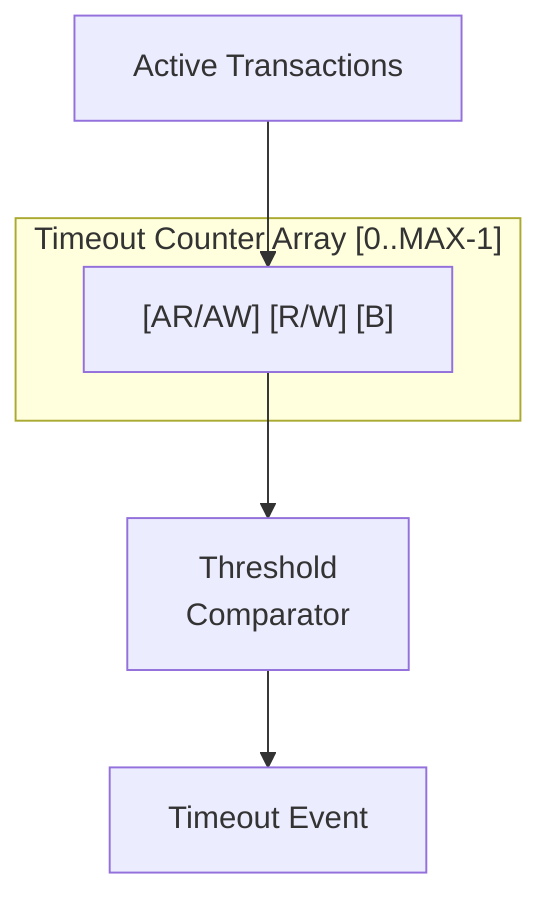

<!-- RTL Design Sherpa Documentation Header -->
<table>
<tr>
<td width="80">
  
</td>
<td>
  <strong>RTL Design Sherpa</strong> · <em>Learning Hardware Design Through Practice</em> 
  
    <a href="https://github.com/sean-galloway/RTLDesignSherpa">GitHub</a> ·
    <a href="https://github.com/sean-galloway/RTLDesignSherpa/blob/main/docs/DOCUMENTATION_INDEX.md">Documentation Index</a> ·
    <a href="https://github.com/sean-galloway/RTLDesignSherpa/blob/main/LICENSE">MIT License</a>
  
</td>
</tr>
</table>

---

<!-- End Header -->

# AXI Monitor Timeout

**Module:** `axi_monitor_timeout.sv`
**Location:** `rtl/amba/monitor/`
**Category:** Core Infrastructure
**Status:** Production Ready

---

## Overview

The `axi_monitor_timeout` module provides configurable timeout detection for stuck transactions — the block that notices when a protocol phase stops making progress.

This is a **shared infrastructure module** used internally by the AXI/AXIL monitors. You won't instantiate it directly, but it's central to how the monitor catches hung traffic.

Key features:

- Per-phase timeout detection (AR/AW, R/W, B)
- Configurable timeout thresholds
- Frequency scaling for timeout counts
- Timeout event reporting with transaction ID
- Active transaction tracking
- Timeout clear on transaction completion

What it's for:

1. **Per-Phase Monitoring:** separate timeouts for AR/AW, R/W, B channels
2. **Configurable Thresholds:** adjustable timeout values per phase
3. **Event Reporting:** generates timeout packets with transaction details
4. **Active Tracking:** monitors all outstanding transactions
5. **Frequency Scaling:** adapts timeout counts to system clock frequency

---

## Parameters

| Parameter | Type | Default | Description |
|---|---|---|---|
| `MAX_TRANSACTIONS` | int | 16 | Number of transactions to monitor |
| `ADDR_WIDTH` | int | 32 | Address width for reporting |
| `IS_READ` | bit | 1 | 1 = read channel, 0 = write channel |

---

## Ports

**See RTL source:** `rtl/amba/monitor/axi_monitor_timeout.sv` for complete port listing.

Key interface groups:

- Clock and reset
- Input signals from monitored interface
- Configuration signals
- Output signals to downstream logic

---

## Functional Description

### Architecture

Each transaction has 3 independent timeout counters for different phases. The
timers are dedicated per-slot state owned by this module (`r_addr_timer` /
`r_data_timer` / `r_resp_timer`, **16-bit** each — `TIMER_W = 16`, sized to hold the full microsecond threshold); the rest of the transaction
record is read live off `trans_table`. Timers count `timer_tick` events (from
the frequency-invariant timer, scaled by `cfg_freq_sel`) while their phase is
pending, and fire at `timer >= cfg_addr_cnt / cfg_data_cnt / cfg_resp_cnt`.

### Detection Semantics

The per-phase "still waiting" conditions, read straight off the live table:

| Phase | Condition |
|---|---|
| Address | `valid && state == TRANS_ADDR_PHASE && !cmd_received` (command issued, not yet accepted) |
| Data | `valid && state in {TRANS_ADDR_PHASE, TRANS_DATA_PHASE} && cmd_received && !data_completed` |
| Response | write monitors only: `valid && state == TRANS_DATA_PHASE && data_completed && !resp_received` |

Notable, deliberate properties:

- **"Command accepted, first beat never arrives" is detectable.** The data
  condition intentionally does NOT require `data_started`. With that term (the
  pre-`cb29e226` behavior) this stall class could never fire: the entry sat in
  `TRANS_ADDR_PHASE` forever, pinned its table slot, and enough of them held
  `block_ready` low permanently. A transaction whose command just handshook
  gets the full `cfg_data_cnt` window for its first beat, same as every later
  beat.
- **Runtime disable flushes state.** When `cfg_timeout_enable` is 0, all
  timers and detection flags are cleared, not merely masked. A stale
  detection computed against old timer state can therefore never resurface
  the instant the enable comes back (enforced by the `ap_no_set_without_tick`
  formal property). Disable means inert.
- **Detection is sticky until the slot retires** — the flag is held through
  `TRANS_ERROR` on purpose (that is the state a detected timeout puts the
  transaction into, and the reporter uses this vector to split timeout
  packets from genuine-error packets); it clears when the slot empties or
  reaches `TRANS_COMPLETE`.
- **This module cannot modify the table.** It exports `timeout_detected` per
  slot; `axi_monitor_trans_mgr` consumes that vector (its
  `i_timeout_detected` input) and moves the entry to `TRANS_ERROR` with
  `EVT_CMD_TIMEOUT` / `EVT_DATA_TIMEOUT` / `EVT_RESP_TIMEOUT` so it becomes
  cleanup-eligible.

---

## Timing Characteristics
| Metric | Value | Notes |
|---|---|---|
| Latency | 1-2 cycles | Typical processing delay |
| Throughput | 1 operation/cycle | Maximum rate |

---

## Usage Examples
This module is instantiated automatically within higher-level monitor modules — `axi_monitor_base` owns it, and users configure behavior through top-level monitor parameters. See the individual monitor documentation for configuration examples.

---

## Design Notes

**These are phase DURATION limits, not stall detectors.** Each timer is zeroed
only while its phase is not pending (`if (!w_data_pending[idx]) r_data_timer[idx] <= '0;`);
a beat handshake does not reset it. A long burst that is making steady progress
still trips `EVT_DATA_TIMEOUT` once the phase as a whole exceeds the threshold.
Size `cfg_timeout_cycles` for your longest legitimate burst, not for your worst
tolerable inter-beat gap.

**The thresholds are microseconds, not clocks.** `timer_tick` comes from
`counter_freq_invariant`, so a timeout means the same wall-clock time at any
`aclk` -- provided `ACLK_MHZ` matches the real frequency. Leave it at 100 on a
90 MHz part and every timeout is wrong, silently.

**`TIMER_W` is 16 deliberately.** These counters were 4 bits, and every wrapper
squashed the host's 16-bit request into them with a saturating truncation, so
any value >= 16 became 15 and the entire configurable range collapsed onto
1..15 us.

---

## Related Modules

- **[axi_monitor_base](./axi_monitor_base.md)**

**Used by:**

- **axi_monitor_base**

**See also:**

- **Monitor Architecture:** `docs/markdown/rtl-amba/overview.md`
- **Monitor Configuration Guide:** [Monitor Base Configuration](./axi_monitor_base.md)
- **Packet Format Specification:** `docs/markdown/rtl-amba/includes/monitor_package_spec.md`

---

## Testing

- Functional correctness of core logic
- Boundary conditions (min/max values)
- Error handling and recovery
- Interface protocol compliance

**See:** `val/amba/test_axi_monitor_trans_mgr.py` (timeout-to-terminal
transitions) and the `*_mon` wrapper suites for verification tests

---

## Navigation

- **[Back to Shared Infrastructure Index](../_book_monitor_index.md)**
- **[Back to rtl-amba Index](../index.md)**
- **[Back to Main Documentation Index](../../index.md)**
