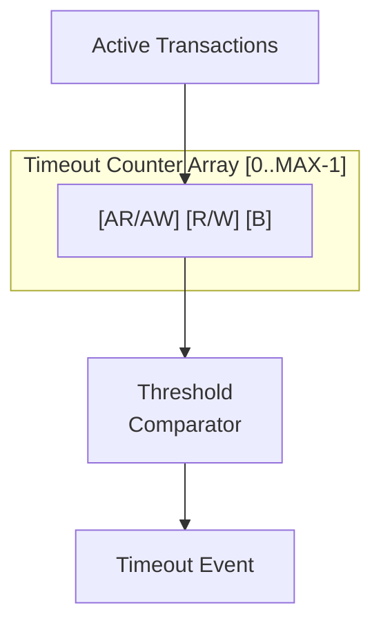

<!-- RTL Design Sherpa Documentation Header -->
<table>
<tr>
<td width="80">
  
</td>
<td>
  <strong>RTL Design Sherpa</strong> · <em>Learning Hardware Design Through Practice</em> 
  
    <a href="https://github.com/sean-galloway/RTLDesignSherpa">GitHub</a> ·
    <a href="https://github.com/sean-galloway/RTLDesignSherpa/blob/main/docs/DOCUMENTATION_INDEX.md">Documentation Index</a> ·
    <a href="https://github.com/sean-galloway/RTLDesignSherpa/blob/main/LICENSE">MIT License</a>
  
</td>
</tr>
</table>

---

<!-- End Header -->

# AXI Monitor Timeout

**Module:** `axi_monitor_timeout.sv`
**Location:** `rtl/amba/monitor/`
**Category:** Core Infrastructure
**Status:** ✅ Production Ready

---

## Overview

The `axi_monitor_timeout` module provides Configurable timeout detection for stuck transactions.

This is a **shared infrastructure module** used internally by AXI/AXIL monitors. It is not typically instantiated directly by users but is critical for understanding the monitor architecture.

---

## Key Features

- ✅ **Per-phase timeout detection (AR/AW, R/W, B):** Per-phase timeout detection (AR/AW, R/W, B)
- ✅ **Configurable timeout thresholds:** Configurable timeout thresholds
- ✅ **Frequency scaling for timeout counts:** Frequency scaling for timeout counts
- ✅ **Timeout event reporting with transaction ID:** Timeout event reporting with transaction ID
- ✅ **Active transaction tracking:** Active transaction tracking
- ✅ **Timeout clear on transaction completion:** Timeout clear on transaction completion

---

## Module Purpose

The `axi_monitor_timeout` module is the core building block for:

1. **Per-Phase Monitoring:** Separate timeouts for AR/AW, R/W, B channels
2. **Configurable Thresholds:** Adjustable timeout values per phase
3. **Event Reporting:** Generates timeout packets with transaction details
4. **Active Tracking:** Monitors all outstanding transactions
5. **Frequency Scaling:** Adapts timeout counts to system clock frequency

---

## Parameters

| Parameter | Type | Default | Description |
|-----------|------|---------|-------------|
| `MAX_TRANSACTIONS` | int | 16 | Number of transactions to monitor |
| `ADDR_WIDTH` | int | 32 | Address width for reporting |
| `IS_READ` | bit | 1 | 1 = read channel, 0 = write channel |

---

## Port Groups

**See RTL source:** `rtl/amba/monitor/axi_monitor_timeout.sv` for complete port listing.

Key interface groups:
- Clock and reset
- Input signals from monitored interface
- Configuration signals
- Output signals to downstream logic

---

## Architecture

Each transaction has 3 independent timeout counters for different phases. The
timers are dedicated per-slot state owned by this module (`r_addr_timer` /
`r_data_timer` / `r_resp_timer`, 8-bit each); the rest of the transaction
record is read live off `trans_table`. Timers count `timer_tick` events (from
the frequency-invariant timer, scaled by `cfg_freq_sel`) while their phase is
pending, and fire at `timer >= cfg_addr_cnt / cfg_data_cnt / cfg_resp_cnt`.

---

## Detection Semantics

The per-phase "still waiting" conditions, read straight off the live table:

| Phase | Condition |
|---|---|
| Address | `valid && state == TRANS_ADDR_PHASE && !cmd_received` (command issued, not yet accepted) |
| Data | `valid && state in {TRANS_ADDR_PHASE, TRANS_DATA_PHASE} && cmd_received && !data_completed` |
| Response | write monitors only: `valid && state == TRANS_DATA_PHASE && data_completed && !resp_received` |

Notable, deliberate properties:

- **"Command accepted, first beat never arrives" is detectable.** The data
  condition intentionally does NOT require `data_started`. With that term (the
  pre-`cb29e226` behavior) this stall class could never fire: the entry sat in
  `TRANS_ADDR_PHASE` forever, pinned its table slot, and enough of them held
  `block_ready` low permanently. A transaction whose command just handshook
  gets the full `cfg_data_cnt` window for its first beat, same as every later
  beat.
- **Runtime disable flushes state.** When `cfg_timeout_enable` is 0, all
  timers and detection flags are cleared, not merely masked. A stale
  detection computed against old timer state can therefore never resurface
  the instant the enable comes back (enforced by the `ap_no_set_without_tick`
  formal property). Disable means inert.
- **Detection is sticky until the slot retires** — the flag is held through
  `TRANS_ERROR` on purpose (that is the state a detected timeout puts the
  transaction into, and the reporter uses this vector to split timeout
  packets from genuine-error packets); it clears when the slot empties or
  reaches `TRANS_COMPLETE`.
- **This module cannot modify the table.** It exports `timeout_detected` per
  slot; `axi_monitor_trans_mgr` consumes that vector (its
  `i_timeout_detected` input) and moves the entry to `TRANS_ERROR` with
  `EVT_CMD_TIMEOUT` / `EVT_DATA_TIMEOUT` / `EVT_RESP_TIMEOUT` so it becomes
  cleanup-eligible.

---

## Usage in Monitor System

This module is used by:

- **axi_monitor_base**

### Internal Integration

This module is instantiated automatically within higher-level monitor modules. Users configure behavior through top-level monitor parameters.

---

## Configuration Guidelines

**See individual monitor documentation for configuration examples.**

Configuration is typically handled at the top-level monitor instantiation.

---

## Performance Characteristics

| Metric | Value | Notes |
|--------|-------|-------|
| Latency | 1-2 cycles | Typical processing delay |
| Throughput | 1 operation/cycle | Maximum rate |
| Resource Usage | Varies | Depends on configuration |

---

## Verification Considerations

### Test Coverage

- Functional correctness of core logic
- Boundary conditions (min/max values)
- Error handling and recovery
- Interface protocol compliance

**See:** `val/amba/test_axi_monitor_trans_mgr.py` (timeout-to-terminal
transitions) and the `*_mon` wrapper suites for verification tests

---

## Related Modules

- **[axi_monitor_base](./axi_monitor_base.md)**

---

## See Also

- **Monitor Architecture:** `docs/markdown/rtl-amba/overview.md`
- **Monitor Configuration Guide:** [Monitor Base Configuration](./axi_monitor_base.md)
- **Packet Format Specification:** `docs/markdown/rtl-amba/includes/monitor_package_spec.md`

---

## Navigation

- **[← Back to Shared Infrastructure Index](../_book_monitor_index.md)**
- **[← Back to rtl-amba Index](../index.md)**
- **[← Back to Main Documentation Index](../../index.md)**
