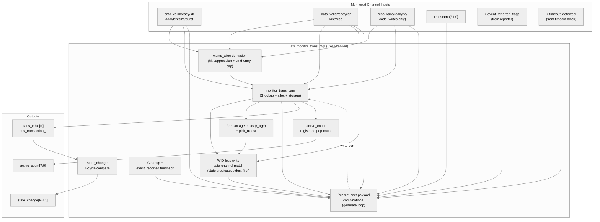

<!-- RTL Design Sherpa Documentation Header -->
<table>
<tr>
<td width="80">
  <a href="https://github.com/sean-galloway/RTLDesignSherpa">
    
  </a>
</td>
<td>
  <strong>RTL Design Sherpa</strong> · <em>Learning Hardware Design Through Practice</em><br>
  <sub>
    <a href="https://github.com/sean-galloway/RTLDesignSherpa">GitHub</a> ·
    <a href="https://github.com/sean-galloway/RTLDesignSherpa/blob/main/docs/DOCUMENTATION_INDEX.md">Documentation Index</a> ·
    <a href="https://github.com/sean-galloway/RTLDesignSherpa/blob/main/LICENSE">MIT License</a>
  </sub>
</td>
</tr>
</table>

---

<!-- End Header -->

# AXI Monitor Transaction Manager

**Module:** `axi_monitor_trans_mgr.sv`
**Location:** `rtl/amba/monitor/`
**Category:** Core Infrastructure
**Status:** Production Ready (CAM-backed revision, 2026-06-08)

---

## Overview

`axi_monitor_trans_mgr` tracks outstanding AXI transactions through their
addr → data → resp lifecycle. It exposes a registered table of in-flight
transactions (`trans_table[N]`) for downstream consumers (reporter, debug,
timeout) and feeds the monitor bus with state-change events.

This is a **shared infrastructure module** used internally by every AXI4 /
AXI5 / AXI-Lite monitor. Users don't instantiate it directly; they
configure behaviour through the top-level monitor wrapper.

The current revision delegates per-transaction keying + storage to the
shared [`monitor_trans_cam`](monitor_trans_cam.md) module. (The previous
in-place revision, once parked in `mon_temp/`, was deleted in `d246a72d`
along with its equivalence test and the `TRANS_MGR_VARIANT` rollback knob —
there is no legacy variant anymore.)

---

## Key Features

- Tracks up to `MAX_TRANSACTIONS` outstanding (default 16)
- 3 independent ID lookups per cycle (addr / data / resp) via CAM
- Out-of-order transaction support
- **Multiple outstanding same-ID transactions**, each in its own slot, with
  oldest-first (rank-based) attribution of data/response beats
- Same-cycle AW+W first-beat capture for write monitors (combinational bypass)
- Command-entry cap implementing the saturation-recovery contract (see
  [axi_monitor_base](./axi_monitor_base.md#flow-control-and-the-saturation-recovery-contract))
- Burst beat counting
- Per-phase timestamps for latency reporting
- Orphan-data / orphan-resp detection (per AXI4 / AXI-Lite rules)
- Timeout-to-terminal-state transition via `i_timeout_detected` feedback
- State-change events for downstream packet generation
- Active-transaction counter (exact CAM occupancy, registered pop-count)
- Cleanup-when-event-reported handshake with the reporter
- AXI4 / AXI4-Lite / read / write variants via parameters

---

## Architecture



Source: [`axi_monitor_trans_mgr.mmd`](../../assets/rtl-amba/axi_monitor_trans_mgr.mmd)



The trans_mgr owns:
- The **WID-less write data-channel match** (state predicate over the
  payload, not an id match — the CAM only sees ids), resolved oldest-first.
- The **per-slot age ranks** (`r_age`) and the `pick_oldest` selector that
  attribute each data/response beat to the oldest matching entry.
- The per-slot **next-payload computation** (the per-phase if/else chain
  that says "what should slot i's bus_transaction_t look like next cycle").
- The **wants_alloc** derivation (hit suppression + the command-entry cap;
  see [Allocation and Same-ID Tracking](#allocation-and-same-id-tracking)).
- Cleanup eligibility, event_reported feedback, the registered
  `active_count` pop-count, state_change detection.

The CAM owns:
- Per-slot `(valid, id, payload)` storage.
- The 3 parallel ID lookups (`addr_match_oh`, `data_match_oh`, `resp_match_oh`).
- The free-slot vector and 3-way priority-encoded alloc one-hots.

This split makes the parallel-match shape that closes 100 MHz on the
xc7a100t-1 (`(* keep = "true" *)` per-bit match vectors, per-slot
generate-loop storage) explicit and reusable.

---

## Parameters

| Parameter | Type | Default | Description |
|---|---|---|---|
| `MAX_TRANSACTIONS` | int | 16 | Transaction table depth |
| `ADDR_WIDTH` | int | 32 | Width of address bus tracked |
| `ID_WIDTH` | int | 8 | Width of AXI ID |
| `IS_READ` | bit | 1 | 1 for read monitors, 0 for write |
| `IS_AXI` | bit | 1 | 1 for AXI4, 0 for AXI-Lite |
| `USE_WDATA_ORDER_Q` | bit | 0 | Write monitors: attribute W beats via an AWID FIFO instead of the table-wide state predicate. **Required when `NUM_BANKS > 1`** |
| `NUM_BANKS` | int | 1 | Generate the CAM this many times, `MAX_TRANSACTIONS/NUM_BANKS` deep each. Power of 2, must divide the table |
| `ENABLE_PERF_PACKETS` | bit | 0 | Reserved — perf packet generation hook |

The `AW` and `IW` short-alias parameters are retained for API stability with
prior revisions; they default to `ADDR_WIDTH` and `ID_WIDTH`.

---

## Module Interface

The module exports a registered `trans_table` of `bus_transaction_t`
entries (see `monitor_amba4_pkg.sv`) plus aggregate status:

```systemverilog
module axi_monitor_trans_mgr
    import monitor_common_pkg::*;
    import monitor_amba4_pkg::*;
#(
    parameter int MAX_TRANSACTIONS = 16,
    parameter int ADDR_WIDTH       = 32,
    parameter int ID_WIDTH         = 8,
    parameter bit IS_READ          = 1'b1,
    parameter bit IS_AXI           = 1'b1,
    ...
) (
    input  logic                          aclk,
    input  logic                          aresetn,

    // Synchronous clear: empty the transaction CAM and zero the
    // active-count pipeline on the next edge (no full reset needed).
    // Pulse one cycle while idle.
    input  logic                          clear,

    // Address channel
    input  logic                          cmd_valid,
    input  logic                          cmd_ready,
    input  logic [IW-1:0]                 cmd_id,
    input  logic [AW-1:0]                 cmd_addr,
    input  logic [7:0]                    cmd_len,
    input  logic [2:0]                    cmd_size,
    input  logic [1:0]                    cmd_burst,

    // Data channel
    input  logic                          data_valid,
    input  logic                          data_ready,
    input  logic [IW-1:0]                 data_id,
    input  logic                          data_last,
    input  logic [1:0]                    data_resp,

    // Response channel (write only)
    input  logic                          resp_valid,
    input  logic                          resp_ready,
    input  logic [IW-1:0]                 resp_id,
    input  logic [1:0]                    resp_code,

    input  logic [31:0]                   timestamp,
    input  logic [MAX_TRANSACTIONS-1:0]   i_event_reported_flags,

    // Timeout feedback from axi_monitor_timeout. The timeout block detects
    // the stall but cannot modify the table; trans_mgr consumes this vector
    // and moves the flagged entry to TRANS_ERROR with the appropriate
    // EVT_*_TIMEOUT code so it becomes cleanup-eligible instead of leaking.
    input  logic [MAX_TRANSACTIONS-1:0]   i_timeout_detected,

    output bus_transaction_t              trans_table[MAX_TRANSACTIONS],
    output logic [7:0]                    active_count,
    output logic [MAX_TRANSACTIONS-1:0]   state_change
);
```

The `bus_transaction_t` struct (defined in `monitor_amba4_pkg.sv`) contains:
- State flags: `valid`, `cmd_received`, `data_started`, `data_completed`,
  `resp_received`, `event_reported`, `eos_seen`
- FSM state: `state` (TRANS_IDLE / ADDR_PHASE / DATA_PHASE / COMPLETE /
  ERROR / ORPHANED)
- Captured fields: `addr`, `id`, `len`, `size`, `burst`, `channel`
- Timers and timestamps: `addr_timer`, `data_timer`, `resp_timer`,
  `addr_timestamp`, `data_timestamp`, `resp_timestamp`
- Beat tracking: `expected_beats`, `data_beat_count`
- `event_code` union (axi_error / axi_timeout / etc.)

Total: 285 bits per entry. With `MAX_TRANSACTIONS=16`, the trans_table is
~4.5 Kb of registered state.

---

## Transaction Lifecycle

A typical AXI4 read transaction:

```
                              addr_alloc fires (free CAM slot picked)
                              valid       = 1
                              state       = TRANS_ADDR_PHASE
   cmd_valid handshake ─►     id          = cmd_id
   (cmd_id, cmd_addr, ...)    cmd_received= cmd_ready
                              expected_beats = cmd_len + 1
                              addr_timestamp = timestamp

                              addr_update fires (the SAME entry, still
   cmd held valid ─────►      awaiting its handshake: cmd_received=0)
   across stalled cycles      cmd_received <= 1 on the handshake cycle
                              addr_timer  <= 0
                              addr_timestamp <= timestamp

                              data_update fires (oldest matching open entry)
   data_valid handshake ─►    data_started <= 1
   (data_id == cmd_id,        data_beat_count++
    data_last, data_resp)     state        <= TRANS_DATA_PHASE
                              if data_last:
                                data_completed <= 1
                                state        <= TRANS_COMPLETE
                              if data_resp[1]:  # RESP error
                                state        <= TRANS_ERROR
                                event_code   <= EVT_RESP_*

                              (later, reporter handles the event)
                              cleanup fires
   event_reported flag ─►     valid <= 0       # slot returned to free pool
   from reporter              # CAM sees the entry as free on next cycle
```

A second AR/AW with the **same ID** allocates its **own slot** — same-ID
outstanding transactions are legal AXI4 and are never merged. Data and
response beats are attributed oldest-first (see the next section).

For AXI4 writes the data phase uses a state predicate match (not id),
since AXI4 W has no WID. For AXI-Lite writes, the data channel CAN
allocate an orphan slot if data arrives before the AW handshake.

A transaction flagged by `i_timeout_detected` (and not already terminal) is
moved to `TRANS_ERROR` with an event code derived from its progress:
`EVT_CMD_TIMEOUT` if the command never handshook, `EVT_RESP_TIMEOUT` if data
completed but the B response is outstanding, else `EVT_DATA_TIMEOUT`. This
makes timed-out entries cleanup-eligible instead of leaking their slot.

---

## Allocation and Same-ID Tracking

### Separate slot per same-ID transaction

The pre-CAM design merged a new command into any existing entry with the
same ID. That was a **defect** (issue #41 defect 1, fixed): AXI4 permits
several outstanding transactions with the same ID, so a second AR/AW must
get its own slot. Allocation is now suppressed only for the one legitimate
case — a command held valid across several stalled cycles must not allocate
a fresh slot every cycle. The actual derivations:

```systemverilog
// A "pending" entry is the same-ID entry still awaiting its handshake
// (cmd_received=0) and not being freed this cycle.
addr_hit_any     = |w_addr_pend_oh;
addr_wants_alloc = cmd_valid && !addr_hit_any && w_cmd_headroom;

// Reads: allocate an orphan when a data beat matches no entry.
data_wants_alloc = data_valid && data_ready && !data_hit_any;            // IS_READ
data_wants_alloc = data_valid && data_ready && !IS_AXI && !data_hit_any; // write
resp_wants_alloc = !IS_READ && resp_valid && resp_ready && !resp_hit_any;
```

`w_cmd_headroom` is the command-entry cap: command-originated entries may
occupy at most `MAX_TRANSACTIONS - cmd_entry_reserve(MAX_TRANSACTIONS)`
slots (reserve = 2 for tables of 16+, 0 below). A command seen while the cap
is reached is simply not tracked until a command entry retires. This cap is
one half of the saturation-recovery contract; the other half is the
`block_ready` reopen threshold in `axi_monitor_base` — see the canonical
description in
[axi_monitor_base](./axi_monitor_base.md#flow-control-and-the-saturation-recovery-contract).

### Oldest-first (rank-based) attribution

Because same-ID entries coexist, an incoming beat can match several slots.
AXI4 orders same-ID data/responses by issue order, so each beat belongs to
the **oldest** matching entry that is still open. Slot index carries no
ordering information (allocation takes the lowest free index, so a recycled
low slot can be younger than a live high slot); instead each slot carries a
dense rank `r_age[i]` (0 = oldest live entry), and a `pick_oldest()` function
selects the lowest-rank candidate. Two tiers: prefer the oldest match whose
data/response phase is still open; if every match has already closed, a
stray **last** beat falls back to the oldest match (re-running completion —
harmless, and it reconstructs untracked bursts under ID oversubscription),
while a stray **non-last** beat is absorbed with no update at all (the
pre-fix behavior re-opened a terminal entry into an unclosable state — the
production saturation-wedge mechanism, guarded by the in-RTL formal property
`ap_no_reopened_complete`).

### Write-data attribution by AWID FIFO (`USE_WDATA_ORDER_Q`)

AXI4 W beats carry no WID, so the entry a beat belongs to cannot come from
the beat. With `USE_WDATA_ORDER_Q=1` the manager records the **AWID** on each
AW handshake and pops it on W-LAST; the head AWID keys the write-data
candidate set, and `pick_oldest()` then resolves among that ID's entries.

This is required whenever the table is banked. `pick_oldest()` compares
**same-bank only** — the cross-bank comparators are constant-folded away at
elaboration — and that is sound precisely because candidates are ID-matched
and all of an ID's entries live in one bank. The legacy write path built its
candidates from a state predicate over the *whole* table, which is not
ID-matched, so at `NUM_BANKS=B` the select returned one winner **per bank**
and a single W beat advanced up to `B` transactions. `NUM_BANKS > 1` on a
write monitor therefore refuses to elaborate without this parameter
(`$error`), because the combination has no correct fallback.

**Bus requirement — W must not lead AW.** Attribution is by AW order, so the
AW naming a beat must already have been seen. Same-cycle AW+W is supported
(below); W strictly *before* its AW has no AWID to attribute it to and is
treated as a stray. This is the restriction commercial VIPs commonly impose.

Regression: `val/amba/test_axi_monitor_trans_mgr_wr_bank.py` (attribution at
`NUM_BANKS` 1 and 4, plus the refusal of the illegal combination).

### Same-cycle AW+W bypass (write monitors)

The WID-less write predicate runs over registered entries, so a W beat
arriving in the **same cycle** as its AW used to match nothing and be
silently lost (the entry then waited for data forever and the B response
fabricated an `EVT_PROTOCOL` error on legal traffic — routine for
single-beat writes from skid-buffered masters). Fixed in `95c9490a`: when no
registered entry matches, the beat binds combinationally to the slot the
command path touches this cycle — either the slot being allocated for this
AW (via a local mirror of the CAM's allocation pick, cross-checked by the
`ap_bypass_alloc_mirror` formal property) or the pending same-ID entry,
state-qualified to `TRANS_ADDR_PHASE` so orphan adoption keeps its legacy
behavior. An entry whose AW has not yet handshaked is held in
`TRANS_ADDR_PHASE` even after taking the beat, preserving address-phase
timeout coverage (formal property `ap_wr_data_phase_has_cmd`).

---

## Synthesis Notes

The CAM-backed revision preserves the 2026-04-23 WNS fix:

| Construct | Rationale |
|---|---|
| Per-slot `always_comb` for next-payload (in a generate loop) | N independent small cones; synth cannot fuse them across slots |
| Per-slot CAM storage via `monitor_trans_cam` (generate-loop `always_ff`) | Same property at the registered storage layer |
| `(* keep = "true" *)` on CAM match vectors | Prevents Vivado from fusing match-result usage into the update cones, which would re-introduce the 12-LUT-level WNS issue |
| `active_count` = registered pop-count of `cam_entry_valid` | Derived directly from live CAM occupancy, **not** an alloc-minus-cleanup accumulator. The former accumulator could desync from true occupancy and underflow to 0xFF under legal AXI (found by the SymbiYosys proof — see `rtl/amba/KNOWN_ISSUES/axi_monitor_active_count_underflow.md`); a registered pop-count is structurally bounded to [0, N]. The valid bits are already registers, so the adder tree sits cleanly between flops; `active_count` lags occupancy by 1 cycle, which the `block_ready` margin absorbs. |
| Pipelined `state_change` (1 cycle of `r_trans_table_prev`) | Cheap comparison against last cycle's table; output lag is 1 cycle |
| Synchronous `clear` zeroes `active_count` alongside the CAM | `clear` invalidates every CAM slot and zeroes the registered count and age ranks on the same edge, so an empty table is never published with a stale nonzero `active_count`. |

The combined effect is that no signal in the trans_mgr has more than ~6
LUT levels between flops at typical configurations — closes 100 MHz on
xc7a100t-1 with margin.

---

## Formal Properties

The saturation-recovery and same-cycle-bypass contracts are encoded as
in-RTL formal properties (under `ifdef FORMAL`, flattened into the
SymbiYosys proofs and mutation-checked):

| Property | Guarantee |
|---|---|
| `ap_no_reopened_complete` | No read entry is ever in `TRANS_DATA_PHASE` with `data_completed` set — the unclosable "poison" state behind the production saturation wedge is unreachable |
| `ap_wr_data_phase_has_cmd` | A write entry in `TRANS_DATA_PHASE` always has its command handshake recorded (the same-cycle bypass cannot create timeout-coverage holes) |
| `ap_bypass_alloc_mirror` | The bypass's local allocation mirror always agrees with the CAM's own pick |
| `ap_cmd_entry_cap` | Command-originated entries never exceed `N - cmd_entry_reserve(N)` (vacuous by design when the reserve is 0, i.e. `N < 16`) |

---

## Performance Characteristics

| Metric | Value | Notes |
|---|---|---|
| Throughput | 1 transaction-event/cycle | Per-phase handshake; up to 3 phases (addr / data / resp) can act per cycle |
| `trans_table` latency | 1 cycle | Output is registered |
| `active_count` latency | 1 cycle | Registered pop-count of CAM occupancy |
| `state_change` latency | 1 cycle | Compared against prev cycle |
| Resource | ~5 Kb storage | 16 × 285-bit struct, in the CAM |

---

## Verification

| Test | Coverage |
|---|---|
| `val/amba/test_axi_monitor_trans_mgr.py` | Directed trans_mgr suite: same-ID slot separation, oldest-first attribution, stray-beat absorption, `phase_saturation_recovers` (block_ready reopen), timeout-to-terminal transitions |
| `val/amba/test_monitor_trans_cam.py` | The CAM sub-module in isolation |
| `val/amba/test_axi4_master_rd_mon.py` and all `*_mon*` tests | End-to-end through the full monitor stack |

Run the directed suite to validate trans_mgr changes:

```bash
pytest val/amba/test_axi_monitor_trans_mgr.py -v
```

---

## Related Modules

| Module | Role |
|---|---|
| [`monitor_trans_cam`](monitor_trans_cam.md) | Per-slot keying + storage with 3 lookup ports and alloc priority encoder |
| [`axi_monitor_base`](axi_monitor_base.md) | Top-level monitor wrapper that instantiates trans_mgr + timer + reporter |
| [`axi_monitor_reporter`](axi_monitor_reporter.md) | Consumes `trans_table` + `state_change` to generate monbus packets |
| [`axi_monitor_timeout`](axi_monitor_timeout.md) | Watches the per-phase timers in `trans_table` for timeout events |

---

## See Also

- **Monitor Architecture:** [`docs/markdown/rtl-amba/overview.md`](../overview.md)
- **Monitor Configuration Guide:** [`axi_monitor_base.md`](./axi_monitor_base.md)
- **Packet Format Specification:** [`monitor_package_spec.md`](../includes/monitor_package_spec.md)
- **Saturation-recovery contract:** [`axi_monitor_base.md`](./axi_monitor_base.md#flow-control-and-the-saturation-recovery-contract) and `monitor_common_pkg::cmd_entry_reserve()`

---

## Navigation

- **[← Back to Shared Infrastructure Index](../_book_monitor_index.md)**
- **[← Back to rtl-amba Index](../index.md)**
