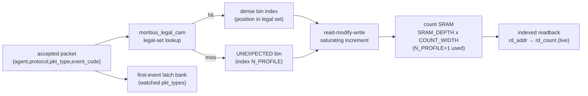

<!-- RTL Design Sherpa Documentation Header -->
<table>
<tr>
<td width="80">
  <a href="https://github.com/sean-galloway/RTLDesignSherpa">
    
  </a>
</td>
<td>
  <strong>RTL Design Sherpa</strong> · <em>Learning Hardware Design Through Practice</em><br>
  <sub>
    <a href="https://github.com/sean-galloway/RTLDesignSherpa">GitHub</a> ·
    <a href="https://github.com/sean-galloway/RTLDesignSherpa/blob/main/docs/DOCUMENTATION_INDEX.md">Documentation Index</a> ·
    <a href="https://github.com/sean-galloway/RTLDesignSherpa/blob/main/LICENSE">MIT License</a>
  </sub>
</td>
</tr>
</table>

---

<!-- End Header -->

# monbus_pkt_tally

**Module:** `monbus_pkt_tally.sv`
**Location:** `rtl/amba/monitor/`
**Category:** Coverage / Observability
**Status:** Production Ready

---

## Overview

`monbus_pkt_tally` is an **on-chip packet-coverage histogram**. Every accepted monitor-bus packet's identity key `{agent[15:0], protocol[3:0], pkt_type[3:0], event_code[7:0]}` is looked up in a host-loaded **legal set** (a [`monbus_legal_cam`](monbus_legal_cam.md)); the CAM returns a **dense bin index** — the key's position in the legal set — and the count SRAM at that index is incremented. A key that is *not* in the legal set increments a single **`UNEXPECTED`** bin (index `N_PROFILE`), so anything unforeseen is caught rather than silently mis-binned. The CAM is **always** in the path — there is no direct-mapped bypass and no write-combining cache.

It's the silicon twin of the sim-side packet-type coverage matrix ([`bin/monbus_coverage_report.py`](../../../../bin/monbus_coverage_report.py) + `TBClasses.monbus.parse`): a bin count `> 0` means "this message happened on hardware", and one readback sweep dumps the whole coverage matrix. And because a counter absorbs any arrival rate, a coverage run can span **millions of cycles** with no capture-bandwidth limit — unlike the [compressor](monbus_compressor.md)+log path, which bounds capture to the log SRAM depth.

The intended home is the Genesys 2 monitor board-validation build; see `vault/handbook/fpga/Genesys2/stream-mon/monitor-board-coverage.md`.

---

## Parameters

| Parameter | Default | Description | Constraints |
|-----------|---------|-------------|-------------|
| `PKT_WIDTH` | 128 | Monitor packet width | Locked by `monitor_common_pkg` |
| `TS_WIDTH` | 64 | Side-band timestamp width | Locked |
| `COUNT_WIDTH` | 32 | Saturating bin-count width | ≥ 1; sizes the SRAM word |
| `NUM_LATCH` | 4 | First-event capture slots | ≥ 1 |
| `ADDR_BITS` | 7 | Bin address width | `≥ clog2(N_PROFILE+1)` — sizes the dense count SRAM |
| `N_PROFILE` | 64 | Legal-set entries (dense bins) | Dense bins `0..N-1`; `N` = `UNEXPECTED` |
| `SRAM_DEPTH` | `1<<ADDR_BITS` | Derived count-SRAM depth | Do not override |
| `PROF_KEY_W` | int | `32` | {agent[15:0],proto[3:0],type[3:0],event[7:0]} |

---

### Derived Parameters (do not override)

These are declared as `parameter` so the elaborator can compute them, not so callers can set them. Each defaults to an expression over the parameters above; overriding one desynchronises it from its source and the design fails to elaborate or silently mis-sizes a bus. Set the parameters they are derived FROM and leave these alone.

| Derived parameter | Default expression |
|---|---|
| `PROF_IDX_W` | `(N_PROFILE > 1) ? $clog2(N_PROFILE) : 1` |
| `LSEL_WIDTH` | `(NUM_LATCH > 1) ? $clog2(NUM_LATCH) : 1` |
| `LFILL_WIDTH` | `$clog2(NUM_LATCH + 1)` |

## Ports

The full interface, straight from the RTL:

```systemverilog
module monbus_pkt_tally #(
    parameter int PKT_WIDTH   = 128,   // monitor_packet_t width (locked)
    parameter int TS_WIDTH    = 64,    // side-band timestamp width (locked)
    parameter int COUNT_WIDTH = 32,    // saturating bin count width
    parameter int NUM_LATCH   = 4,     // first-event capture slots
    parameter int ADDR_BITS   = 7,     // bin address width (sizes the dense SRAM)
    parameter int N_PROFILE   = 64,    // legal-set entries; dense bins 0..N-1, UNEXPECTED = N
    parameter int SRAM_DEPTH  = (1 << ADDR_BITS)
    // ... plus the legal-set load port (profile_clear/we/waddr/wvalid/wkey)
) (
    input  logic                    clk,
    input  logic                    rst_n,

    // Accepted-packet input (valid/ready; one packet per handshake)
    input  logic                    in_valid,
    output logic                    in_ready,
    input  logic [PKT_WIDTH-1:0]    in_packet,
    input  logic [TS_WIDTH-1:0]     in_ts,

    // Window / snapshot control
    input  logic                    i_freeze,      // level: hold counting
    input  logic                    i_flush,       // no-op (no cache to drain)
    output logic                    o_flush_busy,  // high while the clear walk runs
    input  logic                    i_clear,       // pulse: zero everything

    // Count readback (registered; valid one cycle after rd_addr, idle only)
    input  logic [ADDR_BITS-1:0]    rd_addr,
    output logic [COUNT_WIDTH-1:0]  rd_count,

    // First-event latch
    input  logic                    i_watch_arm,          // level: capture enable
    input  logic [15:0]             i_watch_pkttype_mask, // bit p = watch pkt_type p
    input  logic [$clog2(NUM_LATCH)-1:0] latch_sel,
    output logic                    latch_valid,
    output logic [PKT_WIDTH-1:0]    latch_packet,
    output logic [TS_WIDTH-1:0]     latch_ts,
    output logic [$clog2(NUM_LATCH+1)-1:0] latch_fill
);
```

---

## Functional Description

### Architecture



A tiny FSM runs the accept: `ST_RUN` reads the CAM-resolved bin, `ST_WR` writes the saturating-incremented count back; a walk-counter (`ST_CLEAR`) zeroes the SRAM on clear. `i_flush` is accepted for interface compatibility but is a **no-op** — there is no cache to drain.

### Data Model

```
total(bin) = SRAM[bin]            # always live; no cache term
bin        = legal_cam.lookup(key) ? dense_index : UNEXPECTED   (index N_PROFILE)
```

- **Legal-set hit** — increment `SRAM[dense_index]` (the key's slot in the loaded legal set).
- **Legal-set miss** — increment `SRAM[UNEXPECTED]`. A non-zero `UNEXPECTED` count means a packet arrived with a tuple the host did not load, and should be flagged loudly.

All counts **saturate**: a pegged bin never wraps.

The **legal set** is loaded by the host over the config port (clear, then one `{key, index}` pair per entry). The 32-bit key is `{agent[15:0], protocol[3:0], pkt_type[3:0], event_code[7:0]}` — note it includes **agent**, so per-instance identity is resolved, not just the message class. Dense bins run `0..N_PROFILE-1` with `UNEXPECTED = N_PROFILE`, so only `N_PROFILE+1` words are ever *used*, regardless of how sparse the underlying tuple space is. The SRAM itself is `SRAM_DEPTH = 1 << ADDR_BITS` words (128 at the default `ADDR_BITS = 7`), and the clear walk covers all of them.

### Legal-Set (Dense) Binning

A direct-mapped `{protocol, pkt_type, event_code}` matrix cannot answer *"did every agent fire?"* (`agent_id` is not in the key) and is ~99% empty (only ~245 of the 20,480 `protocol×type×event` cells are ever legal). So the tally does **not** use one; the CAM-resolved dense binning is the **only** mode (the earlier `PROFILE_MODE = 0` direct-mapped path was removed).

A [`monbus_legal_cam`](monbus_legal_cam.md) holds up to `N_PROFILE` legal `{agent, protocol, pkt_type, event_code}` keys; an incoming packet is matched to the entry's **dense bin index** (a hit) or routed to the single **`UNEXPECTED` bin** at index `N_PROFILE` (a miss, also captured by the first-event latch). This makes per-agent coverage a first-class count, and turns any out-of-profile message — a wrong event code, an untracked agent, a protocol a unit should not speak — into a swept spec-violation signal.

The legal set is loaded/cleared over the config port. Two host encodings exist: the raw profile-load pins (`profile_clear` / `profile_we` / `profile_waddr` / `profile_wvalid` / `profile_wkey`), and — in the STREAM-monitor AXIL wrapper — a **register model** (`CAM_CLEAR`, then per entry `CAM_KEY` followed by `CAM_LOAD = (valid<<31)|index`) that carries the index in the write *data* so it is immune to bus-width/stride hazards. Either way the host can reprogram slices per run when the full legal set exceeds `N_PROFILE`.

Coverage gate: every expected dense bin `> 0` (all agents/types fired) **and** `UNEXPECTED == 0` (nothing rogue slipped through). Note that `UNEXPECTED == 0` is also the *fault-free* signal — the [fault classes](monitor_system_architecture.md#healthy-classes-vs-fault-classes) (error/timeout/threshold) only appear here when a fault was deliberately injected.

### Snapshot Protocol

The host reads a coherent coverage snapshot over the CSR/AXIL window as follows:

1. `i_freeze = 1` — stop counting at a coherent boundary.
2. Sweep `rd_addr` over every bin and read `rd_count` (one-cycle registered read, valid only while idle). No flush is needed — counts are live in SRAM.
3. Pulse `i_clear` — zero the SRAM + the first-event latches for the next window. `o_flush_busy` is high during the SRAM walk.

`rd_count` is **always** the coherent count (`= SRAM[rd_addr]`); there is no cache to fold in. `i_flush` is retained on the interface but is a no-op.

### First-Event Latch

`NUM_LATCH` slots capture the full 128-bit packet + timestamp of the first accepted packets whose `pkt_type` bit is set in `i_watch_pkttype_mask` (with `i_watch_arm = 1`). This yields the offending packet behind a nonzero error bin, not just a count. `latch_fill` reports how many slots are populated; read a slot by driving `latch_sel` and sampling `latch_valid` / `latch_packet` / `latch_ts`. The bank is cleared by `i_clear`.

---

## Timing Characteristics
- **Accept path:** a combinational legal-set CAM lookup resolves the bin, then a 2-cycle read-then-saturating-write (`ST_RUN` → `ST_WR`) commits it. `in_ready` is `(r_st == ST_RUN) && !i_freeze && !i_clear && !r_clear_pend` -- so a clear pulse also drops it, and it stays low until the SRAM clear walk finishes. The documented protocol freezes before clearing, which masks this, but a checker written from the "running and unfrozen" summary alone will false-flag a clear that arrives unfrozen. The clear terms are required for valid/ready correctness, not tidiness.
- **Read:** `rd_count` is a registered read of `SRAM[rd_addr]`, always live.
- **Clear:** walks `SRAM_DEPTH` entries writing zero (`ST_CLEAR`).
- **Flush:** no-op (no cache).

---

## Usage Examples

Every parameter and port below is taken from the module declaration.

```systemverilog
monbus_pkt_tally #(
    .PKT_WIDTH             (128),
    .TS_WIDTH              (64),
    .COUNT_WIDTH           (32),
    .NUM_LATCH             (4),
    .ADDR_BITS             (7),
    .N_PROFILE             (64),
    .SRAM_DEPTH            ((1 << ADDR_BITS)),
    .PROF_IDX_W            ((N_PROFILE > 1)),
    .PROF_KEY_W            (32),
    .LSEL_WIDTH            ((NUM_LATCH > 1))
) u_monbus_pkt_tally (
    .clk                   (clk),
    .rst_n                 (rst_n),
    .in_valid              (in_valid),
    .in_ready              (in_ready),
    .in_packet             (in_packet),
    .in_ts                 (in_ts),
    .i_freeze              (i_freeze),
    .i_flush               (i_flush),
    .o_flush_busy          (o_flush_busy),
    .i_clear               (i_clear),
    .rd_addr               (rd_addr),
    .rd_count              (rd_count),
    .i_watch_arm           (i_watch_arm),
    .i_watch_pkttype_mask  (i_watch_pkttype_mask),
    .latch_sel             (latch_sel),
    .latch_valid           (latch_valid),
    .latch_packet          (latch_packet),
    .latch_ts              (latch_ts),
    .latch_fill            (latch_fill),
    .profile_clear         (profile_clear),
    .profile_we            (profile_we),
    .profile_waddr         (profile_waddr),
    .profile_wvalid        (profile_wvalid),
    .profile_wkey          (profile_wkey)
);
```

---

## Design Notes

### Why Count Instead of Log?

A 128-bit monitor packet plus a 64-bit timestamp is 24 bytes per event. Log every one and a run tops out at `SRAM_depth / 24` events — a millisecond or two at realistic rates, then you're full. But the board-validation goal is *coverage* ("did every packet type happen, and how often?"), not a trace. For that, a **saturating counter per message bin** is the right structure: it absorbs any rate, drops the compressor (and its worst-case CAM timing path) from the board build, and *is* the coverage matrix in hardware.

Each accepted packet is a read-modify-write on the count SRAM (read the bin, saturating-increment, write it back). A short two-cycle accept sequence services that RMW directly; there is no cache in front. An earlier design added an LRU write-combining cache to collapse the RMWs, but it stranded low-volume counts in the cache (a readback returned SRAM only), so it was removed in favour of the simple, always-coherent direct RMW. `rd_count` is therefore always live — it is `SRAM[rd_addr]` with nothing to drain first.

---

## Related Modules

### Building Blocks Reused

| Block | Role |
|-------|------|
| [`monbus_legal_cam`](monbus_legal_cam.md) | The CSR-loaded legal-set match CAM that maps `{agent, protocol, pkt_type, event_code}` to a dense bin index (hit) or a miss (`UNEXPECTED`). Always in the path. |
| `monitor_common_pkg` | The locked 128-bit packet field map (`pkt_type[127:124]`, `protocol[108:105]`, `event_code[104:97]`, `agent_id[87:72]`). |
| synchronous single-port SRAM | The backing dense count matrix (`N_PROFILE+1` deep). |

### See Also

- [`monbus_legal_cam.md`](monbus_legal_cam.md) — the legal-set CAM that resolves each packet to its dense bin.
- [`monbus_compressor.md`](monbus_compressor.md) — the alternative capture path (bounded compressed log) this histogram replaces on the board build.
- [`axi_perf_latency_hist.md`](../shared/axi_perf_latency_hist.md) — a companion histogram that bins latency magnitude (not message type) with the same freeze/clear window semantics.
- [`monbus_group_core.md`](monbus_group_core.md) — the filter/route front whose accepted-packet stream feeds this block.

---

## Testing

**Location:** `val/amba/test_monbus_pkt_tally.py`
**Run:** `pytest val/amba/test_monbus_pkt_tally.py -v`

The acceptance criterion is an **exact** cross-check: after a freeze/flush, the hardware bin counts must equal a pure-Python golden count of the same accepted `(protocol, pkt_type, event_code)` stream. A lost increment shows up as a per-bin mismatch. Phases: random count + readback, back-to-back same-bin accepts (the RMW hazard the two-cycle accept sequence exists to cover), saturation (a bin pegs and never wraps), first-event latch, and clear. (Earlier revisions of this section described eviction-stress phases against an LRU write-combining cache; that cache was removed -- every accept is now a direct SRAM read-modify-write.)

---

## Navigation

- **[← Back to monitor index](../index.md)**
- **[← Back to rtl-amba index](../index.md)**
