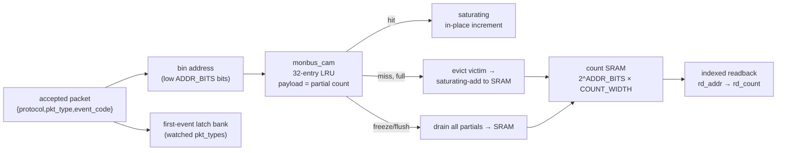

<!-- RTL Design Sherpa Documentation Header -->
<table>
<tr>
<td width="80">
  <a href="https://github.com/sean-galloway/RTLDesignSherpa">
    
  </a>
</td>
<td>
  <strong>RTL Design Sherpa</strong> · <em>Learning Hardware Design Through Practice</em><br>
  <sub>
    <a href="https://github.com/sean-galloway/RTLDesignSherpa">GitHub</a> ·
    <a href="https://github.com/sean-galloway/RTLDesignSherpa/blob/main/docs/DOCUMENTATION_INDEX.md">Documentation Index</a> ·
    <a href="https://github.com/sean-galloway/RTLDesignSherpa/blob/main/LICENSE">MIT License</a>
  </sub>
</td>
</tr>
</table>

---

<!-- End Header -->

# Monitor Bus Packet Tally

**Module:** `monbus_pkt_tally.sv`
**Location:** `rtl/amba/monitor/`
**Category:** Coverage / Observability
**Status:** Production Ready

---

## Overview

`monbus_pkt_tally` is an **on-chip packet-type coverage histogram**. It counts
accepted monitor-bus packets into an SRAM matrix addressed by the message
identity `{protocol, pkt_type, event_code}`, fronted by a 32-entry LRU
write-combining cache so the common case — back-to-back hits on a handful of hot
bins — never touches the SRAM.

It's the silicon twin of the sim-side packet-type coverage matrix
([`bin/monbus_coverage_report.py`](../../../../bin/monbus_coverage_report.py) +
`TBClasses.monbus.parse`): a bin count `> 0` means "this message happened on
hardware", and one readback sweep dumps the whole coverage matrix. And because a
counter absorbs any arrival rate, a coverage run can span **millions of cycles**
with no capture-bandwidth limit — unlike the
[compressor](monbus_compressor.md)+log path, which bounds capture to the log
SRAM depth.

The intended home is the Genesys 2 monitor board-validation build; see
`projects/NexysA7/stream_characterization/MONITOR_BOARD_VALIDATION_PLAN.md`.

---

## Why Count Instead of Log?

A 128-bit monitor packet plus a 64-bit timestamp is 24 bytes per event. Log every
one and a run tops out at `SRAM_depth / 24` events — a millisecond or two at
realistic rates, then you're full. But the board-validation goal is *coverage*
("did every packet type happen, and how often?"), not a trace. For that, a
**saturating counter per message bin** is the right structure: it absorbs any
rate, drops the compressor (and its worst-case CAM timing path) from the board
build, and *is* the coverage matrix in hardware.

The catch with a naive counter array is a read-modify-write on every packet.
That's what the LRU cache in front is for — it collapses the RMWs to one per
eviction, and real traffic is heavily skewed to a handful of bins, so once the
working set is warm that eviction is rare.

---

## Architecture



The counting datapath has no FSM on the fast path: an accepted packet is a
single-cycle cache lookup + commit. A small shared read-modify-write
sub-sequence services evictions and the flush drain; a walk-counter zeroes the
SRAM on clear.

---

## Data Model

```
total(bin) = SRAM[bin] + (cache partial for bin, if resident)
```

- **Hit** — increment the resident partial in place (no SRAM access).
- **Miss** — install a fresh partial (`= 1`). If the cache was full, the evicted
  victim's partial saturating-adds back into its SRAM bin (the evict RMW).
- **Freeze/flush** — drain every resident partial into SRAM, so a readback sees
  the coherent total. The cache is left empty.

All counts **saturate**: a pegged bin never wraps, even across the cache/SRAM
split (both the in-cache increment and the spill add are saturating).

The bin address is the **low `ADDR_BITS` bits** of the 16-bit identity
`{protocol[3:0], pkt_type[3:0], event_code[7:0]}`. At the production
`ADDR_BITS = 16` this is the whole tuple, direct-mapped, so the hardware count
equals the Python `parse()` count **exactly** — no hash collisions. A narrower
test build keeps `{pkt_type, event_code}` and must restrict `protocol` to stay
unique.

---

## Top-level Interface

```systemverilog
module monbus_pkt_tally #(
    parameter int PKT_WIDTH   = 128,   // monitor_packet_t width (locked)
    parameter int TS_WIDTH    = 64,    // side-band timestamp width (locked)
    parameter int COUNT_WIDTH = 32,    // saturating bin count width
    parameter int CACHE_DEPTH = 32,    // LRU write-combining cache entries
    parameter int NUM_LATCH   = 4,     // first-event capture slots
    parameter int ADDR_BITS   = 16,    // bin address width (16 = full tuple)
    parameter int SRAM_DEPTH  = (1 << ADDR_BITS)
) (
    input  logic                    clk,
    input  logic                    rst_n,

    // Accepted-packet input (valid/ready; one packet per handshake)
    input  logic                    in_valid,
    output logic                    in_ready,
    input  logic [PKT_WIDTH-1:0]    in_packet,
    input  logic [TS_WIDTH-1:0]     in_ts,

    // Window / snapshot control
    input  logic                    i_freeze,      // level: hold counting
    input  logic                    i_flush,       // pulse: drain cache -> SRAM
    output logic                    o_flush_busy,  // high while flush/clear runs
    input  logic                    i_clear,       // pulse: zero everything

    // Count readback (registered; valid one cycle after rd_addr, idle only)
    input  logic [ADDR_BITS-1:0]    rd_addr,
    output logic [COUNT_WIDTH-1:0]  rd_count,

    // First-event latch
    input  logic                    i_watch_arm,          // level: capture enable
    input  logic [15:0]             i_watch_pkttype_mask, // bit p = watch pkt_type p
    input  logic [$clog2(NUM_LATCH)-1:0] latch_sel,
    output logic                    latch_valid,
    output logic [PKT_WIDTH-1:0]    latch_packet,
    output logic [TS_WIDTH-1:0]     latch_ts,
    output logic [$clog2(NUM_LATCH+1)-1:0] latch_fill
);
```

### Parameters

| Parameter | Description | Default | Constraints |
|-----------|-------------|---------|-------------|
| `PKT_WIDTH` | Monitor packet width | 128 | Locked by `monitor_common_pkg` |
| `TS_WIDTH` | Side-band timestamp width | 64 | Locked |
| `COUNT_WIDTH` | Saturating bin-count width | 32 | ≥ 1; sizes the SRAM word and cache payload |
| `CACHE_DEPTH` | LRU cache entries | 32 | Passed straight to `monbus_cam.DEPTH` |
| `NUM_LATCH` | First-event capture slots | 4 | ≥ 1 |
| `ADDR_BITS` | Bin address width | 16 | ≤ 16; 16 = whole tuple, direct-mapped |
| `SRAM_DEPTH` | Derived count-SRAM depth | `1<<ADDR_BITS` | Do not override |

---

## Snapshot Protocol

The host reads a coherent coverage snapshot over the CSR/AXIL window as follows:

1. `i_freeze = 1` — stop counting at a coherent boundary.
2. Pulse `i_flush` — drain the cache partials into SRAM. `o_flush_busy` is high
   until the drain completes; the cache is left empty.
3. Sweep `rd_addr` over every bin and read `rd_count` (one-cycle registered read,
   valid only while idle).
4. Pulse `i_clear` — zero SRAM + cache + the first-event latches for the next
   window. `o_flush_busy` is high during the SRAM walk.

`rd_count` is meaningful **only after a flush while frozen/idle** — mid-run it
reflects SRAM alone (the resident partials have not been folded in yet).

---

## First-Event Latch

`NUM_LATCH` slots capture the full 128-bit packet + timestamp of the first
accepted packets whose `pkt_type` bit is set in `i_watch_pkttype_mask` (with
`i_watch_arm = 1`). This yields the offending packet behind a nonzero error bin,
not just a count. `latch_fill` reports how many slots are populated; read a slot
by driving `latch_sel` and sampling `latch_valid` / `latch_packet` / `latch_ts`.
The bank is cleared by `i_clear`.

---

## Building Blocks Reused

| Block | Role |
|-------|------|
| [`monbus_cam`](monbus_cam.md) | The 32-entry LRU cache front. Its payload is repurposed from `last_event_data` to a partial count; the `evict_*` / `dump_*` / `soft_clear` ports were added additively for this consumer (the compressor path is untouched). |
| `monitor_common_pkg` | The locked 128-bit packet field map (`pkt_type[127:124]`, `protocol[108:105]`, `event_code[104:97]`). |
| synchronous single-port SRAM | The backing count matrix. |

---

## Timing

- **Fast path:** single-cycle. An accepted packet performs a combinational cache
  lookup and commits the same cycle; `in_ready` is high whenever running,
  unfrozen, and the spill engine is idle.
- **Evict RMW:** a full-cache miss stalls `in_ready` for the 2-cycle
  read-then-saturating-write that folds the victim into SRAM. Post-warmup this
  is rare (traffic is skewed to a few bins).
- **Flush:** walks `CACHE_DEPTH` entries, one RMW per live entry.
- **Clear:** walks `SRAM_DEPTH` entries writing zero.

---

## Related Modules

- [`monbus_cam.md`](monbus_cam.md) — the LRU cache reused as the tally's front.
- [`monbus_compressor.md`](monbus_compressor.md) — the alternative capture path
  (bounded compressed log) this histogram replaces on the board build.
- [`axi_perf_latency_hist.md`](../shared/axi_perf_latency_hist.md) — a companion histogram
  that bins latency magnitude (not message type) with the same freeze/clear
  window semantics.
- [`monbus_group_core.md`](monbus_group_core.md) — the filter/route front whose
  accepted-packet stream feeds this block.

---

## Test

**Location:** `val/amba/test_monbus_pkt_tally.py`
**Run:** `pytest val/amba/test_monbus_pkt_tally.py -v`

The acceptance criterion is an **exact** cross-check: after a freeze/flush, the
hardware bin counts must equal a pure-Python golden count of the same accepted
`(protocol, pkt_type, event_code)` stream. A lost increment through an eviction
race shows up as a per-bin mismatch. Phases: random count + readback, eviction
stress (5× more distinct bins than the cache, repeated eviction/re-install),
saturation (a bin pegs and never wraps), first-event latch, and clear.
