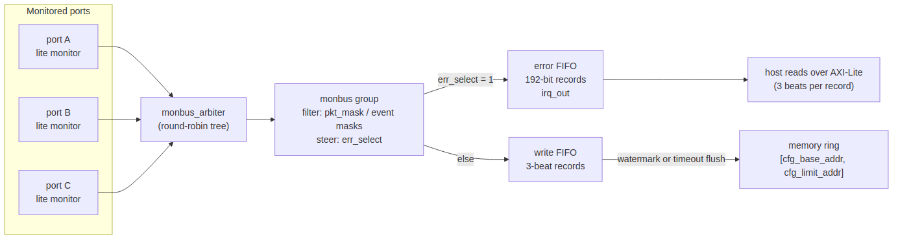
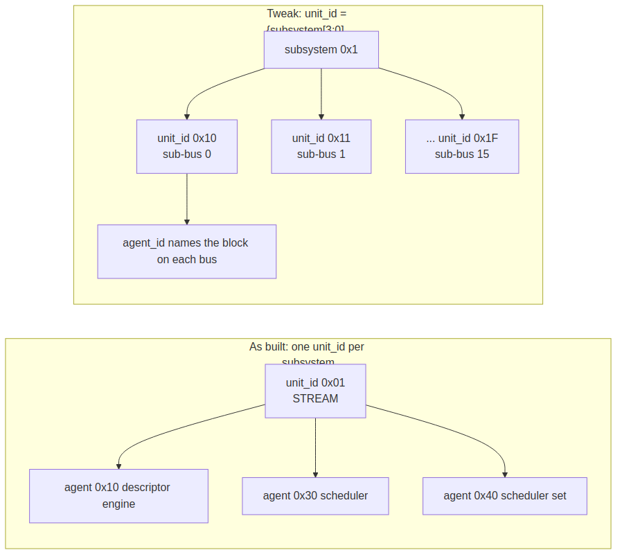
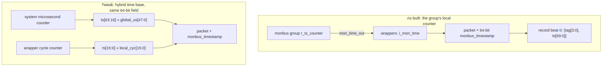
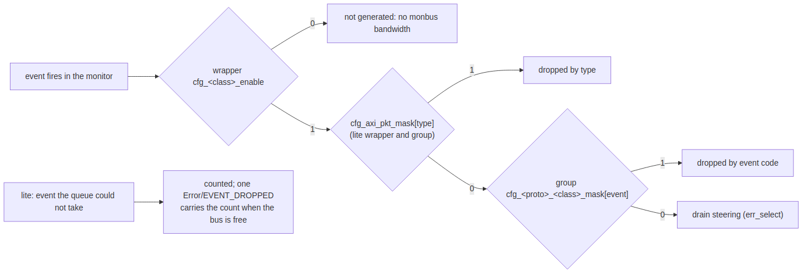
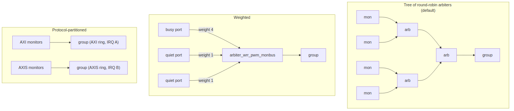

<!-- RTL Design Sherpa Documentation Header -->
<table>
<tr>
<td width="80">
  
</td>
<td>
  <strong>RTL Design Sherpa</strong> · <em>Learning Hardware Design Through Practice</em> 
  
    <a href="https://github.com/sean-galloway/RTLDesignSherpa">GitHub</a> ·
    <a href="https://github.com/sean-galloway/RTLDesignSherpa/blob/main/docs/DOCUMENTATION_INDEX.md">Documentation Index</a> ·
    <a href="https://github.com/sean-galloway/RTLDesignSherpa/blob/main/LICENSE">MIT License</a>
  
</td>
</tr>
</table>

---

<!-- End Header -->

# The Monitor System as a Design Surface

**Audience:** SoC integrators deciding how to instrument a design with the
RTL Design Sherpa monitor system. **Not** a status snapshot of what is in the
tree (that is [overview.md](overview.md)) and not a port list (those are the
per-module pages under [monitor/](monitor/)). This paper sits one level up:
here is the spine, here are the six axes the integrator owns, and here is
what each choice costs.

**Version:** 1.1, 2026-09-28. Numbers are from the tree at that date;
each is cited to the page or report it comes from. Revision 1.1 makes the
recommendation explicit: the lite monitor is the realistic choice on every
port, and the full monitor is the exception you justify.

---

## The spine

Every monitored port emits 128-bit packets onto a monitor bus (monbus). An
arbiter tree merges the ports of a block into one stream, and a monbus group
sinks that stream into two paths: an error FIFO the host reads over
AXI-Lite behind an interrupt, and a write FIFO the group flushes as AXI
bursts into a memory ring. Filtering happens at the group, per protocol and
per packet type. The packet layout is fixed
([monitor_package_spec.md](includes/monitor_package_spec.md)); everything
else on this page is a knob.

## Which monitor: the lite, unless you can say why not

Two monitors implement the port end of the spine. `axi_monitor_base`, the
full monitor, tracks transactions in a CAM and drives six reporter cones
(error, timeout, completion, threshold, performance, debug) with ID and
address filtering. `axi_monitor_lite` tracks the same transactions in
per-ID linked lists, emits errors, timeouts, completions with latency,
thresholds and address-range events, and drops the performance and debug
classes and the ID filter. Measured at their default parameters, out of
context, on the Kintex-7 the boards ship on
([monitor/monitor_characterization.md](monitor/monitor_characterization.md)):

| | Full monitor | Lite | Ratio |
|---|---:|---:|---:|
| AXI4 read monitor, LUTs | 7,006 | 1,115 | 6.3x |
| AXI4 read monitor, flops | 5,219 | 1,027 | 5.1x |
| AXI-Lite read monitor, LUTs | 2,891 | 929 | 3.1x |
| 6.667 ns on Kintex-7 325T -2, register to register | misses (CAM at 16 slots) | meets, 0.8 to 1.5 ns spare | |
| 10 ns on Artix-7 100T -1 | misses by 1.45 ns | meets by 0.6 ns | |

That is why the lite is the default: the bridge generator instantiates it on
every monitored port, STREAM's three in-core monitors and RAPIDS' descriptor
and AXIS monitors are lite, and every board build since 2026-09-26 carries
it. It is also the more honest of the two under load. A full monitor that
runs out of table entries stalls the command channel (`block_ready`); the
lite never stalls the bus, counts the command it could not track
(`refused_count`), and when its output queue is full it counts the events
it could not deliver and reports the count in one `Error/EVENT_DROPPED`
packet as soon as the bus is free. Its contract is exact and is proved in
the tree: every command is completed, refused or live, and every generated
event is delivered, reported dropped or pending, with no fourth outcome
(`val/amba/test_axi_mon_block_ready.py`, `test_axi_monitor_soak.py`,
`formal/amba/axi_monitor_lite`). A stalled bus is the one effect an
instrument must never have on the design it watches.

What you give up, and when it matters:

| Full-monitor feature | Lite | Reach for the full monitor if |
|---|---|---|
| performance windows (`cfg_perf_enable`, byte/beat/idle counters) | none; the in-datapath `axi_bus_meter` and the pass-through observer measure throughput without a monitor | you need windowed bandwidth numbers from the monitor itself |
| debug trace packets | none | you need per-beat trace, not events |
| ID-range filter (`ID_FILTER_ENABLE`) | none; one lite per port, sliced by `unit_id`/`agent_id` instead | several instances must share one port by ID |
| 16 slots | 8 by default, parameter | more than eight transactions in flight per port and every one must be tracked, not counted as refused |
| address filter | address ranges kept (`N_ADDR_RANGES`, error or match per range) | |

The rest of this paper assumes the lite at the ports. Every axis below is
the same for both monitors; the numbers are the lite's.

## 1. Identity space allocation

Three fields in every packet are designer-owned and fixed at build time:

| Field | Bits | Set by | Meaning |
|---|---:|---|---|
| `unit_id` | 8 | wrapper parameter `UNIT_ID` | which subsystem |
| `agent_id` | 16 | wrapper parameter `AGENT_ID` | which block inside it |
| `channel_id` | 9 | the monitor, from the transaction | which channel or AXI ID |

The tools decode nothing from these fields; a host-side table maps the
`(unit_id, agent_id)` tuple to a name. That makes the allocation yours.
STREAM uses `unit_id = 0x01` for the whole DMA and spends `agent_id` on
blocks: `0x10` descriptor engine, `0x30` scheduler, `0x40` the widened
scheduler set (`projects/components/dmas/stream/rtl/macro/scheduler_group.sv`).

**Worked example, one level down.** A subsystem with several internal
buses can split `unit_id` into a subsystem nibble and a sub-bus nibble:
`unit_id = {sub_system[3:0], sub_bus[3:0]}` gives sixteen subsystems each
with up to sixteen tracked internal buses, and `agent_id` is still free to
name the block on each bus. A host filter on `unit_id[7:4]` then isolates a
subsystem, and on the full byte a single bus, with no change to the RTL.
The cost is nothing: the fields exist in every packet regardless.

## 2. Where to insert monitoring

| Placement | What it sees | Cost | Use when |
|---|---|---|---|
| **Per port** (the default; the bridge generator puts a lite monitor on every monitored port) | every transaction on that port, attributed by ID, with completion latency | one lite per port: about 1,100 LUTs / 1,030 FFs at defaults, 677 / 831 with the bridge's narrower parameters ([monitor_characterization.md](monitor/monitor_characterization.md), [axi_monitor_lite.md](monitor/axi_monitor_lite.md)) | you need to know WHICH port misbehaved |
| **Mid-fabric** | the traffic crossing one internal link, through a pass-through observer with its own APB configuration (`projects/components/misc/rtl/axi4_intf_master_observer.sv`) | one observer per link | localizing violations the fabric itself introduces (ordering, ID collisions between ports) |
| **Root of tree** | the aggregate of everything below, once | one monitor | area-constrained; you only need "something is wrong", not where |

Per port and root of tree are the ends of one trade: resolution against
area. A three-port read bridge with per-port lite monitors spends about
2,000 LUTs on monitors and about 1,400 on the shared group; the same bridge
monitored once at its root spends 677 and 1,400, and can no longer tell the
ports apart. With the full monitor the same per-port choice would cost about
21,000 LUTs, which is why per-port monitoring was not realistic before the
lite and is the default with it.

## 3. Timestamp policy

A 64-bit timestamp rides beside every packet (`monbus_timestamp_t`). Today
it is the monbus group family's local free-running counter (`mon_time_out`),
distributed to the wrappers as `i_mon_time`, and the group writes its low 60
bits into the first beat of every three-beat record. Within one group every
packet is on one clock; across groups there is no shared time base.

Two directions are open to the integrator:

- **Hybrid** `{global_us[47:0], local_cyc[15:0]}`: a system-wide
  microsecond count in the upper bits, the wrapper's own cycle count in the
  lower. Cross-subsystem correlation and per-wrapper cycle resolution then
  share the one field, and nothing in the packet layout moves.
- **External time source** (PTP or a chip-level counter): drive `i_mon_time`
  from it instead of the group's counter. The wrappers do not care where the
  value comes from.

Neither is prototyped; the hybrid form is the one this paper recommends
when it is, because it needs no new field and no host-side re-basing.

## 4. Drain path selection

The group has two sinks and a per-type steering mask
([monbus_group.md](monitor/monbus_group.md)):

| Sink | Record | Reached by | Best for |
|---|---|---|---|
| **Error FIFO** | 192-bit `{timestamp, packet}`, read back as three 64-bit beats over the AXI-Lite slave; `irq_out` while non-empty | `cfg_<proto>_err_select[type] = 1` | the few packets a handler must act on now: errors, timeouts |
| **Write FIFO** | the same record as three beats (raw) or one beat (compressed), flushed as AXI bursts into the ring `[cfg_base_addr, cfg_limit_addr]` when `cfg_flush_watermark` beats are queued or the flush timeout elapses | everything not dropped and not selected for the error FIFO | bulk trace: completions, latencies, thresholds, for offline analysis |

The choice is per packet type per protocol, at runtime. The common shape is
errors and timeouts to the interrupt path and everything else to the trace
ring; a debug session flips completions over to the error FIFO for a while
and reads them one at a time.

## 5. Packet-type filtering

Three layers, all runtime-programmable over the control APB:

1. **Type mask** at the group, `cfg_<proto>_pkt_mask[type]`: 1 drops the
   type. Also on every lite wrapper (`cfg_axi_pkt_mask`) so a dropped type
   never even leaves the port.
2. **Event mask** at the group, `cfg_<proto>_<class>_mask[event_code[3:0]]`:
   1 drops one event within a type, for example `RESP_SLVERR` but not
   `RESP_DECERR`.
3. **Enable pins** on the wrappers, `cfg_error_enable`, `cfg_compl_enable`,
   `cfg_timeout_enable`, `cfg_threshold_enable`: a class that is off is not
   generated at all, so it costs no monbus bandwidth.

**The congestion pitfall, and how the lite retires it.** On the full
monitor, completion and performance packets are the high-rate classes; with
both enabled on a busy port the monbus saturates and lower-priority packets
are lost silently. The rule from
[AXI_Monitor_Configuration_Guide.md](../../user-guides/AXI_Monitor_Configuration_Guide.md)
stands there: never enable `cfg_compl_enable` and `cfg_perf_enable`
together. The lite has no performance class to collide with, holds a
timeout or a latency event that loses the pick until it can go, and when
its queue is genuinely full it counts the loss and reports the count in one
`Error/EVENT_DROPPED` packet as soon as the bus is free. Nothing is lost
silently; the consumer always knows how many events it did not see, which
is the property a filtering strategy can be built on.

## 6. Aggregation topology

| Topology | Block | When |
|---|---|---|
| **Tree of round-robin arbiters** (default) | `monbus_arbiter`, any fan-in, ACK-mode grants | ports of similar rate; simplest, fair |
| **Weighted** | `arbiter_wrr_pwm_monbus` (weights per client, PWM flow control); `arbiter_rr_pwm_monbus` is the unweighted sibling | one port far busier than the others and you want its packets to win proportionally, not equally |
| **Protocol-partitioned groups** | one `monbus_group_core` per protocol family instead of the shared AXI / AXIS / CORE slots | the families need different rings, different interrupt handlers, or different flush policies |

The group core is shared by every wrapper family (AXI4, AXI5, AXI-Lite,
AXIS, Wishbone), so partitioning is a topology decision, not a new block.

## What it costs

Standalone, at default parameters, from the characterization sweep
([monitor/monitor_characterization.md](monitor/monitor_characterization.md)),
and in place, from the bridge fixture with the bridge's parameters
([axi_monitor_lite.md](monitor/axi_monitor_lite.md)):

| | Full monitor | Lite |
|---|---:|---:|
| One AXI4 read monitor at defaults (16 / 8 slots), LUTs / FFs | 7,006 / 5,219 | 1,115 / 1,027 |
| One read monitor in the bridge, LUTs / FFs | 3,249 / 1,628 | 677 / 831 |
| Three-port read bridge with group, LUTs | 12,625 | 5,339 |
| The unmonitored bridge, LUTs | 826 | 826 |
| Kintex-7 325T -2 at 6.667 ns, bridge WNS | +0.212 ns | +1.092 ns |
| Kintex-7 at 6.667 ns, standalone at defaults, register to register | -0.166 ns | +1.005 ns |
| A group (error FIFO 64 records, write FIFO 96 beats), LUTs / FFs | 1,700 to 2,000 / 1,150 to 1,390 | same, shared |

The lite bridge fixture meets 10 ns on the Artix-7 100T -1 since 2026-09-28
(+0.366 ns), after the group planner and the lite's event stage were
re-pipelined (amba ISSUE-001, monitor-lite ISSUE-002). The per-variant
characterization -- every wrapper family, with and without clock gating,
full against lite, on both parts, from one repeatable flow -- is
[monitor/monitor_characterization.md](monitor/monitor_characterization.md).
Its headline: at default parameters the full AXI monitor is about 7,000
LUTs and the lite about 1,100, and the lite meets 150 MHz on the Kintex-7
with 0.8 ns or more to spare where the 16-slot full monitor does not.

## Validating a tweak in simulation

Three templates in the tree exercise exactly the knobs above:

- `val/amba/test_axi_mon_block_ready.py`: saturate a port and prove the
  monitor's admission contract, `block_ready` on the full monitor and the
  refuse-count identity on the lite.
- `val/amba/test_axi_monitor_soak.py::monitor_soak_monlite`: random traffic
  with backpressure, asserting that every generated event is delivered or
  counted as dropped. Change a mask or a drain and this is the identity that
  must still close.
- `formal/amba/monbus_group_core`: the routing rule, `monbus_ready`, the FIFO
  accounting and the legality of the flush burst, proved at the ports. A
  change to the group's filtering or drain logic re-runs against it.

The error-injection template the original outline named
(`test_bridge_1x2_rd_monitor_error_inject.py`) is not in the tree; the
bridge's generated monitor stress tests cover that ground.

## Out of scope

Packet bit layout ([monitor_package_spec.md](includes/monitor_package_spec.md)),
per-module ports and timing ([monitor/](monitor/)), and test recipes (the
test sources).
