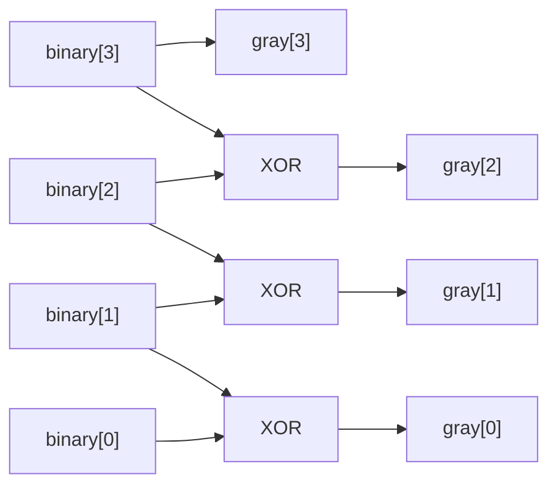

<!-- RTL Design Sherpa Documentation Header -->
<table>
<tr>
<td width="80">
  <a href="https://github.com/sean-galloway/RTLDesignSherpa">
    
  </a>
</td>
<td>
  <strong>RTL Design Sherpa</strong> · <em>Learning Hardware Design Through Practice</em><br>
  <sub>
    <a href="https://github.com/sean-galloway/RTLDesignSherpa">GitHub</a> ·
    <a href="https://github.com/sean-galloway/RTLDesignSherpa/blob/main/docs/DOCUMENTATION_INDEX.md">Documentation Index</a> ·
    <a href="https://github.com/sean-galloway/RTLDesignSherpa/blob/main/LICENSE">MIT License</a>
  </sub>
</td>
</tr>
</table>

---

<!-- End Header -->

# Binary-to-Gray converter (`bin2gray.sv`)

## Overview

`bin2gray` is a purely combinational binary-to-Gray converter. Gray code —
reflected binary code, unit-distance code, same thing — is a binary numeral
system where two successive values differ in exactly one bit. That one-bit
property is what reduces glitches and metastability exposure when a value moves
between asynchronous domains, which is why Gray code turns up everywhere in
clock domain crossing work.

Where it earns its keep:

- **Asynchronous FIFOs** — pointer comparisons that can't afford metastability
- **Clock domain crossing** — safe multi-bit signal transfer
- **Position encoders** — mechanical/optical encoder interfaces
- **Memory address generation** — reduces EMI and power spikes
- **Test pattern generation** — controlled single-bit transitions
- **Error detection** — single-bit error detection schemes
- **ADC/DAC interfaces** — fewer glitches in conversion systems

## Module Declaration

```systemverilog
module bin2gray #(
    parameter int WIDTH = 4
) (
    input  wire [WIDTH-1:0] binary,
    output wire [WIDTH-1:0] gray
);
```

## Parameters

| Parameter | Default | Description |
|-----------|---------|-------------|
| `WIDTH` | 4 | Bit width of both input and output (`int`, any positive integer ≥ 1; common values 4, 8, 16, 32 for address counters and data buses). Determines the number of XOR gates required. |

: bin2gray parameters

## Ports

| Port | Direction | Width | Description |
|------|-----------|-------|-------------|
| `binary` | input | WIDTH | Input binary value |
| `gray` | output | WIDTH | Output Gray code value |

: bin2gray ports

## Functional Description

### Mathematical definition

The conversion follows one simple relationship:

- **MSB**: `gray[WIDTH-1] = binary[WIDTH-1]` (MSB unchanged)
- **Other bits**: `gray[i] = binary[i] ⊕ binary[i+1]` for i = 0 to WIDTH-2

### Why Gray code?

That one-bit property buys you four things:

1. **Single Bit Transitions**: Adjacent values differ by exactly one bit
2. **Glitch Reduction**: Eliminates intermediate states during transitions
3. **Metastability Prevention**: Safer for asynchronous clock domain crossings
4. **Mechanical Encoders**: Natural for optical/magnetic position encoders

### Gray code sequences

Walk the tables and watch the "changed bit" column — one bit, every time.

#### 2-bit Gray Code
| Decimal | Binary | Gray | Transition |
|---------|--------|------|------------|
| 0 | 00 | 00 | - |
| 1 | 01 | 01 | bit 0 |
| 2 | 10 | 11 | bit 1 |
| 3 | 11 | 10 | bit 0 |

#### 3-bit Gray Code
| Decimal | Binary | Gray | Changed Bit |
|---------|--------|------|-------------|
| 0 | 000 | 000 | - |
| 1 | 001 | 001 | 0 |
| 2 | 010 | 011 | 1 |
| 3 | 011 | 010 | 0 |
| 4 | 100 | 110 | 2 |
| 5 | 101 | 111 | 0 |
| 6 | 110 | 101 | 1 |
| 7 | 111 | 100 | 0 |

#### 4-bit Gray Code (Complete Table)
| Dec | Binary | Gray | Dec | Binary | Gray |
|-----|--------|------|-----|--------|------|
| 0 | 0000 | 0000 | 8 | 1000 | 1100 |
| 1 | 0001 | 0001 | 9 | 1001 | 1101 |
| 2 | 0010 | 0011 | 10 | 1010 | 1111 |
| 3 | 0011 | 0010 | 11 | 1011 | 1110 |
| 4 | 0100 | 0110 | 12 | 1100 | 1010 |
| 5 | 0101 | 0111 | 13 | 1101 | 1011 |
| 6 | 0110 | 0101 | 14 | 1110 | 1001 |
| 7 | 0111 | 0100 | 15 | 1111 | 1000 |

## Implementation

### Core logic

```systemverilog
genvar i;
generate
    for (i = 0; i < WIDTH - 1; i++) begin : gen_gray
        assign gray[i] = binary[i] ^ binary[i+1];
    end
endgenerate

assign gray[WIDTH-1] = binary[WIDTH-1];
```

What the RTL builds is a bank of XOR gates: each lower Gray bit is the XOR of
the current and next binary bits, the MSB comes straight across, and everything
evaluates in parallel — a single level of logic.

For WIDTH = 4, gate level:



### Timing characteristics

One XOR gate of delay — typically 0.1-0.3ns in modern processes — and that's
the whole critical path. Each binary bit drives at most 2 XOR gates, and the
delay is constant regardless of WIDTH. This module will never be your timing
problem.

## Usage Examples

> **One rule governs every example below.** `bin2gray` is combinational. If its
> output is going to be sampled by another clock -- a FIFO pointer, a status
> word, anything crossing -- it MUST be registered in the source domain first.
> The XOR outputs settle at different times, so during a multi-bit binary
> transition (`0111` -> `1000`) the combinational output can momentarily show a
> code that is neither the old value nor the new one. Sampling that transient
> defeats the entire point of Gray coding.
>
> Examples that cross a domain show the register explicitly. Examples that stay
> inside one clock domain (the pipeline, the address scrambler, the validated
> wrapper) do not need it -- but if you lift one of those into a crossing, the
> register comes with it. When the thing you are building is a FIFO pointer,
> use [`counter_bingray`](counter_bingray.md) instead of assembling it yourself.

### Example 1: asynchronous FIFO pointer

```systemverilog
module async_fifo_ptr #(
    parameter int ADDR_WIDTH = 4
) (
    input  logic                  clk,
    input  logic                  rst_n,
    input  logic                  enable,
    output logic [ADDR_WIDTH:0]   gray_ptr,
    output logic [ADDR_WIDTH-1:0] addr
);

    logic [ADDR_WIDTH:0] binary_ptr, binary_ptr_next;
    
    // Binary counter
    assign binary_ptr_next = enable ? (binary_ptr + 1) : binary_ptr;
    
    always_ff @(posedge clk or negedge rst_n) begin
        if (!rst_n)
            binary_ptr <= 'b0;
        else
            binary_ptr <= binary_ptr_next;
    end
    
    // Binary to Gray conversion -- then REGISTER, because gray_ptr is a FIFO
    // pointer and a FIFO pointer crosses. An unregistered bin2gray output
    // carries the transient this whole page exists to prevent.
    logic [ADDR_WIDTH:0] w_gray_ptr;

    bin2gray #(
        .WIDTH(ADDR_WIDTH + 1)
    ) ptr_converter (
        .binary(binary_ptr),
        .gray  (w_gray_ptr)
    );

    always_ff @(posedge clk or negedge rst_n) begin
        if (!rst_n) gray_ptr <= '0;
        else        gray_ptr <= w_gray_ptr;
    end
    
    // Extract address (lower bits of binary counter)
    assign addr = binary_ptr[ADDR_WIDTH-1:0];

endmodule
```

> **In real code, do not write this module at all.**
> [`counter_bingray`](counter_bingray.md) is exactly this block -- binary count
> and registered Gray count from one `always_ff` -- and it is what
> `fifo_async` and `gaxi_fifo_async` instantiate. The example above is here to
> show the *shape*, including the register that makes it safe. Reach for the
> library module.

### Example 2: clock domain crossing counter

```systemverilog
module cross_domain_counter #(
    parameter int WIDTH = 8
) (
    // Source domain
    input  logic             src_clk,
    input  logic             src_rst_n,
    input  logic             src_enable,
    
    // Destination domain  
    input  logic             dst_clk,
    input  logic             dst_rst_n,
    output logic [WIDTH-1:0] dst_count_binary,
    output logic [WIDTH-1:0] dst_count_gray
);

    // Source domain counter
    logic [WIDTH-1:0] src_binary, w_src_gray, r_src_gray;
    
    always_ff @(posedge src_clk or negedge src_rst_n) begin
        if (!src_rst_n)
            src_binary <= 'b0;
        else if (src_enable)
            src_binary <= src_binary + 1;
    end
    
    // Convert to Gray in source domain -- COMBINATIONAL
    bin2gray #(.WIDTH(WIDTH)) src_converter (
        .binary(src_binary),
        .gray  (w_src_gray)
    );
    
    // ...then REGISTER it before it crosses. This flop is not optional: the
    // XOR outputs settle at different times, so on a multi-bit binary
    // transition (0111 -> 1000) an unregistered w_src_gray can momentarily
    // show a code that is neither the old value nor the new one. Sampling
    // that transient defeats the entire point of Gray coding.
    always_ff @(posedge src_clk or negedge src_rst_n) begin
        if (!src_rst_n) r_src_gray <= '0;
        else            r_src_gray <= w_src_gray;
    end
    
    // Synchronize the REGISTERED Gray code to the destination domain
    logic [WIDTH-1:0] dst_gray_sync;
    
    glitch_free_n_dff_arn #(
        .FLOP_COUNT(2),
        .WIDTH(WIDTH)
    ) gray_sync (
        .clk  (dst_clk),
        .rst_n(dst_rst_n),
        .d    (r_src_gray),
        .q    (dst_gray_sync)
    );
    
    // Convert back to binary in destination domain
    gray2bin #(.WIDTH(WIDTH)) dst_converter (
        .gray(dst_gray_sync),
        .binary(dst_count_binary)
    );
    
    assign dst_count_gray = dst_gray_sync;

endmodule
```

### Example 3: rotary encoder interface

```systemverilog
module rotary_encoder_interface #(
    parameter int POSITION_WIDTH = 12
) (
    input  logic                        clk,
    input  logic                        rst_n,
    input  logic [POSITION_WIDTH-1:0]   encoder_binary,
    output logic [POSITION_WIDTH-1:0]   encoder_gray,
    output logic [POSITION_WIDTH-1:0]   position_filtered,
    output logic                        position_changed
);

    // Convert encoder binary position to Gray.
    //
    // This example assumes encoder_binary is ALREADY in the clk domain. If it
    // comes straight off the mechanical encoder it is asynchronous, and
    // converting it combinationally here then sampling below re-creates the
    // multi-bit transient (see the rule at the top of this section). For a raw
    // async encoder, either register encoder_binary in its own domain first, or
    // -- better -- take the encoder's native Gray output and skip this
    // conversion entirely, which is why quadrature encoders emit Gray.
    bin2gray #(
        .WIDTH(POSITION_WIDTH)
    ) encoder_conv (
        .binary(encoder_binary),
        .gray(encoder_gray)
    );
    
    // Synchronize and filter
    logic [POSITION_WIDTH-1:0] gray_sync, gray_prev;
    
    always_ff @(posedge clk or negedge rst_n) begin
        if (!rst_n) begin
            gray_sync <= 'b0;
            gray_prev <= 'b0;
        end else begin
            gray_sync <= encoder_gray;
            gray_prev <= gray_sync;
        end
    end
    
    // Detect changes (only one bit should change in Gray code)
    logic valid_transition;
    assign valid_transition = ($countones(gray_sync ^ gray_prev) <= 1);
    
    // Convert back to binary for position output
    gray2bin #(.WIDTH(POSITION_WIDTH)) pos_converter (
        .gray(gray_sync),
        .binary(position_filtered)
    );
    
    assign position_changed = valid_transition && (gray_sync != gray_prev);

endmodule
```

### Example 4: address scrambling for memory testing

```systemverilog
module memory_address_scrambler #(
    parameter int ADDR_WIDTH = 16
) (
    input  logic [ADDR_WIDTH-1:0] linear_addr,
    output logic [ADDR_WIDTH-1:0] scrambled_addr
);

    logic [ADDR_WIDTH-1:0] gray_addr;
    
    // Convert linear address to Gray code for scrambling
    bin2gray #(.WIDTH(ADDR_WIDTH)) scrambler (
        .binary(linear_addr),
        .gray(gray_addr)
    );
    
    // Additional scrambling (optional)
    assign scrambled_addr = {gray_addr[0], gray_addr[ADDR_WIDTH-1:1]};

endmodule
```

### Example 5: multi-bit synchronizer with Gray code

> **Prefer the library module.** The example below is written out in full to show
> the mechanism, but production code should instantiate
> `glitch_free_n_dff_arn` or `cdc_synchronizer` (both rtl/cdc)
> rather than hand-rolling the flop chain.
>
> Two conditions this example depends on, both easy to get wrong:
> - `src_gray` must be **registered in the source domain** before it crosses.
>   The single-bit-change guarantee belongs to a registered counter sequence,
>   not to the encoding in the abstract; a Gray value straight out of
>   combinational logic can present a transient that was never a real state.
> - The source value must **increment by one**. A Gray value that jumps changes
>   multiple bits and no encoding makes that safe.
```systemverilog
module gray_code_synchronizer #(
    parameter int WIDTH = 8,
    parameter int SYNC_STAGES = 2
) (
    input  logic             src_clk,
    input  logic             src_rst_n,
    input  logic [WIDTH-1:0] src_data,
    
    input  logic             dst_clk,
    input  logic             dst_rst_n,
    output logic [WIDTH-1:0] dst_data
);

    // Convert to Gray in the source domain (combinational) and register it
    // there. src_clk / src_rst_n exist for exactly this flop -- the note above
    // is not advice, it is a requirement, and without this register the
    // synchronizer below samples a combinational output mid-settle.
    logic [WIDTH-1:0] w_src_gray, r_src_gray;
    
    bin2gray #(.WIDTH(WIDTH)) src_conv (
        .binary(src_data),
        .gray  (w_src_gray)
    );
    
    always_ff @(posedge src_clk or negedge src_rst_n) begin
        if (!src_rst_n) r_src_gray <= '0;
        else            r_src_gray <= w_src_gray;
    end
    
    // Multi-stage synchronizer for Gray code
    logic [WIDTH-1:0] sync_regs [SYNC_STAGES];
    
    always_ff @(posedge dst_clk or negedge dst_rst_n) begin
        if (!dst_rst_n) begin
            for (int i = 0; i < SYNC_STAGES; i++) begin
                sync_regs[i] <= 'b0;
            end
        end else begin
            sync_regs[0] <= r_src_gray;
            for (int i = 1; i < SYNC_STAGES; i++) begin
                sync_regs[i] <= sync_regs[i-1];
            end
        end
    end
    
    // Convert back to binary in destination domain
    gray2bin #(.WIDTH(WIDTH)) dst_conv (
        .gray(sync_regs[SYNC_STAGES-1]),
        .binary(dst_data)
    );

endmodule
```

## Companion converter: gray2bin

You'll almost always need the trip back. The inverse conversion:

```systemverilog
module gray2bin #(
    parameter int WIDTH = 4
) (
    input  wire [WIDTH-1:0] gray,
    output wire [WIDTH-1:0] binary
);

    genvar i;
    
    // MSB is unchanged
    assign binary[WIDTH-1] = gray[WIDTH-1];
    
    // Other bits: XOR accumulation from MSB down
    generate
        for (i = WIDTH-2; i >= 0; i--) begin : gen_binary
            assign binary[i] = binary[i+1] ^ gray[i];
        end
    endgenerate

endmodule
```

### Gray-to-Binary Truth Table (4-bit)
| Gray | Binary | Conversion Process |
|------|--------|--------------------|
| 0000 | 0000 | bin[3]=0, bin[2]=0⊕0=0, bin[1]=0⊕0=0, bin[0]=0⊕0=0 |
| 0001 | 0001 | bin[3]=0, bin[2]=0⊕0=0, bin[1]=0⊕0=0, bin[0]=0⊕1=1 |
| 0011 | 0010 | bin[3]=0, bin[2]=0⊕0=0, bin[1]=0⊕1=1, bin[0]=1⊕1=0 |
| 0010 | 0011 | bin[3]=0, bin[2]=0⊕0=0, bin[1]=0⊕1=1, bin[0]=1⊕0=1 |

## Advanced implementations

### 1. Parameterized Converter with Validation
```systemverilog
module bin2gray_validated #(
    parameter int WIDTH = 4,
    parameter bit ENABLE_CHECKS = 1
) (
    input  logic [WIDTH-1:0] binary,
    output logic [WIDTH-1:0] gray,
    output logic             valid
);

    // Basic conversion
    bin2gray #(.WIDTH(WIDTH)) converter (
        .binary(binary),
        .gray(gray)
    );
    
    // Optional validation
    generate
        if (ENABLE_CHECKS) begin : validation
            logic [WIDTH-1:0] binary_check;
            
            // Round-trip conversion check
            gray2bin #(.WIDTH(WIDTH)) check_converter (
                .gray(gray),
                .binary(binary_check)
            );
            
            assign valid = (binary == binary_check);
        end else begin : no_validation
            assign valid = 1'b1;
        end
    endgenerate

endmodule
```

### 2. Pipelined Converter for High Speed
```systemverilog
module bin2gray_pipelined #(
    parameter int WIDTH = 32,
    parameter int PIPELINE_STAGES = 2
) (
    input  logic             clk,
    input  logic             rst_n,
    input  logic [WIDTH-1:0] binary_in,
    input  logic             valid_in,
    output logic [WIDTH-1:0] gray_out,
    output logic             valid_out
);

    // Pipeline registers
    logic [WIDTH-1:0] binary_pipe [PIPELINE_STAGES];
    logic valid_pipe [PIPELINE_STAGES];
    logic [WIDTH-1:0] gray_pipe [PIPELINE_STAGES];
    
    // Stage 0: Input registration
    always_ff @(posedge clk or negedge rst_n) begin
        if (!rst_n) begin
            binary_pipe[0] <= 'b0;
            valid_pipe[0] <= 1'b0;
        end else begin
            binary_pipe[0] <= binary_in;
            valid_pipe[0] <= valid_in;
        end
    end
    
    // Conversion in stage 0
    bin2gray #(.WIDTH(WIDTH)) stage0_conv (
        .binary(binary_pipe[0]),
        .gray(gray_pipe[0])
    );
    
    // Additional pipeline stages
    generate
        for (genvar s = 1; s < PIPELINE_STAGES; s++) begin : pipeline_stages
            always_ff @(posedge clk or negedge rst_n) begin
                if (!rst_n) begin
                    gray_pipe[s] <= 'b0;
                    valid_pipe[s] <= 1'b0;
                end else begin
                    gray_pipe[s] <= gray_pipe[s-1];
                    valid_pipe[s] <= valid_pipe[s-1];
                end
            end
        end
    endgenerate
    
    // Output assignment
    assign gray_out = gray_pipe[PIPELINE_STAGES-1];
    assign valid_out = valid_pipe[PIPELINE_STAGES-1];

endmodule
```

### 3. Bidirectional Converter
```systemverilog
module bidirectional_gray_converter #(
    parameter int WIDTH = 8
) (
    input  logic             direction,  // 0: bin→gray, 1: gray→bin
    input  logic [WIDTH-1:0] data_in,
    output logic [WIDTH-1:0] data_out
);

    logic [WIDTH-1:0] bin_to_gray_out, gray_to_bin_out;
    
    // Both converters always active
    bin2gray #(.WIDTH(WIDTH)) b2g (
        .binary(data_in),
        .gray(bin_to_gray_out)
    );
    
    gray2bin #(.WIDTH(WIDTH)) g2b (
        .gray(data_in),
        .binary(gray_to_bin_out)
    );
    
    // Mux output based on direction
    assign data_out = direction ? gray_to_bin_out : bin_to_gray_out;

endmodule
```

## Testing

### Comprehensive Test Bench
```systemverilog
module tb_bin2gray;

    parameter int WIDTH = 4;
    parameter int MAX_VAL = (1 << WIDTH) - 1;
    
    logic [WIDTH-1:0] binary, gray;
    logic [WIDTH-1:0] expected_gray;
    logic [WIDTH-1:0] binary_check;
    
    // DUT
    bin2gray #(.WIDTH(WIDTH)) dut (
        .binary(binary),
        .gray(gray)
    );
    
    // Reference converter for checking
    gray2bin #(.WIDTH(WIDTH)) check_conv (
        .gray(gray),
        .binary(binary_check)
    );
    
    // Test sequence
    initial begin
        $display("Testing %d-bit Binary to Gray converter", WIDTH);
        
        // Test all possible values
        for (int i = 0; i <= MAX_VAL; i++) begin
            binary = i;
            expected_gray = compute_gray_reference(i);
            
            #1; // Allow propagation
            
            // Check conversion correctness
            if (gray !== expected_gray) begin
                $error("Mismatch: binary=%b, expected_gray=%b, actual_gray=%b", 
                       binary, expected_gray, gray);
            end
            
            // Check round-trip conversion
            if (binary_check !== binary) begin
                $error("Round-trip failed: original=%b, recovered=%b", 
                       binary, binary_check);
            end
            
            // Check single-bit change property
            if (i > 0) begin
                logic [WIDTH-1:0] prev_gray = compute_gray_reference(i-1);
                int bit_changes = $countones(gray ^ prev_gray);
                if (bit_changes != 1) begin
                    $error("Multiple bit change: %d→%d, gray %b→%b, changes=%d",
                           i-1, i, prev_gray, gray, bit_changes);
                end
            end
            
            $display("PASS: %d → binary:%b → gray:%b", i, binary, gray);
        end
        
        $display("All tests passed!");
        $finish;
    end
    
    // Reference Gray code computation
    function [WIDTH-1:0] compute_gray_reference(input [WIDTH-1:0] bin);
        compute_gray_reference[WIDTH-1] = bin[WIDTH-1];
        for (int i = WIDTH-2; i >= 0; i--) begin
            compute_gray_reference[i] = bin[i] ^ bin[i+1];
        end
    endfunction

endmodule
```

### Property-Based Verification
```systemverilog
// bin2gray is purely combinational -- it has no clock, so there is no clocking
// event to write concurrent assertions against. Use IMMEDIATE assertions in an
// always_comb block: they re-evaluate whenever an input settles, need no clock,
// and work under both simulation and formal.
//
// The checker declares PORTS. A checker with no ports bound with `(.*)` would
// connect nothing, and every assertion would silently evaluate on X.

module bin2gray_properties #(
    parameter int WIDTH = 4
) (
    input logic [WIDTH-1:0] binary,
    input logic [WIDTH-1:0] gray
);

    // Reference encode/decode as functions -- a property body cannot contain
    // variable declarations, continuous assigns, or genvar loops.
    function automatic logic [WIDTH-1:0] gray_encode(input logic [WIDTH-1:0] bin);
        gray_encode = bin ^ (bin >> 1);
    endfunction

    function automatic logic [WIDTH-1:0] gray_decode(input logic [WIDTH-1:0] gry);
        gray_decode[WIDTH-1] = gry[WIDTH-1];
        for (int i = WIDTH-2; i >= 0; i--) begin
            gray_decode[i] = gray_decode[i+1] ^ gry[i];
        end
    endfunction

    always_comb begin
        // MSB is passed through unchanged
        a_msb_unchanged: assert (gray[WIDTH-1] == binary[WIDTH-1]);

        // Output matches the reference encoding
        a_matches_reference: assert (gray == gray_encode(binary));

        // Adjacent codes differ in exactly one bit (skip the wrap at the top,
        // which is also single-bit but is worth asserting separately)
        if (binary < WIDTH'((2**WIDTH) - 1)) begin
            a_single_bit_change: assert (
                $countones(gray ^ gray_encode(binary + WIDTH'(1))) == 1
            );
        end

        // Decoding the output recovers the input
        a_round_trip: assert (gray_decode(gray) == binary);
    end

endmodule

// Bind at the point of use, OUTSIDE the checker -- a module cannot bind itself
// into another module from within its own body. Ports connect by name via (.*)
// because the checker's port names match the DUT's.
bind bin2gray bin2gray_properties #(.WIDTH(WIDTH)) props_inst (.*);
```

The `bind` line belongs in a file compiled alongside the DUT (typically the
testbench), not inside the checker module. Under Verilator these compile with
`--assert`; under SymbiYosys the same immediate assertions are proven
exhaustively rather than sampled.

### Coverage Model
```systemverilog
covergroup bin2gray_cg;
    
    cp_binary_values: coverpoint binary {
        bins zero = {0};
        bins powers_of_two[] = {1, 2, 4, 8, 16}; // For appropriate WIDTH
        bins max_value = {2**WIDTH - 1};
        bins mid_range[] = {[1:2**(WIDTH-1)-1]};
        bins upper_range[] = {[2**(WIDTH-1):2**WIDTH-2]};
    }
    
    cp_gray_values: coverpoint gray {
        bins all_values[] = {[0:2**WIDTH-1]};
    }
    
    cp_bit_patterns: coverpoint binary {
        bins alternating_01 = {8'b01010101}; // For WIDTH=8
        bins alternating_10 = {8'b10101010};
        bins all_ones = {'1};
        bins all_zeros = {'0};
    }
    
    // Cross coverage between input patterns and outputs
    cross_binary_gray: cross cp_binary_values, cp_gray_values;

endcovergroup
```

### Test files

- `val/cdc/test_bin2gray.py` — functional verification

```bash
pytest val/cdc/test_bin2gray.py -v
```

## Synthesis and performance

Typical FPGA resource usage, by width:

| WIDTH | LUTs | Delay (ns) | Max Freq (MHz) |
|-------|------|------------|----------------|
| 4 | 3 | 0.2 | 800+ |
| 8 | 7 | 0.2 | 800+ |
| 16 | 15 | 0.3 | 600+ |
| 32 | 31 | 0.4 | 500+ |

: bin2gray resource usage by width (typical FPGA)

If this block ever lands on a critical path — it shouldn't, but designs surprise
you — register the output:

```systemverilog
// For critical timing paths, add pipeline register
module bin2gray_registered #(
    parameter int WIDTH = 16
) (
    input  logic             clk,
    input  logic             rst_n,
    input  logic [WIDTH-1:0] binary,
    output logic [WIDTH-1:0] gray
);

    logic [WIDTH-1:0] gray_comb;
    
    // Combinational conversion
    bin2gray #(.WIDTH(WIDTH)) conv (
        .binary(binary),
        .gray(gray_comb)
    );
    
    // Output register
    always_ff @(posedge clk or negedge rst_n) begin
        if (!rst_n)
            gray <= 'b0;
        else
            gray <= gray_comb;
    end

endmodule
```

And if the block sits in a power-sensitive path, gate the clock of the
registered version:

```systemverilog
// Clock gating for power savings
module bin2gray_gated #(
    parameter int WIDTH = 8
) (
    input  logic             clk,
    input  logic             rst_n,
    input  logic             enable,
    input  logic [WIDTH-1:0] binary,
    output logic [WIDTH-1:0] gray
);

    logic gated_clk;
    
    // Clock gate
    clock_gate cg_inst (
        .clk(clk),
        .enable(enable),
        .gated_clk(gated_clk)
    );
    
    // Registered converter
    bin2gray_registered #(.WIDTH(WIDTH)) conv (
        .clk(gated_clk),
        .rst_n(rst_n),
        .binary(binary),
        .gray(gray)
    );

endmodule
```

## Design Notes

- **Always use Gray for async boundaries** — it's the baseline tool for safe
  asynchronous transfer of a multi-bit count.
- **Timing is a non-issue**: purely combinational, no setup/hold concerns of
  its own.
- **Verify the single-bit property**: adjacent values must differ by exactly
  one bit. Check it in simulation, not by eye.
- **Plan for the trip back**: you usually need `gray2bin` on the other side.
- **Check the width**: enough bits for the application range, no more.

The binary-to-Gray converter is one of those fundamental building blocks —
simple, combinational, dependable. For asynchronous interfaces and glitch-free
operation it's close to indispensable. Respect the two rules from the multi-bit
synchronizer example above — register the Gray value in the source domain, and
make sure it only ever increments by one — and this module will never be the
source of your bug.

## Navigation

- **[← Back to CDC Index](index.md)**
- **[← Back to Main Documentation Index](../index.md)**
