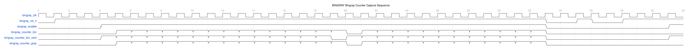
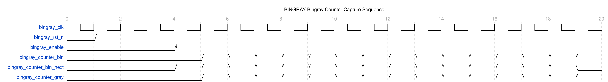
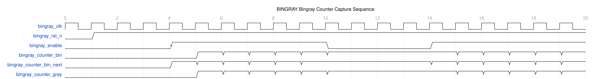
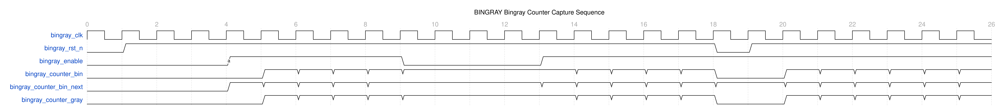

<!-- RTL Design Sherpa Documentation Header -->
<table>
<tr>
<td width="80">
  <a href="https://github.com/sean-galloway/RTLDesignSherpa">
    
  </a>
</td>
<td>
  <strong>RTL Design Sherpa</strong> · <em>Learning Hardware Design Through Practice</em><br>
  <sub>
    <a href="https://github.com/sean-galloway/RTLDesignSherpa">GitHub</a> ·
    <a href="https://github.com/sean-galloway/RTLDesignSherpa/blob/main/docs/DOCUMENTATION_INDEX.md">Documentation Index</a> ·
    <a href="https://github.com/sean-galloway/RTLDesignSherpa/blob/main/LICENSE">MIT License</a>
  </sub>
</td>
</tr>
</table>

---

<!-- End Header -->

# Binary-Gray counter (`counter_bingray.sv`)

## Overview

`counter_bingray` is a dual-output counter: you get the binary and the Gray
representation of the same count, registered in parallel. Asynchronous FIFOs
are the reason it exists -- the Gray value is what crosses the clock boundary
safely (one bit changes per increment, so metastability never gets a foothold),
while the binary value stays home for the arithmetic.

You'll also see it used for clock-domain-crossing counters, position encoder
interfaces, state machine counters that need glitch-free outputs, and memory
address generation in dual-port systems.

```systemverilog
module counter_bingray #(
    parameter int WIDTH = 4
) (
    input  logic             clk,
    input  logic             rst_n,
    input  logic             enable,
    output logic [WIDTH-1:0] counter_bin,
    output logic [WIDTH-1:0] counter_bin_next,
    output logic [WIDTH-1:0] counter_gray
);
```

## Parameters

| Parameter | Default | Description |
|-----------|---------|-------------|
| `WIDTH` | 4 | Bit width of both binary and Gray code outputs (`int`, any positive integer ≥ 1). Determines maximum count value (2^WIDTH - 1). |

: counter_bingray parameters

## Ports

| Port | Direction | Width | Description |
|------|-----------|-------|-------------|
| `clk` | input | 1 | System clock input |
| `rst_n` | input | 1 | Active-low asynchronous reset |
| `enable` | input | 1 | Counter enable control |
| `counter_bin` | output | WIDTH | Binary counter output (registered) |
| `counter_bin_next` | output | WIDTH | Next binary value (combinational) |
| `counter_gray` | output | WIDTH | Gray code output (registered) |

: counter_bingray ports

## Functional Description

Gray code (reflected binary code) guarantees adjacent values differ by exactly
one bit. That buys you:

1. **Metastability Prevention**: when crossing clock domains, only one bit
   changes at a time
2. **Glitch Elimination**: reduces intermediate states during transitions
3. **Asynchronous Safety**: safe for use in asynchronous circuits

The conversion is the standard one:

- **MSB**: `gray[WIDTH-1] = binary[WIDTH-1]`
- **Other bits**: `gray[i] = binary[i] ^ binary[i+1]` for i = 0 to WIDTH-2

### Gray code sequence (4-bit)

| Decimal | Binary | Gray | Changes |
|---------|--------|------|---------|
| 0 | 0000 | 0000 | - |
| 1 | 0001 | 0001 | bit 0 |
| 2 | 0010 | 0011 | bit 1 |
| 3 | 0011 | 0010 | bit 0 |
| 4 | 0100 | 0110 | bit 2 |
| 5 | 0101 | 0111 | bit 0 |
| 6 | 0110 | 0101 | bit 1 |
| 7 | 0111 | 0100 | bit 0 |
| 8 | 1000 | 1100 | bit 3 |
| 9 | 1001 | 1101 | bit 0 |
| 10 | 1010 | 1111 | bit 1 |
| 11 | 1011 | 1110 | bit 0 |
| 12 | 1100 | 1010 | bit 2 |
| 13 | 1101 | 1011 | bit 0 |
| 14 | 1110 | 1001 | bit 1 |
| 15 | 1111 | 1000 | bit 0 |

### Internal logic

```systemverilog
logic [WIDTH-1:0] w_counter_bin, w_counter_gray;

assign w_counter_bin = enable ? (counter_bin + 1) : counter_bin;
assign w_counter_gray = w_counter_bin ^ (w_counter_bin >> 1);
assign counter_bin_next = w_counter_bin;
```

The next binary value is a conditional increment; the Gray value is that next
binary value XORed with itself shifted right by one. Both registers update from
the same `always_ff`:

```systemverilog
always_ff @(posedge clk, negedge rst_n) begin
    if (!rst_n) begin
        counter_bin  <= 'b0;
        counter_gray <= 'b0;
    end else begin
        counter_bin  <= w_counter_bin;
        counter_gray <= w_counter_gray;
    end
end
```

Note what this buys you over a `bin2gray` plus a separate flop: the Gray output
is registered from the *next-state* value in the same process, so the encoding
transient never leaves the module.

## Timing

Three paths matter:

1. **Binary increment** -- standard binary addition timing
2. **Gray conversion** -- a single XOR level: `gray = bin ^ (bin >> 1)` gives
   every output bit one 2-input XOR, so the delay is constant in WIDTH. (The
   log(WIDTH) XOR depth belongs to the *decode* direction, `gray2bin`.)
3. **Combined path** -- increment + conversion in the same cycle

Clock-to-Q is the standard flip-flop delay, the combinational piece depends on
the adder and XOR depth, and your setup check has to absorb the longest of
them. Expect 200-400 MHz in a modern FPGA as-is; pipeline the Gray conversion
if you need more.

## Waveforms

**WaveDrom timing diagrams for the Binary-Gray counter are available.**

Four scenarios walk through the dual-output counter design:

### Scenario 1: Binary vs Gray Code Comparison



**WaveJSON:** [bingray_counter_binary_vs_gray.json](../assets/WAVES/counter_bingray/bingray_counter_binary_vs_gray.json)

Side-by-side comparison of both outputs:
- Binary: Normal sequential counting (0→1→2→3→...)
- Gray: Single-bit transitions between values
- Shows full cycle demonstrating encoding differences
- Illustrates why Gray code is CDC-safe

### Scenario 2: Single-Bit Transitions (CDC Safety) **KEY FEATURE**



**WaveJSON:** [bingray_counter_single_bit_transitions.json](../assets/WAVES/counter_bingray/bingray_counter_single_bit_transitions.json)

Gray code CDC safety property:
- Each Gray transition changes EXACTLY one bit
- Hamming distance = 1 between adjacent values
- **Critical for fifo_async CDC mechanism**
- Prevents metastability in clock domain crossing

### Scenario 3: Lookahead Signal (counter_bin_next)



**WaveJSON:** [bingray_counter_lookahead.json](../assets/WAVES/counter_bingray/bingray_counter_lookahead.json)

Combinational lookahead feature:
- Predicts next binary value one cycle ahead
- Useful for FIFO full/empty prediction
- Shows enable gating behavior
- Enables early decision-making

### Scenario 4: Enable and Reset Control



**WaveJSON:** [bingray_counter_enable_reset.json](../assets/WAVES/counter_bingray/bingray_counter_enable_reset.json)

Control signal behavior:
- Both outputs hold when enable=0
- Asynchronous reset to zero
- Clean state transitions
- Reset during counting demonstration

---

**To regenerate these waveforms:**
```bash
pytest val/cdc/test_counter_bingray_wavedrom.py -v
# Then convert JSON to PNG:
cd docs/markdown/assets/WAVES/counter_bingray
for f in *.json; do wavedrom-cli -i "$f" -p "${f%.json}.png"; done
```

**What Makes Binary-Gray Counters Special:**

The waveforms put the unique dual-output design on display:
- **Dual Encoding**: Binary for arithmetic, Gray for CDC safety
- **Single-Bit Transitions**: Gray code changes one bit at a time
- **Lookahead**: counter_bin_next provides one-cycle prediction
- **CDC-Safe**: Safe for asynchronous clock domain crossing

**Relationship to fifo_async:**

Binary-Gray counters are the foundation of the standard `fifo_async` module:
- **fifo_async** uses this counter for read/write pointers
- Gray outputs cross clock domains safely
- Binary outputs used for arithmetic (occupancy, address generation)
- Logarithmic width (`$clog2(DEPTH) + 1`) for resource efficiency

**Comparison Table:**

| Feature | BinGray Counter | Johnson Counter |
|---------|----------------|-----------------|
| **Output Width** | `$clog2(DEPTH) + 1` bits | `DEPTH` bits |
| **CDC Method** | Standard Gray code | Johnson code |
| **Depth Support** | Power-of-2 only | Any depth, odd included |
| **Resource Efficiency** | Logarithmic (better for large depths) | Linear |
| **Conversion** | XOR tree (simple) | Position detection (complex) |
| **Used In** | `fifo_async` USE_JOHNSON=0 | `fifo_async` USE_JOHNSON=1 |

**Comparison with Other Modules:**

- `test_counter_johnson_wavedrom.py` - Johnson counter (any depth, linear width)
- `test_fifo_async_wavedrom.py` - BinGray counter in action (async FIFO, power-of-2)

## Usage Example

### Asynchronous FIFO pointers

This is the canonical use -- one counter per domain:

```systemverilog
// Write domain counter
counter_bingray #(.WIDTH(ADDR_WIDTH+1)) wr_counter (
    .clk(wr_clk),
    .rst_n(wr_rst_n),
    .enable(wr_enable),
    .counter_bin(wr_bin),
    .counter_bin_next(wr_bin_next),
    .counter_gray(wr_gray)
);

// Read domain counter  
counter_bingray #(.WIDTH(ADDR_WIDTH+1)) rd_counter (
    .clk(rd_clk),
    .rst_n(rd_rst_n), 
    .enable(rd_enable),
    .counter_bin(rd_bin),
    .counter_bin_next(rd_bin_next),
    .counter_gray(rd_gray)
);
```

### Cross-domain synchronization

The Gray pointers cross; the binary ones don't:

```systemverilog
// Synchronize Gray code pointers across domains
logic [ADDR_WIDTH:0] wr_gray_sync, rd_gray_sync;

// Write domain: synchronize read Gray pointer
glitch_free_n_dff_arn #(
    .FLOP_COUNT(2),
    .WIDTH(ADDR_WIDTH+1)
) rd_sync (
    .clk  (wr_clk),
    .rst_n(wr_rst_n),
    .d    (rd_gray),
    .q    (rd_gray_sync)
);

// Read domain: synchronize write Gray pointer
glitch_free_n_dff_arn #(
    .FLOP_COUNT(2),
    .WIDTH(ADDR_WIDTH+1)
) wr_sync (
    .clk  (rd_clk),
    .rst_n(rd_rst_n),
    .d    (wr_gray),
    .q    (wr_gray_sync)
);
```

### FIFO status generation

```systemverilog
// FIFO empty: Gray pointers equal
assign fifo_empty = (rd_gray == wr_gray_sync);

// FIFO full: Binary addresses equal, MSBs different
//
// gray2bin is a MODULE, not a function -- instantiate it once and slice the
// output. It cannot be called inside an expression.
wire [ADDR_WIDTH:0] rd_bin_sync;

gray2bin #(.WIDTH(ADDR_WIDTH + 1)) u_rd_ptr_decode (
    .gray   (rd_gray_sync),
    .binary (rd_bin_sync)
);

wire [ADDR_WIDTH-1:0] wr_addr      = wr_bin[ADDR_WIDTH-1:0];
wire [ADDR_WIDTH-1:0] rd_addr_sync = rd_bin_sync[ADDR_WIDTH-1:0];
wire                  wr_msb       = wr_bin[ADDR_WIDTH];
wire                  rd_msb_sync  = rd_bin_sync[ADDR_WIDTH];

assign fifo_full = (wr_addr == rd_addr_sync) && (wr_msb != rd_msb_sync);
```

### Almost full/empty flags

```systemverilog
// Calculate occupancy using binary values. rd_bin_sync comes from the
// gray2bin INSTANCE above -- there is no gray2bin function to call.
wire [ADDR_WIDTH:0] occupancy = wr_bin - rd_bin_sync;

// Generate status flags
assign almost_full = (occupancy >= ALMOST_FULL_THRESH);
assign almost_empty = (occupancy <= ALMOST_EMPTY_THRESH);
```

If you ever need the decode as a function inside your own logic (rather than
the module), this is the shape:

```systemverilog
function automatic [WIDTH-1:0] gray2bin;
    input [WIDTH-1:0] gray;
    integer i;
    begin
        gray2bin[WIDTH-1] = gray[WIDTH-1];
        for (i = WIDTH-2; i >= 0; i--) begin
            gray2bin[i] = gray2bin[i+1] ^ gray[i];
        end
    end
endfunction
```

### Example: 8-bit asynchronous FIFO pointer

```systemverilog
parameter FIFO_DEPTH = 256;
parameter ADDR_WIDTH = $clog2(FIFO_DEPTH);
parameter PTR_WIDTH = ADDR_WIDTH + 1;  // Extra bit for full detection

counter_bingray #(
    .WIDTH(PTR_WIDTH)
) fifo_wr_ptr (
    .clk(wr_clk),
    .rst_n(async_rst_n),
    .enable(wr_enable && !fifo_full),
    .counter_bin(wr_ptr_bin),
    .counter_bin_next(wr_ptr_bin_next),
    .counter_gray(wr_ptr_gray)
);
```

### Example: clock domain crossing counter

```systemverilog
// Source domain
counter_bingray #(.WIDTH(8)) src_counter (
    .clk(src_clk),
    .rst_n(src_rst_n),
    .enable(src_enable),
    .counter_bin(src_bin),
    .counter_bin_next(),
    .counter_gray(src_gray)
);

// Destination domain receives synchronized Gray value
logic [7:0] dest_gray_sync;
glitch_free_n_dff_arn #(
    .FLOP_COUNT(2),
    .WIDTH(8)
) sync_inst (
    .clk  (dest_clk),
    .rst_n(dest_rst_n),
    .d    (src_gray),
    .q    (dest_gray_sync)
);
```

## Design Notes

Resource cost: 2×WIDTH flip-flops (binary and Gray registers are separate),
plus the increment logic and the single-level XOR for the Gray conversion. The
critical path runs through the binary increment and the Gray conversion in
series.

```systemverilog
// Optional: Pipeline Gray conversion for high speed
logic [WIDTH-1:0] counter_gray_pipe;
always_ff @(posedge clk) begin
    counter_gray_pipe <= w_counter_gray;
end
```

Mark the Gray register as an async-crossing register so the placer keeps the
sync chain tight:

```systemverilog
(* ASYNC_REG = "TRUE" *) logic [WIDTH-1:0] counter_gray; // Xilinx
// synthesis attribute ASYNC_REG of counter_gray is "TRUE"  // Altera/Intel
```

Dynamic power scales with switching activity; static is minimal. Gate the clock
with `enable` if the counter sits idle for long stretches.

### Common mistakes

1. **Metastability** -- the Gray value must go through a proper synchronizer in
   the destination domain; the encoding alone doesn't sample for you.
2. **Timing violations** -- pipeline the Gray conversion if the increment+XOR
   path doesn't close.
3. **Incorrect FIFO status** -- check the Gray-to-binary decode on the
   synchronized pointer before blaming the flags.
4. **Reset skew** -- use proper reset synchronization in each domain.

For debug: assert the Gray properties in simulation, capture real transitions
on a logic analyzer, run timing analysis on the crossing paths, and verify the
synchronizer stage count against your MTBF target.

## Related Modules

- **counter_johnson**: the non-power-of-2 alternative -- any depth, linear width
- **bin2gray** / **gray2bin**: the standalone converters, if you ever need the encode or decode alone
- **glitch_free_n_dff_arn**: the multi-flop synchronizer the Gray output crosses through
- **fifo_async** / **gaxi_fifo_async**: the modules this counter exists to serve

## Testing

### Test scenarios

1. **Sequential counting**: both outputs increment correctly
2. **Gray code properties**: single-bit changes between adjacent values
3. **Reset behavior**: both outputs reset to zero
4. **Enable control**: hold behavior when disabled
5. **Rollover**: clean wrap-around from maximum value

### Coverage

```systemverilog
covergroup counter_bingray_cg @(posedge clk);
    cp_binary: coverpoint counter_bin {
        bins all_values[] = {[0:2**WIDTH-1]};
    }
    
    cp_gray: coverpoint counter_gray {
        bins all_values[] = {[0:2**WIDTH-1]};
    }
    
    cp_enable: coverpoint enable {
        bins enabled = {1};
        bins disabled = {0};
    }
    
    cp_transitions: coverpoint counter_bin {
        bins transitions[] = ([0:2**WIDTH-2] => [1:2**WIDTH-1]);
        bins rollover = (2**WIDTH-1 => 0);
    }
endgroup
```

### Assertions

```systemverilog
// Verify Gray code has single bit changes
property gray_single_bit_change;
    @(posedge clk) disable iff (!rst_n)
    enable && !$isunknown(counter_gray) |->
    $countones(counter_gray ^ $past(counter_gray)) <= 1;
endproperty

assert property (gray_single_bit_change);

// Verify binary and Gray relationship
property bin_gray_relationship;
    @(posedge clk) disable iff (!rst_n)
    counter_gray == (counter_bin ^ (counter_bin >> 1));
endproperty

assert property (bin_gray_relationship);
```

### Test files

- `val/cdc/test_counter_bingray.py` -- full functional verification
- `val/cdc/test_counter_bingray_wavedrom.py` -- WaveDrom timing diagrams 

```bash
# Full functional test (basic/medium/full levels)
pytest val/cdc/test_counter_bingray.py -v

# WaveDrom waveform generation
pytest val/cdc/test_counter_bingray_wavedrom.py -v
```

## Navigation

- [← Back to CDC Index](index.md)
- [← Back to Main Documentation Index](../index.md)
