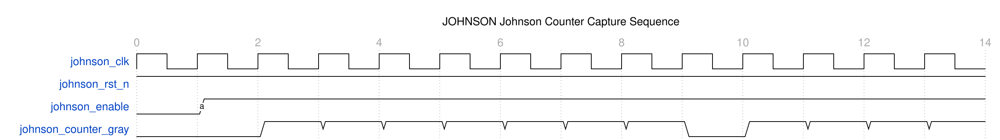
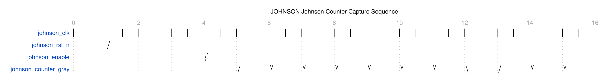
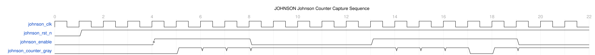
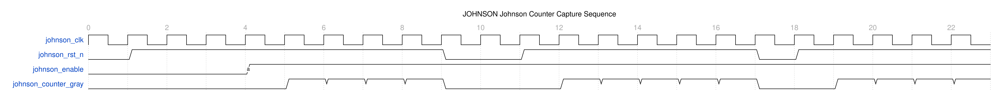

<!-- RTL Design Sherpa Documentation Header -->
<table>
<tr>
<td width="80">
  <a href="https://github.com/sean-galloway/RTLDesignSherpa">
    
  </a>
</td>
<td>
  <strong>RTL Design Sherpa</strong> · <em>Learning Hardware Design Through Practice</em><br>
  <sub>
    <a href="https://github.com/sean-galloway/RTLDesignSherpa">GitHub</a> ·
    <a href="https://github.com/sean-galloway/RTLDesignSherpa/blob/main/docs/DOCUMENTATION_INDEX.md">Documentation Index</a> ·
    <a href="https://github.com/sean-galloway/RTLDesignSherpa/blob/main/LICENSE">MIT License</a>
  </sub>
</td>
</tr>
</table>

---

<!-- End Header -->

# Johnson counter (`counter_johnson.sv`)

## Overview

`counter_johnson` implements a Johnson counter -- also called a twisted-ring
counter or a switch-tail counter. It's a shift register with a twist: the
inverted output of the last stage feeds back into the first, which gives you a
sequence with 2×WIDTH unique states. You'll see these generating multi-phase
clock signals, driving state machine control, and running sequential timing
applications -- and, in this library, serving as the non-power-of-2 FIFO pointer
behind `USE_JOHNSON=1`.

```systemverilog
module counter_johnson #(
    parameter int WIDTH = 4
) (
    input  logic                clk,
    input  logic                rst_n,
    input  logic                enable,
    output logic [WIDTH - 1:0]  counter_gray
);
```

## Parameters

| Parameter | Default | Description |
|-----------|---------|-------------|
| `WIDTH` | 4 | Number of stages in the Johnson counter (`int`, `>= 2`). Generates 2×WIDTH unique states; determines sequence length and number of output phases. |

: counter_johnson parameters

The `>= 2` bound is real, not a style preference. The shift expression is
`counter_gray <= {counter_gray[WIDTH-2:0], ~counter_gray[WIDTH-1]}`, whose
`[WIDTH-2:0]` part-select is reversed at `WIDTH=1` and fails elaboration.
A 1-stage Johnson counter has no use anyway.

## Ports

| Port | Direction | Width | Description |
|------|-----------|-------|-------------|
| `clk` | input | 1 | System clock input |
| `rst_n` | input | 1 | Active-low asynchronous reset |
| `enable` | input | 1 | Counter enable control |
| `counter_gray` | output | WIDTH | Johnson counter output register |

: counter_johnson ports

## Functional Description

A Johnson counter is a shift register with inverted feedback:

- **Normal operation**: bits shift left (or right) each clock cycle
- **Feedback**: the complement of the MSB feeds back to the LSB
- **Sequence length**: 2×WIDTH states before repeating

Mathematically, for a WIDTH-bit counter:

```
Next_State[i] = Current_State[i-1]  for i = 1 to WIDTH-1
Next_State[0] = ~Current_State[WIDTH-1]
```

And here is the entire implementation:

```systemverilog
always_ff @(posedge clk or negedge rst_n) begin
    if (!rst_n) 
        counter_gray <= {WIDTH{1'b0}};  // Reset to all zeros
    else if (enable) begin
        counter_gray <= {counter_gray[WIDTH-2:0], ~counter_gray[WIDTH-1]};
    end
end
```

Four lines of actual logic: shift the low bits up, feed the inverted MSB into
the LSB, hold when `enable` is low, clear on reset.

### State sequences

#### 4-bit Johnson Counter (WIDTH=4)
| Step | counter_gray | Decimal | Description |
|------|--------------|---------|-------------|
| 0 | 0000 | 0 | Reset state |
| 1 | 0001 | 1 | First '1' enters |
| 2 | 0011 | 3 | '1' propagates |
| 3 | 0111 | 7 | '1' propagates |
| 4 | 1111 | 15 | All '1's |
| 5 | 1110 | 14 | First '0' enters |
| 6 | 1100 | 12 | '0' propagates |
| 7 | 1000 | 8 | '0' propagates |
| 8 | 0000 | 0 | Back to start |

#### 3-bit Johnson Counter (WIDTH=3)
| Step | counter_gray | Binary Pattern |
|------|--------------|----------------|
| 0 | 000 | All zeros |
| 1 | 001 | One bit set |
| 2 | 011 | Two bits set |
| 3 | 111 | All ones |
| 4 | 110 | Two bits set |
| 5 | 100 | One bit set |
| 6 | 000 | Cycle repeats |

#### 2-bit Johnson Counter (WIDTH=2)
| Step | counter_gray | State Name |
|------|--------------|------------|
| 0 | 00 | State A |
| 1 | 01 | State B |
| 2 | 11 | State C |
| 3 | 10 | State D |
| 4 | 00 | Back to A |

### NOT self-starting -- reset is mandatory

This RTL is a bare twisted-ring shift register
(`counter_gray <= {counter_gray[WIDTH-2:0], ~counter_gray[WIDTH-1]}`) with **no
state-correction logic**, so it is **not** self-starting:

- **Valid states**: 2×WIDTH states in the normal sequence
- **Invalid states**: (2^WIDTH - 2×WIDTH) states not in sequence
- **Recovery**: **none.** The invalid states form their own closed cycle and
  never converge to the valid sequence. For WIDTH=4 the 8 invalid states cycle
  `0010→0101→1011→0110→1101→1010→0100→1001→0010` forever; for WIDTH=3 the pair
  `010↔101` is a parasitic 2-cycle. **You must guarantee a clean reset** -- after
  a glitch or SEU the counter can lock permanently into the parasitic cycle. If
  self-correction is required, add explicit decode/recovery logic (not present
  here).

### Symmetry

The sequence has inherent symmetry: the first half fills with '1's
(0→1→11→111...), the second half flushes them back out with '0's
(111→110→100→000...). Each bit effectively represents a different phase of the
cycle.

### Single-bit transitions -- but Johnson is not Gray

Johnson counter outputs share the one-bit-change property that makes Gray code
safe to synchronize -- consecutive states differ by exactly **one** bit,
including the wrap from the last state back to state 0 -- with predictable
progression and easy state decode. But they are **not** Gray code:

> **Johnson is not Gray code.** Johnson achieves single-bit transitions through
> sequential shift-register operation; Gray code achieves them through a
> mathematical encoding (`gray = bin ^ (bin >> 1)`). Consequences:
> - Johnson yields `2N` states from N bits; Gray yields `2**N`.
> - Johnson is safe only for a counter stepping through its own sequence. It
>   cannot encode an arbitrary value, and there is no closed-form binary
>   conversion -- decoding needs `johnson2bin`, which detects position.
> - Do not substitute one for the other in general-purpose CDC. For an
>   arbitrary binary value crossing domains, use Gray (`bin2gray`/`gray2bin`).

## Timing

The logic is minimal -- a shift register and an inverter -- so there are no
complex timing requirements. Typical maximum frequency is 400-600 MHz in modern
FPGAs, limited by the shift-register timing. For extreme speeds, pipeline:

```systemverilog
// For high-speed applications, consider pipeline stages
logic [WIDTH-1:0] johnson_pipe;
always_ff @(posedge clk) begin
    johnson_pipe <= {counter_gray[WIDTH-2:0], ~counter_gray[WIDTH-1]};
end
```

## Waveforms

**WaveDrom timing diagrams for the Johnson counter are available.**

Four scenarios demonstrate the unique properties of Johnson counters:

### Scenario 1: Walking Ones and Walking Zeros Pattern



**WaveJSON:** [johnson_counter_walking_pattern.json](../assets/WAVES/counter_johnson/johnson_counter_walking_pattern.json)

Complete 2×WIDTH state cycle (8 states for WIDTH=4):
- Walking ones: 0000 → 0001 → 0011 → 0111 → 1111
- Walking zeros: 1111 → 1110 → 1100 → 1000 → 0000
- Demonstrates predictable sequential progression

### Scenario 2: Single-Bit Transitions (CDC Safety) **KEY FEATURE**



**WaveJSON:** [johnson_counter_single_bit_transitions.json](../assets/WAVES/counter_johnson/johnson_counter_single_bit_transitions.json)

Each transition changes only ONE bit:
- CDC-safe like Gray codes
- **Critical for the fifo_async USE_JOHNSON=1 CDC mechanism**
- Prevents metastability in clock domain crossing
- Hamming distance = 1 between all adjacent states

### Scenario 3: Enable Control



**WaveJSON:** [johnson_counter_enable_control.json](../assets/WAVES/counter_johnson/johnson_counter_enable_control.json)

Enable control and state holding:
- Counter advances when enable=1
- Counter holds state when enable=0
- Clean enable/disable transitions
- Demonstrates conditional counting

### Scenario 4: Reset Behavior



**WaveJSON:** [johnson_counter_reset_behavior.json](../assets/WAVES/counter_johnson/johnson_counter_reset_behavior.json)

Reset and initialization:
- Asynchronous reset to all zeros (0000)
- Immediate reset effect
- Clean restart from reset state
- Reset during counting operation

---

**To regenerate these waveforms:**
```bash
pytest val/cdc/test_counter_johnson_wavedrom.py -v
# Then convert JSON to PNG:
cd docs/markdown/assets/WAVES/counter_johnson
for f in *.json; do wavedrom-cli -i "$f" -p "${f%.json}.png"; done
```

**What Makes Johnson Counters Special:**

The waveforms highlight the unique properties that make Johnson counters useful:
- **Single-Bit Transitions**: Only one bit changes per state, making them CDC-safe
- **2×WIDTH States**: More efficient than one-hot (N states with N/2 flip-flops)
- **Walking Pattern**: Natural "fill then empty" sequence useful for visual effects
- **Reset-dependent**: NOT self-starting -- a valid state is only guaranteed by reset

**Relationship to fifo_async (USE_JOHNSON=1):**

Johnson counters are the foundation of the `fifo_async` `USE_JOHNSON=1` CDC mechanism:
- **fifo_async with USE_JOHNSON=1** uses Johnson counters for pointer synchronization
- Single-bit transitions enable safe clock domain crossing
- Linear width scaling (DEPTH bits) allows any depth, odd included

**Comparison with Other Counters:**

- `test_counter_bingray_wavedrom.py` - Binary-Gray counter (power-of-2 depths, logarithmic width)
- `test_fifo_async_wavedrom.py` - Gray code in action (async FIFO)

## Usage Example

### Example 1: 4-phase clock generator

```systemverilog
counter_johnson #(
    .WIDTH(4)
) phase_gen (
    .clk(master_clk),
    .rst_n(rst_n),
    .enable(1'b1),
    .counter_gray(phases)
);

// Decode individual phases
assign phase_0 = (phases == 4'b0001);  // Step 1
assign phase_1 = (phases == 4'b0011);  // Step 2  
assign phase_2 = (phases == 4'b0111);  // Step 3
assign phase_3 = (phases == 4'b1111);  // Step 4
```

### Example 2: LED chaser

```systemverilog
counter_johnson #(
    .WIDTH(8)
) led_chaser (
    .clk(slow_clk),        // ~1Hz clock
    .rst_n(rst_n),
    .enable(chase_enable),
    .counter_gray(led_pattern)
);

// LEDs show walking pattern
assign leds[7:0] = led_pattern;
```

### Example 3: state machine controller

```systemverilog
counter_johnson #(
    .WIDTH(3)
) state_ctrl (
    .clk(clk),
    .rst_n(rst_n), 
    .enable(state_advance),
    .counter_gray(state_code)
);

// Decode states for control logic
always_comb begin
    case (state_code)
        3'b001: current_state = INIT;
        3'b011: current_state = LOAD;
        3'b111: current_state = PROCESS;
        3'b110: current_state = STORE;
        3'b100: current_state = CLEANUP;
        3'b000: current_state = IDLE;
        default: current_state = ERROR;
    endcase
end
```

### Example 4: quadrature signal generation

```systemverilog
// Generate quadrature encoder-like signals
counter_johnson #(
    .WIDTH(4)
) quad_gen (
    .clk(position_clk),
    .rst_n(rst_n),
    .enable(motor_moving),
    .counter_gray(quad_state)
);

// Extract A and B channels with 90° phase shift
assign quad_a = quad_state[0] ^ quad_state[1];
assign quad_b = quad_state[1] ^ quad_state[2];
```

### Multi-phase clock for pipeline stages

```systemverilog
// Multi-phase clock for pipeline stages
counter_johnson #(.WIDTH(4)) pipeline_phases (
    .clk(master_clk),
    .enable(pipeline_enable),
    .counter_gray(phase_vector)
);

// Generate phase-shifted clocks
assign clk_ph0 = master_clk & phase_vector[0];
assign clk_ph1 = master_clk & phase_vector[1];
assign clk_ph2 = master_clk & phase_vector[2];
assign clk_ph3 = master_clk & phase_vector[3];
```

### Sequential control (memory refresh)

```systemverilog
// Memory refresh controller
counter_johnson #(.WIDTH(3)) refresh_ctrl (
    .clk(clk),
    .enable(refresh_request),
    .counter_gray(refresh_phase)
);

// Control refresh operations
assign precharge = (refresh_phase == 3'b001);
assign activate  = (refresh_phase == 3'b011);
assign refresh   = (refresh_phase == 3'b111);
assign restore   = (refresh_phase == 3'b110);
```

### Pattern generation for BIST

```systemverilog
// Test pattern generator
counter_johnson #(.WIDTH(8)) pattern_gen (
    .clk(test_clk),
    .enable(pattern_enable), 
    .counter_gray(test_pattern)
);

// Use for built-in self-test (BIST)
assign test_data = test_pattern;
```

## Design Notes

**What it does well.** The logic is minimal -- a shift register and an
inverter -- so states can be used directly with no decode logic and no complex
timing requirements. It runs fast (400-600 MHz typical in modern FPGAs, limited
by the shift-register timing), it's power-friendly because only one bit changes
per cycle, and the progression is completely predictable. Any width works,
every bit gives you a different phase, and the parameterization is trivial.

**What it costs.** Count efficiency: 2×WIDTH states versus 2^WIDTH for a binary
counter of the same flops. The progression is a fixed sequence -- no random
access, you step through it. Decoding specific states takes comparators, the
output isn't binary-compatible without `johnson2bin`, and you need care to
avoid state conflicts when overlapping decoded phases. And the big one, from
the theory section: it is **not** self-starting, so a clean reset is a hard
requirement and glitch-free operation is only guaranteed inside the valid
sequence.

**Synthesis.** Resources: WIDTH flip-flops, almost no LUTs (shift and invert
only), and simple routing between adjacent stages. Keep the tool from
swallowing the register into an SRL -- the feedback path needs real flops:

```systemverilog
(* SHREG_EXTRACT = "NO" *) logic [WIDTH-1:0] counter_gray; // Prevent SRL inference
```

Dynamic power is low -- one bit changes per cycle -- and `enable` gives you
free clock gating.

## Related Modules

- `counter_ring`: different shift register pattern
- `counter_bingray`: binary and Gray code counter
- `counter`: simple binary counter
- Standard shift register implementations

## Testing

### Functional tests

1. **Sequence verification**: check the complete 2×WIDTH state cycle
2. **Reset behavior**: verify initialization to all zeros
3. **Enable control**: hold behavior when disabled
4. **Invalid-state containment**: force an invalid state and confirm it stays
   trapped in the parasitic cycle (this counter does NOT auto-recover), so the
   design's reset strategy is the only guarantee of a valid state

### Coverage

```systemverilog
covergroup johnson_cg @(posedge clk);
    cp_states: coverpoint counter_gray {
        // Valid Johnson counter states for WIDTH=4
        bins valid_states[] = {4'b0000, 4'b0001, 4'b0011, 4'b0111,
                              4'b1111, 4'b1110, 4'b1100, 4'b1000};
        bins invalid_states[] = default;
    }
    
    cp_transitions: coverpoint counter_gray {
        bins valid_trans[] = (4'b0000 => 4'b0001),
                            (4'b0001 => 4'b0011),
                            (4'b0011 => 4'b0111),
                            (4'b0111 => 4'b1111),
                            (4'b1111 => 4'b1110),
                            (4'b1110 => 4'b1100),
                            (4'b1100 => 4'b1000),
                            (4'b1000 => 4'b0000);
    }
    
    cp_enable: coverpoint enable {
        bins enabled = {1};
        bins disabled = {0};
    }
endgroup
```

### Assertions

```systemverilog
// Verify valid state progression
property johnson_sequence;
    @(posedge clk) disable iff (!rst_n)
    enable && (counter_gray == 4'b0000) |=> 
    counter_gray == 4'b0001;
endproperty

assert property (johnson_sequence);

// Check for invalid states
property no_invalid_states;
    @(posedge clk) disable iff (!rst_n)
    counter_gray inside {4'b0000, 4'b0001, 4'b0011, 4'b0111,
                        4'b1111, 4'b1110, 4'b1100, 4'b1000};
endproperty

assert property (no_invalid_states);
```

### Test files

- `val/cdc/test_counter_johnson.py` -- full functional verification
- `val/cdc/test_counter_johnson_wavedrom.py` -- WaveDrom timing diagrams 

```bash
# Full functional test (basic/medium/full levels)
pytest val/cdc/test_counter_johnson.py -v

# WaveDrom waveform generation
pytest val/cdc/test_counter_johnson_wavedrom.py -v
```

## Navigation

- [← Back to CDC Index](index.md)
- [← Back to Main Documentation Index](../index.md)
