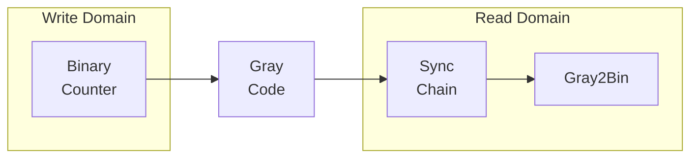

<!-- RTL Design Sherpa Documentation Header -->
<table>
<tr>
<td width="80">
  <a href="https://github.com/sean-galloway/RTLDesignSherpa">
    
  </a>
</td>
<td>
  <strong>RTL Design Sherpa</strong> · <em>Learning Hardware Design Through Practice</em><br>
  <sub>
    <a href="https://github.com/sean-galloway/RTLDesignSherpa">GitHub</a> ·
    <a href="https://github.com/sean-galloway/RTLDesignSherpa/blob/main/docs/DOCUMENTATION_INDEX.md">Documentation Index</a> ·
    <a href="https://github.com/sean-galloway/RTLDesignSherpa/blob/main/LICENSE">MIT License</a>
  </sub>
</td>
</tr>
</table>

---

<!-- End Header -->

# Asynchronous FIFO (`fifo_async.sv`)

## Overview

An asynchronous FIFO for crossing data safely between different clock domains.
**Restricted to power-of-2 depths only** -- that restriction comes from the Gray
code pointer implementation, and `USE_JOHNSON=1` is the supported way around
it.

## Parameters

| Parameter | Default | Description |
|-----------|---------|-------------|
| `MEM_STYLE` | — | Memory implementation (`FIFO_AUTO`/SRL/BRAM). The BRAM branch registers the read path (registered read even when `REGISTERED=0`). |
| `REGISTERED` | — | 0 = mux mode, 1 = flop mode for read output |
| `DATA_WIDTH` | 8 | Width of data |
| `DEPTH` | 16 | FIFO depth. Power-of-2 with the default binary Gray pointers; set **`USE_JOHNSON=1`** for **non-power-of-2** depths (Johnson-coded pointers via `counter_johnson`/`johnson2bin`). |
| `USE_JOHNSON` | 0 | 0 = Gray pointers (power-of-2 depth), 1 = Johnson pointers (arbitrary depth). This is the supported route to non-power-of-2 depth (the old `fifo_async_div2` module was retired). |
| `N_FLOP_CROSS` | 2 | Number of synchronizer stages |
| `ALMOST_WR_MARGIN` | 1 | Almost full threshold |
| `ALMOST_RD_MARGIN` | 1 | Almost empty threshold |

: fifo_async parameters

## Ports

| Port | Direction | Width | Description |
|------|-----------|-------|-------------|
| `wr_clk` | input | 1 | Write domain clock |
| `wr_rst_n` | input | 1 | Write domain active-low reset |
| `write` | input | 1 | Write enable signal |
| `wr_data` | input | DATA_WIDTH | Data to write |
| `wr_full` | output | 1 | Write domain full flag |
| `wr_almost_full` | output | 1 | Write domain almost full flag |
| `rd_clk` | input | 1 | Read domain clock |
| `rd_rst_n` | input | 1 | Read domain active-low reset |
| `read` | input | 1 | Read enable signal |
| `rd_data` | output | DATA_WIDTH | Data read from FIFO |
| `rd_empty` | output | 1 | Read domain empty flag |
| `rd_almost_empty` | output | 1 | Read domain almost empty flag |

: fifo_async ports

## Functional Description

### Clock domain crossing strategy

The FIFO uses **Gray code pointers** for safe clock domain crossing:



### Core components

1. **Binary-Gray counters** (`counter_bingray`) for pointer generation
2. **Multi-stage synchronizers** (`glitch_free_n_dff_arn`) for CDC
3. **Gray-to-binary converters** (`gray2bin`) for pointer comparison
4. **Shared memory array** accessible from both domains
5. **FIFO control logic** for status flag generation

### Gray code pointer system

Gray codes ensure **only one bit changes** per increment:

- **Binary**: 011 → 100 (3 bits change simultaneously)
- **Gray**: 010 → 110 (only 1 bit changes)
- **Benefit**: eliminates metastability from multi-bit transitions

```systemverilog
// Write domain Gray counter
counter_bingray #(.WIDTH(AW + 1)) wr_ptr_counter_gray (
    .clk(wr_clk),
    .rst_n(wr_rst_n),
    .enable(write && !wr_full),
    .counter_bin(r_wr_ptr_bin),          // Binary for addressing
    .counter_bin_next(w_wr_ptr_bin_next), // Next binary value
    .counter_gray(r_wr_ptr_gray)         // Gray for CDC
);
```

Pointer width: `AW = $clog2(DEPTH)` address bits, plus one extra bit for wrap
detection -- so DEPTH=16 gives AW=4 and a 5-bit pointer.

### Clock domain crossing

```systemverilog
// Cross read pointer to write domain
glitch_free_n_dff_arn #(
    .FLOP_COUNT(N_FLOP_CROSS),
    .WIDTH(AW + 1)
) rd_ptr_gray_cross_inst (
    .q(r_wdom_rd_ptr_gray),    // Synchronized output
    .d(r_rd_ptr_gray),         // Gray pointer input
    .clk(wr_clk),              // Destination clock
    .rst_n(wr_rst_n)           // Destination reset
);
```

The default is 2 flip-flops per crossing (`N_FLOP_CROSS=2`). Each additional
stage improves MTBF at the cost of latency -- the classic trade.

### Memory organization

```systemverilog
logic [DW-1:0] mem[DEPTH];  // Memory array -- sized by DEPTH, not by
                           // 1<<AW: with USE_JOHNSON=1 and a
                           // non-power-of-2 DEPTH those differ

// Write port (write domain)
always_ff @(posedge wr_clk) begin
    if (write && !wr_full) begin  // !wr_full guard REQUIRED (prevents overwrite)
        mem[r_wr_addr] <= wr_data;
    end
end

// Read port (read domain) -- dual mode, like fifo_sync:
if (REGISTERED != 0) begin : g_flop
    always_ff ... r_rd_data <= mem[r_rd_addr];
    assign rd_data = r_rd_data;
end else begin : g_mux
    assign rd_data = mem[r_rd_addr];
end
```

Addresses come from the binary pointers, truncated to the low bits:
`r_wr_addr = r_wr_ptr_bin[AW-1:0]` and `r_rd_addr = r_rd_ptr_bin[AW-1:0]`.

### Full/empty detection

```systemverilog
// In write domain (fifo_control): computed combinationally, REGISTERED out
assign w_wr_full_d = (w_wdom_ptr_xor &&
                     (wr_ptr_bin[AW-1:0] == wdom_rd_ptr_bin[AW-1:0]));

always_ff @(posedge wr_clk, negedge wr_rst_n) begin
    if (!wr_rst_n) wr_full <= 'b0;
    else           wr_full <= w_wr_full_d;
end

// Where:
assign w_wdom_ptr_xor = wr_ptr_bin[AW] ^ wdom_rd_ptr_bin[AW];
```

```systemverilog
// In read domain: same shape, and rd_empty RESETS TO 1 (empty out of reset)
assign w_rd_empty_d = (!w_rdom_ptr_xor_for_empty &&
                      (rd_ptr_bin[AW:0] == w_wr_ptr_for_empty[AW:0]));

always_ff @(posedge rd_clk, negedge rd_rst_n) begin
    if (!rd_rst_n) rd_empty <= 'b1;
    else           rd_empty <= w_rd_empty_d;
end
```

Both flags are registered, so each lags its pointer comparison by one cycle of
its own clock -- conservative in the safe direction (a write that just made the
FIFO non-empty shows up at the reader one `rd_clk` later).

The algorithm in words: **full** is MSBs differ AND LSBs equal (the write
pointer has wrapped and caught the read pointer); **empty** is all bits equal
(pointers at the same location). The MSB is the wrap bit -- it records which
pointer has lapped.

### The power-of-2 requirement

Why power-of-2 only, with Gray pointers:

1. **Gray code properties**: natural binary-Gray relationship
2. **Wraparound behavior**: clean modulo-2^n arithmetic
3. **Address truncation**: simple bit slicing for memory addressing
4. **Pointer comparison**: efficient full/empty detection

```systemverilog
// Valid depths: 2, 4, 8, 16, 32, 64, 128, 256, ...
// Invalid depths: 3, 5, 6, 7, 9, 10, 12, 15, ...
```

## Timing

- **Pointer propagation**: 2-3 clock cycles (depending on `N_FLOP_CROSS`)
- **Status flag delay**: flags reflect state with synchronizer latency
- **Conservative design**: prevents overflow/underflow despite the delay

Metastability protection comes from the usual pair: Gray code transitions
(single bit changes only) and multi-stage synchronization, which reduces
metastability failure probability exponentially (raises MTBF). Proper timing
constraints on the crossing paths are essential -- see the SDC section of the
[CDC reference](cdc.md).

Throughput and latency at a glance:

- **Throughput**: up to 1 operation per clock per domain
- **Latency**: 0-1 cycles (depending on REGISTERED mode)
- **CDC latency**: 2-3 cycles for status propagation
- **Efficiency**: ~100% utilization possible

## Waveforms

**WaveDrom timing diagrams of the Gray code CDC mechanism are available.**

Run the WaveDrom test to generate detailed timing diagrams:

```bash
# Generate Gray code waveforms (standard async FIFO implementation)
pytest val/cdc/test_fifo_async_wavedrom.py -v
```

**Waveform Scenarios Generated:**

1. **Write-Fill-Read-Empty Cycle**
   - Standard async FIFO operation
   - Gray code pointer progression
   - Power-of-2 depth utilization

2. **Gray Code Synchronization**
   - Efficient Gray code CDC
   - Logarithmic pointer width (vs. linear for Johnson)
   - Cross-domain pointer transitions

3. **Power-of-2 Depth Utilization**
   - Efficient addressing with power-of-2 depths
   - Full depth wraparound behavior
   - Resource-efficient pointer management

**Key Differences from Johnson Counter Variant:**

- **Pointer Width**: Logarithmic (`$clog2(DEPTH) + 1`) vs. linear (`DEPTH`) for Johnson
- **Depth Restriction**: Power-of-2 only vs. **any** depth for Johnson -- odd
  depths included. The elaboration check only fires for `USE_JOHNSON == 0`
  (`if ((USE_JOHNSON == 0) && ((DEPTH & (DEPTH - 1)) != 0)) $error(...)`), so
  Johnson mode has no restriction at all. ("Even only" is stale language from
  the retired `fifo_async_div2`.)
- **Resource Efficiency**: Better for large depths (>32) vs. Johnson's flexibility for small depths

**Comparison Tests:**

- `test_fifo_sync_wavedrom.py` - Synchronous FIFO (single clock, no CDC)

## Usage Example

Typical applications:

- **Video processing**: different pixel and memory clock domains
- **Networking**: packet buffers between different rate domains
- **Audio systems**: sample rate conversion buffers
- **Microprocessor interfaces**: CPU and peripheral clock domains

When to use what:

- **Async FIFO** when the clock domains are truly independent
- **Sync FIFO** when a single clock domain is sufficient
- **Non-power-of-2 depth**: use `fifo_async #(.USE_JOHNSON(1))` -- the
  standalone `fifo_async_div2` module was retired

## Design Notes

### Depth sizing

```systemverilog
// Calculate minimum depth for burst handling
// DEPTH ≥ burst_size + synchronizer_latency + margin
parameter int MIN_DEPTH = 16;  // Typical minimum for async FIFOs
```

### Clock relationship

- **Asynchronous clocks**: no phase relationship assumed
- **Clock gating**: avoid gating clocks used by the FIFO
- **Reset deassertion**: ensure proper reset release sequencing

### Almost full/empty settings

- **Almost full**: `DEPTH - ALMOST_WR_MARGIN`
- **Almost empty**: `ALMOST_RD_MARGIN`
- **Guideline**: set margins > synchronizer latency

### Error checking

The current RTL has **no** runtime `$display` overflow/underflow checks. The
`!wr_full` write guard is the only overflow protection. The one
elaboration-time check that does exist is an `$error` for a non-power-of-2
`DEPTH` when Gray pointers are selected (`USE_JOHNSON=0`). Add assertions in
your testbench if you need overflow telemetry.

## Related Modules

- **USE_JOHNSON=1**: for non-power-of-2 depths, using Johnson counters (replaces the retired fifo_async_div2)
- **fifo_sync**: for single clock domain applications
- **counter_bingray**: binary-Gray counter implementation
- **glitch_free_n_dff_arn**: multi-stage synchronizer

## Testing

- `val/cdc/test_fifo_buffer_async.py` -- full functional verification
- `val/cdc/test_fifo_async_wavedrom.py` -- WaveDrom timing diagrams

```bash
# Full functional test (basic/medium/full levels)
pytest val/cdc/test_fifo_buffer_async.py -v

# WaveDrom waveform generation
pytest val/cdc/test_fifo_async_wavedrom.py -v
```

## Navigation

- [← Back to CDC Index](index.md)
- [← Back to Main Documentation Index](../index.md)
