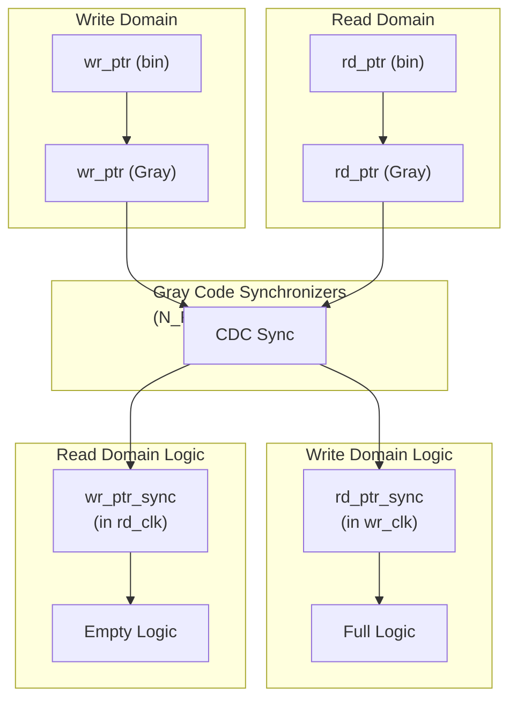

<!-- RTL Design Sherpa Documentation Header -->
<table>
<tr>
<td width="80">
  <a href="https://github.com/sean-galloway/RTLDesignSherpa">
    
  </a>
</td>
<td>
  <strong>RTL Design Sherpa</strong> · <em>Learning Hardware Design Through Practice</em><br>
  <sub>
    <a href="https://github.com/sean-galloway/RTLDesignSherpa">GitHub</a> ·
    <a href="https://github.com/sean-galloway/RTLDesignSherpa/blob/main/docs/DOCUMENTATION_INDEX.md">Documentation Index</a> ·
    <a href="https://github.com/sean-galloway/RTLDesignSherpa/blob/main/LICENSE">MIT License</a>
  </sub>
</td>
</tr>
</table>

---

<!-- End Header -->

# GAXI asynchronous FIFO (`gaxi_fifo_async.sv`)

## Overview

`gaxi_fifo_async` (in `rtl/cdc/`, production ready) moves GAXI data safely
between independent clock domains. Gray code pointers and multi-flop
synchronizers keep metastability out of the datapath and get your data across
intact.

What you get:

- **Clock domain crossing:** safe transfer between independent clocks
- **Gray code pointers:** no multi-bit synchronization hazards
- **Configurable CDC stages:** 2-4 flop synchronizers (3 recommended; 4 for ultra-critical systems)
- **Arbitrary clock ratios:** works with any write:read clock ratio
- **Two read modes:** mux or flop mode

## Module declaration

```systemverilog
module gaxi_fifo_async #(
    parameter fifo_mem_t MEM_STYLE        = FIFO_AUTO,  // FIFO_AUTO / FIFO_SRL / FIFO_BRAM
    parameter int        REGISTERED       = 0,          // 0 = mux mode, 1 = flop mode
    parameter int        DATA_WIDTH       = 8,
    parameter int        DEPTH            = 16,
    parameter int        USE_JOHNSON      = 0,          // 0 = Gray (power-of-2 depth), 1 = Johnson (any depth)
    parameter int        N_FLOP_CROSS     = 2,
    parameter int        ALMOST_WR_MARGIN = 1,
    parameter int        ALMOST_RD_MARGIN = 1
) (
    // Write Domain
    input  logic            axi_wr_aclk,
    input  logic            axi_wr_aresetn,
    input  logic            wr_valid,
    output logic            wr_ready,    // not full
    input  logic [DW-1:0]   wr_data,
    
    // Read Domain
    input  logic            axi_rd_aclk,
    input  logic            axi_rd_aresetn,
    input  logic            rd_ready,
    output logic            rd_valid,    // not empty
    output logic [DW-1:0]   rd_data
);
```

## Parameters

| Parameter | Default | Description |
|-----------|---------|-------------|
| `MEM_STYLE` | `FIFO_AUTO` | Memory implementation: `FIFO_AUTO` / `FIFO_SRL` / `FIFO_BRAM`. The BRAM branch registers the read path -- a registered read even when `REGISTERED=0` |
| `REGISTERED` | 0 | 0=mux mode, 1=flop mode (read path) |
| `DATA_WIDTH` | 8 | Data bus width |
| `DEPTH` | 16 | FIFO depth. Power of 2 with Gray pointers; **any** depth -- odd included -- with `USE_JOHNSON=1` |
| `USE_JOHNSON` | 0 | Pointer CDC encoding: 0 = Gray (`log2(DEPTH)+1` bits, power-of-2 depth only), 1 = Johnson (`DEPTH` bits, **any** depth -- odd included). An illegal combination fails at elaboration with an explicit `$error`. |
| `N_FLOP_CROSS` | 2 | Synchronizer stages (3 recommended for safety) |
| `ALMOST_WR_MARGIN` | 1 | Almost full threshold |
| `ALMOST_RD_MARGIN` | 1 | Almost empty threshold |

: gaxi_fifo_async parameters

**️ Important:** Set `N_FLOP_CROSS=3` for production designs to ensure metastability protection.

The RTL also declares five derived parameters after these -- `DW`, `D`, `AW`,
`JCW`, `N`. They are aliases (`DW = DATA_WIDTH`, `AW = $clog2(DEPTH)`,
`JCW = D`, `N = N_FLOP_CROSS`), not independent knobs. SystemVerilog lets you
override them, but doing so decouples a port width from the storage that backs
it: override `DW` alone and the ports widen while the memory stays narrow, and
the FIFO silently drops the upper bits of every entry. Set `DATA_WIDTH`, not
`DW`.

## Ports

| Port | Direction | Width | Description |
|------|-----------|-------|-------------|
| `axi_wr_aclk` | input | 1 | Write domain clock |
| `axi_wr_aresetn` | input | 1 | Write domain active-low reset |
| `wr_valid` | input | 1 | Write valid |
| `wr_ready` | output | 1 | Write ready (not full) |
| `wr_data` | input | DW | Write data |
| `axi_rd_aclk` | input | 1 | Read domain clock |
| `axi_rd_aresetn` | input | 1 | Read domain active-low reset |
| `rd_ready` | input | 1 | Read ready |
| `rd_valid` | output | 1 | Read valid (not empty) |
| `rd_data` | output | DW | Read data |

: gaxi_fifo_async ports

## Theory of operation

### Why Gray code?

Gray code ensures only one bit changes at a time during pointer updates:

```
Binary: 011 → 100  (3 bits change - hazard!)
Gray:   010 → 110  (1 bit changes - safe!)
```

This prevents glitches during synchronization across clock domains.

### Dependencies

- `counter_bin.sv` - Binary counters
- `counter_johnson.sv` - Johnson (twisted-ring) counters, used when `USE_JOHNSON=1`.
  Johnson code is NOT Gray code -- it is a distinct encoding that happens to share
  the single-bit-change property needed for CDC. Both change exactly one bit per
  increment, including the wrap.
- `glitch_free_n_dff_arn.sv` - Multi-flop synchronizers
- `johnson2bin.sv` - Johnson-to-binary conversion (**combinational**; its `clk`/`rst_n` ports are declared but unused), used when `USE_JOHNSON=1`
- `counter_bingray.sv` / `gray2bin.sv` - Gray pointer path (combinational decode), used when `USE_JOHNSON=0`
- `fifo_control.sv` - Full/empty flag generation

## Implementation



Each domain keeps its own binary pointer for arithmetic, converts it to Gray
for the crossing, and decodes the synchronized remote pointer for flag
generation.

## Design examples

### Example 1: basic CDC FIFO

```systemverilog
gaxi_fifo_async #(
    .DATA_WIDTH(32),
    .DEPTH(16),
    .N_FLOP_CROSS(3),      // 3-stage synchronizer
    .REGISTERED(0)
) u_cdc_fifo (
    // Write domain @ 100 MHz
    .axi_wr_aclk    (clk_100mhz),
    .axi_wr_aresetn (rst_100_n),
    .wr_valid       (domain_a_valid),
    .wr_ready       (domain_a_ready),
    .wr_data        (domain_a_data),
    
    // Read domain @ 50 MHz
    .axi_rd_aclk    (clk_50mhz),
    .axi_rd_aresetn (rst_50_n),
    .rd_ready       (domain_b_ready),
    .rd_valid       (domain_b_valid),
    .rd_data        (domain_b_data)
);
```

### Example 2: high-speed to low-speed CDC

```systemverilog
// Fast writer (250 MHz) → Slow reader (62.5 MHz)
// Needs deeper FIFO to handle burst traffic
gaxi_fifo_async #(
    .DATA_WIDTH(64),
    .DEPTH(32),           // Deeper for rate mismatch
    .N_FLOP_CROSS(3),
    .REGISTERED(1)        // Flop mode for timing
) u_rate_converter (
    .axi_wr_aclk    (clk_250mhz),
    .axi_wr_aresetn (rst_fast_n),
    .wr_valid       (fast_valid),
    .wr_ready       (fast_ready),
    .wr_data        (fast_data),
    
    .axi_rd_aclk    (clk_62p5mhz),
    .axi_rd_aresetn (rst_slow_n),
    .rd_ready       (slow_ready),
    .rd_valid       (slow_valid),
    .rd_data        (slow_data)
);
```

## Timing characteristics

| Clock Ratio (wr:rd) | Latency | Notes |
|---------------------|---------|-------|
| 1:1 (same freq) | 3-5 cycles | CDC synchronization overhead |
| 2:1 (fast→slow) | 4-6 cycles | Additional write-side delay |
| 1:2 (slow→fast) | 3-5 cycles | Read-side samples faster |
| Any ratio | 3-7 cycles | Depends on synchronizer stages + clock relationship |

: gaxi_fifo_async latency by clock ratio

**Latency formula:** `~(2 × N_FLOP_CROSS) + 1` in slower clock domain cycles.

## Design considerations

### Depth sizing for clock ratio

When write clock >> read clock, size the FIFO to handle burst accumulation:

```
Required Depth >= Burst Size x (1 - Read Freq / Write Freq) x Safety Margin

Example:
- Write: 100 MHz, Read: 25 MHz
- Burst: 16 transfers
- Safety: 1.5x
→ Depth >= 16 x (1 - 25/100) x 1.5 = 18 entries
```

### Reset synchronization

**Critical:** both clock domains must have properly synchronized resets!

```systemverilog
// Separate reset synchronizers for each domain
reset_sync u_wr_rst_sync (
    .clk(axi_wr_aclk),
    .rst_n(global_rst_n),
    .sync_rst_n(axi_wr_aresetn)
);

reset_sync u_rd_rst_sync (
    .clk(axi_rd_aclk),
    .rst_n(global_rst_n),
    .sync_rst_n(axi_rd_aresetn)
);
```

### Metastability protection

`N_FLOP_CROSS` sets the synchronizer depth, and MTBF rises steeply with it.

| Stages | Use Case |
|--------|----------|
| 2 | Short-term prototyping only |
| 3 | **Production standard** |
| 4 | Ultra-critical systems |

: Synchronizer stage guidance

This page deliberately gives no MTBF figures. Real MTBF depends on the flop's
metastability time constant and resolution window, the two clock frequencies and
the data toggle rate -- none of which a module page can know. A second table
here also drifted from the one in
[glitch_free_n_dff_arn](../rtl-cdc/glitch_free_n_dff_arn.md), which put
2 stages at "hours" where this page said "years". One source per fact: that page
owns the discussion.

**Recommendation:** always use `N_FLOP_CROSS=3` in production.

## Error checking

The RTL contains **no** assertions and no runtime `$display` checks. What is
there is a single empty read-domain block:

```systemverilog
always_ff @(posedge axi_rd_aclk) begin
    if (w_read && r_rd_empty) begin end   // empty -- reports nothing
end
```

There is no write-domain equivalent. Overflow is prevented structurally by the
`!wr_full` write guard rather than reported; underflow is not detected at all.
If you need overflow/underflow telemetry in simulation, add it in the testbench.
`fifo_async.md` states the same for its module.

## Common mistakes

### 1. Metastability

**Symptom:** random data corruption, simulation/hardware mismatch.

**Fix:** increase `N_FLOP_CROSS` to 3 or 4.

### 2. Pointer synchronization failure

**Symptom:** FIFO full/empty signals incorrect.

**Debug:**

1. Verify the clocks are truly independent (no PLL relationship violations)
2. Check reset synchronization — both domains must reset properly
3. Verify the Gray code conversion logic

### 3. Underflow/overflow

**Symptom:** data loss or corruption.

**Debug:**

1. Check `DEPTH` is sufficient for the clock ratio
2. Verify flow control is respected in both domains
3. Monitor pointer values in both domains

## Verification

```bash
# Async FIFO tests with various clock ratios
pytest val/cdc/test_gaxi_buffer_async.py -v

# Test specific clock ratio (wr:rd)
pytest val/cdc/test_gaxi_buffer_async.py -k "wr10_rd12" -v  # 10ns : 12ns
```

The test matrix covers:

- Same clocks (1:1)
- 1.2x ratio (10ns : 12ns)
- 2x ratio (10ns : 20ns)
- 2.5x ratio (8ns : 20ns)

## Related modules

- [gaxi_fifo_sync](../rtl-amba/gaxi/gaxi_fifo_sync.md) - Single clock domain version
- [gaxi_skid_buffer_async](gaxi_skid_buffer_async.md) - Async skid buffer
- [GAXI Index](index.md) - Overview

## References

- **Clifford Cummings:** "Simulation and Synthesis Techniques for Asynchronous FIFO Design" (Sunburst Design)
- **Source:** `rtl/cdc/gaxi_fifo_async.sv`
- **Tests:** `val/cdc/test_gaxi_buffer_async.py`

## Navigation

- **[← Back to CDC Index](index.md)**
- **[← Back to Main Documentation Index](../index.md)**

---

**Version:** 1.0
**Last Updated:** 2025-10-06
