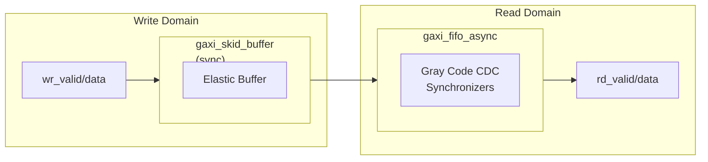

<!-- RTL Design Sherpa Documentation Header -->
<table>
<tr>
<td width="80">
  <a href="https://github.com/sean-galloway/RTLDesignSherpa">
    
  </a>
</td>
<td>
  <strong>RTL Design Sherpa</strong> · <em>Learning Hardware Design Through Practice</em><br>
  <sub>
    <a href="https://github.com/sean-galloway/RTLDesignSherpa">GitHub</a> ·
    <a href="https://github.com/sean-galloway/RTLDesignSherpa/blob/main/docs/DOCUMENTATION_INDEX.md">Documentation Index</a> ·
    <a href="https://github.com/sean-galloway/RTLDesignSherpa/blob/main/LICENSE">MIT License</a>
  </sub>
</td>
</tr>
</table>

---

<!-- End Header -->

# GAXI Asynchronous Skid Buffer

**Module:** `gaxi_skid_buffer_async.sv`
**Location:** `rtl/cdc/`
**Status:** ✅ Production Ready

---

## Overview

The GAXI asynchronous skid buffer is a wrapper: a synchronous skid buffer on the write side, an asynchronous FIFO behind it. You get the skid buffer's elastic buffering plus clock domain crossing in a single instantiation. Note that the skid buffer registers its handshake outputs -- there is no zero-latency bypass path; see Latency Components below.

### Key Features

- ✅ **CDC Capability:** Safe clock domain crossing
- ✅ **Elastic Buffering:** Combines skid buffer + async FIFO
- ✅ **Write-Side Buffering:** Skid buffer in write domain prevents stalls
- ✅ **Configurable CDC:** Adjustable synchronizer stages
- ✅ **Dual Clock Domains:** Independent write/read clocks

---

## Module Interface

```systemverilog
module gaxi_skid_buffer_async #(
    parameter fifo_mem_t MEM_STYLE   = FIFO_AUTO,  // FIFO_AUTO / FIFO_SRL / FIFO_BRAM
    parameter int        REGISTERED  = 0,          // 0 = mux mode, 1 = flop mode
    parameter int        DATA_WIDTH  = 32,
    parameter int        DEPTH       = 2,          // async FIFO depth
    parameter int        USE_JOHNSON = 0,          // 0 = Gray (power-of-2 depth), 1 = Johnson (any depth)
    parameter int        N_FLOP_CROSS = 2          // CDC synchronizer stages
) (
    // Write Domain
    input  logic          axi_wr_aclk,
    input  logic          axi_wr_aresetn,
    input  logic          wr_valid,
    output logic          wr_ready,
    input  logic [DW-1:0] wr_data,

    // Read Domain
    input  logic          axi_rd_aclk,
    input  logic          axi_rd_aresetn,
    output logic          rd_valid,
    input  logic          rd_ready,
    output logic [DW-1:0] rd_data
);
```

---

## Architecture



### Internal Components

1. **gaxi_skid_buffer (Write Domain):**
   - Provides elastic buffering
   - Prevents write-side stalls
   - Fixed depth (typically 2-4 entries)

2. **gaxi_fifo_async (CDC):**
   - Handles clock domain crossing
   - Configurable depth (DEPTH parameter)
   - Gray code pointer synchronization

---

## Parameters

| Parameter | Default | Description |
|-----------|---------|-------------|
| `MEM_STYLE` | `FIFO_AUTO` | Async FIFO storage: `FIFO_AUTO` / `FIFO_SRL` / `FIFO_BRAM` |
| `REGISTERED` | 0 | Async FIFO read mode (0=mux, 1=flop) |
| `DATA_WIDTH` | 32 | Data bus width |
| `DEPTH` | 2 | Async FIFO depth (CDC stage) |
| `USE_JOHNSON` | 0 | 0 = Gray pointers, power-of-2 `DEPTH` only; 1 = Johnson pointers, any `DEPTH` |
| `N_FLOP_CROSS` | 2 | Synchronizer stages (3 recommended) |

`USE_JOHNSON` reaches the async FIFO underneath and carries the same meaning it
has there: it selects the pointer encoding, and with it the legal `DEPTH` values.
Leave it at 0 and `DEPTH` must be a power of 2 or elaboration fails; set it to 1
and odd depths become legal at the cost of a wider pointer. See
[gaxi_fifo_async](gaxi_fifo_async.md) for the trade-off in full.

**Note:** the skid half's depth is NOT `DEPTH`. The wrapper instantiates
`gaxi_skid_buffer` with `DATA_WIDTH` only, so it takes that module's own default
of 2. `DEPTH` sizes the async FIFO behind it.

---

## Usage Examples

### Example 1: Basic Async Skid Buffer

```systemverilog
gaxi_skid_buffer_async #(
    .DATA_WIDTH(64),
    .DEPTH(4),            // Async FIFO depth
    .N_FLOP_CROSS(3),     // CDC stages
    .REGISTERED(0)
) u_async_skid (
    // Write domain @ 100 MHz
    .axi_wr_aclk    (clk_100),
    .axi_wr_aresetn (rst_100_n),
    .wr_valid       (src_valid),
    .wr_ready       (src_ready),
    .wr_data        (src_data),
    
    // Read domain @ 75 MHz
    .axi_rd_aclk    (clk_75),
    .axi_rd_aresetn (rst_75_n),
    .rd_valid       (dst_valid),
    .rd_ready       (dst_ready),
    .rd_data        (dst_data)
);
```

### Example 2: Pipeline Stage with CDC

```systemverilog
// Break long path AND cross clock domains
gaxi_skid_buffer_async #(
    .DATA_WIDTH(128),
    .DEPTH(8),            // Larger for rate buffering
    .N_FLOP_CROSS(3),
    .REGISTERED(1)        // Registered output for timing
) u_cdc_pipeline (
    .axi_wr_aclk    (source_clk),
    .axi_wr_aresetn (source_rst_n),
    .wr_valid       (stage_in_valid),
    .wr_ready       (stage_in_ready),
    .wr_data        (stage_in_data),
    
    .axi_rd_aclk    (dest_clk),
    .axi_rd_aresetn (dest_rst_n),
    .rd_valid       (stage_out_valid),
    .rd_ready       (stage_out_ready),
    .rd_data        (stage_out_data)
);
```

---

## Timing Characteristics

### Latency Components

| Component | Latency | Domain |
|-----------|---------|--------|
| Skid buffer (empty) | 1 cycle | Write |
| Skid buffer (buffered) | 1 cycle | Write |
| Async FIFO CDC | 3-5 cycles | Both |
| **Total (empty path)** | **4-6 cycles** | End-to-end |
| **Total (buffered)** | **4-6 cycles** | End-to-end |

`gaxi_skid_buffer` registers its handshake outputs, so even a write into an empty
buffer costs one write clock before `rd_valid` rises and the async FIFO can take
the data. There is no zero-latency bypass path.

### Throughput

- **Write Side:** 1 transfer/cycle (when not full)
- **Read Side:** 1 transfer/cycle (when not empty)
- **Sustained:** Limited by slower clock domain

---

## Design Considerations

### When to Use This Module

**Use async skid buffer when:**
- Need CDC between clock domains
- Want elastic buffering on write side
- Write-side needs low-latency response

**Use plain async FIFO instead when:**
- Only need CDC, no special write-side buffering
- Want deeper buffering (larger DEPTH)
- Don't need skid buffer complexity

### Depth Selection

Total buffering = Skid buffer entries + DEPTH

**Recommendations:**
- **DEPTH=4:** Minimal CDC buffering, light traffic
- **DEPTH=8:** Moderate buffering, balanced
- **DEPTH=16:** Heavy buffering, burst traffic

### Reset Synchronization

**Critical:** Both domains need synchronized resets!

```systemverilog
// Example reset synchronization
reset_sync #(.STAGES(3)) u_wr_sync (
    .clk(axi_wr_aclk),
    .async_rst_n(global_rst_n),
    .sync_rst_n(axi_wr_aresetn)
);

reset_sync #(.STAGES(3)) u_rd_sync (
    .clk(axi_rd_aclk),
    .async_rst_n(global_rst_n),
    .sync_rst_n(axi_rd_aresetn)
);
```

---

## Resource Utilization

Combines resources of both sub-modules:

| Component | Flops | LUTs |
|-----------|-------|------|
| Skid buffer (fixed, DEPTH=2) | 2×DW + ~4 | ~50 |
| Async FIFO (DEPTH=8) | 8×DW + ~40 | ~120 |
| **Total (DEPTH=8)** | **~10×DW + 44** | **~170** |

The skid row does not scale with `DEPTH`. The wrapper never overrides the skid
buffer's depth, so its storage is `r_data[2]` -- two words -- whatever `DEPTH`
you pass. Only the FIFO row moves.

---

## Testing

```bash
# Async skid buffer tests
pytest val/cdc/test_gaxi_buffer_async.py -k "skid" -v

# Test specific clock ratio
pytest val/cdc/test_gaxi_buffer_async.py -k "skid" -k "wr10_rd20" -v
```

---

## Common Issues

### Issue 1: CDC Violations

**Symptom:** Metastability, data corruption

**Solution:**
- Set `N_FLOP_CROSS=3` (minimum for production)
- Verify clocks are truly independent
- Check reset synchronization

### Issue 2: Write-Side Stalls

**Symptom:** `wr_ready` deasserts unexpectedly

**Debug:**
1. Check async FIFO depth (DEPTH parameter)
2. Verify read-side is consuming data
3. Monitor clock ratio - may need deeper FIFO

### Issue 3: Unexpected Latency

**Symptom:** Data takes longer than expected

**Explanation:**
- Total latency = skid buffer + async FIFO CDC
- Minimum ~3-5 cycles even when empty
- This is inherent to CDC design

---

## Related Modules

- [gaxi_skid_buffer](../rtl-amba/gaxi/gaxi_skid_buffer.md) - Synchronous version
- [gaxi_fifo_async](gaxi_fifo_async.md) - Async FIFO without skid buffer
- [GAXI Index](index.md) - Overview

---

## References

- **Source:** `rtl/cdc/gaxi_skid_buffer_async.sv`
- **Dependencies:**
  - `gaxi_skid_buffer.sv`
  - `gaxi_fifo_async.sv`
- **Tests:** `val/cdc/test_gaxi_buffer_async.py`

---

**Version:** 1.0
**Last Updated:** 2025-10-06
