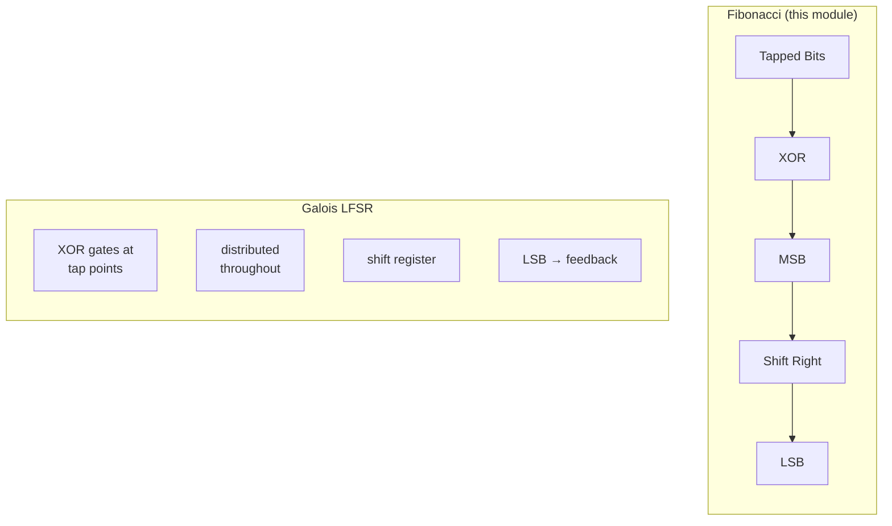

<!-- RTL Design Sherpa Documentation Header -->
<table>
<tr>
<td width="80">
  <a href="https://github.com/sean-galloway/RTLDesignSherpa">
    
  </a>
</td>
<td>
  <strong>RTL Design Sherpa</strong> · <em>Learning Hardware Design Through Practice</em><br>
  <sub>
    <a href="https://github.com/sean-galloway/RTLDesignSherpa">GitHub</a> ·
    <a href="https://github.com/sean-galloway/RTLDesignSherpa/blob/main/docs/DOCUMENTATION_INDEX.md">Documentation Index</a> ·
    <a href="https://github.com/sean-galloway/RTLDesignSherpa/blob/main/LICENSE">MIT License</a>
  </sub>
</td>
</tr>
</table>

---

<!-- End Header -->

# Fibonacci LFSR Module

## Purpose
The `shifter_lfsr_fibonacci` module is a Fibonacci Linear Feedback Shift Register — the textbook form, where all the feedback funnels into a single point at the most significant bit. It's the complement to the Galois LFSR, and the two come with genuinely different implementation trade-offs.

## Key Features
- Fibonacci (external XOR) LFSR architecture
- Configurable tap positions and polynomial
- Right-shift operation with feedback to MSB
- Seed loading and cycle detection
- Non-zero state enforcement
- Parameterizable width and tap configuration

## Port Description

### Parameters
- **WIDTH**: Width of the LFSR register (default: 8)
- **TAP_INDEX_WIDTH**: Width of each tap index (default: 12)
- **TAP_COUNT**: Number of feedback taps (default: 4)
- **TIW**: Shorthand for TAP_INDEX_WIDTH

### Inputs
| Port | Width | Description |
|------|-------|-------------|
| `clk` | 1 | System clock |
| `rst_n` | 1 | Active-low asynchronous reset |
| `enable` | 1 | Enable LFSR operation |
| `seed_load` | 1 | Load seed value into LFSR |
| `seed_data` | WIDTH | Seed value for LFSR initialization |
| `taps` | TAP_COUNT*TIW | Concatenated tap positions |

### Outputs
| Port | Width | Description |
|------|-------|-------------|
| `lfsr_out` | WIDTH | Current LFSR value |
| `lfsr_done` | 1 | High when LFSR returns to seed value |

## Fibonacci vs Galois LFSR Architecture

### Fibonacci LFSR Characteristics
- **Feedback Location**: Single XOR gate feeding MSB
- **Data Path**: Simple right-shift with external feedback
- **XOR Gate Count**: One multi-input XOR gate
- **Critical Path**: Through feedback XOR to MSB

### Implementation Comparison



## Implementation Details

### Tap Processing (Same as Standard LFSR)
```systemverilog
// Split concatenated tap positions
always_comb begin
    for (int i = 0; i < TAP_COUNT; i++) 
        w_tap_positions[i] = taps[i*TIW+:TIW];
end

// Convert to bit mask
always_comb begin
    w_taps = 'b0;
    for (int i = 0; i < TAP_COUNT; i++)
        if (w_tap_positions[i] > 0) 
            w_taps[w_tap_positions[i]-1'b1] = 1'b1;
end
```

### Fibonacci Feedback Calculation
```systemverilog
assign w_feedback = ^(r_lfsr & w_taps);
```
**Key Difference**: XOR (`^`) here, not the XNOR (`~^`) the standard LFSR module uses.

### Right-Shift with MSB Feedback
```systemverilog
always_ff @(posedge clk or negedge rst_n) begin
    if (~rst_n) begin
        r_lfsr <= 'b0;  // initialization to all 0's
    end else begin
        if (enable) begin
            if (seed_load) begin
                r_lfsr <= seed_data;  // Load seed
            end else if (|r_lfsr) begin // Only shift if we have non-zero value
                // Fibonacci LFSR: Shift right, feedback to MSB
                r_lfsr <= {w_feedback, r_lfsr[WIDTH-1:1]};
            end
        end
    end
end
```

## Special Implementation Notes

### 1. XOR vs XNOR Feedback
- **Fibonacci LFSR**: Uses XOR (`^`) for feedback calculation
- **Standard LFSR**: Uses XNOR (`~^`) for feedback calculation
- Both produce maximal-length sequences with appropriate polynomials

### 2. Non-Zero State Protection
```systemverilog
end else if (|r_lfsr) begin // Only shift if we have non-zero value
```
This guard stops the LFSR from shifting when it's sitting at all zeros — a state
it could never leave on its own. The sequence would lock at zero permanently.

### 3. Right-Shift Architecture
```systemverilog
r_lfsr <= {w_feedback, r_lfsr[WIDTH-1:1]};
```
- Feedback enters at MSB position
- Data shifts right (towards LSB)
- LSB data is discarded each cycle

### 4. Polynomial Compatibility
Your tap positions need to correspond to a primitive polynomial appropriate for
Fibonacci LFSR implementation. The polynomial form is:
```
P(x) = x^n + x^(tap1) + x^(tap2) + ... + x^(tapk) + 1
```

### 5. Reset to All Zeros
Unlike some LFSR implementations that reset to all ones, this module resets to
all zeros and relies on seed loading for proper initialization.

## Timing Example (4-bit Fibonacci LFSR)

### Configuration
- WIDTH = 4
- Polynomial: x⁴ + x³ + 1, which **this module encodes as taps `[4,1]`** — see
  the tap-direction note under "Polynomial Examples" below
- Seed: 4'b1001

### Sequence Generation

Tap position `p` selects bit `p-1`, feedback is the XOR of the tapped bits, and
the register shifts right with the feedback entering the MSB
(`{w_feedback, r_lfsr[WIDTH-1:1]}`):

```
Cycle | LFSR | Tap bits (4,1) | Feedback | Next LFSR
------|------|----------------|----------|----------
0     | 1001 | 1,1            | 1^1=0    | 0100
1     | 0100 | 0,0            | 0^0=0    | 0010
2     | 0010 | 0,0            | 0^0=0    | 0001
3     | 0001 | 0,1            | 0^1=1    | 1000
4     | 1000 | 1,0            | 1^0=1    | 1100
5     | 1100 | 1,0            | 1^0=1    | 1110
...
```

The sequence runs the full period of 15 and returns to the seed, at which point
`lfsr_done` asserts. Reset loads all zeros, and the `|r_lfsr` guard means the
register cannot leave zero on its own — a `seed_load` is required to start it.
Getting the taps wrong does not merely shorten the period: `[4,3]` on this
module walks to zero and freezes there.

## Comparison with Galois LFSR

### Advantages of Fibonacci LFSR
- **Simpler Data Path**: Only one shift register with external feedback
- **Easy to Understand**: Classical LFSR textbook implementation
- **Single XOR Gate**: All feedback logic concentrated in one location

### Disadvantages of Fibonacci LFSR  
- **Fan-out**: Feedback XOR gate may have high fan-out for many taps
- **Critical Path**: All tapped bits must route to single XOR gate
- **Timing**: May be slower than distributed Galois implementation

### When to Use Fibonacci LFSR
- **Educational Purposes**: Easier to understand and debug
- **Few Taps**: When polynomial has only 2-3 taps
- **Area Constraints**: When minimizing XOR gate count is critical
- **Legacy Compatibility**: When interfacing with existing Fibonacci LFSR systems

## Applications
- Pseudo-random sequence generation (identical to Galois LFSR output)
- CRC calculation (with appropriate polynomial)
- Data scrambling and encryption
- Test pattern generation
- Spread spectrum communications
- Error detection and correction

## Polynomial Examples for Fibonacci LFSR

> **The tap numbers below are specific to this module's shift direction.** The
> tap column published for Galois LFSRs -- and the table in the
> `shifter_lfsr.sv` header, which is XNOR feedback with a *left* shift -- encodes
> the same polynomials differently. Get it wrong and you don't merely shorten the
> sequence: the register walks itself to zero, where the `|r_lfsr` guard freezes
> it permanently. Measured on this RTL under Verilator: `WIDTH=4` with taps
> `[4,3]` locks at zero after **one** step, while `[4,1]` runs the full period
> of 15.

### Common Primitive Polynomials

| Width | Polynomial | Tap Positions | Period |
|-------|------------|---------------|---------|
| 3 | x³+x²+1 | [3,1] | 7 |
| 4 | x⁴+x³+1 | [4,1] | 15 |
| 5 | x⁵+x³+1 | [4,1] | 31 |
| 8 | x⁸+x⁶+x⁵+x⁴+1 | [7,6,5,1] | 255 |
| 16 | x¹⁶+x¹⁵+x¹³+x⁴+1 | [16,14,5,1] | 65535 |
| 24 | x²⁴+x²³+x²²+x¹⁷+1 | [24,23,18,1] | 16777215 |
| 32 | x³²+x²²+x²+x+1 | [23,3,2,1] | 4294967295 |

The polynomials themselves are the standard primitive set; only the tap
*encoding* differs from the published one. The full 168-width table in this
module's RTL header (`rtl/common/shifter_lfsr_fibonacci.sv`) is already
converted -- use it directly.

### Why the Encoding Differs

This module computes `fb = ^(lfsr & taps)` and shifts it into the MSB, so a tap
at position `t` contributes `x^(t-1)` and the characteristic polynomial is:

```
x^WIDTH + SUM over taps of x^(tap-1)
```

For a published polynomial `x^n + x^a + x^b + 1`, the taps here are
`[a+1, b+1, 1]`. Two consequences worth remembering:

- **Tap 1 is always present** -- it supplies the constant term. A tap set
  without it cannot be maximal, and typically locks at zero.
- **`n` itself is not a tap** -- the register width supplies the leading term.

To convert any row of the standard table: drop the leading `n`, add 1 to every
remaining number, then append `1`.

### Usage Note

The same polynomial works for both Fibonacci and Galois LFSRs, and both produce
maximal-length sequences of the same period -- but the *tap numbers you pass in*
differ, and the state orderings differ. `shifter_lfsr_galois.sv` takes the
exponents directly (`[n, a, b]`); this module takes `[a+1, b+1, 1]`.

## Navigation

- **[← Back to rtl-common Index](index.md)**
- **[← Back to Main Documentation Index](../index.md)**
