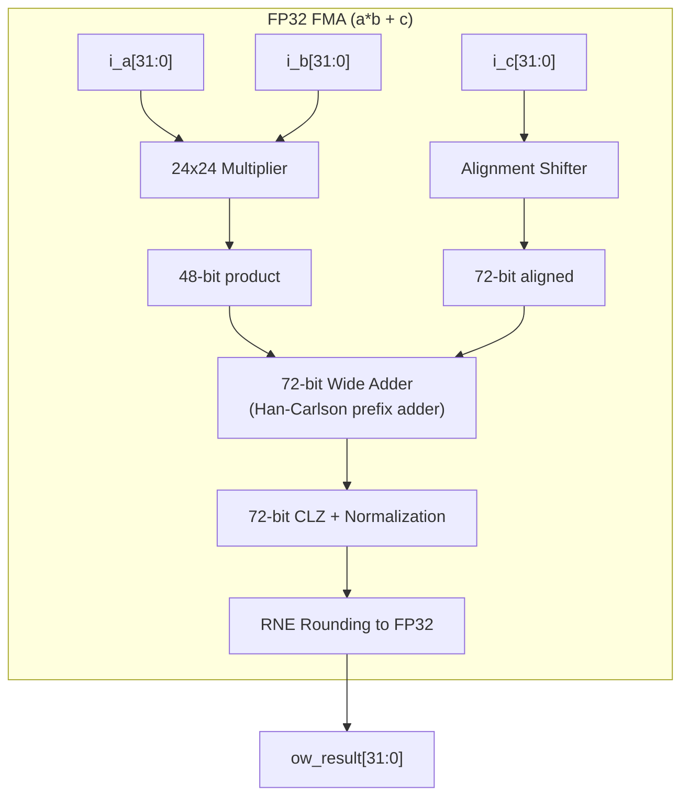

<!-- RTL Design Sherpa Documentation Header -->
<table>
<tr>
<td width="80">
  <a href="https://github.com/sean-galloway/RTLDesignSherpa">
    
  </a>
</td>
<td>
  <strong>RTL Design Sherpa</strong> · <em>Learning Hardware Design Through Practice</em><br>
  <sub>
    <a href="https://github.com/sean-galloway/RTLDesignSherpa">GitHub</a> ·
    <a href="https://github.com/sean-galloway/RTLDesignSherpa/blob/main/docs/DOCUMENTATION_INDEX.md">Documentation Index</a> ·
    <a href="https://github.com/sean-galloway/RTLDesignSherpa/blob/main/LICENSE">MIT License</a>
  </sub>
</td>
</tr>
</table>

---

<!-- End Header -->

# IEEE 754-2008 Compliant Modules

IEEE 754-2008 floating-point arithmetic modules for FP16 and FP32 formats.

## Overview

These modules implement IEEE 754-2008 arithmetic for half-precision (FP16) and
single-precision (FP32). Subnormal behavior is a build-time choice on every
arithmetic block via the `SUBNORMAL_SUPPORT` parameter:

- **`SUBNORMAL_SUPPORT = 0` (default)** — the legacy flush-to-zero (FTZ)
  datapath: subnormal operands are treated as zero, and a nonzero
  subnormal-range result flushes to signed zero with `ow_underflow` asserted.
  This is the pre-existing behavior, kept bit-for-bit.
- **`SUBNORMAL_SUPPORT = 1`** — full IEEE 754-2008 gradual underflow, inputs
  and outputs: subnormal operands decode with hidden bit 0 at effective biased
  exponent 1, and subnormal-range results are rounded onto the subnormal grid
  with RNE.

NaN, infinity, and zero special cases are identical in both modes. Unlike the
simplified BF16/FP8 modules, which are FTZ-only, these blocks can be built to
handle subnormals properly — but the default build is FTZ, so full IEEE
compliance is a parameter choice, not the out-of-box behavior.

**Key Features:**
- **Configurable subnormal support** - `SUBNORMAL_SUPPORT=0` (default, legacy FTZ) or `=1` (IEEE 754-2008 gradual underflow on inputs and outputs)
- **Complete special case handling** - Zero, infinity, NaN (identical in both modes)
- **Status flags** - Overflow, underflow, invalid; underflow detected after rounding (tiny AND inexact)
- **Implementation choice** - Combinational multipliers/FMAs, optionally pipelined adders, iterative FSM divider/square root

## Functional Description

### Module Summary

#### FP16 (Half Precision) IEEE 754

| Module | Operation | Description |
|--------|-----------|-------------|
| `math_ieee754_2008_fp16_adder` | a + b | Full FP16 addition with alignment |
| `math_ieee754_2008_fp16_multiplier` | a * b | FP16 multiplication |
| `math_ieee754_2008_fp16_fma` | a*b + c | Fused multiply-add |
| `math_ieee754_2008_fp16_mantissa_mult` | Internal | 11x11 mantissa multiply |
| `math_ieee754_2008_fp16_exponent_adder` | Internal | Exponent computation |

#### FP32 (Single Precision) IEEE 754

| Module | Operation | Description |
|--------|-----------|-------------|
| `math_ieee754_2008_fp32_adder` | a + b | Full FP32 addition with alignment |
| `math_ieee754_2008_fp32_multiplier` | a * b | FP32 multiplication |
| `math_ieee754_2008_fp32_fma` | a*b + c | Fused multiply-add |
| `math_ieee754_2008_fp32_divider` | a / b | Iterative Goldschmidt multiplicative divide (RISC-V FDIV.S class) |
| `math_ieee754_2008_fp32_sqrt` | sqrt(a) | Iterative Newton-Raphson reciprocal square root (RISC-V FSQRT.S class) |
| `math_ieee754_2008_fp32_mantissa_mult` | Internal | 24x24 mantissa multiply |
| `math_ieee754_2008_fp32_exponent_adder` | Internal | Exponent computation |

### Module Interfaces

All eight arithmetic blocks carry the subnormal switch:

```systemverilog
parameter bit SUBNORMAL_SUPPORT = 1'b0  // 0: FTZ (legacy); 1: IEEE 754-2008 gradual underflow
```

#### FP16 Adder

```systemverilog
module math_ieee754_2008_fp16_adder #(
    parameter bit PIPE_STAGE_1 = 1'b0,  // Pipeline after swap
    parameter bit PIPE_STAGE_2 = 1'b0,  // Pipeline after alignment
    parameter bit PIPE_STAGE_3 = 1'b0,  // Pipeline after add
    parameter bit PIPE_STAGE_4 = 1'b0,  // Pipeline after normalize
    parameter bit SUBNORMAL_SUPPORT = 1'b0  // 0: FTZ (legacy); 1: IEEE 754-2008 gradual underflow
) (
    input  logic        i_clk,
    input  logic        i_rst_n,
    input  logic [15:0] i_a,
    input  logic [15:0] i_b,
    input  logic        i_valid,
    output logic [15:0] ow_result,
    output logic        ow_overflow,
    output logic        ow_underflow,
    output logic        ow_invalid,
    output logic        ow_valid
);
```

#### FP32 Adder

```systemverilog
module math_ieee754_2008_fp32_adder #(
    parameter bit PIPE_STAGE_1 = 1'b0,  // After exponent diff + swap
    parameter bit PIPE_STAGE_2 = 1'b0,  // After alignment shifter
    parameter bit PIPE_STAGE_3 = 1'b0,  // After mantissa add/sub
    parameter bit PIPE_STAGE_4 = 1'b0,  // After normalize
    parameter bit SUBNORMAL_SUPPORT = 1'b0  // 0: FTZ (legacy); 1: IEEE 754-2008 gradual underflow
) (
    input  logic        i_clk,
    input  logic        i_rst_n,
    input  logic [31:0] i_a,
    input  logic [31:0] i_b,
    input  logic        i_valid,
    output logic [31:0] ow_result,
    output logic        ow_overflow,
    output logic        ow_underflow,
    output logic        ow_invalid,
    output logic        ow_valid
);
```

#### FP32 Multiplier

```systemverilog
module math_ieee754_2008_fp32_multiplier #(
    parameter bit SUBNORMAL_SUPPORT = 1'b0  // 0: FTZ (legacy); 1: IEEE 754-2008 gradual underflow
) (
    input  logic [31:0] i_a,
    input  logic [31:0] i_b,
    output logic [31:0] ow_result,
    output logic        ow_overflow,
    output logic        ow_underflow,
    output logic        ow_invalid
);
```

#### FP32 FMA

```systemverilog
module math_ieee754_2008_fp32_fma #(
    parameter bit SUBNORMAL_SUPPORT = 1'b0  // 0: FTZ (legacy); 1: IEEE 754-2008 gradual underflow
) (
    input  logic [31:0] i_a,      // Multiplicand
    input  logic [31:0] i_b,      // Multiplier
    input  logic [31:0] i_c,      // Addend
    output logic [31:0] ow_result,
    output logic        ow_overflow,
    output logic        ow_underflow,
    output logic        ow_invalid
);
```

#### FP32 Divider

Iterative unit: `i_valid` accepts one operation, `ow_valid` pulses for exactly
one cycle when `ow_result` and the flags are ready.

```systemverilog
module math_ieee754_2008_fp32_divider #(
    parameter bit SUBNORMAL_SUPPORT = 1'b0  // 0: FTZ (legacy); 1: IEEE 754-2008 gradual underflow
) (
    input  logic        i_clk,
    input  logic        i_rst_n,
    input  logic [31:0] i_a,
    input  logic [31:0] i_b,
    input  logic        i_valid,
    output logic [31:0] ow_result,
    output logic        ow_overflow,
    output logic        ow_underflow,
    output logic        ow_invalid,
    output logic        ow_valid
);
```

#### FP32 Square Root

Same handshake as the divider. Note there is deliberately **no
`ow_overflow` port** — sqrt cannot overflow (and cannot underflow, so
`ow_underflow` is tied low; see the flag table below).

```systemverilog
module math_ieee754_2008_fp32_sqrt #(
    parameter bit SUBNORMAL_SUPPORT = 1'b0  // 0: FTZ (legacy); 1: IEEE 754-2008 gradual underflow
) (
    input  logic        i_clk,
    input  logic        i_rst_n,
    input  logic [31:0] i_a,
    input  logic        i_valid,
    output logic [31:0] ow_result,
    output logic        ow_underflow,
    output logic        ow_invalid,
    output logic        ow_valid
);
```

### SUBNORMAL_SUPPORT Parameter Semantics

| Setting | Operand decode | Result range | Underflow flag |
|---------|----------------|--------------|----------------|
| `0` (default) | Subnormal operands flush to zero | Never subnormal: a nonzero subnormal-range result flushes to signed zero | Asserts on the FTZ flush |
| `1` | Subnormals decode with hidden bit 0 at effective biased exponent 1 | Full gradual underflow: results round RNE onto the subnormal grid | Asserts only for a result that is tiny **after rounding** AND inexact (math BUG-004 ruling) |

Shared rules in both modes:

- **NaN / infinity / zero special cases are unchanged** by the parameter.
- **A rounding carry out of pre-round exponent 0 yields min-normal, never a
  flush** (math BUG-004 ruling) — the underflow corner is settled repo-wide;
  do not "fix" it.
- **The adders never assert `ow_underflow` for a subnormal sum** (at `=1`):
  the exact sum of two grid points is itself a grid point the subnormal
  encoding holds exactly. The multiplier, FMA, and divider can assert it,
  because their subnormal-boundary results round inexact.
- **FTZ flag quirk (multiplier, `=0`):** FTZ folds a subnormal operand into
  effective zero, so `subnormal * inf` raises **NaN + invalid** at `=0` but
  returns **inf** at `=1` (where the subnormal is a real operand and only
  `0 * inf` is invalid).
- **Divider and sqrt, `=1`:** a subnormal operand is left-normalized into
  [1,2) with an exponent debit before the iterative datapath runs; the
  divider then scales an exact subnormal-grid quotient back (one extra
  compare cycle). The sqrt output can never be subnormal — the square root
  halves exponents toward zero — so `SUBNORMAL_SUPPORT=1` there only
  normalizes subnormal *inputs*; `ow_underflow` stays tied to `1'b0`.

### Latency

The multipliers and FMAs are combinational; the adders take 0-4 pipeline
stages from their `PIPE_STAGE_*` parameters. The two iterative units have
FSM latencies pinned exactly by their testbenches (accept edge to `ow_valid`):

| Unit | Special cases | Iterative path |
|------|---------------|----------------|
| `math_ieee754_2008_fp32_divider` | 1 cycle | 9 cycles; 10 when the exact quotient lands on the subnormal grid (`SUBNORMAL_SUPPORT=1` only) |
| `math_ieee754_2008_fp32_sqrt` | 1 cycle | 10 cycles odd input exponent, 11 cycles even (extra 1/sqrt(2) significand-scale cycle) |

### Architecture

#### FP32 Multiplier Pipeline

```
Stage 1: Field extraction + special case detection
         sign_a, exp_a[7:0], mant_a[22:0]
         sign_b, exp_b[7:0], mant_b[22:0]
              |
Stage 2: Sign computation (XOR)
         24x24 Dadda tree multiplication -> 48-bit product
              |
Stage 3: Exponent computation
         exp_sum = exp_a + exp_b - 127 + norm_adjust
              |
Stage 4: Normalization + RNE rounding
         Shift product, apply round-to-nearest-even
              |
Stage 5: Special case priority selection
         NaN > Inf > Overflow > Underflow > Zero > Normal
              |
         Result assembly
```

#### FP32 FMA Architecture



#### FP32 Divider Architecture

Goldschmidt-class multiplicative divide, one shared `fp32_mantissa_mult`
multiply per FSM cycle:

```
Accept  : special-case short-circuit (NaN / 0/0 / inf/inf / x/0 / 0/x / x/inf)
S_LUT   : 7-bit reciprocal seed LUT (divisor significand B[22:16]),
          12-bit bucket-center entries, |r0*b - 1| <= 2^-7.96 at bucket ends
S_NR1/2 : two Newton refinements of the reciprocal (e = 2 - b*r),
          exhaustively bounded at generate time
S_Q0    : quotient refine, then S_REM forms the exact residual
S_RNE   : residual-based faithful RNE correction (the last ulp is decided
          by the sign of the remainder, not a guard-bit estimate)
```

At `SUBNORMAL_SUPPORT=1`, subnormal operands are pre-scaled into [1,2) with
exponent bookkeeping before the datapath, and an exact subnormal-grid quotient
takes one extra compare cycle (`S_SUBN`, 10 cycles total).

#### FP32 Square-Root Architecture

Newton-Raphson reciprocal square root, one shared `fp32_mantissa_mult`
multiply per FSM cycle:

```
Accept  : special-case short-circuit (NaN / -x / -inf / +/-0;
          FTZ folds a positive subnormal into +0 with no invalid)
S_U1/T1 : 7-bit reciprocal-sqrt seed LUT (S[22:16]), 12-bit bucket centers
          targeting r* = 2^23*sqrt(2/b) so every seed keeps its true hidden bit
S_E1R   : first refinement of e = 3/2 - b*r^2/2 (exhaustively bounded)
S_U2/T2 : second refinement
S_Y     : y = S * r2 with odd/even exponent handling (even exponents take
          one extra 1/sqrt(2) significand-scale cycle)
S_SQ    : exact residual rounding: an incremental-square isqrt chain decides
          the last ulp from (y0+k)^2 <= S exactly -- no half-ULP ties are
          possible, so the RNE result is mathematically exact
```

### IEEE 754 Compliance

#### Special Value Handling

| Operation | Input | Output |
|-----------|-------|--------|
| Any | NaN | NaN (propagated) |
| x + y | +Inf, -Inf | NaN (invalid) |
| x * y | 0, Inf | NaN (invalid) |
| x + y | Normal, Normal | Normal/Subnormal (`SUBNORMAL_SUPPORT=1`; FTZ at `=0`) |
| x * y | Normal, Normal | Normal/Subnormal/Zero (subnormal only at `=1`) |
| x / y | NaN, 0/0, Inf/Inf | NaN (invalid) |
| x / y | x/0, Inf/y | Inf |
| x / y | 0/y, x/Inf | Zero |
| sqrt(x) | NaN, -Inf, negative x | NaN (invalid) |
| sqrt(x) | +Inf | +Inf |
| sqrt(x) | +/-0 | +/-0 (sign preserved; FTZ folds a positive subnormal into +0, no invalid) |

#### Rounding Modes

Currently implements Round-to-Nearest-Even (RNE):
```systemverilog
// RNE: Round up if guard=1 AND (round=1 OR sticky=1 OR lsb=1)
wire w_round_up = w_guard & (w_round | w_sticky | w_lsb);
```

The iterative units decide the final ulp from exact residuals (the divider's
remainder, the sqrt's incremental-square compare), so their RNE results are
mathematically exact rather than faithful-plus-estimate.

#### Status Flags

| Flag | Condition |
|------|-----------|
| `ow_overflow` | Result magnitude exceeds max normal (divider: quotient exponent >= 255). The sqrt has no `ow_overflow` port — a square root cannot overflow |
| `ow_underflow` | Rounded result magnitude less than min normal (non-zero); IEEE 754 after-rounding detection (tiny AND inexact), so a rounding carry out of the boundary yields min normal, not a flush (math BUG-004, was MATH-008). At `SUBNORMAL_SUPPORT=0` the flag marks the FTZ flush. The sqrt ties it to `1'b0` — a square root cannot underflow; at `=1` it only normalizes subnormal inputs |
| `ow_invalid` | Invalid operation (0*Inf, Inf-Inf, 0/0, Inf/Inf, sqrt of a negative, NaN input) |

## Usage Examples

### High-Precision Computation

```systemverilog
// IEEE 754 compliant FP32 FMA for numerical accuracy
logic [31:0] a, b, c, result;

math_ieee754_2008_fp32_fma u_fma (
    .i_a(a),
    .i_b(b),
    .i_c(c),
    .ow_result(result),
    .ow_overflow(overflow),
    .ow_underflow(underflow),
    .ow_invalid(invalid)
);

// Check for exceptions
always_ff @(posedge clk) begin
    if (invalid)
        $error("Invalid FP operation!");
    else if (overflow)
        $warning("FP overflow - result is infinity");
end
```

### Pipelined FP16 Adder

```systemverilog
// 4-stage pipelined FP16 adder for high frequency
math_ieee754_2008_fp16_adder #(
    .PIPE_STAGE_1(1),  // Pipeline after swap
    .PIPE_STAGE_2(1),  // Pipeline after align
    .PIPE_STAGE_3(1),  // Pipeline after add
    .PIPE_STAGE_4(1)   // Pipeline after normalize
) u_adder (
    .i_clk(clk),
    .i_rst_n(rst_n),
    .i_a(fp16_a),
    .i_b(fp16_b),
    .i_valid(input_valid),
    .ow_result(fp16_sum),
    .ow_valid(output_valid),
    .ow_overflow(),
    .ow_underflow(),
    .ow_invalid()
);
```

### FP16 Adder with Subnormal Support

```systemverilog
// Full IEEE 754-2008 gradual underflow instead of the FTZ default
math_ieee754_2008_fp16_adder #(
    .PIPE_STAGE_1(1),
    .PIPE_STAGE_2(1),
    .PIPE_STAGE_3(1),
    .PIPE_STAGE_4(1),
    .SUBNORMAL_SUPPORT(1'b1)
) u_adder_sn (
    .i_clk(clk),
    .i_rst_n(rst_n),
    .i_a(fp16_a),
    .i_b(fp16_b),
    .i_valid(input_valid),
    .ow_result(fp16_sum),
    .ow_overflow(),
    .ow_underflow(),
    .ow_invalid(),
    .ow_valid(output_valid)
);
```

### Iterative FP32 Divide

```systemverilog
// One operation in flight; ow_valid pulses for exactly one cycle
math_ieee754_2008_fp32_divider #(
    .SUBNORMAL_SUPPORT(1'b1)  // subnormal operands and subnormal-grid quotients
) u_div (
    .i_clk(clk),
    .i_rst_n(rst_n),
    .i_a(numerator),
    .i_b(denominator),
    .i_valid(div_valid),
    .ow_result(quotient),
    .ow_overflow(),
    .ow_underflow(),
    .ow_invalid(),
    .ow_valid(div_done)   // 9 cycles after accept (10 on the subnormal grid)
);
```

## Design Notes

### Comparison: IEEE 754 vs Simplified Modules

| Feature | IEEE 754 Modules | BF16/FP8 Modules |
|---------|------------------|------------------|
| Subnormals | Flush-to-Zero by default; full IEEE 754-2008 gradual underflow at `SUBNORMAL_SUPPORT=1` | Flush to Zero (only) |
| Infinity | Proper handling | Saturation (FP8 E4M3) |
| NaN payloads | Preserved | Canonical only |
| Rounding modes | RNE (extensible) | RNE only |
| Pipeline options | Configurable (adders); fixed-latency FSM (divide/sqrt) | Fixed |
| Target use | Precision-critical | AI/ML acceleration |

### Port-Semantics Quirk: fp16 vs fp32 `mantissa_mult`

The two mantissa multipliers spend their `i_*_is_normal` port differently,
and the difference is load-bearing for any future consumer:

- **FP32:** the port **is the hidden bit** — `w_mant_a_ext = {i_a_is_normal,
  i_mant_a}` — so pass `0` to multiply a subnormal significand `0.mant`.
  This hidden-bit contract is how the fp32 multiplier, divider, and sqrt all
  feed the shared unit.
- **FP16:** the port **selects 1.mant vs 0.0** and zeroes the operand
  outright. It cannot produce a subnormal product at all, so the fp16
  multiplier takes the decoded-significand product from a parallel 11x11
  Dadda multiply that fires only when `SUBNORMAL_SUPPORT=1` sees a
  subnormal (`=0` datapath untouched).

### Dependencies

These modules use the following building blocks:

| Module | Used By | Purpose |
|--------|---------|---------|
| `math_adder_han_carlson_072` | FP32 FMA | 72-bit wide addition |
| `math_adder_han_carlson_048` | FP32 mult | 48-bit product CPA |
| `math_multiplier_dadda_4to2_024` | FP32 mult, FP32 divider, FP32 sqrt | 24x24 mantissa multiply (Newton steps share it, one multiply per FSM cycle) |
| `math_multiplier_dadda_4to2_011` | FP16 | 11x11 mantissa multiply |
| `count_leading_zeros` | All | Normalization |
| `shifter_barrel` | Adders | Mantissa alignment |

### Auto-Generation

```bash
# Regenerate IEEE 754 modules
PYTHONPATH=bin:$PYTHONPATH python3 bin/rtl_generators/ieee754/generate_all.py rtl/math
```

**Generator files:**
- `bin/rtl_generators/ieee754/fp16_adder.py`
- `bin/rtl_generators/ieee754/fp16_multiplier.py`
- `bin/rtl_generators/ieee754/fp16_fma.py`
- `bin/rtl_generators/ieee754/fp32_adder.py`
- `bin/rtl_generators/ieee754/fp32_multiplier.py`
- `bin/rtl_generators/ieee754/fp32_fma.py`
- `bin/rtl_generators/ieee754/fp32_divider.py`
- `bin/rtl_generators/ieee754/fp32_sqrt.py`

## Related Modules

- **[math_bf16_multiplier](math_bf16_multiplier.md)** - Simplified BF16 multiply
- **[math_bf16_fma](math_bf16_fma.md)** - Simplified BF16 FMA
- **[math_bf16_goldschmidt_div](math_bf16_extended.md)** - BF16 iterative divider
- **[math_adder_han_carlson](math_adder_han_carlson.md)** - Prefix adder building block
- **[math_multiplier_dadda_4to2](math_multiplier_dadda_4to2.md)** - Dadda multiplier

## Testing

Covered by 8 test suites:

- `val/math/test_math_ieee754_2008_fp16_adder.py`
- `val/math/test_math_ieee754_2008_fp16_fma.py`
- `val/math/test_math_ieee754_2008_fp16_multiplier.py`
- `val/math/test_math_ieee754_2008_fp32_adder.py`
- `val/math/test_math_ieee754_2008_fp32_divider.py`
- `val/math/test_math_ieee754_2008_fp32_fma.py`
- `val/math/test_math_ieee754_2008_fp32_multiplier.py`
- `val/math/test_math_ieee754_2008_fp32_sqrt.py`

Every suite runs at **both** `SUBNORMAL_SUPPORT` values at each `REG_LEVEL`
(legacy float-oracle TBs skip themselves on `=1` builds), against exact
integer oracles — no floats anywhere in the expected-value path. The
divider/sqrt TBs additionally pin the FSM latencies per class (divide 1/9/10,
sqrt 1/10/11) so any FSM change shows up as a failure, not a slowdown.

Run levels come from the standard grid: `REG_LEVEL=GATE|FUNC|FULL` selects the
parameter set, `TEST_LEVEL` the per-test depth. Run the whole area with
`make -C val/math run-all-func-parallel`, never bare pytest for suites.

## Navigation

- **[← Back to Math Index](index.md)**
- **[← Back to Main Documentation Index](../index.md)**
