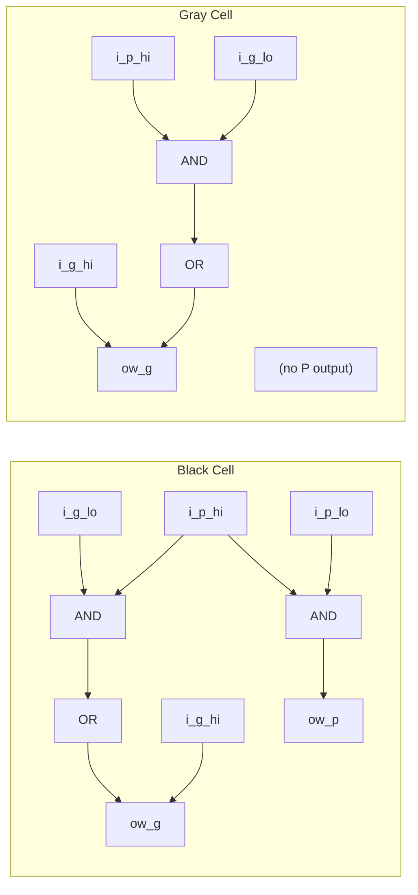

<!-- RTL Design Sherpa Documentation Header -->
<table>
<tr>
<td width="80">
  <a href="https://github.com/sean-galloway/RTLDesignSherpa">
    
  </a>
</td>
<td>
  <strong>RTL Design Sherpa</strong> · <em>Learning Hardware Design Through Practice</em><br>
  <sub>
    <a href="https://github.com/sean-galloway/RTLDesignSherpa">GitHub</a> ·
    <a href="https://github.com/sean-galloway/RTLDesignSherpa/blob/main/docs/DOCUMENTATION_INDEX.md">Documentation Index</a> ·
    <a href="https://github.com/sean-galloway/RTLDesignSherpa/blob/main/LICENSE">MIT License</a>
  </sub>
</td>
</tr>
</table>

---

<!-- End Header -->

# Prefix Cell Gray

## Overview

The `math_prefix_cell_gray` module (the "gray cell") is the reduced-area sibling of the prefix cell—an area-optimized parallel prefix building block that computes only the group generate (G) signal. It earns its keep in reverse tree stages and final carry computation, anywhere the propagate signal isn't needed downstream. The final carry computation needs G, not P, so gray cells save ~33% area in exactly those stages.

**Key Features:**
- **Outputs G only** - Optimized for carry-only computation
- **~33% smaller** than black cells (2 gates vs 3)
- **Same delay** as black cell for G output
- **Used in** the Han-Carlson prefix stages (all six widths); Brent-Kung's reverse tree uses math_adder_brent_kung_gray instead

## Parameters

None. This is a fixed single-bit cell—there's nothing to parameterize.

## Ports

### Module Declaration

```systemverilog
module math_prefix_cell_gray (
    input  logic i_g_hi, i_p_hi,
    input  logic i_g_lo,           // No P needed from lower position
    output logic ow_g              // Only G output (this IS the carry)
);
```

### Port List

| Port | Direction | Width | Description |
|------|-----------|-------|-------------|
| i_g_hi | Input | 1 | Generate signal from higher bit position |
| i_p_hi | Input | 1 | Propagate signal from higher bit position |
| i_g_lo | Input | 1 | Generate signal from lower bit position |
| ow_g | Output | 1 | Combined group generate (the carry into position i+1) |

**Note:** `i_p_lo` isn't needed here—it would only feed the group propagate computation, and this cell doesn't output one.

## Functional Description

### Implementation

```systemverilog
assign ow_g = i_g_hi | (i_p_hi & i_g_lo);
```

That's the group generate:
- **G[i:j]** = G[i:k] OR (P[i:k] AND G[k-1:j])

**Interpretation:** A carry is generated for the combined range [i:j] if:
- The high range [i:k] generates a carry, OR
- The high range propagates AND the low range generates

### Why Gray Cells Don't Need P Output

In parallel prefix adders, the final computation is:
- **Sum[i]** = P[i] XOR C[i-1]
- **C[i]** = G[i:-1] (group generate from bit i down to carry-in)

The sum computation uses the **original** single-bit propagate P[i], not the group propagate. So once we've computed all the carries (group generates), the group propagates have no consumers left.

### Visual Comparison



## Timing Characteristics
| Metric | Value | Description |
|--------|-------|-------------|
| Logic Depth | 2 gates | 1 AND + 1 OR |
| Critical Path | AND-OR | i_g_lo -> ow_g |
| Gate Count | 2 | 1 AND + 1 OR |

## Usage Examples

### In Han-Carlson Final Stage

```systemverilog
// Han-Carlson: Final stage fills odd positions using gray cells
// Odd positions get their carry from the even neighbor
generate
    for (i = 0; i < N; i++) begin : gen_final_stage
        if (i % 2 == 1) begin : gen_odd
            // Odd positions: compute G[i:-1] from G[i] and G[i-1:-1]
            math_prefix_cell_gray u_pf_gray (
                .i_g_hi(w_g_prev[i]),   // G[i] (single bit)
                .i_p_hi(w_p_prev[i]),   // P[i] (single bit)
                .i_g_lo(w_g_prev[i-1]), // G[i-1:-1] (group from even neighbor)
                .ow_g(w_g_final[i])     // G[i:-1] (the carry)
            );
        end else begin : gen_even
            // Even positions: already computed, pass through
            assign w_g_final[i] = w_g_prev[i];
        end
    end
endgenerate
```

### In Brent-Kung Reverse Tree

```systemverilog
// Brent-Kung: the reverse tree uses gray cells to fill intermediate positions.
// After the forward tree, the complete carries sit at positions 2^k - 1 --
// with 0-based bit indexing that is 1, 3, 7, 15 for a 16-bit adder, NOT at
// the powers of two. The reverse tree fills the rest -- for 16-bit that is
// twelve positions ({2,4,5,6,8,9,10,11,12,13,14,16} in
// math_adder_brent_kung_grouppg_016.sv), not just {2,4,8}.

// Example: position 5 combines the span-2 group [4:3] with the complete
// carry already available at position 3. (Indices: ow_gg[k] is the carry
// INTO bit k -- math_adder_brent_kung_sum drives ow_sum[k] = gg[k] ^ p[k+1],
// so ow_gg[5] = G[4:-1], the carry into bit 5, not 6.)
math_prefix_cell_gray u_bk_gray_5 (
    .i_g_hi(w_g_2[5]),  // G[4:3] (span-2 group from forward tree level 1)
    .i_p_hi(w_p_2[5]),  // P[4:3] (matching group propagate)
    .i_g_lo(w_gg[3]),   // G[2:-1] (complete carry into bit 3, already resolved)
    .ow_g(w_gg[5])      // G[4:-1] (carry into bit 5)
);
```

This mirrors `gray_block_5_3` in `math_adder_brent_kung_grouppg_008.sv`, which
wires `G_5_4`/`P_5_4` against `ow_gg[3]`. Many gray cells in the Brent-Kung
reverse tree pair a *group* generate/propagate with an already-complete carry—but
the library's Brent-Kung fill level also uses single-bit gray cells:
`math_adder_brent_kung_grouppg_016.sv` contains `gray_block_1_0`,
`gray_block_2_1`, `gray_block_4_3`, ... which take a single-bit `G[i:i]` against
the completed carry below. So the single-bit pattern isn't exclusive to
Han-Carlson; Brent-Kung uses it in its fill-in stage too.

### Computing Final Sum

```systemverilog
// After all carries computed with gray cells:
generate
    for (i = 0; i < N; i++) begin : gen_sum
        if (i == 0) begin
            assign sum[0] = p_original[0] ^ cin;
        end else begin
            // Sum = original P XOR carry from previous position
            assign sum[i] = p_original[i] ^ g_final[i-1];
        end
    end
endgenerate

// Carry out is the final group generate
assign cout = g_final[N-1];
```

## Design Notes

### Resource Utilization

| Metric | Value |
|--------|-------|
| AND gates | 1 |
| OR gates | 1 |
| Total gates | 2 |
| LUTs (FPGA) | 1 |

### Comparison with Black Cell

| Property | Black Cell | Gray Cell |
|----------|------------|-----------|
| Inputs | 4 (Ghi, Phi, Glo, Plo) | 3 (Ghi, Phi, Glo) |
| Outputs | 2 (G, P) | 1 (G) |
| Gate count | 3 | 2 |
| Area savings | - | ~33% |
| G output delay | Same | Same |

### Area Savings in Adder

For an N-bit adder, the mix of gray cells versus black cells sets the total area.

The two 16-bit rows below are counted from this library's own RTL, not estimated.
Kogge-Stone is a textbook reference figure; there is no Kogge-Stone adder in this
library.

| Architecture | Black Cells | Gray Cells | Total Cells | Prefix Levels |
|--------------|-------------|------------|-------------|---------------|
| Kogge-Stone N=16 (textbook, not implemented here) | 49 | 0 | 49 | 4 |
| Brent-Kung N=16 (`math_adder_brent_kung_grouppg_016.sv`) | 11 | 16 | 27 | 6 |
| Han-Carlson N=16 (`math_adder_han_carlson_016.sv`) | 24 | 8 | 32 | 5 |

: Prefix-cell counts at N=16, counted from the RTL

How these were counted:

- Brent-Kung: `grep -c math_adder_brent_kung_black rtl/math/math_adder_brent_kung_grouppg_016.sv`
  gives 11, and the matching `_gray` count gives 16. Note that this library uses a
  gray cell wherever the low operand is already a complete carry, even inside the
  forward tree, so gray cells outnumber black ones.
- Han-Carlson: elaborating the five generate stages of
  `math_adder_han_carlson_016.sv` yields 7 + 7 + 6 + 4 = 24 `math_prefix_cell`
  instances and 8 `math_prefix_cell_gray` instances.
- Kogge-Stone: `N x log2(N) - N + 1 = 16 x 4 - 16 + 1 = 49` black cells.

Han-Carlson uses gray cells only in the final fill-in stage: N/2 cells for an
N-bit adder, which is the 8 above.

### When to Use Gray Cells

**Use gray cells when:**
- Computing final carries (no further prefix operations needed)
- In reverse tree stages (Brent-Kung)
- Final fill-in stage (Han-Carlson)
- Any position where P is not needed downstream

**Use black cells when:**
- P signal needed for subsequent prefix stages
- Building Kogge-Stone (all stages need both P and G)
- Forward tree stages in hybrid architectures

### Design Optimization Priorities

This module is optimized with the following priorities:
1. **Area** - Minimal 2-gate implementation
2. **Wire complexity** - One fewer input than black cell
3. **Logic depth** - Same 2-gate delay as black cell

### Architectural Trade-offs

| Architecture | Gray Cell Usage | Trade-off |
|--------------|-----------------|-----------|
| Kogge-Stone | None | Maximum speed, maximum area |
| Brent-Kung | Reverse tree (~50%) | Minimum area, 2x depth |
| Han-Carlson | Final stage only (~20%) | Balanced speed/area |

### Applications

- **Parallel prefix adders** - Final carry computation stages
- **Area-optimized adders** - Brent-Kung and Han-Carlson architectures
- **Multiplier CPAs** - Final addition where area matters
- **Low-power designs** - Fewer gates = lower dynamic power

## Related Modules

- **math_prefix_cell** - Black cell variant (outputs both G and P)
- **math_adder_han_carlson_016** - 16-bit Han-Carlson adder using this cell
- **math_adder_han_carlson_048** - 48-bit Han-Carlson adder using this cell
- **math_adder_brent_kung_gray** - Brent-Kung gray cell (equivalent)

## Testing

No dedicated test wrapper -- this block is exercised structurally through the Han-Carlson adder tests (`val/math/test_math_adder_han_carlson.py`) -- all six HC widths instantiate this cell (Brent-Kung uses its own math_adder_brent_kung_black/gray cells, NOT this one).
It is also formally proved: `formal/common/math_prefix_cell_gray/` (prove + cover, SymbiYosys).

## References

- Brent, R.P., Kung, H.T. "A Regular Layout for Parallel Adders." IEEE Trans. Computers, 1982.
- Han, T., Carlson, D.A. "Fast Area-Efficient VLSI Adders." IEEE Symposium on Computer Arithmetic, 1987.
- Harris, D. "A Taxonomy of Parallel Prefix Networks." Asilomar Conference, 2003.

## Navigation

- **[← Back to Math Index](index.md)**
- **[← Back to Main Documentation Index](../index.md)**
