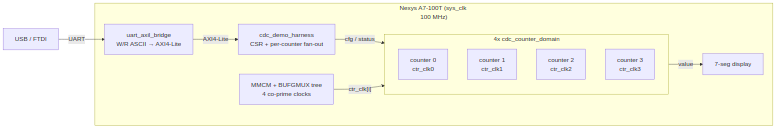

# Overview

## What it is

CDC Counter Display is an educational Nexys A7 project that demonstrates **clock
domain crossing (CDC)** — both done correctly and broken on purpose — on real
silicon. Four independent counters each run in their own asynchronous clock
domain; a host program over UART configures them, reads their values back across
the CDC boundary, and can deliberately select an unsafe crossing to *watch CDC
fail* on the 7-segment display.

Phase 2 (`cdc_demo_top`) is wired on the standard Nexys A7 characterization
**spine**: a single USB-UART link feeds a `uart_axil_bridge` that converts an
ASCII `W/R` command protocol into AXI4-Lite, which drives the `cdc_demo_harness`
CSR block. The harness fans configuration out to four `cdc_counter_domain`
instances and collects their CDC'd status back.

### Figure 1.1: CDC Demo Harness Spine

**Source:** [01_harness_spine.mmd](../assets/mermaid/01_harness_spine.mmd)

## What it demonstrates

- **Safe multi-bit CDC.** With a Gray-coded or FIFO-based crossing, the host
  reads coherent counter values at any source-clock speed.
- **Broken CDC, visibly.** Put a counter in NO-CDC mode with auto-increment,
  then sweep its source clock from slow to fast: the display stays clean at low
  speeds and visibly scrambles at high speeds (multi-bit bus skew), while the
  other counters — in a safe mode — stay clean the whole time.
- **Five selectable CDC strategies** per counter: NO-CDC, stretch, sync-FIFO,
  two-phase handshake, four-phase handshake.
- **Sim / silicon equivalence.** The same host program drives the FPGA and a
  cocotb simulation over the identical UART byte stream (Chapter 6).

## What you need

- Nexys A7-100T board (XC7A100T-1CSG324C) + USB cable.
- Xilinx Vivado (for `build-demo` / `program-demo`).
- A Python environment sourced from `env_python` (for the host CLI and sim).

## Where things live

| Path | Contents |
|------|----------|
| `rtl/cdc_demo_top.sv` | Board top: clocking tree, buttons, harness, display |
| `rtl/cdc_demo_harness.sv` | AXI4-Lite CSR + per-counter fan-out |
| `rtl/cdc_counter_domain.sv` | One counter + its CDC paths (5 modes) |
| `rtl/cdc_demo_csr.rdl` | Register descriptor (generates the by-name regmap) |
| `host/` | `cdc_demo.py` driver, `cdc_programs.py`, `run_cdc_demo.py` CLI |
| `dv/` | UART-equivalence cocotb sim (tb, tests, filelist, regmap) |
| `Makefile` | Build / sim / program / host targets |

: Project file layout
