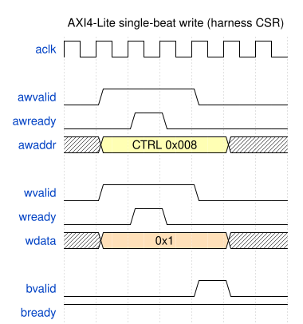

# Harness CSR Configuration

The `cdc_demo_harness` is a single flat AXI4-Lite slave. The host reaches it
through the UART bridge at **harness base `0x0`**. Every register is 32 bits,
word-addressable.

**Registers are accessed by name, never by offset.** The layout is authoritative
in `rtl/cdc_demo_harness.sv`, described in `rtl/cdc_demo_csr.rdl`, and compiled
to `dv/tbclasses/cdc_demo_csr_regmap.py` (PeakRDL). The driver, the host
programs, and the sim all resolve names through that regmap; the `consistency`
test guards the three against drift.

Every named write becomes a single AXI4-Lite beat that the UART bridge drives
into the harness (a named read is the mirror AR/R exchange):

#### Waveform 5.1: AXI4-Lite Single-Beat Write



**Source:** [01_axil_write.json](../assets/wavedrom/01_axil_write.json)

## Global registers

| Register | Offset | Field | Bits | Access | Description |
|----------|:------:|-------|:----:|:------:|-------------|
| `BUILD_ID` | 0x000 | `value` | [31:0] | R | ASCII "CDC1" (0x43434331) — read first to confirm the bitstream |
| `STATUS` | 0x004 | `alive0`–`alive3` | [3:0] | R | Counter *i* toggled within the last ~1 s window |
| `STATUS` | 0x004 | `uart_rx` | [4] | R | UART RX activity |
| `STATUS` | 0x004 | `uart_tx` | [5] | R | UART TX activity |
| `STATUS` | 0x004 | `any_written` | [6] | R | Any CSR written since reset |
| `STATUS` | 0x004 | `reset_ok` | [31] | R | Reset deasserted / harness alive |
| `CTRL` | 0x008 | `soft_reset` | [0] | RW | Pulse: full sys_clk reset |
| `CTRL` | 0x008 | `freeze` | [1] | RW | Freeze all counters |
| `CTRL` | 0x008 | `ignore_btn` | [2] | RW | Ignore physical buttons (host-press only) |
| `DISP_SELECT` | 0x00C | `sel` | [1:0] | RW | Which counter drives the 7-seg |
| `SCRATCH` | 0x010 | `value` | [31:0] | RW | Link-sanity scratch (write, read back) |

: Global CSR registers — register / field / offset / bit slice

## Per-counter block

Counter `i` (0–3) occupies `0x040 + i*0x40`. The regmap keys are
`COUNTER{i}_<REG>` (e.g. `COUNTER2_DIVISOR`).

| Register | +Offset | Field | Bits | Access | Description |
|----------|:-------:|-------|:----:|:------:|-------------|
| `DIVISOR` | +0x00 | `clock_select` | [2:0] | RW | Clock source (0–3 MMCM, 4 = divided) |
| `DIVISOR` | +0x00 | `div_pickoff` | [12:8] | RW | Divided-clock pickoff (when `clock_select`=4) |
| `INIT` | +0x04 | `value` | [15:0] | RW | Value loaded by `CFG_LOAD` |
| `INCREMENT` | +0x08 | `value` | [15:0] | RW | Advance amount per press |
| `CFG_LOAD` | +0x0C | `strobe` | [0] | W | Pulse: load `INIT` into the counter |
| `HOST_PRESS` | +0x10 | `strobe` | [0] | W | Pulse: inject one virtual press |
| `VALUE` | +0x14 | `value` | [15:0] | R | Current value, CDC'd per `CDC_MODE` |
| `PRESS_COUNT` | +0x18 | `value` | [15:0] | R | Debounced press count (always Gray-CDC'd) |
| `CTR_CLK_TICKS` | +0x1C | `value` | [31:0] | R | Free-running `ctr_clk` tick count |
| `CDC_MODE` | +0x20 | `mode` | [2:0] | RW | CDC strategy for `VALUE` (0–4; see Chapter 2) |
| `AUTO_INC` | +0x24 | `en` | [0] | RW | 1 = advance every `ctr_clk` edge |

: Per-counter CSR block — counter *i* absolute offset = 0x40 + i*0x40 + column

## By-name access

The driver (`host/cdc_demo.py`) wraps `UartRegisterMap`. Whole-register and
individual-field access both work:

```python
from cdc_demo import CdcDemoDriver
d = CdcDemoDriver(port="/dev/ttyUSB1")          # or bridge=... for sim

d.build_id()                                    # -> 0x43434331
d.scratch(0xDEADBEEF)                            # write + read back
d.disp_select(2)                                 # DISP_SELECT.sel = 2

c = d.counter(2)
c.set_cdc_mode(2)                                # COUNTER2_CDC_MODE.mode = 2
c.set_div_pickoff(23)                            # DIVISOR.{clock_select=4, div_pickoff=23}
c.set_init(0x10); c.set_increment(3); c.load()   # load INIT
c.press()                                        # HOST_PRESS
c.value(), c.press_count()                       # CDC'd status readback
```

Packed fields are spliced by name with a read-modify-write, so setting
`div_pickoff` never disturbs `clock_select`. Write-only strobes (`CFG_LOAD`,
`HOST_PRESS`) are writable by name but read back as 0 by design.

## Regenerating the regmap

`rtl/cdc_demo_harness.sv` is hand-written; the RDL is a descriptor of it. After
editing either the SV or the RDL:

```bash
make regmap        # regenerate dv/tbclasses/cdc_demo_csr_regmap.py from the RDL
make consistency   # assert regmap == SV (globals + reconstructed per-counter)
```

Never hand-edit the generated regmap — it is regenerated from the RDL.
