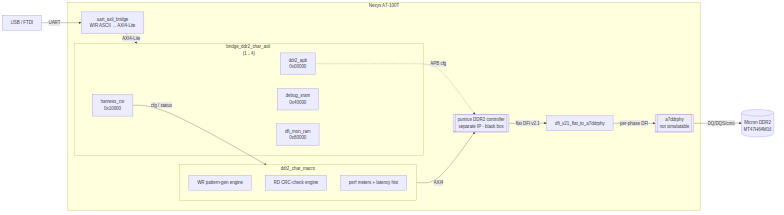

# How It Works

## The transport spine

Host commands reach the DUT over one UART link that fans out to four AXI4-Lite
slaves:

### Figure 2.1: DDR2 Characterization Harness Spine

**Source:** [01_harness_spine.mmd](../assets/mermaid/01_harness_spine.mmd)

The UART wire protocol is ASCII, line-based, 115200 8N1: a write is
`W <hex-addr32> <hex-data32>\n` → the FPGA replies `OK\n`; a read is
`R <hex-addr32>\n` → replies `0x<hex-data32>\n`. The bridge RTL is
`projects/components/converters/rtl/uart_to_axil4/uart_axil_bridge.sv`; the host
framing is `UARTAxiBridge` (`projects/components/converters/bin/uart_axi_bridge.py`).

## The 1→4 AXIL bridge

`bridge_ddr2_char_axil` is generated from
`ddr2_char_framework/rtl/bridges/configs/bridge_ddr2_char_axil.toml` (one master
`host`, four slaves). It decodes the four windows in Chapter 5 and routes each
host transaction to the right slave via per-slave adapters.

## Key RTL blocks

| File | Role |
|------|------|
| `build-perf/rtl/ddr2_char_top.sv` | FPGA pin-level top: wraps the harness, the flat-DFI→per-phase adapter, and the a7ddrphy black box; MMCM clock synthesis (sys / sys2x / sys4x / sys4x_dqs), IDELAYCTRL, DDR2 pads. |
| `build-perf/rtl/ddr2_char_harness.sv` | Internal integration: `uart_axil_bridge` + `bridge_ddr2_char_axil` + `harness_csr` + `debug_sram` + `dfi_mon_ram` + `ddr2_char_macro` + char timer + LED / 7-seg. |
| `ddr2_char_framework/rtl/ddr2_char_macro.sv` | Binds the two AXI4 engines to pumice's `s_axi`, and holds the perf taps (bus meters + latency histogram) on the internal AXI wires. |
| `ddr2_char_framework/rtl/harness_csr.sv` | The AXIL CSR slave (Chapter 5). Hand-written (self-clearing pulses, latches, PHY passthrough). |
| `ddr2_char_framework/rtl/dfi_v21_flat_to_a7ddrphy.sv` | Combinational adapter: pumice's phase-packed flat DFI v2.1 → a7ddrphy per-phase ports (`NPHASES = 4`). |
| `ddr2_char_framework/rtl/a7ddrphy_stub.sv` | Port-shape black box of a7ddrphy for Verilator (real body swapped in by Vivado). |

: Key RTL blocks

## The characterization engines

Inside `ddr2_char_macro`, two master-side AXI4 engines generate and check
traffic against the controller's `s_axi` port:

- **Write engine** (`axi4_master_wr_pattern_gen`) — emits an LFSR data pattern
  across the programmed address pattern, and latches an expected CRC.
- **Read engine** (`axi4_master_rd_crc_check`) — re-reads the same pattern and
  computes an actual CRC, plus a per-beat mismatch count.

Alongside them, **perf taps** — `axi_bus_meter` (write and read) and
`axi_perf_latency_hist` — observe the internal AXI wires to produce the
producer/backpressure/starve/idle buckets and the latency histogram read back in
Chapter 5.

## The controller, DFI, and PHY (black boxes)

The controller (**pumice**) sits inside `ddr2_char_macro` between the AXI
engines and the flat DFI output. Its configuration registers are reached over
the `ddr2_apb` bridge slave at base `0x0`. This guide documents only that the
harness drives it — not its internals.

pumice's flat DFI v2.1 bus is adapted to the a7ddrphy per-phase interface, then
to the DDR2 pads. **a7ddrphy does not simulate in Verilator** (it uses Xilinx
SERDES/IDELAY primitives); the sim connects at the DFI level with a behavioral
model instead (Chapter 6). On hardware, a7ddrphy calibration is driven by
firmware (the host) over the PHY-CSR passthrough window — there is no hardware
leveling FSM.
