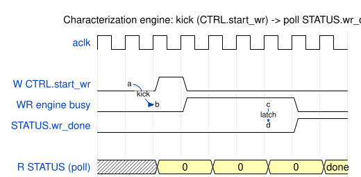

# Harness CSR Configuration

## Bridge address map

The UART bridge fans out to four AXI4-Lite slaves. Bases come from
`bridge_ddr2_char_axil.toml` (mirrored in `build-perf/host/ADDRESS_MAP.md` and as constants
in `ddr2_char.py`):

| Constant | Slave | Base | Size | Protocol |
|----------|-------|------|------|----------|
| `DDR2_APB_BASE` | `ddr2_apb` | 0x0000_0000 | 4 KB | APB — pumice controller CSR (black box) |
| `HARNESS_CSR_BASE` | `harness_csr` | 0x0001_0000 | 4 KB | AXIL — this chapter |
| `DEBUG_SRAM_BASE` | `debug_sram` | 0x0004_0000 | 256 KB | AXIL 64b — MonBus/DFI trace ring |
| `DFI_MON_RAM_BASE` | `dfi_mon_ram` | 0x0008_0000 | 4 KB | AXIL — DFI cmd observability |

: Bridge slave address map

## By-name access (RDL → regmap)

`harness_csr.sv` is hand-written; `harness_csr.rdl` is a descriptor of it, from
which the by-name host regmap is generated. Registers are accessed by name via
`UartRegisterMap`, never by hardcoded offset. Regenerate after editing either:

```bash
python3 bin/peakrdl_generate.py \
  projects/NexysA7/ddr2-characterization/ddr2_char_framework/rtl/harness_csr.rdl \
  --regmap --docs-only --no-html --no-markdown \
  --regmap-output projects/NexysA7/ddr2-characterization/ddr2_char_framework/dv/tbclasses/harness_csr_regmap.py
```

A consistency test (`build-perf/host/test_harness_regmap_consistency.py`) asserts the
generated regmap matches the SV header table.

### Waveform 5.1: Engine Kick and Poll



**Source:** [01_engine_kick.json](../assets/wavedrom/01_engine_kick.json)

## Control / status (offsets relative to `HARNESS_CSR_BASE`)

| Register | Offset | Field | Bits | Access | Description |
|----------|:------:|-------|:----:|:------:|-------------|
| `CTRL` | 0x00 | `start_wr` | [0] | W | Pulse: kick the write engine |
| `CTRL` | 0x00 | `start_rd` | [1] | W | Pulse: kick the read engine |
| `CTRL` | 0x00 | `clear_stats` | [2] | W | Pulse: clear perf + sticky errors |
| `CTRL` | 0x00 | `freeze_trace` | [3] | RW | Latch: freeze perf counters |
| `CTRL` | 0x00 | `soft_reset` | [4] | W | Pulse: soft reset (does **not** clear sticky errors) |
| `STATUS` | 0x04 | `wr_done` / `rd_done` | [0] / [1] | R | Engine completion |
| `STATUS` | 0x04 | `wr_error` / `rd_error` | [2] / [3] | R | Per-engine error |
| `STATUS` | 0x04 | `any_error` | [4] | R | Sticky OR of errors — cleared by `clear_stats` |
| `STATUS` | 0x04 | `init_done` / `init_fail` | [6] / [7] | R | Controller init status |
| `DBG_WR_PTR` | 0x08 | `value` | [31:0] | R | Words written to debug_sram since clear |
| `DBG_OVERFLOW` | 0x0C | `overflow` | [0] | R | Sticky trace-overflow |
| `CRC_EXPECTED` | 0x10 | `value` | [31:0] | R | Write-engine expected CRC |
| `CRC_ACTUAL` | 0x14 | `value` | [31:0] | R | Read-engine actual CRC |
| `CRC_MATCH` | 0x18 | `match` | [0] | R | CRC_ACTUAL == CRC_EXPECTED |
| `CRC_MATCH` | 0x18 | `exp_valid` / `act_valid` | [1] / [2] | R | CRC captured |
| `CRC_MATCH` | 0x18 | `beats_mism_nz` | [3] | R | Any beat mismatched |
| `SCRATCH` | 0x1C | `value` | [31:0] | RW | Host link ping |
| `BUILD_ID` | 0x20 | `value` | [31:0] | R | 0x44445232 ("DDR2") |
| `BEATS_MISM` | 0x24 | `value` | [31:0] | R | Beats mismatched |

: Control / status registers

## Timer

| Register | Offset | Bits | Access | Description |
|----------|:------:|:----:|:------:|-------------|
| `TIMER_CTRL` | 0x28 | [0] clear | W | Pulse: clear the cycle counter |
| `TIMER_STATUS` | 0x2C | [0] done, [1] running, [2] pass | R | Timer state |
| `TIMER_CYCLES_LO/HI` | 0x30 / 0x34 | [31:0] | R | 64-bit cycle count (10 ns/cycle) |
| `TIMER_EXP_BEATS` | 0x38 | [31:0] | RW | Beat-count stop trigger (0 = disable) |
| `TIMER_{R,W}_{FIRST,LAST}_{LO,HI}` | 0x40–0x5C | [31:0] | R | First/last R/W beat timestamps (64-bit each) |

: Characterization timer registers

## Runtime controller cfg + DFI tuning

| Register | Offset | Field | Bits | Access | Description |
|----------|:------:|-------|:----:|:------:|-------------|
| `CTRLR_CFG` | 0x60 | `memtype` | [0] | RW | 0 = DDR2, 1 = LPDDR2 |
| `CTRLR_CFG` | 0x60 | `t_phy_wrlat` | [15:8] | RW | PHY write latency (see Chapter 7 — board wants **0**) |
| `CTRLR_CFG` | 0x60 | `t_rddata_en` | [23:16] | RW | Read-data-enable latency |
| `CTRLR_CFG` | 0x60 | `rd_in_order` | [24] | RW | Force in-order reads |
| `CTRLR_CAP` | 0x64 | `cap_lookahead_max` | [3:0] | RW | Advertised OOO look-ahead depth |
| `CTRLR_CAP` | 0x64 | `cap_synth_mask` | [7:4] | RW | Advertised feature mask |
| `DFI_TUNING` | 0x68 | `cmd_delay` | [3:0] | RW | Live DFI cmd delay (reset 1) — no rebuild |
| `DFI_TUNING` | 0x68 | `rddata_delay` | [7:4] | RW | Live DFI read-data delay (reset 0) |

: Runtime controller config and live DFI tuning

## a7ddrphy calibration passthrough (hardware only)

Indirect access to the a7ddrphy's read/write-leveling knobs; firmware-driven, no
HW FSM. Meaningless in sim (the stub ignores it). Knob map:
`rtl-vivado/a7ddrphy/a7ddrphy_csr_map.txt`.

| Register | Offset | Bits | Access | Description |
|----------|:------:|:----:|:------:|-------------|
| `PHY_CSR_ADDR` | 0x80 | [9:0] | RW | a7ddrphy CSR word index |
| `PHY_CSR_WDATA` | 0x84 | [31:0] | RW | Value to write |
| `PHY_CSR_CTRL` | 0x88 | [0] pulse | W | Drive one CSR-bus write |
| `PHY_CSR_RDATA` | 0x8C | [31:0] | R | `dat_r` for the current `PHY_CSR_ADDR` |

: a7ddrphy calibration passthrough

## Engine config (WR 0x100–0x128, RD 0x180–0x1A8)

The read block mirrors the write block at +0x80.

| Register | Offset | Field | Bits | Description |
|----------|:------:|-------|:----:|-------------|
| `WR_START_ADDR` | 0x100 | `value` | [31:0] | Start address |
| `WR_STRIDE_0/1` | 0x104 / 0x108 | `value` | [23:0] | Signed strides |
| `WR_WRAP_MASK_0/1` | 0x10C / 0x110 | `value` | [31:0] | Address wrap masks |
| `WR_BLEN_TXN` | 0x114 | `burst_len` | [7:0] | AXI burst length |
| `WR_BLEN_TXN` | 0x114 | `txn_count` | [23:8] | Transaction count |
| `WR_BLEN_TXN` | 0x114 | `gap` | [27:24] | Inter-burst gap |
| `WR_AXI_ATTR` | 0x118 | `axi_id` | [7:0] | AXI ID |
| `WR_AXI_ATTR` | 0x118 | `id_mode` | [9:8] | 0 fixed / 1 counter / 2 LFSR |
| `WR_AXI_ATTR` | 0x118 | `axi_size` | [12:10] | AXI size (AXI_SIZE_8 = 3) |
| `WR_AXI_ATTR` | 0x118 | `axi_burst` | [14:13] | 0 fixed / 1 incr / 2 wrap |
| `WR_AXI_ATTR` | 0x118 | `data_mode` | [15] | Data pattern mode |
| `WR_LFSR_SEED` | 0x11C | `value` | [31:0] | Pattern seed (must match RD for CRC) |
| `WR_HASH_SEED0/1/2` | 0x120–0x128 | `value` | [31:0] | Hash seeds |

: Write-engine config (read engine identical at +0x80)

## Perf observability (0x1C0–0x1E8)

All 32-bit; cleared by `CTRL.clear_stats`, frozen by `CTRL.freeze_trace`.

| Register | Offset | Field | Bits | Description |
|----------|:------:|-------|:----:|-------------|
| `OBS_RD_{PROD,BP,STARV,IDLE}` | 0x1C0–0x1CC | `value` | [31:0] | Read data-channel meter buckets |
| `OBS_WR_{PROD,BP,STARV,IDLE}` | 0x1D0–0x1DC | `value` | [31:0] | Write meter buckets |
| `OBS_HIST_SEL` | 0x1E0 | `bus` | [0] | 0 = read, 1 = write |
| `OBS_HIST_SEL` | 0x1E0 | `metric` | [1] | 0 = AR→firstR / AW→B, 1 = AR→RLAST |
| `OBS_HIST_SEL` | 0x1E0 | `bin` | [5:2] | Histogram bin index (0–15) |
| `OBS_HIST_COUNT` | 0x1E4 | `value` | [31:0] | Count in the selected bin |
| `OBS_HIST_TOTAL` | 0x1E8 | `value` | [31:0] | Total txns on the selected metric |

: Perf observability (bin *b* covers [2^b, 2^(b+1)) cycles)
