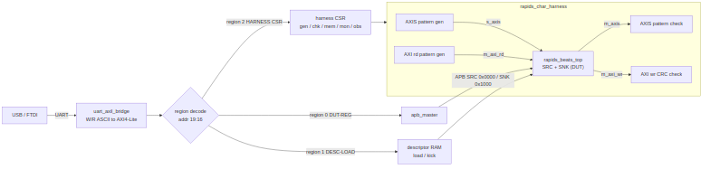

# How It Works

## The spine and region decode

Host commands arrive over one UART link and are steered by the top 4 bits of the
word address (`addr[19:16]`) into three regions:

### Figure 2.1: RAPIDS Characterization Harness Spine

**Source:** [01_harness_spine.mmd](../assets/mermaid/01_harness_spine.mmd)

| Region | Base | Contents |
|:------:|------|----------|
| 0 — DUT-REG | 0x0_0000 | AXIL → `apb_master` → the DUT's APB (SRC @ 0x0000, SNK @ 0x1000) |
| 1 — DESC-LOAD | 0x1_0000 | 256-bit descriptor assembly + single-beat AXI4 write into descriptor RAM |
| 2 — HARNESS CSR | 0x2_0000 | gen / chk / mem / mon / obs control + status readback |

: Host address regions

The UART wire protocol is ASCII (`W <addr> <data>\n` / `R <addr>\n`), 115200
8N1, decoded by `uart_axil_bridge`.

## Key RTL blocks

| File | Role |
|------|------|
| `flows-rapids-beats/rtl/rapids_char_top.sv` | FPGA board top. Owns the host front-end: `uart_axil_bridge`, the region decode/router, `apb_master`, the DESC-LOAD path, the harness CSR register file, the atomic-launch kick sequencer, LEDs and 7-seg. All CSR/DESC offsets are `localparam`s here (the single source of truth for the host regmaps). |
| `flows-rapids-beats/rtl/rapids_char_harness.sv` | Synthesizable harness: instantiates the DUT `rapids_beats_top` plus the on-chip stimulus / checkers / memories. **This is the cocotb DUT top.** |
| `flows-rapids-beats/rtl/rapids_char_genesys2_top.sv` | Genesys 2 wrapper (MMCM 200→100 MHz) around `rapids_char_top`, default 8 channels. |

: Key RTL blocks

## The DUT and the on-chip harness

The DUT is `rapids_beats_top` (`u_dut`), from
`projects/components/dmas/rapids/`. Two build-time overrides matter for the char
build: `USE_AXI_MONITORS = 0` and `GEN_MON = 0` — the in-core AXI/descriptor
monitors and MonBus egress are compiled **out** so utilization is metered
externally and 8-channel timing closes.

Because all data paths are on-chip, the board runs at line rate with no host
bottleneck. The harness instantiates (all sharing LFSR `0xDEADBEEF`, taps
`{32,22,2,1}`, CRC-32 `0x04C11DB7`):

| Block | Role |
|-------|------|
| `axis4_master_pattern_gen` | drives the DUT `s_axis` (sink ingress stimulus) |
| `axis4_slave_pattern_check` | checks the DUT `m_axis` (source egress) |
| `axi4_slave_rd_pattern_gen` | backs the DUT `m_axi_rd` (512-bit source data) |
| `axi4_slave_wr_crc_check` | backs the DUT `m_axi_wr` (512-bit sink data verify) |
| `sdpram_slave_axi4_axi4` ×4 | descriptor + control RAM per half (DUT reads, host writes) |
| `axi_bus_meter` / `axis_bus_meter` | prod/bp/starv/idle buckets + exact AXIS byte/packet counters |

: On-chip harness stimulus and checkers

## Atomic launch

To start a measured run coherently, the host stages the kick parameters
(`CSR_KICK_MASK`, `CSR_KICK_BASE_*`, `CSR_KICK_STRIDE`) and then writes a single
`CSR_GO`, which arms the bus meters, starts the generator, and fires the channel
kicks together (Chapter 5). A run latches PASS (`0x0123`) or FAIL (`0x9999`) on
the LEDs and 7-seg once `gen_done & src_idle & snk_idle`.
