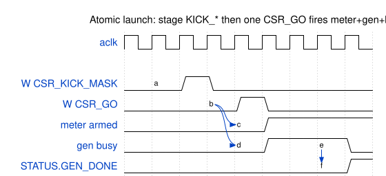

# Harness CSR Configuration

## Regions and by-name access

The host address splits into three regions by `addr[19:16]`:

| Region | Base | Contents |
|:------:|------|----------|
| DUT-REG | 0x0_0000 | APB into the RAPIDS DUT (SRC 0x0000, SNK 0x1000) |
| DESC-LOAD | 0x1_0000 | descriptor holding registers + kick |
| HARNESS CSR | 0x2_0000 | gen / chk / mem / mon / obs + status |

: Host address regions

**No PeakRDL RDL exists for the harness CSR.** The registers are decoded by hand
in `rapids_char_top.sv` (localparams) and mirrored by two hand-maintained Python
regmaps, regenerated from the SV by `flows-rapids-beats/bin/gen_rapids_harness_regmap.py`:

- `flows-rapids-beats/rtl/rapids_harness_csr_regmap.py`
- `flows-rapids-beats/rtl/rapids_harness_desc_regmap.py`

The **DUT** (RAPIDS core) does use PeakRDL — `projects/components/dmas/rapids/rtl/rapids_regmap.py`
— loaded by the host as two `RegisterMap` instances (SRC `start_address=0x0000`,
SNK `0x1000`, 13-bit APB) for by-name DUT config.

The identity register: region-2 `CTRL`/`ID` @ 0x000 reads **`0x5241_5031`**
("RAP1") — the BUILD_ID equivalent used for `ping()` and port autodetect.

### Waveform 4.1: Atomic Launch

**Source:** [01_atomic_launch.json](../assets/wavedrom/01_atomic_launch.json)

## DESC-LOAD region (region 1, byte offsets)

| Register | Offset | Field | Bits | Access | Description |
|----------|:------:|-------|:----:|:------:|-------------|
| `DESC_WORD0..7` | 0x00–0x1C | `value` | [31:0] | RW | Words of the 256-bit descriptor |
| `DESC_ADDR` | 0x20 | `value` | [31:0] | RW | Target byte address in descriptor RAM |
| `DESC_KICK` | 0x24 | `half` | [0] | W | 0 = SRC, 1 = SNK — write issues one AXI4 write |
| `DESC_STATUS` | 0x28 | `ok` | [0] | R | Last BRESP was OKAY |

: DESC-LOAD registers

## HARNESS CSR — control (region 2)

| Register | Offset | Field | Bits | Access | Description |
|----------|:------:|-------|:----:|:------:|-------------|
| `CTRL` | 0x00 | `cam_clear` | [0] | W | Pulse: clear the sticky-error CAM |
| `GEN_CTRL` | 0x10 | `gen_start` | [0] | W | Pulse: start the AXIS generator |
| `GEN_SEED` | 0x14 | `value` | [31:0] | RW | LFSR seed (SINK honors it) |
| `GEN_NBEATS` | 0x18 | `value` | [31:0] | RW | Beats per channel |
| `GEN_BPP` | 0x1C | `value` | [31:0] | RW | Beats per packet |
| `GEN_CHMASK` | 0x20 | `value` | [N-1:0] | RW | Active-channel mask |
| `GEN_TDEST` | 0x24 | `value` | — | RW | AXIS TDEST |
| `CHK_CTRL` | 0x30 | `chk_start` | [0] | RW | Pulse: start the checker |
| `CHK_CTRL` | 0x30 | `chk_ready_en` | [1] | RW | Level: checker backpressure enable |
| `CHK_SEED` | 0x34 | `value` | [31:0] | RW | Checker seed |
| `MEM_CTRL` | 0x40 | `rd_crc_lfsr_reset` | [0] | W | Pulse: reset read-CRC LFSR |
| `MEM_CTRL` | 0x40 | `wr_crc_reset` | [1] | W | Pulse: reset write-CRC |
| `MON_BASE` / `MON_LIMIT` | 0x50 / 0x54 | `value` | [31:0] | RW | DUT monitor egress window (host default 0x1000 / 0x4FFF) |
| `MON_FLUSHWM` | 0x58 | `value` | [15:0] | RW | Monitor flush watermark |
| `CH_SEL` | 0x60 | `value` | — | RW | Selects the channel for indexed CRC reads |
| `OBS_CTRL` | 0xC0 | `arm` | [0] | W | Pulse: re-arm the bus meters |

: Harness CSR — control registers

## Atomic-launch staging (region 2)

These raw offsets are declared in `rapids_char_top.sv` and mirrored in
`run_characterization.py` (they are not in the by-name regmap):

| Register | Offset | Field | Bits | Description |
|----------|:------:|-------|:----:|-------------|
| `CSR_KICK_CFG` | 0x64 | `half` / `start_gen_on_go` | [0] / [1] | Which half; start gen on GO |
| `CSR_KICK_MASK` | 0x68 | `mask` | [N-1:0] | Kick channel mask |
| `CSR_KICK_BASE_LO/HI` | 0x6C / 0x70 | `value` | [31:0] | Descriptor base address |
| `CSR_KICK_STRIDE` | 0x74 | `value` | [31:0] | Per-channel byte stride |
| `CSR_GO` | 0x78 | `go` | [0] | Pulse: arm meter + start gen + fire kicks |
| `CSR_OBS_TARGET` | 0x7C | `value` | [31:0] | Freeze window at N productive beats (0 = off) |

: Atomic-launch staging registers

## HARNESS CSR — status and observability

| Register | Offset | Field | Bits | Description |
|----------|:------:|-------|:----:|-------------|
| `STATUS` | 0x80 | `mon_irq`, `src_idle`, `snk_idle`, `gen_busy`, `gen_done`, `data_error`, `rd_mem_busy`, `wr_mem_busy` | [0]…[7] | Harness state |
| `GEN_BEATS_T` / `CHK_BEATS_T` | 0x84 / 0x88 | `value` | [31:0] | Gen / checker beat totals |
| `PKT_CNT` | 0x8C | `value` | [31:0] | Packet count |
| `RD_BEATS_T` / `WR_BEATS_T` | 0x90 / 0x94 | `value` | [31:0] | Read / write beat totals |
| `SRC_SCHERR` / `SNK_SCHERR` | 0x98 / 0x9C | `value` | [N-1:0] | Per-channel scheduler error |
| `GEN_EXP_CRC` / `CHK_ACT_CRC` | 0xA0 / 0xA4 | `value` | [31:0] | CRC for the `CH_SEL` channel |
| `RD_CRC` / `WR_CRC` | 0xA8 / 0xAC | `value` | [31:0] | Read / write CRC for `CH_SEL` |
| `*_VLD` | 0xB0–0xBC | `value` | [N-1:0] | Per-channel CRC valid masks |
| `OBS_RD_*` / `OBS_WR_*` | 0x100–0x11C | `value` | [31:0] | AXI4 read / write meter buckets |
| `OBS_SIN_*` / `OBS_SOUT_*` | 0x120–0x13C | `value` | [31:0] | AXIS in / out meter buckets |
| `OBS_SIN_BYTES_LO/HI`, `OBS_SIN_PKTS` | 0x140–0x148 | `value` | [31:0] | Exact AXIS-in bytes / packets |
| `OBS_SOUT_BYTES_LO/HI`, `OBS_SOUT_PKTS` | 0x14C–0x154 | `value` | [31:0] | Exact AXIS-out bytes / packets |

: Harness CSR — status and observability

Meter buckets and byte/packet counters are cleared by `CTRL.cam_clear` and each
run must be armed (via `OBS_CTRL.arm` or the `CSR_GO` write) or the window stays
frozen on the first capture.
