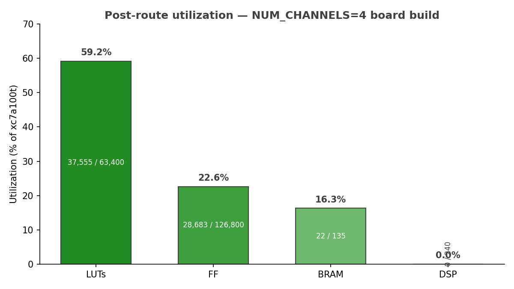
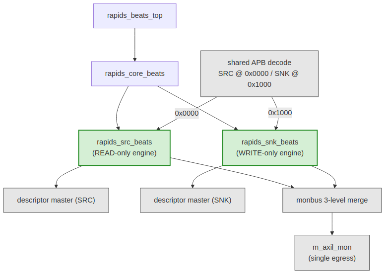
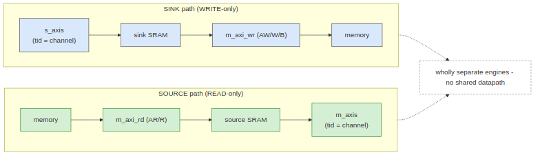
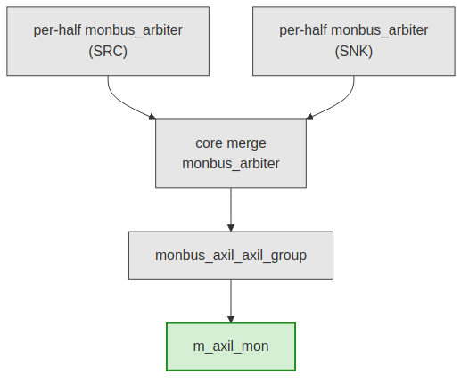
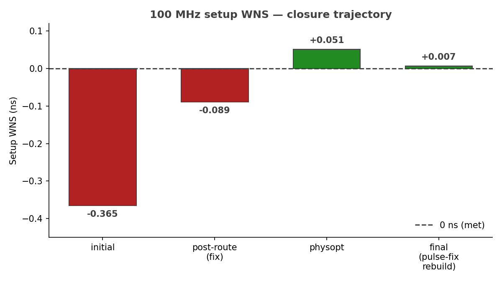
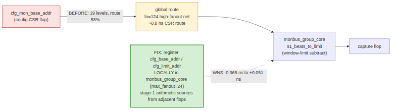
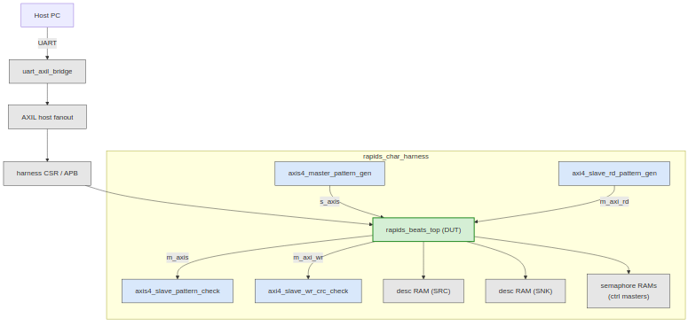
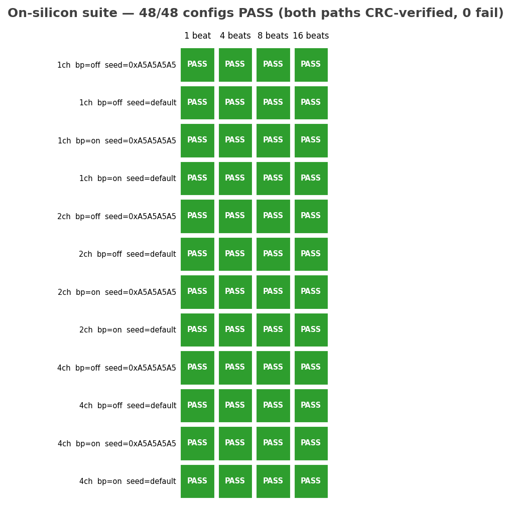

<!-- RTL Design Sherpa Documentation Header -->
<table>
<tr>
<td width="80">
  
</td>
<td>
  <strong>RTL Design Sherpa</strong> · <em>Learning Hardware Design Through Practice</em> 
  
    <a href="https://github.com/sean-galloway/RTLDesignSherpa">GitHub</a> ·
    <a href="https://github.com/sean-galloway/RTLDesignSherpa/blob/main/docs/DOCUMENTATION_INDEX.md">Documentation Index</a> ·
    <a href="https://github.com/sean-galloway/RTLDesignSherpa/blob/main/LICENSE">MIT License</a>
  
</td>
</tr>
</table>

---

<!-- End Header -->

# RAPIDS Beats DMA Engine — Phase 1 Characterization Report

**Component:** RAPIDS beats DMA (`rapids_beats_top`)
**Platform:** Digilent Nexys A7-100T (Xilinx Artix-7 100T, 100 MHz, **4-channel build**, -1 speed grade)
**Status:** Phase 1 complete — the engine was split into two wholly-separate data paths, characterized on real silicon, timing-closed at 100 MHz, and both paths CRC-validated against a deterministic golden model across a full config sweep.

**Headline:** the RAPIDS beats DMA was refactored into two wholly-separate engines — a write-only sink and a read-only source — driven by a directional scheduler. It was characterized on a Nexys A7-100T, closed timing at 100 MHz with **+0.007 ns of setup slack and zero failing endpoints**, and both data paths were CRC-validated on silicon across a **48/48-PASS** sweep of channels, beat counts, backpressure, and seeds.

---

## 0. Resource footprint

Before any dynamic behavior, the static cost. The numbers below are post-route
on `xc7a100tcsg324-1`, **NUM_CHANNELS = 4**, `SRAM_DEPTH = 256`,
`DESC_RAM_ENTRIES = 256`, all monitors enabled, harness included.

| Resource | Used | Available | Utilization |
|---|---:|---:|---:|
| Slice LUTs | 37,555 | 63,400 | **59.2 %** |
| Slice Registers (FF) | 28,683 | 126,800 | **22.6 %** |
| Block RAM tiles | 22 | 135 | **16.3 %** |
| DSP | 0 | 240 | **0 %** |

### Figure 0.1: Post-route utilization — 4-channel board build

LUTs are the tight resource at 59.2 %; the two SRAMs plus the two descriptor
RAMs plus the harness pattern-memory account for the BRAM. There is no DSP in
the design — the beats engine is pure control and datapath movement, no
arithmetic reduction.

### 0.1 The BRAM board-fit trim

The harness ships with generous simulation defaults — `SRAM_DEPTH = 4096` and
`DESC_RAM_ENTRIES = 2048` — chosen so the cocotb testbench never has to think
about buffer pressure. On the 100T those defaults are not synthesizable as-is:
the SRAMs and descriptor RAMs inflate to **148 BRAM tiles**, which overflows the
135-tile device. For the board build the depths were trimmed to `256` each,
which drops the footprint to **22 tiles (16.3 %)** with comfortable headroom.
This is a build-time parameter only; the RTL is unchanged, and the sweep in
Section 9 confirms the trimmed depths cover every characterized transfer size.

---

## 1. What we set out to do

RAPIDS is a descriptor-driven accelerator DMA. The beats variant moves fixed
"beat" quanta between an AXIS network interface and system memory. Before
declaring the split-engine refactor ready, we wanted to **measure** what it
actually does on real silicon — not just pass simulation. Specifically:

1. **Prove the split is clean.** The engine was refactored from a single
   bidirectional block into two wholly-separate engines — a write-only sink and
   a read-only source. Does the split hold on silicon, with no hidden coupling
   between the two paths?
2. **Close timing at 100 MHz on the -1 part.** The shared monitor-bus core
   carries a config-CSR path that had been the chronic critical path on this
   family. Can we close it without pipelining the datapath?
3. **Validate both data paths end-to-end.** Sink (network to memory) and source
   (memory to network) each need independent, deterministic correctness checking
   that survives multi-channel interleave.
4. **Establish a reproducible on-silicon regression.** A smoke test and a full
   config sweep, driven over UART, with machine-readable results — the same
   flow shape STREAM already uses.

The headline answer: the split is clean, timing closes with `+0.007 ns` of
slack, and both paths CRC-match a golden model across all 48 swept
configurations. The rest of this document is the work behind those results.

---

## 2. Test platform

| | |
|---|---|
| FPGA | Xilinx Artix-7 100T (`xc7a100tcsg324-1`, -1 speed grade) |
| Clock | `aclk` = 100 MHz (10 ns period) |
| Build | `rapids_char_top` wrapping `rapids_beats_top`, NUM_CHANNELS = 4 |
| Buffer depths (board) | `SRAM_DEPTH = 256`, `DESC_RAM_ENTRIES = 256` |
| Network interface | AXIS4 (`s_axis` sink in, `m_axis` source out), `tid` = channel |
| Register map | one APB slave, SRC @ `0x0000`, SNK @ `0x1000` |
| Monitor egress | single `m_axil_mon` after a 3-level monbus merge |
| Post-route timing | setup WNS **+0.007 ns**, hold WHS +0.011 ns, 0 failing endpoints |
| Bitstream resources | 37.6k LUTs (59.2 %), 28.7k FFs (22.6 %), 22 BRAM (16.3 %), 0 DSP |
| Host link | UART, board ID `"RAP1"` (`0x52415031`) |

The DUT is `rapids_beats_top`. Everything around it is characterization harness
— not part of the IP, but instrumented to make the engine measurable and
self-checking on real silicon.

---

## 3. Architecture — two wholly-separate engines

The defining change in this generation is that the beats DMA is no longer one
bidirectional block. It is two engines that share nothing but a register
decode and a monitor egress.

### Figure 3.1: Split architecture

`rapids_beats_top` instantiates `rapids_core_beats`, which contains exactly two
data engines:

- **`rapids_snk_beats`** — write-only. It receives from the network and writes
  to memory. It never issues an AXI read.
- **`rapids_src_beats`** — read-only. It reads from memory and sends to the
  network. It never issues an AXI write.

The two are driven by a **directional scheduler** parameterized by `EN_READ` /
`EN_WRITE`, so each engine is compiled with only the half of the scheduler it
needs. A single APB decode fans configuration to both halves — **SRC at
`0x0000`, SNK at `0x1000`** — and each engine drives its own descriptor master.
Monitoring from both halves is merged down to a single `m_axil_mon` egress.

### Figure 3.2: The two data paths are wholly separate

The sink path is `s_axis` (with `tid` = channel) into the sink SRAM, then out
`m_axi_wr` (AW/W/B) to memory. The source path is memory in via `m_axi_rd`
(AR/R), into the source SRAM, then out `m_axis` (with `tid` = channel). There is
no shared datapath, no shared buffer, and no shared AXI master between the two
directions. This is what "wholly separate" means in practice: a change to one
engine cannot introduce a datapath hazard in the other.

### Figure 3.3: Monitor-bus hierarchy — 3-level merge to one egress

Observability is built in and merges in three levels: a per-half
`monbus_arbiter` inside each of the source and sink engines, a core-level
`monbus_arbiter` that merges the two halves, and finally
`monbus_axil_axil_group`, which drains the merged stream to the single
`m_axil_mon` egress. One wire off-chip carries every monitor packet from both
directions.

---

## 4. Timing closure at 100 MHz

Post-route, the build closes with **setup WNS = +0.007 ns, 0 failing
endpoints**, and hold met (WHS = +0.011 ns). Getting there was not free.

### Figure 4.1: 100 MHz setup WNS — closure trajectory

The closure trajectory ran through four points: an initial post-route WNS of
**-0.365 ns** (failing), **-0.089 ns** after the fix landed at post-route,
**+0.051 ns** after phys-opt, and a final **+0.007 ns** on the rebuild that also
folded in the harness pulse-fix of Section 8.

### Figure 4.2: The critical path — a config CSR into the monbus window math

The critical path was **not** in the datapath. It ran from `cfg_mon_base_addr`
— a configuration CSR that essentially never changes at runtime — into
`monbus_group_core`'s `s1_beats_to_limit`, the stage-1 window-limit subtract.
At 19 logic levels it looked like a logic-depth problem, but it was
**route-dominated**: route delay was **53 %** of the path, including a
high-fanout net (`fo = 124`) and roughly **0.8 ns** of pure CSR route just to
reach the arithmetic.

The fix was to **register `cfg_base_addr` / `cfg_limit_addr` locally inside
`monbus_group_core`** with `max_fanout = 24`, so the stage-1 subtract sources
its operands from flops physically adjacent to the arithmetic rather than from a
CSR on the far side of the die. That change alone moved the endpoint from
**-0.365 ns to +0.051 ns** — no datapath pipelining required. Because
`monbus_group_core` is shared collateral, **STREAM benefits from the same fix**.

---

## 5. Vivado bring-up fixes (found vs. Verilator)

The design simulated cleanly under Verilator but Vivado elaboration surfaced a
class of issue Verilator does not: package-symbol collisions under `$unit`
wildcard imports. Vivado merges all `import pkg::*;` into one `$unit` scope, and
guarded imports only apply to the first file that imports them — so a symbol
defined in two packages becomes ambiguous the moment a second file pulls both
in. The fixes, all in the RTL's package qualification (no logic change):

- **`rapids_pkg` vs. `stream_pkg` enum-label collisions.** Both packages define
  `RD_*` and `CH_*` enum labels. Ambiguous references were qualified with
  `rapids_pkg::`.
- **Type collisions.** `channel_state_t`, `descriptor_t`, and
  `read_engine_state_t` exist in both packages; each use site was qualified with
  `rapids_pkg::`.
- **Monitor response codes.** `monitor_amba4_pkg::AXI_ERR_RESP_*` was qualified
  in the control engines, where it otherwise clashed under the merged `$unit`
  scope.

None of these are visible under Verilator's per-file import handling; they only
appear once Vivado flattens the import scope. They are documented here so the
next engine that reuses these packages qualifies from the start.

---

## 6. The characterization harness

### Figure 6.1: `rapids_char_harness` block diagram

The harness wraps `rapids_beats_top` with everything needed to drive it from a
host PC and check both directions on-chip, while leaving the DUT untouched:

- **On-chip AXIS pattern generator and checker.** `axis4_master_pattern_gen`
  drives `s_axis` for the sink path; `axis4_slave_pattern_check` consumes
  `m_axis` on the source path. Both are multi-channel with a **per-channel LFSR
  seeded `seed ^ ch`** and a **CRC-32** computed over the actual beats, so the
  data is deterministic and independently reproducible per channel.
- **Memory-side pattern / CRC.** `axi4_slave_rd_pattern_gen` backs `m_axi_rd`
  with the same deterministic LFSR stream (this is the source path's memory),
  and `axi4_slave_wr_crc_check` CRCs everything written on `m_axi_wr` (the sink
  path's memory).
- **Dual descriptor RAMs.** One descriptor RAM per engine, feeding the two
  independent descriptor masters.
- **Semaphore RAMs** on the control masters, backing the engines'
  control-plane accesses.
- **Host link.** A `uart_axil_bridge` fans the single UART into the AXIL host
  bus, reaching the harness CSRs and the DUT's APB. The board announces itself
  with ID `"RAP1"` (`0x52415031`) so the host script can confirm it is talking
  to the right bitstream.

Every block earned its place: the split engines mean the sink and source each
need their own traffic source and their own checker, and the per-channel LFSR /
CRC keeps correctness meaningful under multi-channel `tid` interleave.

---

## 7. CRC validation on both paths against a golden model

Both directions are checked against a **deterministic software golden model**,
`host/rapids_char_golden.py`, which computes the **reflected CRC-32** over the
per-channel LFSR stream. The model is the single source of truth: the same
expected value is asserted on the write side (sink), the read side (source), and
the on-chip checker.

For an 8-beat transfer the golden model reproduces, per channel:

| Channel | Golden CRC-32 |
|---|---|
| ch0 | `0x8C023372` |
| ch1 | `0x3FB81189` |
| ch2 | `0xD64B4EEC` |
| ch3 | `0x65F16C17` |

These were validated in two independent places:

- **In simulation** — the cocotb harness testbench asserts that the sink write
  CRC, the source read CRC, and the on-chip checker CRC all equal the golden
  value (2/2 checks pass).
- **On the host** — `rapids_char_golden.py` reproduces the same per-channel
  values standalone, so a mismatch on hardware points at the RTL, not at a
  disagreement between the checker and the model.

Because the golden model is deterministic in `(seed, channel, beats)`, the
sweep in Section 9 can assert exact per-channel CRC equality for every one of
its 48 configurations rather than just "no error flagged."

---

## 8. A real harness bug, root-caused

The most instructive find of the campaign was **only visible on hardware**, not
in simulation.

The AXIS pattern generator's `start` control was implemented as a **held
level** — assert the CSR bit, the generator runs. In simulation that is
harmless: the testbench edge-arms the generator and resets it between runs, so
the level is asserted for exactly one controlled window. Over UART it is not
harmless. A single host write holds that level for the **~1–2 ms** it takes the
next UART transaction to arrive, and the generator **re-arms and re-runs
repeatedly** for the entire duration of the held level. Each spurious re-run
pushes more beats into the sink than the checker expects, and the sink
**desyncs** — a failure that never reproduced in sim because sim never holds the
level across real UART timing.

The fix was to make the generator and checker `start` controls **one-cycle
pulses** (the same pattern already used by `cam_clear` elsewhere in the harness)
rather than held levels. One arm equals exactly one run, independent of how long
the host leaves the CSR bit set. This is a textbook example of a bug that a
simulation-only flow cannot catch: it lives entirely in the interaction between
a held CSR level and real-world host timing.

---

## 9. On-silicon results

The engine ships with two on-silicon regression targets driven over UART, both
producing machine-readable JSON results.

- **`make smoke`** — a quick both-paths run, golden-validated. **PASS.**
- **`make suite`** — the full sweep. **48/48 PASS**, both paths CRC-verified
  against the golden model on every configuration.

### Figure 9.1: On-silicon suite — 48/48 configurations PASS

The suite sweeps a clean cross product:

| Axis | Values |
|---|---|
| Active channels | 1, 2, 4 |
| Beats per transfer | 1, 4, 8, 16 |
| Source backpressure | off, on |
| Base seed | default (`0xDEADBEEF`), `0xA5A5A5A5` |

That is `3 x 4 x 2 x 2 = 48` configurations. Every cell in Figure 9.1 is green:
for each configuration, both the sink path (network to memory) and the source
path (memory to network) were exercised, and the per-channel write, read, and
generator/checker CRCs were compared against the golden model. There were **zero
mismatches and zero errors** across the entire grid.

---

## 10. Tooling

The RAPIDS beats flow deliberately mirrors STREAM's characterization flow so the
two engines share operator muscle memory and result tooling:

- **`make smoke` / `make suite`** drive the board over UART and emit
  timestamped JSON (`reports/rapids_char_suite_*.json`) with per-configuration,
  per-channel golden/measured CRCs and pass flags.
- **`host/rapids_char_golden.py`** is the standalone golden model, usable
  independently of the board for offline expected-value generation.
- The **DOCX/PDF report pipeline** (this document) uses the same house
  `md_to_docx.py` recipe and corporate style sheet STREAM uses, so both
  characterization reports render identically.

---

## 11. What we learned

1. **The split is clean on silicon.** Two wholly-separate engines — write-only
   sink, read-only source — with no shared datapath, driven by one directional
   scheduler and merged only at the monitor egress. The 48/48 sweep confirms
   neither path perturbs the other.

2. **The chronic critical path was route, not logic.** The `cfg_mon_base_addr`
   into `s1_beats_to_limit` path looked like 19 levels of logic but was 53 %
   route. Registering the config operands locally in `monbus_group_core`
   (`max_fanout = 24`) closed it — from `-0.365 ns` to `+0.051 ns` — with no
   datapath pipelining, and the fix carries over to STREAM.

3. **Timing closes at 100 MHz with margin to spare in the datapath.** Final
   setup WNS `+0.007 ns`, hold met, zero failing endpoints on the -1 part.

4. **Vivado catches package collisions Verilator hides.** `rapids_pkg` /
   `stream_pkg` enum-label and type clashes only surface once Vivado flattens
   `$unit` imports; qualifying at the use site is the durable fix.

5. **Both data paths are golden-validated, not just error-free.** A
   deterministic reflected-CRC-32 model checks exact per-channel values on the
   sink write side, the source read side, and the on-chip checker — in sim and
   on the host.

6. **Some bugs only exist on hardware.** The held-level AXIS start CSR re-ran the
   generator for the whole UART inter-transaction gap and desynced the sink;
   converting `start` to a one-cycle pulse fixed it. A simulation-only flow
   would never have seen it.
