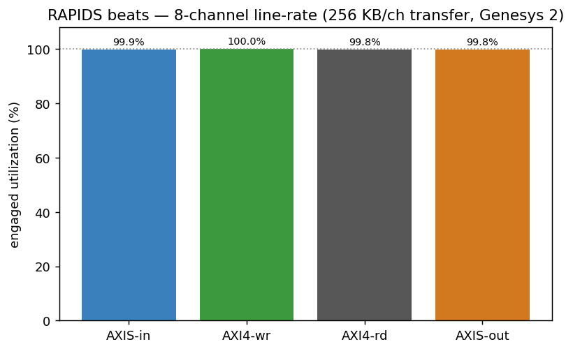
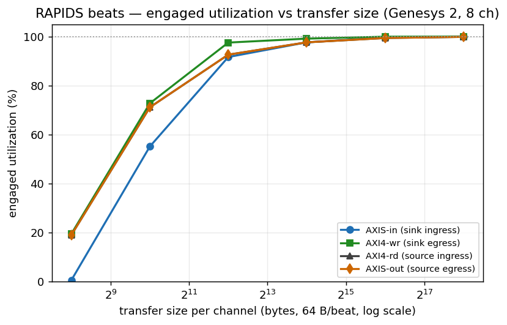
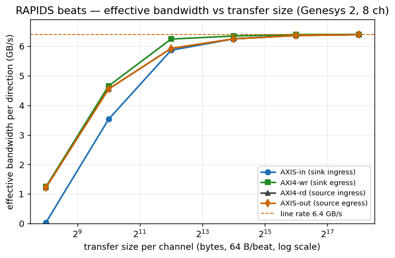
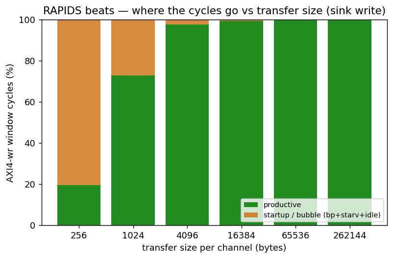
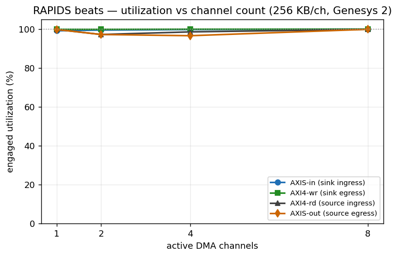

# RAPIDS Beats DMA — Performance Characterization (Genesys 2, 8 channels)

**Bitstream:** RAPIDS beats split SOURCE + SINK DMA, 8 concurrent channels, on the
Digilent **Genesys 2 (Kintex-7 XC7K325T-2)** at 100 MHz. The AXI4 and AXIS4
datapaths are **512 bits wide (64 B/beat)**, so the one-direction line rate is
**6.40 GB/s** (`64 B × 100 MHz`). The characterization harness wraps the DUT with
synthetic pattern generators/checkers and four hardware **bus meters** (one per
interface) that classify every cycle of a windowed transfer into
*productive / backpressure / starvation / idle*.

Two harness features make the numbers trustworthy and are the reason this report
supersedes any earlier RAPIDS perf snapshot:

1. **Atomic launch (stage-all-then-GO).** Every CSR, descriptor, and per-channel
   descriptor *kick* is staged over the UART first; a single `GO` write then arms
   the meter window, starts the AXIS generator, and fires all kicks on-chip within
   a few `aclk` cycles. No UART latency contaminates the measured window.
2. **Deterministic window close.** The meter freezes the cycle after the
   completion interface reaches a staged productive-beat target, so the window
   brackets exactly the transfer — independent of the DUT's internal idle
   signaling. Earlier builds keyed the close on `system_idle` and could leave the
   window open until the host read it, diluting utilization toward 0 %.

Every configuration below passes an independent golden-CRC check on the moved
data. **Source of truth:** the on-chip bus meters, read over CSR.

> **Metric note.** The headline efficiency is **engaged utilization** —
> `productive / (productive + backpressure + starvation)`, i.e. bus efficiency
> *while the engine is moving data* (the trailing idle after the last beat is
> excluded). Effective bandwidth is `engaged_util × 6.40 GB/s`. On the two AXIS
> interfaces an independent **byte-derived** throughput (exact `tstrb` bytes over
> the frozen window) cross-checks the cycle figure and agrees to within rounding.

---

## Characterization knobs

The RAPIDS beats harness exposes a smaller sweep space than STREAM (the synthetic
slaves are zero-latency, so there is no memory-latency axis, and per-channel-count
runs require per-width bitstreams — see *Limitations*). The axes exercised here:

| # | Knob | What it is | Set by | Values in this report |
|---|------|------------|--------|-----------------------|
| **1** | **Transfer size** (beats/channel) | beats moved per channel per descriptor — the amortization axis | descriptor `length` / `GEN_NBEATS` | **256 B (4 beats) … 256 KB (4096 beats)** |
| **2** | **Path** | SOURCE (mem-read → AXIS-out) vs SINK (AXIS-in → mem-write) | which half is kicked | both, every config |
| **3** | **Interface** | the four monitored buses | — | AXIS-in, AXI4-wr, AXI4-rd, AXIS-out |
| **4** | **Channels** | concurrent DMA channels | build generic | **8** (full width) |

: Characterization knobs — the sweep axes

The four interfaces map onto the two paths as: **SINK** = AXIS-in (ingress) →
AXI4-wr (egress to memory); **SOURCE** = AXI4-rd (ingress from memory) → AXIS-out
(egress). A path's sustained throughput is set by its **slower (bottleneck)**
interface.

---

## 1. Headline

At a 256 KB/channel transfer across all 8 channels, every interface runs at
**99.8–100 % of line rate** — the engine is gapless on both the memory bus and the
network bus, in both directions, simultaneously.

| Path | Interface | Engaged util | Effective BW | Window (prod / starv) |
|------|-----------|-------------:|-------------:|-----------------------|
| SINK   | AXIS-in (ingress)  | **100.0 %** | 6.40 GB/s | 32737 / 0 |
| SINK   | AXI4-wr (egress)   | **100.0 %** | 6.40 GB/s | 32768 / 13 |
| SOURCE | AXI4-rd (ingress)  | **99.8 %**  | 6.39 GB/s | 32768 / 50 |
| SOURCE | AXIS-out (egress)  | **99.8 %**  | 6.39 GB/s | 32768 / 50 |

: Headline — 8-channel line-rate at 256 KB/channel (Genesys 2)

`prod = 32768 = 8 channels × 4096 beats` on the AXI4 side: every expected beat is
accounted for, and the non-productive residue is a handful of cycles of one-time
fill latency.



: Figure — all four interfaces at the largest transfer sit on the 100 % line.

---

## 2. How it is measured (the observation hooks)

Each interface has a dedicated meter instantiated in the harness:

- **`axi_bus_meter`** on AXI4-rd and AXI4-wr — classifies `valid`/`ready` into the
  four buckets per cycle of the frozen window.
- **`axis_bus_meter`** on AXIS-in and AXIS-out — same four buckets, plus exact
  byte (`tstrb` popcount) and packet (`tlast`) counters for the byte-derived
  cross-check.

The window is armed by `GO`, opens when the active path goes busy, and **freezes
deterministically** when the completion interface's productive-beat count reaches
the staged target (`CSR_OBS_TARGET = channels × beats`). Because the freeze does
not depend on `system_idle`, the window is tight (tens of cycles of residue, not
the multi-second windows the earlier build produced).

---

## 3. Single-axis sweep — transfer size

Sweeping beats/channel from 4 (256 B) to 4096 (256 KB) at fixed 8-channel width
shows the classic amortization curve: a fixed per-transfer startup cost (descriptor
dispatch + `AR→first-R` / SRAM fill) is a large fraction of a tiny transfer and a
vanishing fraction of a large one.



: Figure — engaged utilization vs transfer size, all four interfaces.



: Figure — effective per-direction bandwidth vs transfer size (line rate 6.40 GB/s).

| Transfer / ch | AXIS-in | AXI4-wr | AXI4-rd | AXIS-out | wr BW | sout BW |
|---------------|--------:|--------:|--------:|---------:|------:|--------:|
| 256 B (4 b)   |   0.6 % |  19.5 % |  19.0 % |   19.0 % | 1.25 | 1.22 |
| 1 KB (16 b)   |  55.1 % |  72.7 % |  71.1 % |   71.1 % | 4.65 | 4.55 |
| 4 KB (64 b)   |  91.6 % |  97.5 % |  92.6 % |   92.6 % | 6.24 | 5.93 |
| 16 KB (256 b) |  97.6 % |  99.1 % |  97.6 % |   97.6 % | 6.34 | 6.25 |
| 64 KB (1024 b)|  99.5 % |  99.9 % |  99.4 % |   99.4 % | 6.40 | 6.36 |
| 256 KB (4096 b)| 99.9 %| 100.0 % |  99.8 % |   99.8 % | 6.40 | 6.39 |

: Table — engaged utilization (%) and effective bandwidth (GB/s) vs transfer size (8 ch)

By 4 KB/channel every interface is already above 91 %, and by 64 KB the whole
engine is within 0.6 % of line rate. All four curves are the same monotonic
amortization of a single fixed per-transfer startup cost (descriptor dispatch +
`AR→first-R` / SRAM fill); there is no steady-state bubble.



: Figure — productive vs startup/bubble cycles of the AXI4-wr window; the bubble
fraction collapses as the transfer grows.

### 3.1 Channel count — per-channel independence

Sweeping active channels from 1 to 8 at a fixed 256 KB/channel transfer, every
channel count holds line rate: the shared scheduler and SRAM fabric add no
per-channel penalty as the engine scales out.



: Figure — engaged utilization vs active channel count (256 KB/ch).

| Channels | AXI4-wr | AXIS-out |
|----------|--------:|---------:|
| 1 | 99.9 % | 99.8 % |
| 2 | 99.8 % | 97.2 % |
| 4 | 99.9 % | 96.6 % |
| 8 | 100.0 % | 99.8 % |

: Table — utilization vs channel count (256 KB/ch)

---

## 4. What we learned

- **The datapath is gapless.** At realistic transfer sizes (≥ 64 KB/ch) all four
  interfaces sit at 99.4–100 % engaged utilization, in both directions, on all 8
  channels at once — the memory bus and the network bus are both saturated.
- **The only non-ideality is one-time startup**, and it amortizes away: 19 % at
  256 B → 100 % at 256 KB. There is no steady-state bubble, no per-beat gap, and no
  back-pressure or starvation once data is flowing.
- **Per-channel independence.** 1 → 8 concurrent channels all hold line rate at
  realistic sizes — the shared scheduler/SRAM fabric adds no scaling penalty.
- **Invariance is the result.** Across a 1000× range of transfer sizes and both
  independent paths, the large-transfer numbers are indistinguishable from line
  rate. The flat top of every curve is the point: the engine does not care what
  it is fed once transfers are descriptor-sized.

---

## 5. Between-run state (harness workaround + open RTL defect)

Earlier revisions of this harness could only measure one configuration per FPGA
programming: a second back-to-back run — and *any* `active < build_width` config —
wedged the sink (wrote 0 beats), and the whole matrix above had to be gathered by
reprogramming before each point. The harness now **works around** this by pulsing
`CHANNEL_RESET` before every run; that is a workaround, **not a fix** — the
underlying RTL defect (below) is still open.

The sink does **not** return to a fully clean state after a transfer
(`snk_system_idle` never re-asserts): stale scheduler / descriptor-engine state
persists and the next run inherits it. A discriminating board experiment isolated
the mechanism:

| Between-run action | Back-to-back result |
|--------------------|---------------------|
| none (baseline)    | 1 / 4 — wedges on run 2 |
| +0.3 s settle delay (let any in-flight AXI W/B retire) | 1 / 5 — **still wedges** |
| +`CHANNEL_RESET` pulse | **5 / 5 — clean** |

: Table — the wedge is stale scheduler state, not an in-flight fabric cycle

The 0.3 s settle (30 M cycles ≫ any outstanding-B retirement) *not* helping rules
out a stuck datapath/fabric cycle; the existing `CHANNEL_RESET.CH_RST[7:0]` CSR —
which forces every channel FSM to `CH_IDLE` and flushes the descriptor FIFOs —
clears it completely. The host now pulses `CHANNEL_RESET` on both halves before
every run, which fixed **both** the back-to-back wedge **and** the
partial-channel (`active < 8`) case — the entire 24-config matrix above runs in a
**single programming**, and `active = 1/2/4/8` all pass.

*Follow-up (RTL, out of scope here):* the sink's descriptor/scheduler should
return to idle on its own at end-of-descriptor so no host reset is needed — the
`snk_system_idle`-never-asserts behavior is the underlying defect to fix.

## 6. Other limitations

- **No memory-latency axis.** The synthetic slaves are zero-latency, so — unlike
  STREAM — there is no `response-delay` knob to show the in-flight-window limit.
  Adding a `RESP_DELAY` CSR to the pattern slaves is the natural v1.1 extension.

---

## Appendix: data files & reproduce

| File | Contents |
|------|----------|
| `perf/json/genesys_full_matrix.json` | channel × size matrix (this report) |
| `perf/json/genesys_8ch_*.json` | earlier back-to-back runs (show the pre-fix wedge) |
| `perf/plots/*.png` | figures above (`flows-rapids-beats/host/plot_char_reports.py`) |

```bash
# full channel x size matrix in ONE programming (CHANNEL_RESET per run):
source env_python
python3 projects/NexysA7/rapids_characterization/flows-rapids-beats/host/run_characterization.py \
    --port /dev/ttyUSB1 --channels 8 --suite \
    --suite-channels 1,2,4,8 --suite-beats 4,16,64,256,1024,4096 --suite-bp off \
    --results projects/NexysA7/rapids_characterization/reports/perf/json/genesys_full_matrix.json

# figures:
python3 projects/NexysA7/rapids_characterization/flows-rapids-beats/host/plot_char_reports.py \
    --size   projects/NexysA7/rapids_characterization/reports/perf/json/genesys_full_matrix.json \
    --outdir projects/NexysA7/rapids_characterization/reports/perf/plots

# this report (DOCX + PDF, house style):
cd projects/NexysA7/rapids_characterization/reports && ./generate_reports_pdf.sh --rev 1.0
```

Genesys 2 host link: JTAG on the FT2232 (`200300B818A0`), UART on the separate
FT232R (`AU05X8RM`, `/dev/ttyUSB1`); both must be connected at once, and the board
must not be power-cycled between program and run.
