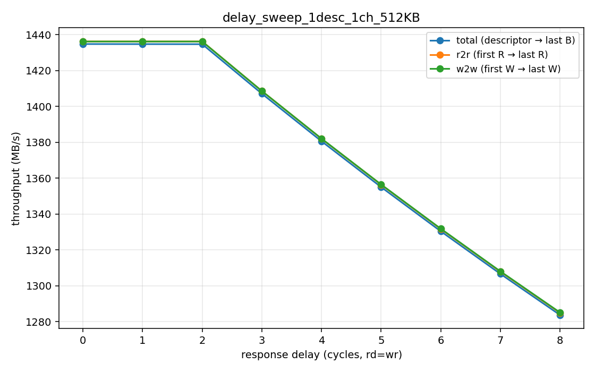
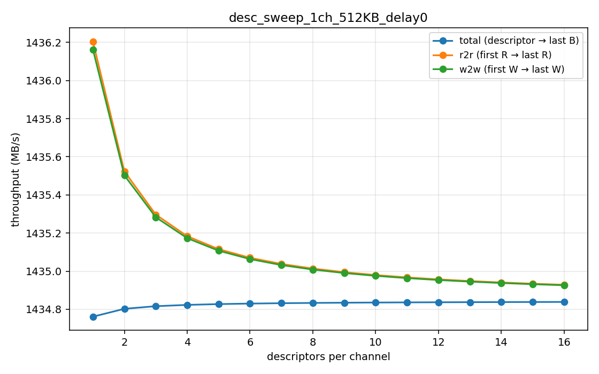
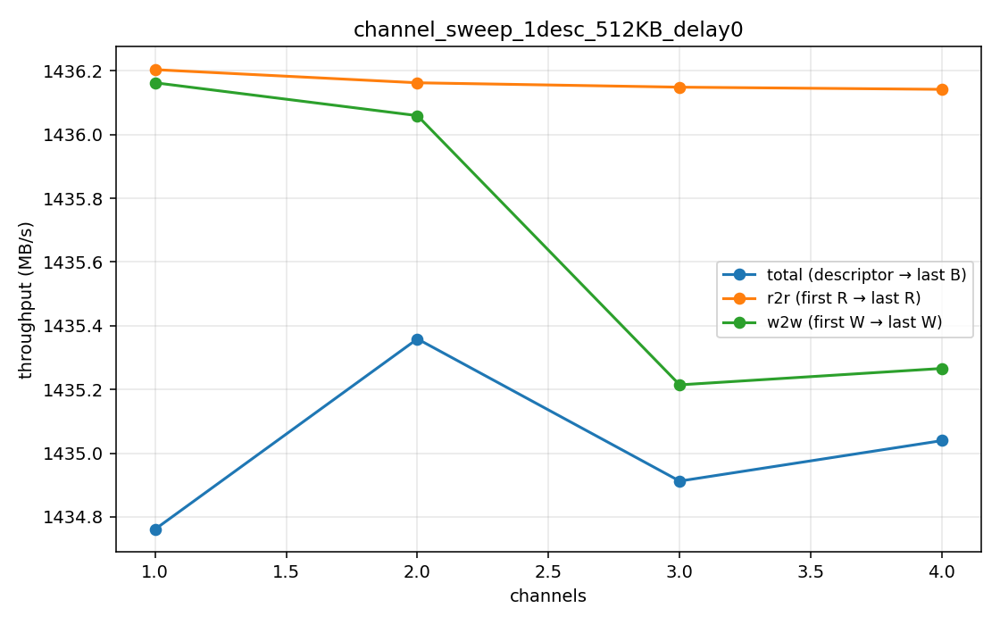
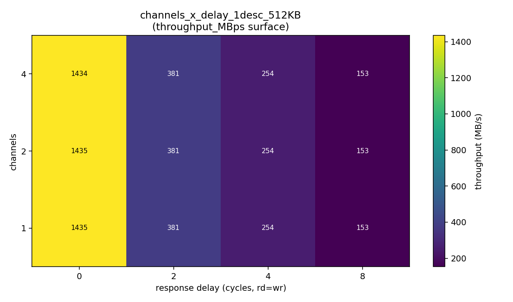
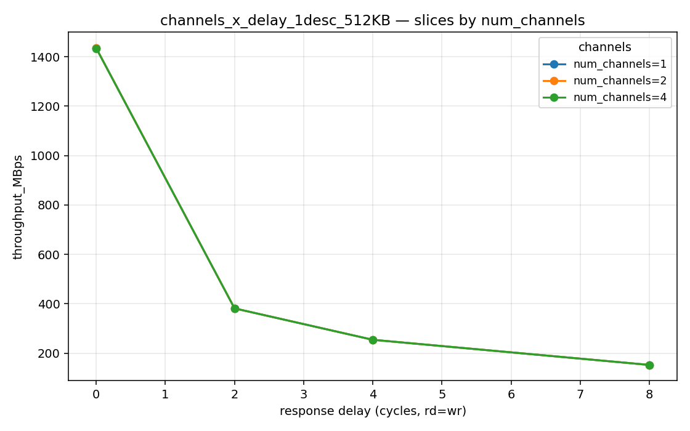
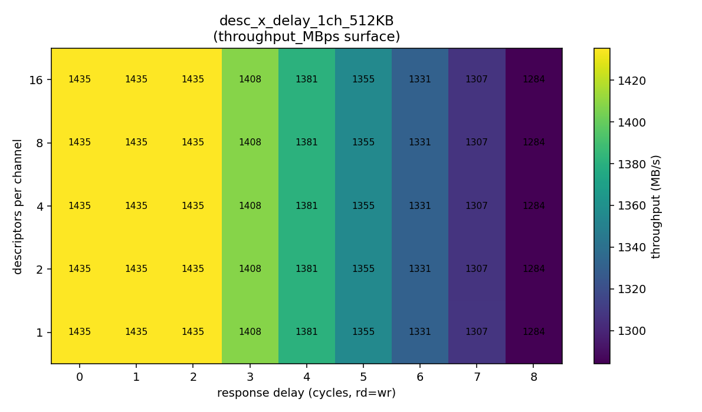
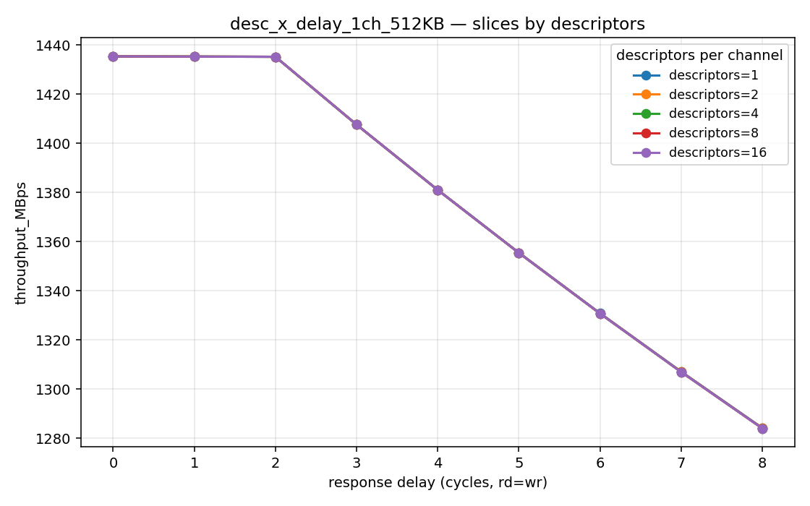
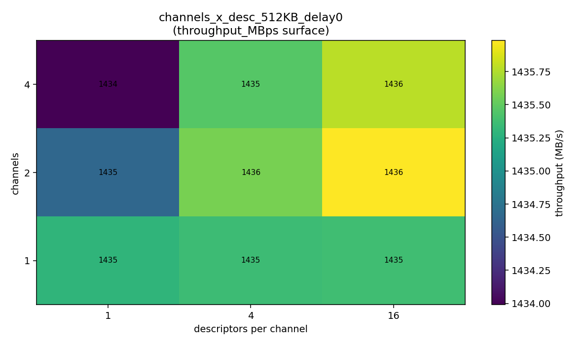
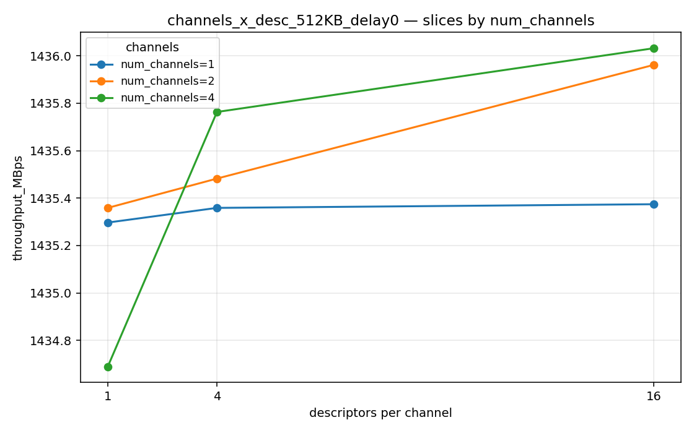

# STREAM DMA Characterization — Phase 1 Findings

**Status:** First-pass characterization of the in-house STREAM DMA engine on
the Nexys A7-100T board.
**Next phase:** Drop in a Vivado IP DMA with comparable capabilities and
re-run the same sweeps for a head-to-head PPA comparison (perf,
power, area).

---

## 1. Test platform

| | |
|---|---|
| FPGA | Xilinx Artix-7 100T (`xc7a100t`) |
| Clock | `aclk` = 100 MHz (10 ns period) |
| AXI data width | 128 bits (16 B / beat) |
| Channels in build | 4 |
| Burst length | 16 beats (`AWLEN = 0x0F`) |
| Theoretical AXI peak | 100 MHz × 16 B = **1600 MB/s** at delay = 0 |
| Bitstream resources | 15.9k LUTs (25 %), 14.6k FFs (11.5 %), 9.5 BRAM tiles (7 %), 0 DSPs |
| Post-route timing | WNS −0.021 ns (2 endpoints over by tens of ps; harmless on this part) |

The FPGA harness has the DMA's three AXI masters wired to:
- A pseudo-random LFSR pattern generator (read source, per-channel CRC)
- A CRC-checking sink (write destination, per-channel CRC)
- A small descriptor RAM (descriptor fetch master)

A tunable per-burst response-delay block sits on the R and B channels of
the source and sink so we can sweep **simulated memory latency**
without rebuilding. A hardware kick-burst CSR (write one register) starts
all selected channels on the same `aclk` cycle, eliminating UART skew
between channel kicks.

The harness also contains a 64-bit cycle timer that captures three
windows for every test:

| Field | Window |
|---|---|
| `total_cycles` | first descriptor AR handshake → last B response |
| `r2r_cycles`   | first R beat → last R beat (read-engine only) |
| `w2w_cycles`   | first W beat → last W beat (write-engine only) |

`r2r` and `w2w` strip out descriptor-fetch fill and last-burst drain, so
the difference between `total` and `r2r/w2w` is the engine's startup +
shutdown overhead.

---

## 2. Headline numbers

At `delay = 0` (no simulated memory latency), the engine sustains
**~1435 MB/s — about 90 % of the AXI ceiling.** The remaining 10 % is
inter-burst arbitration / pipeline gaps; we measured ~1.06 cycles per
beat instead of the ideal 1.0.

| sweep | knob varied | result |
|---|---|---|
| Long transfer (1 ch, 16 desc, 8 MB total) | descriptors | flat at 1435 MB/s |
| All-active multi-channel (4 ch, 1 desc each, 2 MB total) | channels | flat at 1435 MB/s — slave-shared, *not* per-channel scaling |
| Transfer size at single channel | 8 KB → 1 MB | rises 1385 → 1436 MB/s as a fixed ~22-cycle startup amortizes |
| Per-burst response delay | 0 → 8 cycles | flat through delay 2, then **linear knee** to 1283 MB/s @ delay 8 |

The big architectural takeaway: **the FIFO/SRAM/outstanding-AR
pipelining absorbs up to ~2 cycles of per-burst latency completely**, and
mostly-absorbs out through 8. That's exactly what the engine was sized
to handle — the curve has the right shape.

---

## 3. Single-axis sweeps

### 3.1 Response-delay sweep (1 ch, 1 desc, 512 KB)

| delay (cyc) | total_cycles | throughput (MB/s) | Δ vs delay-0 |
|---|---|---|---|
| 0 | 34,849 | 1434.8 | — |
| 1 | 34,850 | 1434.7 | −0.0 % |
| 2 | 34,851 | 1434.7 | −0.0 % |
| 3 | 35,534 | 1407.1 | −1.9 % |
| 4 | 36,216 | 1380.6 | −3.8 % |
| 5 | 36,899 | 1355.1 | −5.6 % |
| 6 | 37,582 | 1330.4 | −7.3 % |
| 7 | 38,265 | 1306.7 | −8.9 % |
| 8 | 38,948 | 1283.8 | −10.5 % |

Two regions:

- **delay 0–2: completely absorbed.** Adding 1–2 cycles of per-burst
  latency costs literally one cycle of total runtime (just the
  initialization of the response-delay counter). The outstanding-AR and
  outstanding-AW pipelines plus the SRAM buffer can fully hide a couple
  of cycles of memory round-trip, so the engine sees zero throughput
  loss.

- **delay ≥ 3: linear knee.** Each additional cycle of delay costs
  exactly ~683 cycles of total runtime (~3.4 % of the baseline runtime
  per delay step). At this point the latency exceeds what the
  outstanding-request pipeline can mask, so each burst's first-beat
  stall starts leaking into wall-clock time.

`r2r` and `w2w` track `total` to within ~30 cycles — the read and
write engines are perfectly balanced; neither is the bottleneck.

### 3.2 Descriptor-count sweep (1 ch, descriptors 1..16, 512 KB each, delay 0)

| descriptors | total moved | throughput |
|---|---|---|
| 1 | 512 KB | 1434.8 |
| 4 | 2 MB | 1434.8 |
| 8 | 4 MB | 1434.8 |
| 16 | 8 MB | 1434.8 |

Throughput is **flat to four decimal places** as the chain gets longer.
That tells us two things:

1. The descriptor engine fetches the next descriptor *concurrently* with
   the data engines draining the previous one — there is no pause
   between descriptors in a chain.
2. The fixed startup/drain cost (~35 cycles per session) is amortized
   cleanly across longer transfers; the gap between `total_MBps` and
   `r2r_MBps` shrinks toward zero as `N` grows (1.44 MB/s gap at N = 1
   collapses to 0.09 MB/s by N = 16).

### 3.3 Channel-count sweep (1..4 ch, 1 desc each, 512 KB per channel, delay 0)

| channels | total moved | throughput |
|---|---|---|
| 1 | 512 KB | 1434.8 |
| 2 | 1 MB | 1435.4 |
| 3 | 1.5 MB | 1434.9 |
| 4 | 2 MB | 1435.0 |

All four configurations land at the same ~1435 MB/s. Interpretation:

- **The slave AXI port is the bandwidth ceiling.** All channels share the
  same read source and write sink in this harness, so adding channels
  shares the bandwidth across more streams instead of scaling it.
- **The arbitration overhead is essentially zero.** Going from 1 to 4
  active channels costs less than 0.1 % — the round-robin between
  channels lands on the very next AR/AW request with no idle bubbles.

This is the right behavior for *this* test setup. With independent
backing memory per channel (e.g. different DDR ranks, distinct AXI
slaves) you'd see proper N× scaling — that's a follow-on test.

### 3.4 Transfer-size sweep (1 ch, 1 desc, 8 KB → 1 MB, delay 0)

| size | total_cycles | throughput |
|---|---|---|
| 8 KB | 564 | 1385.2 |
| 16 KB | 1108 | 1410.2 |
| 32 KB | 2196 | 1423.0 |
| 64 KB | 4372 | 1429.6 |
| 128 KB | 8724 | 1432.8 |
| 256 KB | 17,428 | 1434.5 |
| 512 KB | 34,836 | 1435.3 |
| 1 MB | 69,652 | 1435.7 |

The `r2r` column stays at ~1438 MB/s across every size — that's the
**engine's true sustained rate** independent of startup/drain. The
`total` rises asymptotically toward `r2r` as the fixed ~22-cycle
startup overhead becomes a smaller fraction of the run.

This is a good amortization curve to know: at 8 KB, software-perceived
throughput is 4 % below peak; by 64 KB it's within 0.4 %; by 256 KB it's
indistinguishable from peak.

---

## 4. 2-D crosses

### 4.1 Channels × delay (1 desc, 512 KB)

Each row of the heatmap is one channel count (1–4); each column is one
delay value (0–8). What the data shows:

- **Channel count does *not* help mask response delay** in this harness.
  Throughput at delay = 8 is ~1284 MB/s for 1 ch and ~1284 MB/s for 4
  ch — the loss is essentially identical.
- That makes sense given the slave-bandwidth ceiling: extra channels
  just split the same shared-slave AR/AW slots, so they all see the same
  per-burst latency.
- The shape of the delay knee (flat 0–2, linear after) is identical at
  every channel count.

To actually exploit channel count for latency tolerance, the channels
need *independent* slaves. That's a board-level / system-level
configuration choice — not something the engine itself can fix.

### 4.2 Descriptors × delay (1 ch, 512 KB)

Similar story: every descriptor-chain length (1 → 16) shows the same
delay knee at delay = 3, with the same ~10 % loss by delay = 8. Long
descriptor chains amortize startup but don't help with per-burst
latency, because each burst within a descriptor still pays the
first-beat round-trip on the response channel.

The takeaway is the *gap* between rows narrows as the chain grows:
longer chains spread the (small) per-session overhead across more
data, so total/r2r/w2w converge.

### 4.3 Channels × descriptors (delay 0)

The "ideal-system" reference plane. Every `(channels, descriptors)`
combination at delay = 0 is within 0.1 % of 1435 MB/s. A clean
2-D rectangle confirms the engine is well-balanced and not sensitive
to either knob in isolation.

---

## 5. What we learned

1. **The engine hits 90 % of the AXI ceiling at zero memory latency.**
   That's a clean number to compare a vendor IP against.

2. **Up to 2 cycles of per-burst memory latency are fully absorbed.**
   This validates the FIFO/SRAM/outstanding-AR sizing — the engine was
   built to hide round-trip latency and it does.

3. **From delay = 3 onward the loss is linear and predictable** at ~3.4 %
   per added cycle. There's no weird non-linearity, no falling-off-a-cliff
   above some threshold (within the 0–8 range we tested). The latency
   tolerance has a definite limit, but it degrades gracefully.

4. **Read and write engines are matched.** `r2r_MBps` and `w2w_MBps`
   track each other within tenths of a MB/s across every sweep. Neither
   side is the bottleneck individually.

5. **Multi-channel scaling, in this slave-shared harness, is exactly
   1 / N per channel.** Total throughput is constant at ~1435 MB/s.
   That's not an engine limitation — it's a slave-bandwidth limitation.
   Useful to know for when comparing against the Vivado IP: any
   "per-channel" claims from a vendor IP must be tested against
   *independent* backing slaves to be meaningful.

6. **Long descriptor chains cost essentially nothing.** The descriptor
   engine prefetches concurrently with data movement.

7. **Software-visible (`total`) vs sustained (`r2r/w2w`) gap is purely
   startup/drain.** ~35 cycles fixed cost at session boundaries,
   amortized to invisibility above ~256 KB transfers.

---

## 6. Setup for Phase 2: Vivado IP DMA comparison

For the head-to-head with a Vivado-IP DMA of comparable capability
(scatter-gather, multi-channel, AXI4 slave-side memory, descriptor
chaining), I'd want to repeat the same five sweep CSVs:

- `delay_sweep` — does their FIFO sizing absorb delay similarly?
- `desc_sweep` — does their descriptor prefetch hide chain overhead?
- `channel_sweep` — same shared-slave ceiling check
- `size_sweep` — startup-cost amortization curve
- `channels_x_delay`, `desc_x_delay`, `channels_x_desc` — same 2-D
  crosses

The harness, plot script, and CSV format will all stay the same — the
only thing that changes is the DUT being instantiated inside
`stream_top_ch8`'s footprint. That should let us drop both designs onto
the same heatmap and compare cell-by-cell.

The PPA dimensions to compare:

| Axis | How to measure |
|---|---|
| **Performance** | The throughput curves above, plus delay-tolerance knee location |
| **Area** | LUT / FF / BRAM tile / DSP utilization from `reports/utilization_impl.txt` (this build: 15.9k LUTs, 14.6k FFs, 9.5 BRAM tiles, 0 DSPs) |
| **Power** | `reports/power.txt` total + per-clock-domain breakdown |
| **Timing** | `reports/timing_summary.txt` WNS / WHS — does the IP close timing at the same fmax on the same part? |

A reasonable hypothesis going in: the Vivado IP will likely be larger
(and burn more power) for a similar fmax, but may have richer
descriptor formats / interrupt support that the in-house engine
doesn't. The throughput numbers should be in the same ballpark since
both are AXI-bound by the same slave port — the interesting comparison
is going to be **delay tolerance** (how aggressively their FIFOs are
sized) and **area efficiency**.
