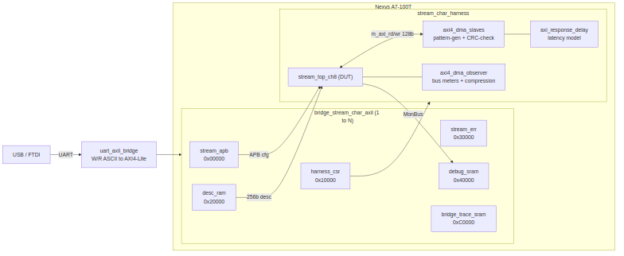

# How It Works

## The spine (primary flow)

The host drives one UART link into a generated 1→N AXI4-Lite/APB fabric that
fans out to the DUT config, the harness CSR, and the trace/error memories:

### Figure 2.1: STREAM Characterization Harness Spine

**Source:** [01_harness_spine.mmd](../assets/mermaid/01_harness_spine.mmd)

## Bridge slaves and base addresses

From `flows-stream-bridge/host/ADDRESS_MAP.md` and `PORT_MAP.md` (the current design; the older
`flows-stream-bridge/README.md` describes a superseded 5-slave decoder — trust
the address-map docs):

| Base | Size | Slave | Width | Protocol |
|------|------|-------|:-----:|----------|
| 0x0000_0000 | 4 KB | `stream_apb` (STREAM config) | 32b | APB |
| 0x0001_0000 | 4 KB | `harness_csr` | 32b | AXIL |
| 0x0002_0000 | 64 KB | `desc_ram` (32 B/desc) | 256b | AXIL |
| 0x0003_0000 | 4 KB | `stream_err` (MonBus IRQ-FIFO drain) | 64b | AXIL |
| 0x0004_0000 | 256 KB | `debug_sram` (MonBus bulk trace) | 64b | AXIL |
| 0x0008_0000 | 4 KB | `dma_axil` (tied off, reserved MCDMA) | 32b | AXIL |
| 0x000c_0000 | 64 KB | `bridge_trace_sram` (bridge MonBus trace) | 64b | AXIL |

: Bridge slave address map

Every MonBus-carrying AXI path is 64-bit. The descriptor read path is a direct
256-bit AXI4 (`m_axi_desc` ↔ `desc_ram`, bypassing the bridge); the DMA payload
masters `m_axi_rd` / `m_axi_wr` are 128-bit into the pattern-gen / CRC-check
slaves.

## Key RTL blocks

| File | Role |
|------|------|
| `flows-stream-bridge/rtl/stream_char_top.sv` | FPGA pin-level top: instantiates the harness, `led_status_driver`, `seven_seg_4digit`. |
| `flows-stream-bridge/rtl/stream_char_harness.sv` | The integration hub: `uart_axil_bridge` + generated `bridge_stream_char_axil` + `harness_csr` + `desc_ram` + `debug_sram` + `axi_response_delay` ×2 + `axi4_dma_slaves` + `axi4_dma_observer` + the DUT `stream_top_ch8`. |
| `stream_char_framework/rtl/` | Shared framework RTL: `harness_csr.sv` (authoritative CSR), `desc_ram.sv`, `debug_sram.sv`, `axi_response_delay.sv`, `led_status_driver.sv`, `seven_seg_4digit.sv`, `sram_chan_tracker.sv`. |

: Key RTL blocks

## The instrumentation harness

Around the DUT, the harness supplies stimulus, a memory-latency model, and
non-perturbing observability:

- **`axi4_dma_slaves`** — an LFSR read-source pattern generator (feeds `m_axi_rd`)
  and a write-sink CRC checker (verifies `m_axi_wr`).
- **`axi_response_delay` ×2** — a programmable memory-latency model on the read
  and write paths (the `RESP_DELAY` CSR, Chapter 5).
- **`axi4_dma_observer`** — non-perturbing valid/ready bus meters plus a burst
  histogram and the MonBus-compression observer, all read back through the
  harness CSR.

The DUT's own MonBus monitors feed `debug_sram`; the monbus compressor / half-beat
packer (`USE_MON_COMPRESSION`) drives the compression characterization.
