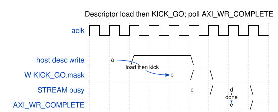

# Harness CSR Configuration

## Address map and by-name access

The bridge fans out to the slaves in Chapter 2. This chapter covers the
`harness_csr` slave at `HARNESS_CSR_BASE = 0x0001_0000`.

**No PeakRDL RDL exists for the harness CSR.** `harness_csr.sv`
(`stream_char_framework/rtl/`) is authoritative; a mirror table in
`stream_char_framework/bin/gen_harness_regmap.py` generates
`stream_char_framework/rtl/harness_csr_regmap.py`. The host accesses it **by
name** — `host/harness_addrs.py` `H("NAME")` resolves `HARNESS_CSR_BASE + offset`
via `RegisterMap`; never hardcode offsets.

The **STREAM DUT's** APB config, by contrast, *is* PeakRDL-generated
(`stream_regmap.py` from `stream_regs.rdl`), accessed by name via
`host/stream_addrs.py` `A("NAME")` — see the monitor-window note below.

### Waveform 4.1: Descriptor Load and Kick

**Source:** [01_desc_kick.json](../assets/wavedrom/01_desc_kick.json)

## harness_csr — control / status (base 0x0001_0000)

| Register | Offset | Field | Bits | Access | Description |
|----------|:------:|-------|:----:|:------:|-------------|
| `CTRL` | 0x00 | `start` | [0] | W | Pulse: start a measured run |
| `CTRL` | 0x00 | `clear_stats` | [1] | W | Pulse: clear meters + sticky errors |
| `CTRL` | 0x00 | `freeze_trace` | [2] | RW | Latch: freeze counters |
| `CTRL` | 0x00 | `soft_reset` | [3] | W | Pulse: soft reset |
| `CTRL` | 0x00 | `cam_clear` | [4] | W | Pulse: clear the error CAM |
| `STATUS` | 0x04 | `stream_irq` | [0] | R | STREAM interrupt |
| `STATUS` | 0x04 | `any_error` | [1] | R | Sticky error OR |
| `STATUS` | 0x04 | `trace_overflow` | [2] | R | Trace ring wrapped |
| `STATUS` | 0x04 | `clear_busy` | [3] | R | Clear in progress |
| `DBG_WR_PTR` | 0x08 | `value` | [31:0] | R | Trace write pointer (words) |
| `DBG_OVERFLOW` | 0x0C | `value` | [0] | R | Sticky trace overflow |
| `CRC_RD_EXPECTED` / `CRC_WR_EXPECTED` / `CRC_WR_COMPUTED` | 0x10 / 0x14 / 0x18 | `value` | [31:0] | R | Aggregate CRCs |
| `CRC_MATCH` | 0x1C | `match` / `valid` | [0] / [1] | R | CRC match |
| `SCRATCH` | 0x20 | `value` | [31:0] | RW | Ping / autodetect (magic 0xC0FFEE5A) |
| `BUILD_ID` | 0x24 | `value` | [31:0] | R | 0x5354_5243 ("STRC") |

: harness_csr control / status

## Timer and the latency knob

| Register | Offset | Field | Bits | Access | Description |
|----------|:------:|-------|:----:|:------:|-------------|
| `TIMER_CTRL` | 0x28 | `clear` | [0] | W | Pulse: clear the cycle counter |
| `TIMER_STATUS` | 0x2C | `done` / `running` / `pass` | [0] / [1] / [2] | R | Timer state |
| `TIMER_CYCLES_LO/HI` | 0x30 / 0x34 | `value` | [31:0] | R | 64-bit free-running cycles |
| `TIMER_EXPECTED_BEATS` | 0x38 | `value` | [31:0] | RW | Sink beat count gating "done" |
| `RESP_DELAY` | 0x3C | `rd_delay` | [15:0] | RW | Read memory latency (aclk cycles) |
| `RESP_DELAY` | 0x3C | `wr_delay` | [31:16] | RW | Write memory latency |
| `TIMER_{R,W}_{FIRST,LAST}_{LO,HI}` | 0x40–0x5C | `value` | [31:0] | R | First/last R/W beat timestamps |

: Timer and memory-latency registers

## CRC, kick, and observability

| Register | Offset | Field | Bits | Description |
|----------|:------:|-------|:----:|-------------|
| `CRC_RD_PER_CH0..7` | 0x60–0x7C | `value` | [31:0] | Per-channel read CRC |
| `CRC_WR_PER_CH0..7` | 0x80–0x9C | `value` | [31:0] | Per-channel write CRC |
| `CRC_VALID_MASK` / `CRC_MATCH_MASK` | 0xA0 / 0xA4 | `value` | [7:0] | Per-channel masks |
| `CH0..3_KICK_ADDR` | 0xB0–0xBC | `value` | [31:0] | Kick shadow addr (ch 0–3) |
| `KICK_GO` | 0xC0 | `mask` | [7:0] | W: pulse a HW kick per set bit |
| `CH4..7_KICK_ADDR` | 0xC4–0xD0 | `value` | [31:0] | Kick shadow (ch 4–7) — split around `KICK_GO` |
| `DESC_*_HS` | 0xD4–0xFC | `value` | [31:0] | Descriptor SRAM / AXI handshake counters |
| `OBS_RD_*` / `OBS_WR_*` | 0x100–0x11C | `value` | [31:0] | DMA observer aggregate buckets |
| `OBS_HIST_SEL/DATA/TOTAL` | 0x120–0x128 | `value` | [31:0] | Burst-count histogram |
| `COMP_TIER1_A/B/C`, `COMP_TIER0`, `COMP_*_OVF` | 0x1E0–0x1FC | `value` | [31:0] | MonBus-compression observer readback |

: CRC, kick, and observability registers

The kick-address block is **split around `KICK_GO`** (ch 0–3 below, ch 4–7
above), so a naive `BASE + 4*ch` mislands channel 4 — use the host's
`kick_addr_csr(ch)` helper.

## STREAM monitor window (0x1000)

STREAM's PeakRDL regmap places the **AXI monitor register block at APB offset
`0x1000+`** (`stream_mon_regs.rdl @ 0x1000`). The perf-counter readbacks
(`RDMON_PERF_*`, `WRMON_PERF_*`, `DAXMON_PERF_*`) live there and are read **by
name** via `stream_addrs.A()` — hardcoding this window broke a path once, so the
by-name access is mandatory. Monitor presets (`perf-mon`, `debug-basic`,
`debug-compl`, `debug-all`, `debug-core`) are built by `host/mon_configs.py`.

## Descriptor format (desc_ram @ 0x0002_0000)

32 B / 256-bit per descriptor, 8 × 32-bit words: `src_addr` lo/hi (w0/1),
`dst_addr` lo/hi (w2/3), `length` in beats (w4), `next_ptr` (w5, 0 = end),
`ctrl` (w6: `valid[0]`, `interrupt[1]`, `last[2]`, `error[3]`, `channel_id[7:4]`,
`priority[15:8]`, `stamp[31:16]`), reserved (w7). Built by
`host/descriptor_builder.py`.
