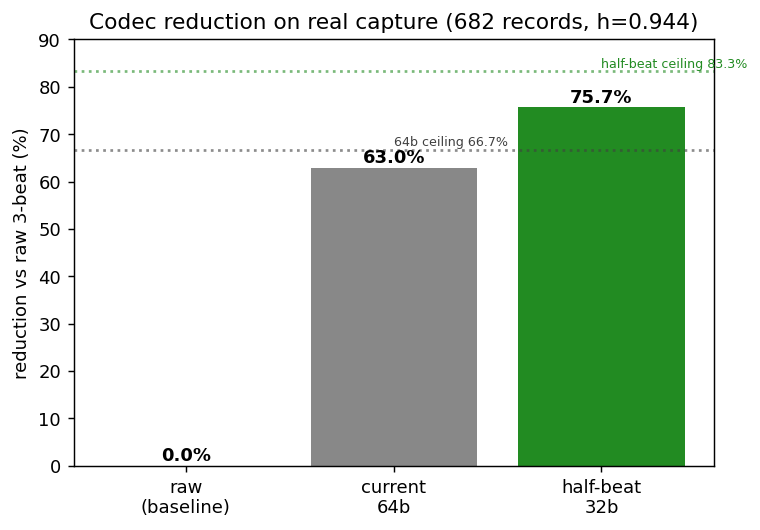
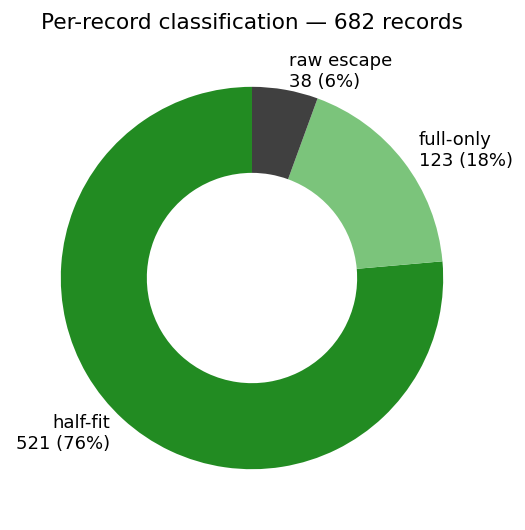
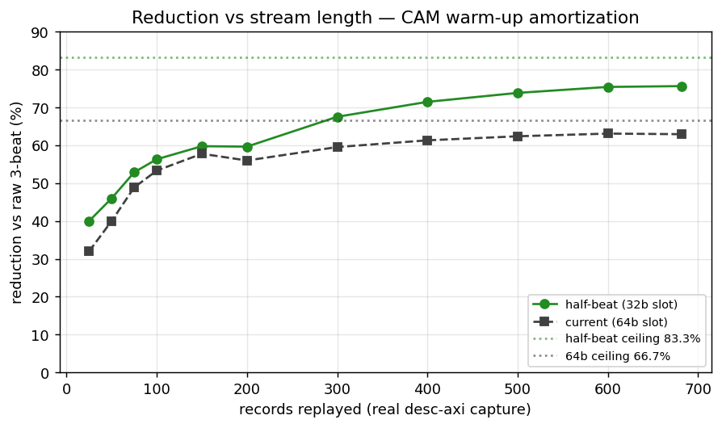
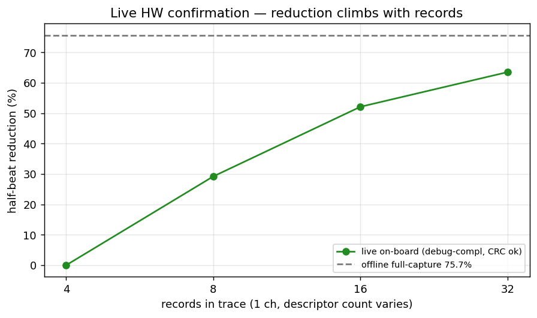

# Monbus Compression — Characterization (all-fixes bitstream)

Companion to `../perf/`. Where the perf report measures how hard the DMA
drives the bus, this measures how well the **monbus compressor + half-beat
packer** shrink the monitor-event stream on real captured traffic.

**Bitstream:** all-fixes build (`USE_MON_COMPRESSION = USE_MON_HALFBEAT =
USE_MON_CAM_PIPELINE = 1`), WNS +0.048 ns @ 100 MHz, xc7a100t.
**Primary data:** the committed encoder CAM logic replayed **bit-exact and
offline** on the real 682-record on-board capture
(`../compression_dataset/desc_axi_16desc_8ch_1MB.json`). The on-chip packer
is verified bit-identical to this model in cosim
(`val/amba/test_monbus_halfbeat.py`), so the offline reduction *is* what the
FPGA emits for the same record stream — it is the codec, not an estimate.

---

## 1. What compression means here

Each monitor record is a 128-bit packet + 64-bit timestamp. A raw (Tier-0)
escape costs **3 × 64-bit beats**. The codec removes that two ways:

1. **Tier-1 templating** (64-bit slot): a CAM-hit record collapses to **1
   beat**. Structural ceiling `1 − 1/3 = 66.7 %`.
2. **Half-beat packing** (32-bit slot): two compressible records share one
   beat (0.5 beat/record), raising the ceiling to `1 − 0.5/3 = 83.3 %`.

Realized reduction is dominated by the Tier-1 hit rate `h`, not slot size:

```
reduction = h · (1 − b_t/3)
    current  (b_t = 1.0):  h · 0.667     ceiling 66.7 %
    half-beat(b_t = 0.5):  h · 0.833     ceiling 83.3 %
```

So 80 % needs `h ≈ 0.96`. The point of measuring on real traffic is to find
the actual `h` and the fraction of hits that fit a 32-bit half-slot.

---

## 2. Headline (real capture, 682 records, h = 0.944)



| codec | beats | reduction |
|---|---|---|
| raw baseline | 2046 | — |
| current 64-bit | 758 | **63.0 %** |
| **half-beat 32-bit** | **498** | **75.7 %** |

Half-beat packing turns the 63.0 % codec into **75.7 %** on this trace — a
**12.7-percentage-point** gain, **260 fewer beats** drained over UART for
identical monitor coverage.

Why 75.7 % and not the 83.3 % ceiling: `h = 0.944` caps half-beat at
`0.944 × 0.833 = 78.6 %`, and of the 644 hits, 123 fit only a full 64-bit
beat (event_data or Δts too wide for a 23-bit half-payload), plus lone-half
round-up. The gap to ceiling is real-traffic structure, not codec overhead.

---

## 3. Per-record classification



| class | records | share | cost |
|---|---|---|---|
| half-fit (Tier-1, 32-bit slot) | 521 | 76 % | 0.5 beat |
| full-only (Tier-1, 64-bit slot) | 123 | 18 % | 1 beat |
| raw escape (Tier-0, CAM miss / overflow) | 38 | 6 % | 3 beats |

Three quarters of records pack into half-slots. The 18 % full-only records
are Tier-1 hits whose `event_data`/Δts exceed the 23-bit half-payload; the
6 % raw escapes are first-occurrence CAM misses (one per distinct template)
plus a handful of Δts overflows.

## 4. Half-beat wire format

A half-pair beat is `{tag[63:60]=0x4, slotA[59:30], slotB[29:0]}` — two
30-bit slots, each `sub[1:0] + idx[4:0] + 23-bit payload`:

```
HALF-A (absolute):  sub=1 | idx[4:0] | delta_ts[9:0] | event_data[12:0]
HALF-C (delta):     sub=2 | idx[4:0] | delta_ts[9:0] | ed_delta[11:0] signed
NOP (lone pad):     sub=0
```

`delta_ts < 1024` cyc (~10.2 µs @ 100 MHz) for either form; HALF-A carries
`event_data < 2^13`, HALF-C a signed `ed_delta` `|·| < 2^12` for
counters/sequential addresses. Tier-1 records that fit neither stay a full
64-bit beat; a lone trailing half rounds up to a full beat. Widths locked in
`host/monbus_halfbeat_model.py` (lines 50–62), mirrored bit-exact by
`rtl/amba/shared/monbus_halfbeat_packer.sv`.

---

## 5. Reduction vs stream length — CAM warm-up



Replaying prefixes of the real capture shows the dominant real-world effect:
**warm-up amortization.** Each distinct template costs one 3-beat raw escape
on first sight; until those are paid off they dominate a short stream. As
records accumulate the escapes amortize and reduction climbs toward the
steady 75.7 %. This is why short captures under-report compression and the
full-stream number is the representative one.

---

## 6. Live on-board confirmation



The same codec is synthesized into the bitstream. `hb_measure.py` runs the
compressed workload, drains the on-chip trace SRAM, and decodes the
FPGA-emitted slots with the golden decoder — every clean point below
round-trips bit-exact (`decode=OK`), confirming the HW slot stream is
correct. 1-channel descriptor sweep (`debug-compl` monitor preset):

| records | half-beat beats | reduction |
|---|---|---|
| 4 | 12 | 0.0 % (all first-occurrence escapes) |
| 8 | 17 | 29.2 % |
| 16 | 23 | 52.1 % |
| 32 | 35 | 63.5 % |

The live curve tracks the offline warm-up curve (§5): reduction climbs with
record count toward the full-capture 75.7 %.

### 6.1 Reproducibility — root-caused (was a reset bug, now fixed)

An earlier `hb_measure` run reported `8desc_8ch` as 261 beats one time and
405 another for the *identical* config. This was **proven** to be a
measurement bug, not the codec:

- Localized on HW: 3 properly-reset runs give **bit-identical packets and
  identical per-template timestamp deltas** (only the absolute timer base
  shifts — it cancels in deltas), so the deterministic model yields the
  same compression every time.
- Root cause: `hb_measure` fired only the soft-reset pulse, leaving
  per-channel + stat state stale between back-to-back invocations, which
  perturbed the captured event stream. **Fixed** (`hb_measure` now does the
  full cluster reset: soft-reset → per-channel reset → clear-stats); with
  the fix, repeated `8desc_8ch` runs are bit-identical (212 rec / 405 beats
  / 36.3 %, CRC ok, every run).
- The compressor RTL is **bit-exact to the golden model in cosim on the
  exact captured stream** (`val/amba/test_monbus_halfbeat.py`, Phase 2 +
  `DATASET_OVERRIDE`). The codec was never implicated.

### 6.2 OPEN BUG — DMA hang at 4–7 active channels under heavy monitoring

Separately, with the `debug-compl` monitor preset and **4, 5, 6, or 7**
active channels, the DMA **hangs** (reproducibly); 1, 2, 3, and 8 channels
complete. The default-mon-config perf matrix passes *all* channel counts, so
the trigger is the heavy monitor traffic, not plain data movement.

| active ch (8desc) | result |
|---|---|
| 1, 2, 3 | completes, CRC ok |
| **4, 5, 6, 7** | **hang (timeout)** |
| 8 | completes, CRC ok |

It is a **hang, not data corruption.** The failing run times out at 120 s
with `GLOBAL_STATUS=0`, `AXI_RD_COMPLETE=AXI_WR_COMPLETE=0` (zero
completions), and `CHANNEL_IDLE=0xF1` — channel 0 finishes, channels 1/2/3
are stuck mid-transfer; `SCHED_ERROR=0`; monbus trace flowing
(`wr_ptr=242`, no overflow). The earlier "CRC mismatch" reported by
`hb_measure` was a *consequence* of non-completion (stale CRC after
timeout), not bad data.

Suspected mechanism (under investigation): the monitors are **not** passive
in this harness — `block_ready` (de-asserted as the transaction table fills
while completion-reporting can't free entries) gates
`fub_axi_arready`/`fub_axi_awready` (`axi4_master_{rd,wr}_mon.sv`), and
`axi_monitor_base.sv:444` documents a prior `block_ready` form that
deadlocked (`block_ready=0 → ready=0 → count never increments`). Heavy
completion traffic at partial channel population appears to re-trip that
corner so the shared engine stalls the non-first channels. The
4–7-hang-but-8-complete pattern points at a `block_ready` / `active_count`
(MAX-3 margin) corner. This is a **real RTL bug, not a measurement
artifact**, being reproduced in the `stream_char` cosim. Until it closes,
the 4–7-channel `debug-compl` points are excluded.

---

## 7. What we learned

1. **Half-beat is worth it on real traffic:** 63.0 % → 75.7 % (+12.7 pp)
   on the captured stream, for two 30-bit slots per beat.
2. **`h` dominates, not slot size.** At `h = 0.944` the half-beat ceiling
   is 78.6 %; we hit 75.7 % of the theoretical 83.3 %.
3. **Three quarters of records half-pack;** 18 % need a full beat (wide
   payload), 6 % escape (cold templates).
4. **Warm-up is the real-world tax.** Short streams under-report; the cost
   is one 3-beat escape per distinct template, amortized over the run.
5. **The HW codec is correct.** Live FPGA slots decode bit-exact and track
   the model; the codec was never the bug. The earlier non-reproducibility
   was a `hb_measure` reset bug (fixed, §6.1).
6. **Separate open bug (§6.2):** 4–7 active channels under `debug-compl`
   **hang the DMA** (channels 1+ stall, zero completions, 120 s timeout) —
   a real RTL interaction (monitor `block_ready` / completion-feedback
   deadlock), under investigation. Not a codec or measurement issue, and
   not data corruption.

---

## Appendix: data files & reproduce

| File | Contents |
|---|---|
| `../compression_dataset/desc_axi_16desc_8ch_1MB.json` | real 682-record on-board capture (locked dataset) |
| `plots/*.png` | figures above (`host/plot_compression_report.py`) |
| `plots/summary.json` | numeric summary (records, h, tier split, beats, reductions) |

```bash
cd flows-stream-bridge/host && source $REPO_ROOT/env_python
# Authoritative, offline, bit-exact (no board needed):
python3 plot_compression_report.py \
    --capture ../reports/compression_dataset/desc_axi_16desc_8ch_1MB.json \
    --outdir ../reports/compression/plots
# Live on-board confirmation (keep workloads small; trace SRAM = 2048 beats;
# reset the cluster between runs):
python3 hb_measure.py --port /dev/ttyUSB2 --channels 1 \
    --config 8desc_1ch_1MB --mon-config debug-compl
```

Codec spec: `bin/TBClasses/monbus/monbus_compressor.py`; RTL:
`rtl/amba/shared/monbus_{compressor,halfbeat_packer}.sv`; cosim:
`val/amba/test_monbus_{compressor,halfbeat}.py`.
