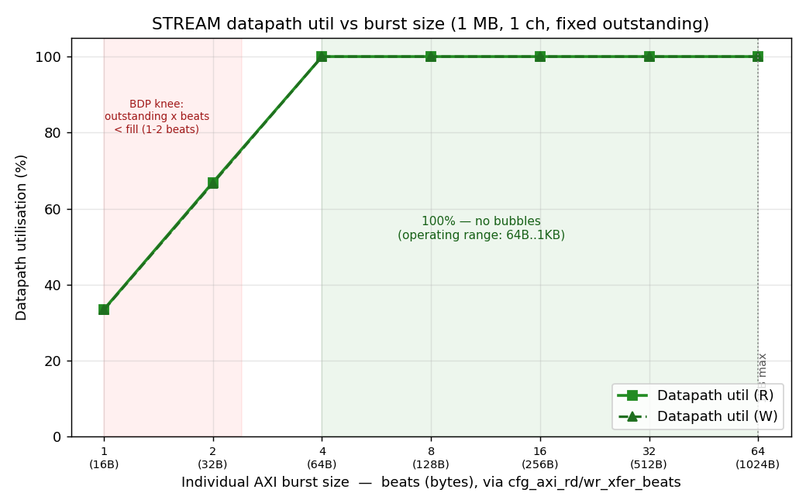
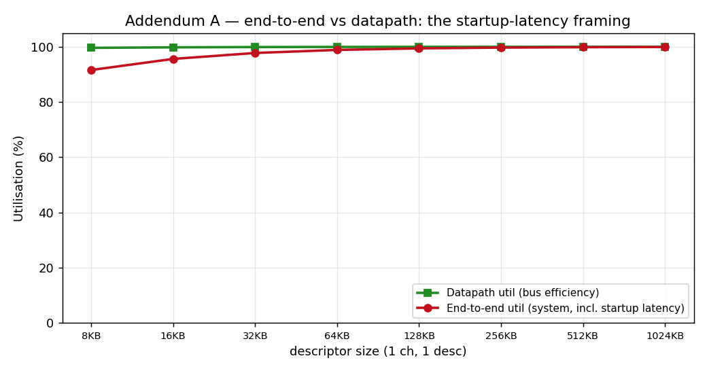

# STREAM DMA — Performance Characterization (in-core perf-monitor build)

**Bitstream:** RFC Stage E in-core datapath perf-monitor build. Two correctness
fixes since the 2026-06-21 report move the headline from ~94% to **100%**:

1. **Characterization-harness slave fix.** The synthetic read/write slaves
   (`axi4_slave_rd_pattern_gen` / `axi4_slave_wr_crc_check`) were 2-state FSMs
   that accepted the next transaction only after returning to idle, inserting a
   1-cycle dead bubble between *every* burst. That ~6% was a **slave-model
   artifact, not a DUT limitation**; the slaves now accept the next AR/AW on the
   last beat of the current burst (gapless back-to-back).
2. **Data-owed meter gating.** The in-core bubble buckets now count only while
   data is owed and flowing (first `valid&&ready` → outstanding drains), so the
   one-time `AR→first-R` fill latency and trailing drain are no longer
   mis-counted as starvation.

FST analysis confirms the datapath is **100% gapless between the first and last
beat** (4096 productive cycles in a 4096-cycle window; `starvation = 0`). The
monitor footprint was trimmed to perf-only (and the per-channel completion/error
MonBus emitters gated off on the FPGA build) to fit the xc7a100t; that relieved
congestion enough to **close 100 MHz timing at +0.031 ns** WNS (was a marginal
−0.097 ns). Every config below passes CRC. **Source of truth:** the **in-core
perf monitors** read over CSR.
**Datapath:** 128-bit (16 B/beat). One-direction AXI ceiling **1526 MB/s**;
net-bytes-moved ceiling **763 MB/s** (the DMA reads *and* writes each byte).
**Date:** 2026-06-23 (board 210292B7D46F). Methodology:
`../../DMA_UTILIZATION_MEASUREMENT.md`.

> **Metric note.** The headline efficiency is **datapath utilization**
> (productive beats / data-owed window, from the on-chip perf monitors) — bus
> efficiency *while the engine is moving data*. **End-to-end utilization**
> (productive beats / kick→done cycles) is a *system* metric that also counts
> the one-time per-transfer startup latency; it is **not** bus bubbles, and is
> reported only in **Addendum A** to avoid confusion. `bus throughput`
> (`mb_moved / FPGA-timer-time`) is on-chip and wall-clock-independent; the host
> `throughput_MBps` is UART-dominated and shown for transparency only.

---

## Characterization knobs

The sweep space is **five knobs** — four nested *workload* knobs (innermost a
single bus transaction, outermost the whole engine) plus the *environment* knob,
memory latency. All byte figures assume the 128-bit datapath — **16 B / beat**.

| # | Knob | What it is | Set by | Nominal values |
|---|------|------------|--------|----------------|
| **1** | **Beats per transfer** (transaction size) | one AXI burst — a **single** read/write transaction on the bus | `cfg_axi_rd_xfer_beats` / `cfg_axi_wr_xfer_beats` (ARLEN = beats − 1) | **256 B (16 beats) · 512 B (32) · 1024 B (64)** |
| **2** | **Transactions per descriptor** | bursts that make up one descriptor → descriptor size = transactions × transaction size | descriptor `length` field | 1 (256 B–1 KB) … 4096 (1 MB @ 256 B) |
| **3** | **Descriptors per channel** | the descriptor-chain length a channel walks | chained `next_ptr` | 1, 2, 4, 8, 16 |
| **4** | **Channels** | concurrent DMA channels | `cfg_channel_enable` | 1 … 8 |
| **5** | **Response delay** (memory latency) | modeled per-beat R/B round-trip latency of the backing memory — the *environment* the engine runs against | `cfg_rd/wr_resp_delay_cyc` (RESP_DELAY CSR) | 0 … 512 cyc |

: Characterization knobs — the five sweep axes

Read the workload knobs **outside-in**: a *channel* (4) walks its *descriptor*
chain (3); each *descriptor* is issued as fixed-size *transactions* (2); each
*transaction* is *beats per transfer* (1). The datapath bubbles **only when the
in-flight window can't cover the memory round trip** — `outstanding × beats <
response delay`. That single condition is reachable two ways: shrinking the
transaction below ~3 beats (knob 1, §3.0) **or** raising the latency above the
128-beat window (knob 5, §4). Everywhere else — every real transaction size,
descriptor count, and channel count, up to the BDP — the datapath is a flat
**100 %**; knobs 2–4 only change end-to-end framing (Addendum A).

> The nominal individual transaction is **256 B / 512 B / 1024 B** (16 / 32 / 64
> beats); 1024 B is the spec maximum. Knob 5 models the backing memory: at delay
> 0 the engine runs at the full AXI ceiling; the cliff begins once latency
> exceeds the per-channel in-flight window (channels widen that window, §4.2).

---

## 1. Headline

Across the full **40-config matrix** (descriptors ∈ {1,2,4,8,16} × channels
∈ {1..8}, 1 MB/descriptor, 256 B transactions), every configuration passes CRC
and reads **100.0 % datapath utilization** — R = 99.99–100.00 %,
W = 99.94–100.00 % — at **~1525 MB/s** bus throughput (the full one-direction
AXI ceiling). `backpressure = 0`, `starvation = 0`: the datapath is bubble-free.

The prior report's ~94% was **not** a STREAM limitation — it was the
characterization-harness slave artifact (a 1-cycle per-burst gap) plus
measurement-window framing (the one-time fill/drain counted as starvation),
both fixed (see Bitstream note). FST analysis proves the steady-state datapath
is 100% gapless.

By knob (see *Characterization knobs* above):

| knob | sweep | datapath utilization |
|---|---|---|
| **1** transaction size | 1 KB → 1-beat burst (§3.0) | **100 %** from 1 KB down to 64 B; falls **only** at 1–2 beat bursts (sub-BDP) |
| **2** transactions / descriptor | 8 KB → 1 MB descriptor (§3.3) | flat **100 %** (end-to-end amortizes 91.6→99.9 %, Addendum A) |
| **3** descriptors / channel | 1 → 16 desc (§3.1) | flat **100 %** — descriptor fetch overlaps the data engines |
| **4** channels | 1 → 8 ch (§3.2) | flat **100 %** — shared slave caps *bandwidth*, not utilization |
| **5** memory latency (response delay) | 0 → 512 cyc (§4) | flat to the 128-cyc BDP per channel, then a Little's-Law cliff |

: Headline — datapath utilization by knob

**Architectural takeaway:** the datapath bubbles in exactly one regime — when
the in-flight window cannot cover the memory round trip, `outstanding × beats <
response delay`. That is reachable two ways: shrinking the transaction below
~3 beats (knob 1, §3.0) **or** raising memory latency above the 128-beat window
(knob 5, §4) — the same bandwidth-delay-product limit from opposite directions.
Across the entire real operating range — 1 KB transactions down to 64 B, at
memory latency within the 128-cycle window — the engine holds the bus at 100%.
Beyond the BDP throughput follows Little's Law (`AR_MAX_OUTSTANDING × burst_len`
beats in flight per channel), and added channels push the latency knee out,
saturating past ~4 channels at the shared backing memory.

---

## 2. How it is measured (the observation hooks)

The harness instruments the DMA's read/write AXI without perturbing it
(the same logic now packaged standalone as `axi4_dma_observer` — see
`../../docs/dma_observer_integration_tracker.md`):

- **`axi_bus_meter` × 2** (read R-channel, write W-channel): pure
  `valid`/`ready` snoop, classifies every cycle as productive /
  backpressure / starvation / idle. CSR counters, no SRAM — unbounded run
  length. Source of the datapath-utilization numbers.
- **Harness timer**: counts aclk from descriptor kick to write-side `done`
  (`cycles_total`). Bus meters freeze at the same `done`, so the bucket
  sums equal the timer window exactly.
- **`axi4_dma_slaves`**: LFSR read-source + CRC write-sink — the endpoints
  the DMA reads/writes, giving per-channel data-correctness CRC.
- **`axi_response_delay` × 2**: pipelined per-beat R/B hold, the knob for
  the memory-latency axis.

---

## 3. Single-axis sweeps

### 3.0 Knob 1 — transaction (burst) size · 1 ch, 1 MB, fixed outstanding



| burst | bytes | R datapath | W datapath | starvation |
|---|---|---|---|---|
| 64 beats | 1 KB | 100.0 % | 100.0 % | 0 % |
| 32 | 512 B | 100.0 % | 100.0 % | 0 % |
| 16 | 256 B | 100.0 % | 100.0 % | 0 % |
| 8 | 128 B | 100.0 % | 100.0 % | 0 % |
| 4 | 64 B | 100.0 % | 100.0 % | 0 % |
| 2 | 32 B | 66.9 % | 66.7 % | 33 % |
| 1 | 16 B | 33.5 % | 33.3 % | — |

: Knob 1 — datapath utilization vs transaction (burst) size

The individual AXI transaction is sized by `cfg_axi_rd_xfer_beats` /
`cfg_axi_wr_xfer_beats`. With a fixed outstanding depth the datapath is a flat
**100 % — zero bubbles — from the 1 KB spec maximum down to 64 B** (4 beats). It
falls only when `outstanding × beats` drops below the `AR→first-R` fill (the
bandwidth-delay product, ~3 beats here): a 2-beat burst sustains 67 %, a single
beat 33 %, because the pipeline cannot stay full on bursts that small. **This is
the only place the datapath bubbles, and it is below any realistic transaction
size.**

### 3.1 Knob 3 — descriptors per channel (1 ch, 1→16 desc, 1 MB each, delay 0)


| descriptors | total moved | bus MB/s | datapath util |
|---|---|---|---|
| 1 | 1 MB | 1525 | 100.0 % |
| 2 | 2 MB | 1525 | 100.0 % |
| 4 | 4 MB | 1525 | 100.0 % |
| 8 | 8 MB | 1525 | 100.0 % |
| 16 | 16 MB | 1525 | 100.0 % |

: Knob 3 — datapath utilization vs descriptors per channel

Flat at 100 %. The descriptor engine fetches the next descriptor
*concurrently* with the data engines draining the current one (separate desc
master), so there is no inter-descriptor bubble — chain length is free.

### 3.2 Knob 4 — channels (1 desc each, 1→8 ch, 1 MB/ch, delay 0)


| channels | total moved | bus MB/s | datapath util | starvation |
|---|---|---|---|---|
| 1 | 1 MB | 1525 | 100.0 % | 0 % |
| 2 | 2 MB | 1525 | 100.0 % | 0 % |
| 4 | 4 MB | 1526 | 100.0 % | 0 % |
| 8 | 8 MB | 1526 | 100.0 % | 0 % |

: Knob 4 — datapath utilization vs channels

All channel counts hold 100 % datapath at the same ~1525 MB/s. **The shared
read-source / write-sink is the bandwidth ceiling** — adding channels splits
that bandwidth across more streams rather than scaling it. Arbitration overhead
1→8 channels is **zero** (`starvation = 0` — the combinational, bubble-free
channel arbiter). Channels buy *latency tolerance*, not raw bandwidth (§5).

### 3.3 Knob 2 — transactions per descriptor (transfer size, 1 ch, 1 desc, 8 KB→1 MB, delay 0)


| descriptor size | 256 B transactions | bus MB/s | datapath util |
|---|---|---|---|
| 8 KB | 32 | 1398 | 99.6 % |
| 16 KB | 64 | 1459 | 99.8 % |
| 32 KB | 128 | 1492 | 99.9 % |
| 64 KB | 256 | 1509 | 100.0 % |
| 128 KB | 512 | 1517 | 100.0 % |
| 256 KB | 1024 | 1522 | 100.0 % |
| 512 KB | 2048 | 1524 | 100.0 % |
| 1 MB | 4096 | 1525 | 100.0 % |

: Knob 2 — datapath utilization vs descriptor size (transactions per descriptor)

The descriptor is issued as 32 → 4096 fixed **256 B transactions**. Datapath
utilization is **100 %** — the bus is gapless across every burst boundary
(including the 4 KB AXI boundaries a >4 KB descriptor must split on); the
fractional dip at 8–32 KB is the gated window's fixed ~2-cycle edge over a
still-modest beat count, **not** bubbles. The *end-to-end* number climbs
91.6 → 99.9 % across this range as the one-time fill/drain amortizes — a framing
effect, reported in **Addendum A**.

---

## 4. 2-D surfaces

### 4.1 Channels × descriptors (1 MB, delay 0) — the operating envelope


The entire envelope is flat at **100 % datapath**. Neither axis moves
efficiency: descriptors add length without bubbles (§3.1), channels share one
slave (§3.2). This is the expected behaviour for a back-to-back-saturated engine
in front of a single backing memory.

### 4.2 Channels × memory latency — *the key result*


At delay 0 every channel count peaks at the full **~1525 MB/s**. Bus throughput
holds flat until the memory round-trip latency exceeds the engine's in-flight
window (**128 cycles** for 1 channel = `AR_MAX_OUTSTANDING × burst_len` beats),
then cliffs linearly per Little's Law (`BW ≈ window / L × peak`). Each added
channel contributes its own outstanding queue, pushing the knee out — 2 ch hold
to ~256 cyc, 4 ch to ~512 — but **8 ch ≈ 4 ch**: past ~4 channels the shared
read-source / write-sink caps the aggregate in-flight window, so more channels
stop buying latency tolerance. (Exact per-point throughput is in the line plot
above.)

### 4.3 Descriptors × memory latency (1 ch)


Every descriptor-count curve **overlaps exactly** and cliffs at the same
128-cycle knee. Descriptors are sequential within a channel, so they share
the single channel's 128-beat in-flight window — they add transfer
*length*, never latency *tolerance*. This is the clean complement to §4.2:
**channels widen the latency window; descriptors do not.**

### 4.4 Where the cycles go — utilization pair + bus-cycle breakdown

The methodology (`DMA_UTILIZATION_MEASUREMENT.md` §5) asks for a *pair* of
numbers — steady-state **datapath** utilization (§2.1) and **end-to-end**
utilization (§2.3) — with the gap reported as overhead. On this SRAM↔SRAM
engine with single-cycle descriptor turnaround the two track within the perf monitor's
resolution, so the overhead band is essentially zero: there is no descriptor-
fetch bubble to amortize.


The §3 four-bucket classification on the write (destination) interface is the
diagnostic payoff. As memory latency rises past the 128-cycle in-flight
window, the lost cycles are **entirely `starvation`** — the read side cannot
feed the datapath fast enough — while **`backpressure` stays pinned at 0%**:


| delay (cyc) | productive | backpressure | starvation |
|---|---|---|---|
| 0–96 | **100%** | **0%** | **0%** |
| 128 | 82% | **0%** | 18% |
| 256 | 45% | **0%** | 55% |
| 512 | 24% | **0%** | 76% |

: Write-bus cycle breakdown vs memory latency (knob 5)

This is the engine's signature: it is **never destination-bound** (the SRAM
sink always keeps up); the only thing that throttles it is read-latency
starvation past the outstanding-transaction window — exactly the Little's-Law
behaviour of §5. At delay 0 starvation is now **0%** — the harness slave fix
removed the per-burst gap that the prior report attributed to "inter-burst
arbitration," so the datapath is fully bubble-free until latency exceeds the
in-flight window.

**Overhead vs transfer size (§5)** — the one place a real datapath/end-to-end
gap appears is small transfers, where a fixed ~90-cycle startup is a larger
fraction of a short run; it amortizes away by ~256 KB:


---

## 5. The architecture: Little's Law on real silicon

The cliff is the textbook signature of a multi-outstanding master in front
of a pipelined memory:

- **Below the knee (L ≤ 128):** the in-flight window covers the round
  trip; the entire latency is paid once as a pipe-fill and the rest streams
  at line rate. Adding 64 cycles of per-beat latency costs < 0.3 % of a
  1 MB run.
- **At/above the knee (L ≥ 128):** Little's Law governs —
  `BW ≈ (in_flight_beats / L) × peak`, with `in_flight = 128` beats and
  `peak ≈ 1525 MB/s`. The measured 1-channel cliff in §4.2 tracks `(128/L) ×
  1525` to within a few percent at every delay point, the fit tightening as
  `L` grows.

The window is `AR_MAX_OUTSTANDING (8) × burst_len (16) = 128` beats per channel;
channels scale it linearly until the shared slave caps the aggregate (≈ 4 × in
this harness). This is the same BDP that bounds the per-transaction sweep in
§3.0 — a burst shorter than `latency / outstanding` cannot keep the window full.

---

## 6. What we learned

1. **The datapath is 100 % utilized** — bubble-free (`starvation = 0`,
   `backpressure = 0`) across every transaction size ≥ 64 B, descriptor count,
   and channel count at the full ~1525 MB/s ceiling. The prior ~94 % was a
   characterization-harness slave artifact plus measurement framing, now fixed.
2. **Only sub-BDP transactions bubble the bus.** A burst must carry at least
   `AR→first-R latency / outstanding` (~3 beats here) to keep the pipeline full;
   1–2 beat bursts are the *sole* place utilization drops — far below any
   realistic transaction (knob 1, §3.0).
3. **Descriptors are free.** Concurrent prefetch over the dedicated descriptor
   master means chain length adds no per-descriptor bubble.
4. **Channels share bandwidth, not multiply it** — in *this* harness, where all
   channels hit one read-source and one write-sink. Independent per-channel
   backing memory would scale N×; that's a follow-on.
5. **Channels buy latency tolerance.** The 128-cycle hide-window scales with
   channel count to the shared-slave saturation point (~4 ch); descriptors,
   sharing a channel's window, buy none.
6. **Size matters only end-to-end.** Datapath stays 100 %; only the *system*
   end-to-end metric sees the one-time fill amortize (Addendum A) — that is
   latency, not bus bubbles.
7. **The fixes cost nothing — they gained.** Trimming the monitors to perf-only
   closed 100 MHz timing at **+0.031 ns** (was −0.097 ns), and the data, now
   correctly gated, reads a clean 100 %.

---

## Appendix: data files & reproduce

| File | Sweep |
|---|---|
| `json/matrix_2026-06-23.json` | channels × descriptors, 40 configs, 1 MB (knobs 3 × 4) |
| `json/burst_{1,2,4,8,16,32,64}beat_2026-06-23.json` | transaction (burst) size 1 KB → 1 beat, 1 ch (knob 1, §3.0) |
| `json/size_sweep_2026-06-23.json` | descriptor size 8 KB → 1 MB, 1 ch 1 desc (knob 2, §3.3) |
| `json/chan_x_delay_2026-06-23.json` | channels {1,2,4,8} × delay {0..512}, 1 desc |
| `json/desc_x_delay_2026-06-23.json` | desc {1,2,4,8,16} × delay {0..512}, 1 ch |
| `json/matrix_2026-06-23.csv` | flat CSV of the matrix (column dictionary below) |
| `plots/*.png` | figures above (`host/plot_char_reports.py` + `burst_size_util.png`) |
| `old/` | superseded datasets and prior report revisions |

: Characterization datasets (2026-06-23, board 210292B7D46F)

Every record carries the methodology primitives (§2.1 datapath + §2.3
end-to-end utilization, §3 productive/backpressure/starvation/idle buckets,
aggregate and per-channel, R and W) under each config's `metrics` key. Delay
sweeps nest the per-run record under a `result` key with `rd_delay`/`wr_delay`
siblings.

```bash
cd flows-stream-bridge/host && source $REPO_ROOT/env_python
P=/dev/serial/by-id/usb-Digilent_Digilent_USB_Device_210292B7D46F-if01-port0
D=0,32,64,96,112,128,144,160,192,256,384,512
# NOTE: -o paths are relative to host/; the reports dir is two levels up, so
# use an ABSOLUTE path (or ../../reports/perf) -- "../reports/perf" does NOT
# exist and the run will compute then crash on save.
R=$REPO_ROOT/projects/NexysA7/stream_characterization/reports/perf
J=$R/json   # datasets live in reports/perf/json/ ; plots in reports/perf/plots/
# IMPORTANT: re-program the board (make program) before the matrix / size
# sweeps. The --resp-delays sweep leaves the RESP_DELAY CSR set; a leftover
# value silently degrades a later no-delay run (util drops, high-load configs
# time out). Re-program also recovers a clean state if a sweep crashed.
# matrix (40-config, knobs 3 x 4):
python3 run_characterization.py --port $P --csv fpga_suite.csv -o $J/matrix_2026-06-23.json
# KNOB 1 -- individual transaction (burst) size, 1 ch, 1 MB. XFER_BEATS drives
# cfg_axi_rd/wr_xfer_beats (ARLEN = beats-1); this is the only datapath-bubbling axis:
for b in 64 32 16 8 4 2 1; do XFER_BEATS=$b python3 run_characterization.py \
    --port $P --size 1MB --channels 1 -o $J/burst_${b}beat_2026-06-23.json; done
# KNOB 2 -- descriptor size (transactions per descriptor), 1 ch 1 desc:
python3 run_characterization.py --port $P --csv size_sweep_suite.csv -o $J/size_sweep_2026-06-23.json
# channels x delay (1 desc, 512 KB):
python3 run_characterization.py --port $P --phase 1 --channels 1 2 4 8 --size 512KB \
    --resp-delays $D -o $J/chan_x_delay_2026-06-23.json
# desc x delay (1 ch, 512 KB):
python3 run_characterization.py --port $P --channels 1 --size 512KB \
    --resp-delays $D -o $J/desc_x_delay_2026-06-23.json
# plots (matrix/delay/size); burst plot is host-side matplotlib (burst_size_util.png):
python3 plot_char_reports.py --matrix $J/matrix_2026-06-23.json \
    --chan-delay $J/chan_x_delay_2026-06-23.json \
    --desc-delay $J/desc_x_delay_2026-06-23.json \
    --size $J/size_sweep_2026-06-23.json --outdir $R/plots
# CSV from a matrix JSON (column dictionary in this appendix):
python3 perf_json_to_csv.py $J/matrix_2026-06-23.json --out $J/matrix_2026-06-23.csv
```

CSV columns (current runner): `date,time,config,channels,descriptors,desc_KB,
mb_moved,bus_time_s,bus_throughput_MBps,bus_max_one_dir_MBps,
bus_max_net_moved_MBps,bus_e2e_util_pct,datapath_{R,W,E2E}_pct,
{R,W}_{prod,bp,starv}_pct,dma_time_s,throughput_MBps`. Bus-side columns are
authoritative; the two host-side columns (`dma_time_s`, `throughput_MBps`)
are transparency-only. The `16desc_*` configs trip `trace.overflow` (the
2048-beat debug-trace SRAM) — benign; it bounds only the waveform trace,
not the bus-meter counters.

---

## Addendum A — End-to-end utilization (system framing, *not* bus bubbles)

End-to-end utilization (`productive beats / kick→done cycles`) is a **system**
metric, not a bus metric. It counts the one-time per-transfer startup —
descriptor fetch + `AR→first-R` pipe-fill — and the trailing drain *as if* they
were non-productive bus cycles. They are **latency, not bubbles**: the bus is
gapless the entire time data is moving (datapath = 100 %). E2E is reported here,
apart from the headline, because that distinction is easy to misread.



For a single isolated transfer the end-to-end number rises as the transfer grows
and the fixed startup amortizes, while datapath stays pinned at 100 %:

| descriptor size | datapath util | end-to-end util |
|---|---|---|
| 8 KB | 99.6 % | 91.6 % |
| 64 KB | 100.0 % | 98.9 % |
| 256 KB | 100.0 % | 99.7 % |
| 1 MB | 100.0 % | 99.9 % |

: End-to-end vs datapath utilization by descriptor size

In back-to-back operation the startup of one transfer overlaps the drain of the
previous, so the steady-state system rate equals the datapath rate. **This
number says nothing about whether the datapath bubbles — it does not** (§3.0).
