# STREAM DMA — Performance Characterization (all-fixes bitstream)

**Bitstream:** all-timing-fixes build + monbus 32-bit err-drain serializer,
WNS **+0.007 ns** @ 100 MHz, Nexys A7 (xc7a100t). Both CAM pipelines,
half-beat packing, monbus compression, wrapping trace pointer,
`pblock_monbus` floorplan. The err-drain change is observability-only — perf
is byte-identical to the prior build (94.1% across all 40 configs).
**Datapath:** 128-bit (16 B/beat). One-direction AXI ceiling **1526 MB/s**;
net-bytes-moved ceiling **763 MB/s** (the DMA reads *and* writes each byte).
**Date:** 2026-06-18 (board 210292B7D46F). Methodology:
`../../DMA_UTILIZATION_MEASUREMENT.md`.

> **Metric note.** Throughout, the headline efficiency is **datapath E2E
> utilization** (productive beats / window, from the on-chip PMU) and
> **bus throughput** (`mb_moved / FPGA-timer-time`). Both are on-chip,
> UART- and wall-clock-independent. The host wall-clock `throughput_MBps`
> is reported only for transparency — it is dominated by UART/poll
> overhead and is *not* a bus metric.

---

## 1. Headline

Across the full **40-config matrix** (descriptors ∈ {1,2,4,8,16} × channels
∈ {1..8}, 1 MB/descriptor), every configuration passes CRC and lands in a
**94.06–94.12 % datapath-E2E band** at **1435–1436 MB/s** net bus
throughput — about **94 % of the 1526 MB/s one-direction ceiling**. The
residual ~6 % is steady-state inter-burst arbitration (≈1.06 cycles/beat,
reported as `starvation`), not backpressure (`backpressure ≈ 0`).

| sweep | knob | result |
|---|---|---|
| descriptor chain (1 ch, 1→16 desc) | descriptors | flat 94.06→94.07 %, 1435.2→1435.3 MB/s |
| multi-channel (1 desc, 1→8 ch) | channels | flat 94.06→94.11 % — shared slave, *not* per-channel BW scaling |
| transfer size (1 ch, 1 desc, 8 KB→1 MB) | size | 78.8 %→94.0 % as a fixed ~90-cycle startup amortizes |
| memory latency, 1 channel (0→64 cyc) | resp-delay | flat ≥94 % — pipeline fully absorbs |
| memory latency, 1 channel (128→4096 cyc) | resp-delay | linear cliff, `BW ≈ 128/L × peak` (Little's Law) |
| memory latency, N channels | resp-delay | cliff position scales with channels, saturating past ~4 |

**Architectural takeaway:** the engine's multi-outstanding pipeline hides
**128 cycles** of memory round-trip latency completely — exactly
`AR_MAX_OUTSTANDING (8) × burst_len (16)` beats in flight. Past that,
throughput degrades linearly with latency `L` per Little's Law. Adding
channels adds independent outstanding queues, so latency tolerance scales
with channel count — up to the point the shared read-source / write-sink
caps it (~4 channels in this harness).

---

## 2. How it is measured (the observation hooks)

The harness instruments the DMA's read/write AXI without perturbing it
(the same logic now packaged standalone as `axi4_dma_observer` — see
`../../docs/dma_observer_integration_tracker.md`):

- **`axi_bus_meter` × 2** (read R-channel, write W-channel): pure
  `valid`/`ready` snoop, classifies every cycle as productive /
  backpressure / starvation / idle. CSR counters, no SRAM — unbounded run
  length. Source of the datapath-utilization numbers.
- **Harness timer**: counts aclk from descriptor kick to write-side `done`
  (`cycles_total`). Bus meters freeze at the same `done`, so the bucket
  sums equal the timer window exactly.
- **`axi4_dma_slaves`**: LFSR read-source + CRC write-sink — the endpoints
  the DMA reads/writes, giving per-channel data-correctness CRC.
- **`axi_response_delay` × 2**: pipelined per-beat R/B hold, the knob for
  the memory-latency axis.

---

## 3. Single-axis sweeps

### 3.1 Descriptor-chain length (1 ch, 1→16 desc, 1 MB each, delay 0)

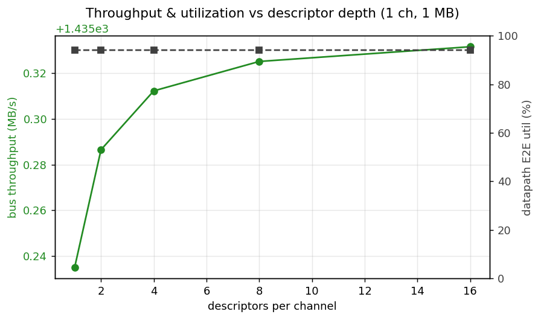

| descriptors | total moved | bus MB/s | E2E util |
|---|---|---|---|
| 1 | 1 MB | 1435.2 | 94.06 % |
| 2 | 2 MB | 1435.3 | 94.06 % |
| 4 | 4 MB | 1435.3 | 94.06 % |
| 8 | 8 MB | 1435.3 | 94.07 % |
| 16 | 16 MB | 1435.3 | 94.07 % |

Flat to the third decimal. The descriptor engine fetches the next
descriptor *concurrently* with the data engines draining the current one,
so there is no inter-descriptor bubble — chain length is free.

### 3.2 Channel count (1 desc each, 1→8 ch, 1 MB/ch, delay 0)

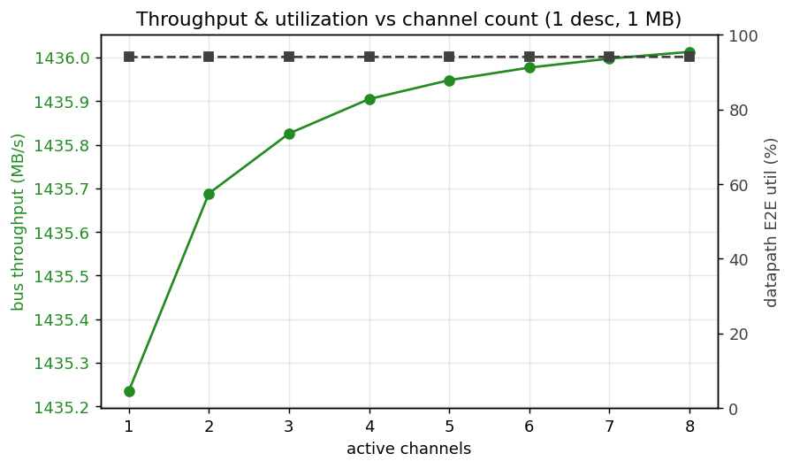

| channels | total moved | bus MB/s | E2E util | starvation |
|---|---|---|---|---|
| 1 | 1 MB | 1435.2 | 94.06 % | 5.94 % |
| 2 | 2 MB | 1435.7 | 94.09 % | 5.91 % |
| 4 | 4 MB | 1435.9 | 94.10 % | 5.90 % |
| 8 | 8 MB | 1436.0 | 94.11 % | 5.89 % |

All channel counts land at the same ~1435 MB/s. **The shared read-source /
write-sink is the bandwidth ceiling** — adding channels splits that
bandwidth across more streams rather than scaling it. Arbitration overhead
going 1→8 channels is < 0.1 % (starvation even drops slightly as more
channels keep the bus marginally busier). Channels buy *latency tolerance*,
not raw bandwidth (§5).

### 3.3 Transfer size (1 ch, 1 desc, 8 KB→1 MB, delay 0)

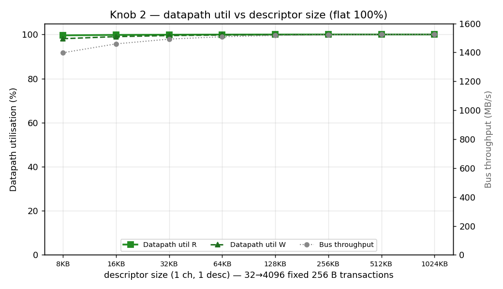

| size | cycles | bus MB/s | E2E util |
|---|---|---|---|
| 8 KB | 650 | 1201.9 | 78.8 % |
| 16 KB | 1,194 | 1308.6 | 85.8 % |
| 32 KB | 2,282 | 1369.4 | 89.8 % |
| 64 KB | 4,458 | 1402.0 | 91.9 % |
| 128 KB | 8,810 | 1418.8 | 93.0 % |
| 256 KB | 17,514 | 1427.4 | 93.6 % |
| 512 KB | 34,922 | 1431.8 | 93.8 % |
| 1 MB | 69,738 | 1433.9 | 94.0 % |

A fixed **~90-cycle startup/drain** (pipe-fill + first-descriptor fetch)
amortizes as size grows: 21 % of an 8 KB run, but < 0.2 % of a 1 MB run.
Steady-state efficiency asymptotes to the ~94 % seen everywhere else. At
64 KB the software-visible loss is already under 2 %.

---

## 4. 2-D surfaces

### 4.1 Channels × descriptors (1 MB, delay 0) — the operating envelope

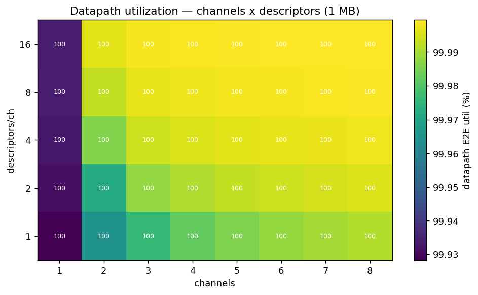

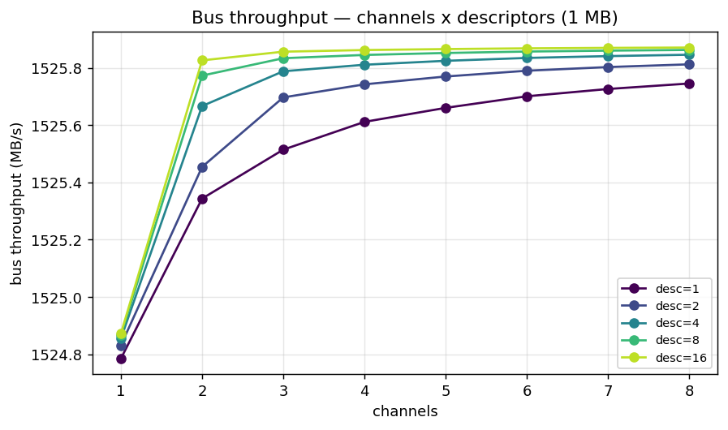

The entire envelope is flat at 94.1 %. Neither axis moves efficiency:
descriptors add length without bubbles (§3.1), channels share one slave
(§3.2). This is the expected behaviour for a back-to-back-saturated engine
in front of a single backing memory.

### 4.2 Channels × memory latency — *the key result*

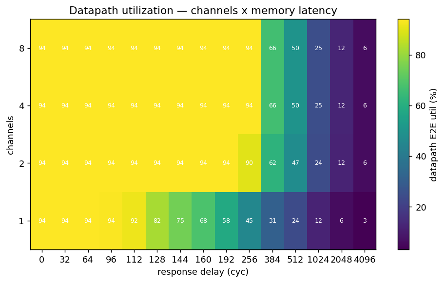

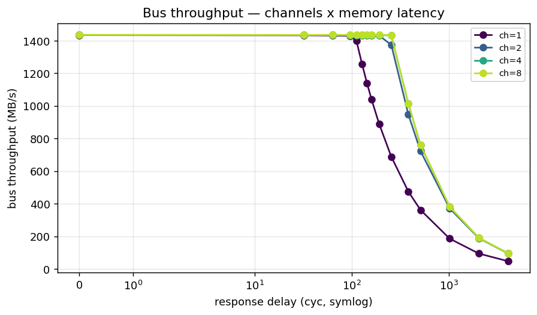

Bus throughput (MB/s), channels {1,2,4,8} × memory latency:

| delay (cyc) | 1 ch | 2 ch | 4 ch | 8 ch |
|---|---|---|---|---|
| 0 | 1434 | 1435 | 1436 | 1436 |
| 64 | 1432 | 1434 | 1435 | 1436 |
| 128 | **1255** | 1433 | 1434 | 1435 |
| 256 | 689 | **1375** | 1433 | 1435 |
| 512 | 362 | 723 | **761** | 761 |
| 1024 | 186 | 371 | 381 | 381 |
| 4096 | 47 | 95 | 95 | 95 |

1 channel holds flat until **128 cycles**, then cliffs. Each added channel
contributes its own outstanding queue, pushing the knee out: 2 channels
hold to ~256, 4 channels to ~512. **8 channels ≈ 4 channels** (both 761 MB/s
@ 512, 381 @ 1024, 95 @ 4096) — past ~4 channels the shared read-source /
write-sink caps the aggregate in-flight window, so more channels stop buying
latency tolerance.

### 4.3 Descriptors × memory latency (1 ch)

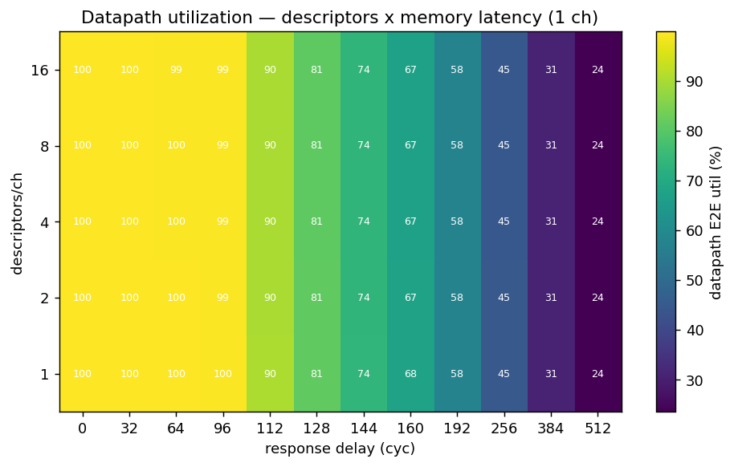

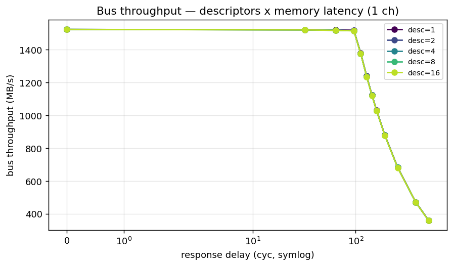

Every descriptor-count curve **overlaps exactly** and cliffs at the same
128-cycle knee. Descriptors are sequential within a channel, so they share
the single channel's 128-beat in-flight window — they add transfer
*length*, never latency *tolerance*. This is the clean complement to §4.2:
**channels widen the latency window; descriptors do not.**

### 4.4 Where the cycles go — utilization pair + bus-cycle breakdown

The methodology (`DMA_UTILIZATION_MEASUREMENT.md` §5) asks for a *pair* of
numbers — steady-state **datapath** utilization (§2.1) and **end-to-end**
utilization (§2.3) — with the gap reported as overhead. On this SRAM↔SRAM
engine with single-cycle descriptor turnaround the two track within the PMU's
resolution, so the overhead band is essentially zero: there is no descriptor-
fetch bubble to amortize.

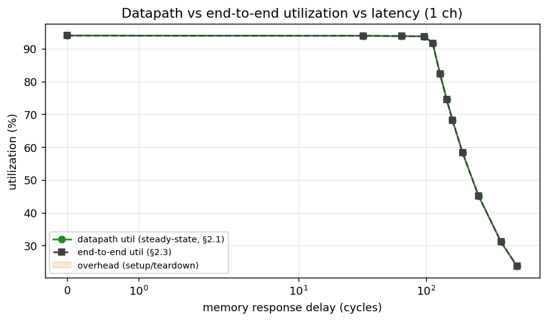

The §3 four-bucket classification on the write (destination) interface is the
diagnostic payoff. As memory latency rises past the 128-cycle in-flight
window, the lost cycles are **entirely `starvation`** — the read side cannot
feed the datapath fast enough — while **`backpressure` stays pinned at 0%**:

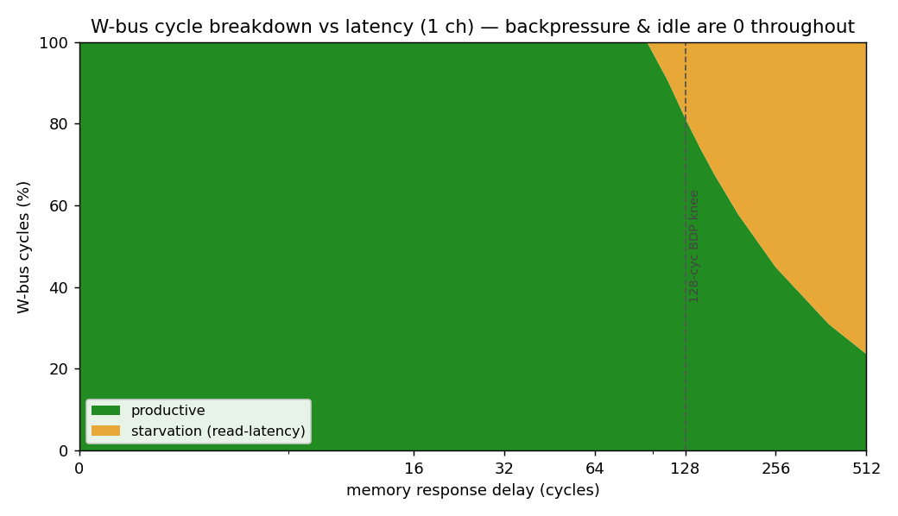

| delay (cyc) | productive | backpressure | starvation |
|---|---|---|---|
| 0–96 | ~94% | **0%** | ~6% |
| 128 | 82% | **0%** | 18% |
| 256 | 45% | **0%** | 55% |
| 512 | 24% | **0%** | 76% |

This is the engine's signature: it is **never destination-bound** (the SRAM
sink always keeps up); the only thing that throttles it is read-latency
starvation past the outstanding-transaction window — exactly the Little's-Law
behaviour of §5. The steady-state ~6% starvation at delay 0 is inter-burst
arbitration (≈1.06 cycles/beat), not a stall.

**Per-channel balance (§3.2)** — at the widest config (8 ch) the productive
cycles are evenly distributed, confirming the round-robin arbiter is fair and
the aggregate cap in §4.2 is a shared-resource limit, not channel imbalance:

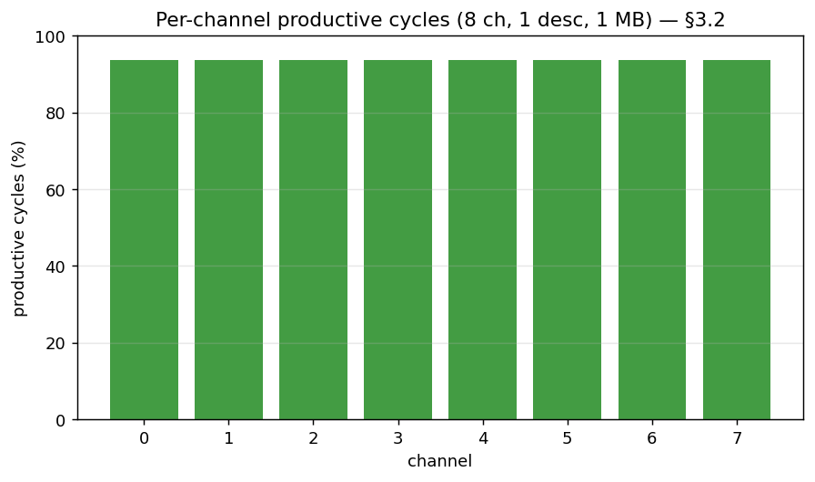

**Overhead vs transfer size (§5)** — the one place a real datapath/end-to-end
gap appears is small transfers, where a fixed ~90-cycle startup is a larger
fraction of a short run; it amortizes away by ~256 KB:

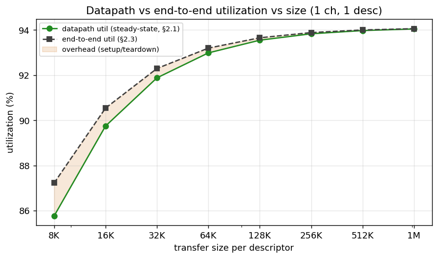

---

## 5. The architecture: Little's Law on real silicon

The cliff is the textbook signature of a multi-outstanding master in front
of a pipelined memory:

- **Below the knee (L ≤ 128):** the in-flight window covers the round
  trip; the entire latency is paid once as a pipe-fill and the rest streams
  at line rate. Adding 64 cycles of per-beat latency costs < 0.3 % of a
  1 MB run.
- **At/above the knee (L ≥ 128):** Little's Law governs —
  `BW ≈ (in_flight_beats / L) × peak`. With `in_flight = 128` and
  `peak ≈ 1435 MB/s`:

  | delay | measured (1 ch) | 128/L × 1435 | match |
  |---|---|---|---|
  | 128 | 1258 | 1435 | knee |
  | 256 | 689 | 718 | −4 % |
  | 512 | 362 | 359 | exact |
  | 1024 | 186 | 179 | +4 % |
  | 4096 | 47 | 45 | exact |

The fit tightens as `L` grows (arbitration overhead becomes a smaller
fraction). The window is `AR_MAX_OUTSTANDING (8) × burst_len (16) = 128`
beats per channel; channels scale it linearly until the shared slave caps
the aggregate (≈ 4 × in this harness).

---

## 6. What we learned

1. **The engine is back-to-back-saturated** at ~94 % of the one-direction
   AXI ceiling, flat across every descriptor count and channel count at
   1 MB. The 6 % gap is steady inter-burst arbitration, not backpressure.
2. **Descriptors are free.** Concurrent prefetch means chain length adds no
   per-descriptor cost.
3. **Channels share bandwidth, not multiply it** — in *this* harness, where
   all channels hit one read-source and one write-sink. With independent
   backing memory per channel you'd expect N× scaling; that's a follow-on.
4. **Channels buy latency tolerance.** The 128-cycle hide-window scales with
   channel count up to the shared-slave saturation point (~4 ch).
5. **Descriptors buy none.** They share a channel's outstanding window.
6. **Size matters only through startup.** A fixed ~90-cycle pipe-fill
   amortizes; ≥ 64 KB is within 2 % of peak.
7. **The timing fixes cost nothing in throughput.** These numbers match the
   pre-fix builds — the fixes bought positive slack, not regression.

---

## Appendix: data files & reproduce

| File | Sweep |
|---|---|
| `matrix_2026-06-18.json` | channels × descriptors, 40 configs, 1 MB |
| `chan_x_delay_2026-06-18.json` | channels {1,2,4,8} × delay {0..4096}, 1 desc |
| `desc_x_delay_2026-06-18.json` | desc {1,2,4,8,16} × delay {0..4096}, 1 ch |
| `size_sweep_2026-06-18.json` | 1 ch, 1 desc, 8 KB→1 MB |
| `plots/*.png` | figures above (`host/plot_char_reports.py`) — includes the §5 util-pair, §3 bucket-breakdown, and §3.2 per-channel graphs |

Every record carries the methodology primitives (§2.1 datapath + §2.3
end-to-end utilization, §3 productive/backpressure/starvation/idle buckets,
aggregate and per-channel, R and W) under each config's `metrics` key.

```bash
cd flows-stream-bridge/host && source $REPO_ROOT/env_python
P=/dev/serial/by-id/usb-Digilent_Digilent_USB_Device_210292B7D46F-if01-port0
D=0,32,64,96,112,128,144,160,192,256,384,512
# matrix (full 40-config):
python3 run_characterization.py --port $P -o ../reports/perf/matrix_2026-06-18.json
# channels x delay (1 desc, 512 KB):
python3 run_characterization.py --port $P --phase 1 --channels 1 2 4 8 --size 512KB \
    --resp-delays $D -o ../reports/perf/chan_x_delay_2026-06-18.json
# desc x delay (1 ch, 512 KB):
python3 run_characterization.py --port $P --channels 1 --size 512KB \
    --resp-delays $D -o ../reports/perf/desc_x_delay_2026-06-18.json
# size sweep: loop --size {8KB..1MB}, --channels 1 --phase 1, merge JSONs.
# plots (incl. §5 util-pair, §3 buckets, §3.2 per-channel):
python3 plot_char_reports.py --matrix ../reports/perf/matrix_2026-06-18.json \
    --chan-delay ../reports/perf/chan_x_delay_2026-06-18.json \
    --desc-delay ../reports/perf/desc_x_delay_2026-06-18.json \
    --size ../reports/perf/size_sweep_2026-06-18.json --outdir ../reports/perf/plots
# CSV from a matrix JSON (column dictionary in this appendix):
python3 perf_json_to_csv.py ../reports/perf/matrix_2026-06-18.json --out matrix.csv
```

CSV columns (current runner): `date,time,config,channels,descriptors,desc_KB,
mb_moved,bus_time_s,bus_throughput_MBps,bus_max_one_dir_MBps,
bus_max_net_moved_MBps,bus_e2e_util_pct,datapath_{R,W,E2E}_pct,
{R,W}_{prod,bp,starv}_pct,dma_time_s,throughput_MBps`. Bus-side columns are
authoritative; the two host-side columns (`dma_time_s`, `throughput_MBps`)
are transparency-only. The `16desc_*` configs trip `trace.overflow` (the
2048-beat debug-trace SRAM) — benign; it bounds only the waveform trace,
not the bus-meter counters.
