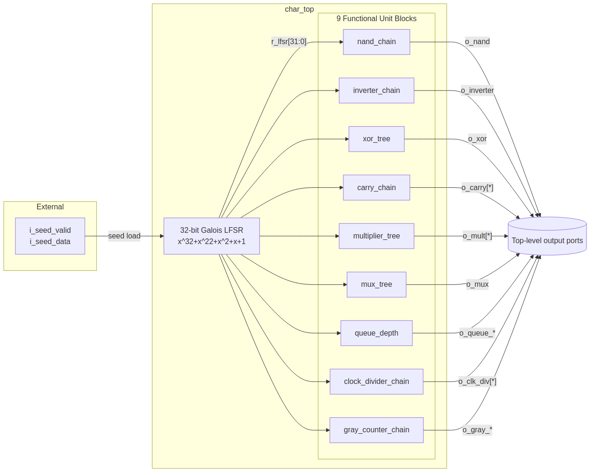
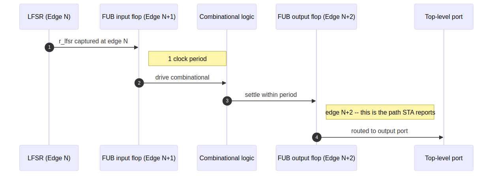
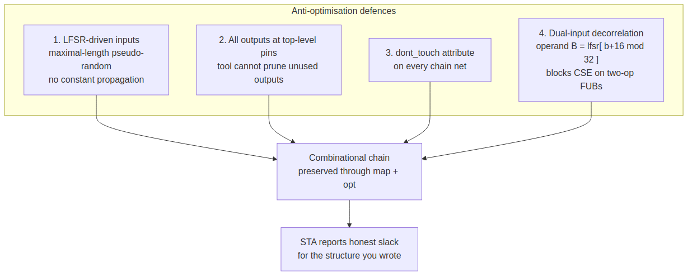
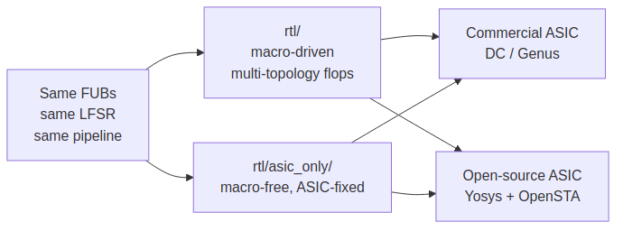
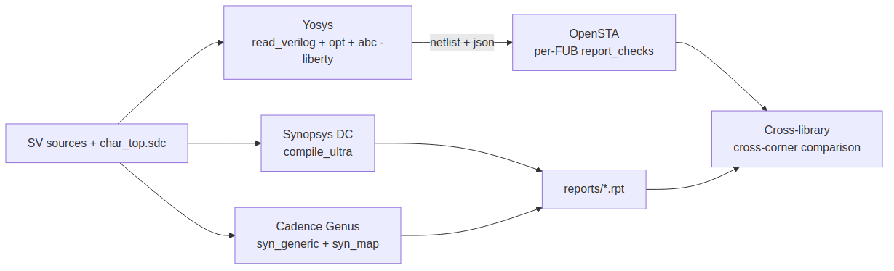
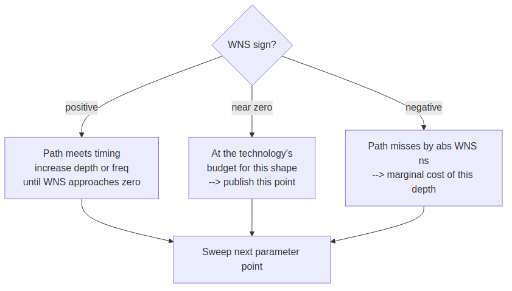
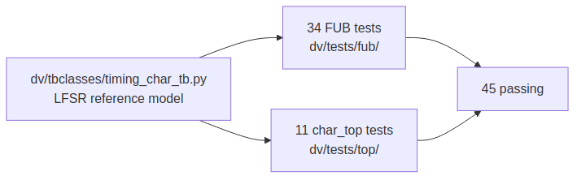

<!-- RTL Design Sherpa Documentation Header -->
<table>
<tr>
<td width="80">
  <a href="https://github.com/sean-galloway/RTLDesignSherpa">
    
  </a>
</td>
<td>
  <strong>RTL Design Sherpa</strong> · <em>Learning Hardware Design Through Practice</em><br>
  <sub>
    <a href="https://github.com/sean-galloway/RTLDesignSherpa">GitHub</a> ·
    <a href="https://github.com/sean-galloway/RTLDesignSherpa/blob/main/docs/DOCUMENTATION_INDEX.md">Documentation Index</a> ·
    <a href="https://github.com/sean-galloway/RTLDesignSherpa/blob/main/LICENSE">MIT License</a>
  </sub>
</td>
</tr>
</table>

---

<!-- End Header -->

# A Portable, Macro-Optional ASIC Timing Characterization Harness

> A practitioner's guide to `char_top` -- a benchmarking harness that
> measures combinational delay across ASIC standard-cell libraries by
> forcing the synthesis tool to build the structures we actually want
> it to build.

**Version:** 3.1 (ASAP7 worked example landed)
**Last Updated:** 2026-06-12
**Status:** RTL + verification + ASIC synthesis flows in place; ASAP7 RVT
characterization run + budget worksheet live under `work/`.
(45 tests passing; Yosys + OpenSTA + Synopsys DC + Cadence Genus drivers;
99-row ASAP7 sweep at TT/FF/SS clean.)

> An FPGA-side companion -- with the same workflow and an analogous
> spreadsheet -- is published as [`README_FPGA.md`](README_FPGA.md) in
> this same directory.  This document is ASIC-only.

---

## Abstract

The sole purpose of this methodology is to allow the designer to predict
and close timing **before synthesis ever starts**.  This flow lets the
designer characterize various structures at various technology nodes and
frequencies so that, by the time the production design enters synthesis,
each combinational shape has a known per-node, per-frequency budget --
and the answer to "will this pipeline stage close?" is already on a
table.  The same characterization run also yields an **accurate
per-structure gate count**: because the harness pins every internal net
through `dont_touch` and emits a per-FUB cell-count + area summary from
both Yosys (`build/$TOP.stat.txt`) and the commercial flows
(`report_area`), the designer gets a real, technology-mapped gate-count
estimate for any combinational shape long before the production netlist
exists.

This methodology is **explicitly proactive**.  It is not a debugger you
reach for after a synthesis run reveals a violation; it is a design-time
budget the designer (or uArch) consults *before writing the first
`always_ff`*.  The whole point is to flip the loop -- characterize once
per node, then build with a known-good budget -- so synthesis becomes a
confirmation step rather than the first time anybody finds out the
pipeline doesn't close.  Concretely, the methodology exists **to prevent,
as much as possible, the designer being surprised when synthesis
happens**: every shape on the critical path has already been measured at
this node and frequency, every gate count has already been totalled, and
the answer is on the worksheet long before the synthesis tool ever
weighs in.

`char_top` is a synthesizable harness that wraps nine **Functional Unit
Blocks (FUBs)** -- each a different shape of combinational logic -- between
registered endpoints driven by a shared 32-bit Galois LFSR.  By driving
every flop input with a maximal-length pseudo-random sequence and routing
every flop output to a top-level port, the design forecloses every
optimisation a modern synthesis tool would otherwise use to make the
benchmark disappear (constant propagation, dead-code elimination,
common-subexpression elimination, retiming-into-pads, and so on).  Within
that frozen scaffold, each FUB exposes a specific combinational pattern
(NAND tree, ripple-carry adder, mux tree, structural multiplier, ...) so
that the slack reported for its path group is a clean, comparable measure
of that pattern's depth in the target technology.

The component ships in two source-equivalent flavours, both targeted at
ASIC characterization:

- **`rtl/`** -- the default, macro-driven tree that supports compile-time
  switches for reset style (`USE_ASYNC_RESET`, `RESET_ACTIVE_HIGH`) and
  FIFO memory type.  Use this tree when the cell library has multiple
  flop topologies (sync / async reset, active-low / active-high) and
  you want one source to characterise all of them.
- **`rtl/asic_only/`** -- a macro-free fork hard-wired to async-negedge
  active-low reset.  Use this tree when the library has exactly one
  flop topology (async, active-low) and you want the source you read
  to match the gates that get built, with no preprocessor in the way.
  Ships with an open-source Yosys + OpenSTA flow plus reference scripts
  for Synopsys Design Compiler and Cadence Genus.

---

## 1. Why this harness, and not just RTL we already have?

A synthesis tool is, by design, free to delete logic whose output is
unobserved or whose input is constant.  Without explicit countermeasures
any benchmark "design" collapses to a few wires before it ever reaches
mapping.  This harness solves four problems at once:

1. it gives every standard combinational pattern (tree, chain, multiplier,
   mux, memory, counter) a **registered envelope** so STA reports the
   pattern's own delay, not an I/O delay;
2. it drives every flop input from a **shared maximal-length LFSR** so
   the tool cannot prove any input constant;
3. it routes every flop output to a **top-level port** so the tool cannot
   prune any output;
4. it carries `(* dont_touch = "true" *)` on every chain net as a
   belt-and-suspenders defence against aggressive remapping.

The result is a single source that runs through any flow you point at it
and lets you measure -- not estimate -- how a 12-level XOR tree, or a
64-bit ripple-carry adder, or a 16x16 Dadda multiplier behaves in the
target technology.

---

## 2. High-level architecture



Each FUB is gated by an `EN_*` parameter.  When disabled (`EN_*=0`) the
corresponding generate block emits a tie-to-zero and consumes zero logic
-- this is how targeted "just the multiplier" or "everything but the
FIFO" sweeps work.

---

## 3. The 3-edge pipeline

The harness deliberately registers both endpoints of every FUB's
combinational logic so STA reports slack for the register-to-register
path itself, not the I/O path.  Because the LFSR is the source for every
input, the design has a fixed three-edge pipeline:



A char_top-level testbench that compares an expected value against an
observed output sampled after rising edge C reads
`lfsr_idx = C - 2` from the reference model
(`dv/tbclasses/timing_char_tb.py:lfsr_step / lfsr_sequence`).

The LFSR in `char_top` is a **left-shift** Galois LFSR
(polynomial `0x0040_0007`).  This is architecturally different from the
right-shift tap-based Galois LFSR in `val/common/test_shifter_lfsr_galois.py`
-- do **not** reuse that model.

---

## 4. Anti-optimisation strategy



| Defence | Threat it blocks |
|---|---|
| LFSR-driven inputs | Constant propagation, dead-input elimination |
| Outputs at the pads | Dead-output elimination, sweep |
| `dont_touch` attribute | Aggressive remapping that erases internal nets |
| Dual-input decorrelation (`r_lfsr[(b+16) % 32]`) | CSE on `a OP a` |

All four work together.  Remove any one and a sufficiently aggressive
synthesis tool will find a shortcut; with all four in place the gates
you wrote are the gates that land in the netlist.

---

## 5. The FUB catalog

| FUB | File | Key parameters | Critical path | What it measures |
|---|---|---|---|---|
| `nand_chain` | `fub/nand_chain.sv` | `LEVELS`, `NUM_FLOPS` | LEVELS NAND-gate delays | Raw 2-input NAND propagation through the target technology |
| `inverter_chain` | `fub/inverter_chain.sv` | `INVERTER_COUNT` | Linear inverter chain | Best-case per-gate delay (no fan-in overhead) |
| `xor_tree` | `fub/xor_tree.sv` | `LEVELS`, `NUM_FLOPS` | LEVELS XOR delays | XOR cell vs.\ NAND cell / LUT packing |
| `carry_chain` | `fub/carry_chain.sv` | `WIDTH` | WIDTH carry-propagation delays | Dedicated carry-chain (CARRY4 / CARRY8 / ALM-carry / stdcell ripple) |
| `multiplier_tree` | `fub/multiplier_tree.sv` | `WIDTH`, `MULT_TYPE` | Reduction-tree depth | Inferred `*` (DSP) vs.\ structural Dadda / Wallace / CSA |
| `mux_tree` | `fub/mux_tree.sv` | `LEVELS`, `NUM_FLOPS` | LEVELS 2:1-mux delays | Mux-cell delay vs.\ logic-cell delay |
| `queue_depth` | `fub/queue_depth.sv` | `DATA_WIDTH`, `DEPTH` | FIFO read path + output flop | Memory inference thresholds (LUTRAM / BRAM / URAM / SRAM compiler) |
| `clock_divider_chain` | `fub/clock_divider_chain.sv` | `STAGES`, `CW`, `PICKOFF` | Counter increment + pickoff mux | Counter-based clock generation |
| `gray_counter_chain` | `fub/gray_counter_chain.sv` | `WIDTH` | Binary carry + XOR tree | Binary-to-Gray conversion delay |

Per-FUB rationale, recommended sweep ranges, and result interpretation
live in [`rtl/syn/SYNTHESIS_GUIDE.md`](rtl/syn/SYNTHESIS_GUIDE.md).

---

## 6. The two source trees

The component ships two source-equivalent trees so that the same nine
FUBs can be characterised with the right amount of preprocessor
indirection for the job.



### 6.1 `rtl/` -- the macro-driven default

The default tree includes `reset_defs.svh` and `fifo_defs.svh` so a single
source set covers every flop topology a target ASIC library might expose:

| Switch | Effect |
|---|---|
| `\`USE_ASYNC_RESET` | Include `negedge rst` in the flop sensitivity list |
| `\`RESET_ACTIVE_HIGH` | Flip reset polarity |
| `MEM_STYLE = FIFO_{AUTO,SRL,BRAM}` | Drive the inferred memory style of `gaxi_fifo_sync` |

Use this tree when the cell library you're characterising has more than
one flop topology (sync-reset cells in addition to async, or active-high
reset cells in addition to active-low) and you want a single source
sweep all of them.

### 6.2 `rtl/asic_only/` -- the macro-free ASIC fork

The asic_only fork strips all three abstractions:

- `\`include "reset_defs.svh"` and `\`include "fifo_defs.svh"` removed
- `\`ALWAYS_FF_RST(clk, rst, BODY)` rewritten to
  `always_ff @(posedge clk or negedge rst) begin BODY end`
- `\`RST_ASSERTED(rst)` rewritten to `!(rst)`
- `fifo_mem_t` parameter type replaced with `int`; `FIFO_AUTO`, `FIFO_SRL`,
  `FIFO_BRAM` inlined as `0`, `1`, `2`

The behaviour is **identical** to the upstream tree when configured for
`USE_ASYNC_RESET` + active-low; the asic_only variant just bakes that
single posture into source so every flop is one obvious `always_ff` block
and every reset condition is one `!rst_n` test.  Use this tree when:

- the target library exposes a single flop topology (async, active-low)
  anyway, so the macro switches are dead options;
- you want the source you read to match the netlist the tool builds, with
  no preprocessor gates in between;
- you want the open-source Yosys + OpenSTA flow without library-defs
  in your include path.

---

## 7. The synthesis flow



Three ASIC back ends are wired up: one open-source (Yosys + OpenSTA),
two commercial (Synopsys DC, Cadence Genus).  All three source the same
`char_top.sdc` so reports use the same path groups and are directly
comparable.

### 7.1 Open-source flow (Yosys + OpenSTA, asic_only tree)

```bash
cd projects/NexysA7/timing_characterization/rtl/asic_only/syn

# Minimal invocation -- 500 MHz, every FUB enabled
make report LIB_PATH=/path/to/stdcell.lib

# 800 MHz, no multiplier (isolates the rest of the harness)
make report LIB_PATH=/path/to/stdcell.lib \
            TARGET_FREQ_MHZ=800 EN_MULTIPLIER=0

# Just rerun STA against the existing netlist
make sta LIB_PATH=/path/to/stdcell.lib
```

Outputs land under `syn/build/`:

| File | Contents |
|---|---|
| `build/$TOP.netlist.v` | Post-mapped gate-level netlist |
| `build/$TOP.json` | Yosys JSON (for graph tools, formal, ABC reruns) |
| `build/$TOP.stat.txt` | Cell-count + area summary per Liberty |
| `build/sta.log` | Full OpenSTA log incl.\ WNS per group |
| `build/timing/GRP_*.rpt` | Per-FUB worst-path report |
| `build/area.rpt` | Hierarchical area |
| `build/yosys.log` | Synthesis trace for diffing across runs |

### 7.2 Commercial reference flows (asic_only tree)

```bash
dc_shell -f rtl/asic_only/syn/dc_synth.tcl       # Synopsys DC
genus    -files rtl/asic_only/syn/genus_synth.tcl # Cadence Genus
```

Both reference scripts source the same `char_top.sdc` and declare the
same per-FUB path groups, so reports are directly comparable to the
open-source flow's output.

---

## 8. Reading the reports

The interesting line in the OpenSTA log (or the DC / Genus equivalent)
is the per-group worst-negative-slack:

```
Path Group: GRP_NAND       WNS =  0.1234 ns
Path Group: GRP_INVERTER   WNS =  0.4567 ns
...
```

Positive WNS = the FUB meets the target frequency with that much slack
to spare.  Negative WNS = the FUB misses by that much; the absolute value
is the additional period the technology needs at this depth.



Sweep protocol:

1. Fix `TARGET_FREQ_MHZ`.
2. For each FUB, sweep its depth / width parameter until WNS crosses zero.
3. Record the parameter value at WNS = 0 -- that's the technology's
   max depth for that pattern at the chosen frequency.
4. Repeat across libraries / devices for an apples-to-apples cross-target
   view.

### 8.1 Comparing technologies

Run the same sweep against two libraries (asic_only flow):

```bash
make report LIB_PATH=lib_A.lib TARGET_FREQ_MHZ=500
mv build/timing build/timing.A

make clean
make report LIB_PATH=lib_B.lib TARGET_FREQ_MHZ=500
mv build/timing build/timing.B

diff -u build/timing.A/GRP_CARRY.rpt build/timing.B/GRP_CARRY.rpt
```

The path structures are identical; only the cell delays differ.  Any WNS
delta therefore comes purely from the technology, not from a synthesizer
mood swing or a netlist topology change.

---

## 9. Verification



| Suite | Location | Tests | Status |
|---|---|---|---|
| Per-FUB sweeps | `dv/tests/fub/` | 34 | All passing |
| `char_top` enable-mix configurations | `dv/tests/top/` | 11 | All passing |

```bash
PYTHONPATH=bin:$PYTHONPATH pytest \
    projects/NexysA7/timing_characterization/dv/tests/ -v
```

The TB class lives in `dv/tbclasses/timing_char_tb.py` and implements the
mandatory three methods (`setup_clocks_and_reset`, `assert_reset`,
`deassert_reset`); the `lfsr_step` / `lfsr_sequence` reference functions
match the left-shift LFSR baked into `char_top`.

---

## 10. Directory layout

```
projects/NexysA7/timing_characterization/
├── README.md                    <-- this file
├── CLAUDE.md                    AI assistance guide
├── PRD.md                       Product Requirements
├── TASKS.md                     Task tracking
├── assets/                      diagram sources + rendered PNGs
│   ├── Makefile                 `make` to re-render every *.mmd -> *.png
│   ├── puppeteer.json           mmdc no-sandbox config
│   ├── *.mmd                    diagram source (mermaid)
│   └── *.png                    diagram renders (embedded above)
├── docs/                        Characterization results (future)
├── dv/
│   ├── tbclasses/
│   │   └── timing_char_tb.py    TB base + LFSR reference model
│   └── tests/
│       ├── fub/                 9 FUB tests (34 parameter points)
│       └── top/                 char_top tests (11 enable-mixes)
├── work/                        <-- the worked example artifacts
│   ├── asap7_characterization.xlsx  3-sheet methodology workbook
│   ├── timing_char_sweep.py     9-primitive 2-point probe driver
│   ├── timing_char_data.csv     54-row primitive characterization data
│   ├── abc_sweep.py             11-row STREAM library sweep driver
│   ├── timings.csv              99-row per-block ASAP7 sweep output
│   ├── build_characterization_xlsx.py  CSV -> xlsx generator
│   └── merge_lib_corner.py      ASAP7 RVT Liberty merger (TT/FF/SS)
└── rtl/
    ├── common/                  shared primitives (counters, math, gaxi_fifo_sync)
    ├── fub/                     9 FUBs
    ├── filelists/char_top.f     flat source list for the multi-flow tree
    ├── top/                     char_top.sv + nand_chain_top.sv
    ├── syn/                     multi-flow SDC + SYNTHESIS_GUIDE
    └── asic_only/               <-- macro-free ASIC fork
        ├── common/              same primitives, macros expanded
        ├── fub/                 same FUBs, macros expanded
        ├── filelists/char_top.f flat source list (asic_only)
        ├── top/                 char_top.sv + nand_chain_top.sv (asic_only)
        └── syn/                 ASIC-only flow
            ├── Makefile         Yosys + OpenSTA driver
            ├── yosys_synth.ys
            ├── sta_run.tcl
            ├── dc_synth.tcl     Synopsys DC reference
            ├── genus_synth.tcl  Cadence Genus reference
            ├── char_top.sdc     ASIC-only SDC
            └── SYNTHESIS_GUIDE.md
```

### 10.1 Regenerating the diagrams

The seven figures in this document live as mermaid source in `assets/`
and are rendered to PNG by `mmdc` (`@mermaid-js/mermaid-cli`).  Re-render
after editing the source:

```bash
cd projects/NexysA7/timing_characterization/assets
make            # render every *.mmd -> *.png
make clean      # delete the PNGs
```

`assets/puppeteer.json` passes `--no-sandbox` so headless Chrome runs
inside sandboxed environments and CI runners.

---

## 11. Limitations and intentional non-features

- **No memory compiler integration.**  `queue_depth` is mapped by the
  tool to whatever the Liberty file exposes; an SRAM-compiler wrapper
  is out of scope.
- **No SDF back-annotation.**  STA against the synth Liberty is wire-load
  estimated, not parasitic-aware.  Round-trip P&R + extraction is out of
  scope of a *characterization* harness.
- **No power numbers from the open-source flow.**  Add a switching
  activity file and a power-aware Liberty to extend the OpenSTA
  invocation with `report_power`.
- **asic_only is async-reset only.**  The harness models the worst case
  (async reset path through every flop) so the cell library's reset
  recovery / removal delay is reflected in the report.  Sync-reset
  numbers come from the macro-driven `rtl/` tree with
  `USE_ASYNC_RESET` left undefined.

---

## 13. From characterization to design: the ASAP7 worked example

The methodology's design-time artifact is a single workbook with three
linked sheets:
[`work/asap7_characterization.xlsx`](work/asap7_characterization.xlsx).
It's built bottom-up against ASAP7 RVT (the same flow described in
section 7) and lets a designer answer "will this pipeline close?" by
changing one cell -- before any RTL exists for the production block.

The three sheets stack:

1. **`characterization`** -- the technology data.  Per-gate-type delay
   (NAND, XOR, MUX, CARRY, MULT, ...) at TT / FF / SS, plus Tflop, wire
   delay per metal layer, and the **Design clocks table** that names the
   clocks the design uses.
2. **`building blocks`** -- a SWAG estimator for every reusable RTL
   block (skid buffer, gaxi_fifo_sync, arbiter_round_robin,
   axi4_master_rd/wr, SRAMs).  Each row's data->D / flop->out / fmax /
   slack are formulas that look up the planning corner and freq from the
   characterization sheet.
3. **`stream`** -- a worked example: every port of every STREAM FUB
   walked by hand, one row per (FUB, port) pair.  The slack cell on each
   row is corner- and freq-aware via VLOOKUP into the clocks table.

Editing the clocks table on sheet 1 propagates to slack columns on
sheets 2 and 3.  Negative slack cells render **bold red** so failing
paths jump off the page during the sweep.

### 13.1 Sheet 1: `characterization` -- the technology data

The top of the sheet is a sweep grid: TT / FF / SS x five frequencies
(currently 2.0 / 2.25 / 2.5 / 2.75 / 3.0 GHz).  Each cell shows what's
achievable in that corner+freq combination.  The two driving rows are:

- **Per-level gate delay** (ps, freq-independent) -- the slope from a
  two-point synth probe per primitive at that corner.  This is what gets
  pulled by the downstream sheets.
- **Max combinational levels per cycle** -- the budget: `(period -
  Tflop) / per_level_delay`.  Tells you how deep a chain of that gate
  type can be before it busts the period.

| TT corner, freq sweep | NAND | XOR  | MUX  | CARRY | MULT (proxy) | GRAY_CTR | QUEUE |
|---|---|---|---|---|---|---|---|
| per-level delay (ps)  | 7.25 | 26.8 | 16.3 | 30.8  | **30.0** | 58.4 | 11.6 |
| max levels @ 2.0 GHz  | 66   | 18   | 29   | 15    | **16**   | 8    | 41    |
| max levels @ 3.0 GHz  | 43   | 12   | 19   | 10    | **10**   | 5    | 27    |

The **MULT** row is highlighted yellow on the sheet -- it doubles as
the recommended proxy for mixed-bag combinational logic (a real mult
tree contains AND, XOR, full-adder, and carry cells, so its per-level
delay blends realistically).

Below the per-corner data lives the **Design clocks table** -- one
configurable row per clock the design uses (up to six slots):

| clock name | freq (MHz) | target corner | period (ps) | input 60% | output 40% | wire/hop |
|---|---|---|---|---|---|---|
| **clk_main** | **1000** | **TT** | =1e6/B | =D*0.6 | =D*0.4 | 100 |
| (5 empty slots)| | | | | | |

Yellow cells are editable; the rest derive.  This table is what sheets
2 and 3 read -- their `slack` columns are wired here via VLOOKUP.

Last two sections on the sheet: **Wire delay per mm by metal layer**
(M2/M3 through M8/M9 -- 120 to 22 ps/mm TT), and notes.

### 13.2 Sheet 2: `building blocks` -- per-block SWAGs

One row per reusable RTL block, in two sections.  The **SRAMs** section
holds the storage primitives:

| block | params | flops | NAND_eq | data->D (TT, ps) | flop->out | slack @ clk_main |
|---|---|---|---|---|---|---|
| `SRAM (raw macro)` | W=512, D=512 | 0 | ~2110 | 7 | 7 | (depends on clock) |
| `gaxi_fifo_sync (REG=1, SRAM-backed)` | W=512, D=512 | 28 | 2188 | 7 | 7 | ... |

`flops` on the SRAM rows is the **control-only** count -- storage bits
(`W * D`) live in the BRAM/SRAM macro, not in std cells.  A reference
block below the table shows `storage = W*D` in bits and KB.

The **Building Blocks** section follows with the rest:

| block | base params | flops | NAND_eq | in mux/nand | out mux/nand | slack @ clk_main |
|---|---|---|---|---|---|---|
| `gaxi_skid_buffer` | W=1, D=2 | 6 | 18 | 1 / 1 | **0 / 0** | (computed) |
| `gaxi_fifo_sync (REG=0)` | W=1, D=2 | 6 | 40 | 1 / 2 | log2(D) / 0 | ... |
| `arbiter_round_robin` | N=2 | 4 | 16 | 0 / 1 | log2(N) / 1 | ... |
| `axi4_master_rd` | AW=DW=32, IW=4 | 212 | 848 | 1 / 1 | 1 / 1 | ... |
| `axi4_master_wr` | similar | 222 | 888 | 1 / 1 | 1 / 1 | ... |

Each row's `clock` column (yellow) defaults to `clk_main` -- change it
to point a block at a different clock entry on sheet 1.  `data->D`
covers the input-side combinational delay; `flop->out` covers the
output-side; `delay_in` defaults to 30 percent of the target period
(STA input arrival); `slack = period - delay_out - 40 percent
of period - wire_per_hop`.

Skid buffers have `out_mux = out_nand = 0` because the head flop's Q
drives the output directly -- there's no internal output muxing.  The
other blocks have non-zero output-side levels (the read mux tree on
FIFOs, the priority encoder on the arbiter, the skid output select on
the AXI masters).

### 13.3 Sheet 3: `stream` -- per-FUB port trace

This is the worked example proper: 11 STREAM FUBs, 144 rows total, one
row per `(FUB, port)` pair.  Walking
[`rtl/fub/stream_latency_bridge.sv`](../stream/rtl/fub/stream_latency_bridge.sv)
by hand gave the first ten rows; the other ten FUBs were filled in the
same way.

Each row has:

| col | content |
|---|---|
| A | FUB name |
| B | port name |
| C | clock (defaults `clk_main`; edit to point at a different clock) |
| D | direction (in / out / local) |
| E | building block crossed (if the port enters / leaves a BB) |
| F | MUX lv on this row's path |
| G | NAND lv on this row's path |
| H | source/sink flop or BB port the path terminates at |
| I | target period (VLOOKUP from clocks table) |
| J | target corner (VLOOKUP) |
| K | local delay (corner-aware: F * per_MUX(corner) + G * per_NAND(corner)) |
| L | delay_in (30 percent of target period by default; override with `=M_prev` to chain) |
| M | delay_out = delay_in + local delay |
| O | **slack = period - delay_out - output_40% - wire/hop** |
| P | places it goes (which downstream FUB / CSR / system bus consumes this) |

A `local` direction marks an internal flop hop (`r_state` -> `r_next`
inside one FUB).  39 of the 144 rows are local-flop hops; 26 cross a
building block boundary; the rest are external ports.

The "places it goes" column carries the partition story.  For example:

| FUB | port | dir | terminator | places it goes |
|---|---|---|---|---|
| `stream_latency_bridge` | `m_valid` | out | `u_skid_buffer.rd_valid (Q)` | to `sram_controller_unit.axi_wr_sram_valid` -> `axi_write_engine` |
| `scheduler` | `axi_rd_req_valid` | out | `r_axi_rd_req (Q)` | to `axi_read_engine` (per-channel request) |
| `descriptor_engine` | `descriptor_valid` | out | `i_descriptor_fifo.rd_valid (Q)` | to `scheduler` (descriptor dispatch) |

### 13.4 The workflow: planning at the spreadsheet

The whole point of the three-sheet stack is to make pipeline planning a
spreadsheet exercise:

1. Open the workbook, go to `characterization`, find the Design clocks
   table, set `clk_main` freq + corner to your target.
2. Flip to `building blocks` -- which BB rows light up red in the slack
   column?  Those are the blocks you need to either pipeline harder or
   stop relying on at this freq.
3. Flip to `stream` -- which FUB ports are red?  Those tell you which
   inter-FUB hops won't close.  The "places it goes" column maps a red
   row back to a concrete RTL location.
4. Iterate: lower the freq until everything's green (the design's actual
   ceiling); switch to FF corner to model best-case silicon; bump
   wire/hop to model long routes.

Three knobs to play with:

- **`clk_main` freq** (B29) -- walk the period; watch slack flip.
- **`clk_main` target corner** (C29) -- TT for sign-off, FF for
  best-case silicon, SS for worst-case.
- **`clk_main` wire/hop** (G29) -- default 100 ps; bump to 200-300 for
  long inter-FUB routes, drop to 0 for paths that stay inside one FUB.

Add more clocks (clk_apb, clk_cdc, ...) in slots 30-34 and re-point
specific rows on sheets 2 / 3 by editing their `clock` cell.

### 13.5 Grounding: how the data got there

The numbers on sheet 1 come from a single Python driver
[`work/timing_char_sweep.py`](work/timing_char_sweep.py) that:

1. Reads the nine `asic_only/fub/*.sv` primitives.
2. Synthesizes each at two probe sizes (small + large) per corner
   through Yosys + ABC against ASAP7 RVT, using
   [`work/merge_lib_corner.py`](work/merge_lib_corner.py)'s merged
   Liberty.
3. Reads ABC's `stime -c` output for each run to get delay (ps) and
   logic-level count.
4. Derives per-level slope and Tflop via linear extrapolation, drops
   them in [`work/timing_char_data.csv`](work/timing_char_data.csv).

Then [`work/build_characterization_xlsx.py`](work/build_characterization_xlsx.py)
turns the CSV plus hand-walked FUB tables into the three-sheet workbook.

A parallel driver [`work/abc_sweep.py`](work/abc_sweep.py) runs every
STREAM library row (11 distinct blocks) through the same Yosys + ABC
flow at TT / FF / SS x three target frequencies (99 cells, all clean,
~9 minutes wall-clock).  Output is
[`work/timings.csv`](work/timings.csv); it's the "ground truth"
measurement to calibrate the SWAGs on sheet 2 against -- the SWAG model
is first-order and underestimates real wide-bus buffering by ~10x, so
production planning should treat the spreadsheet slack as an upper
bound and lean on the CSV for the hard numbers.

### 13.6 The point

The same exercise can run against any ASIC technology you point the
flow at: rerun the per-primitive probes against a different Liberty,
regenerate the workbook, and the methodology recomputes.  The
characterization runs **once per (technology, corner)**; the rest of
the workflow is a spreadsheet.

> The same workflow runs on an FPGA target -- different delay model,
> different primitives, different gate units -- and the worksheet
> shape stays the same; only the library columns change.  That
> companion is the subject of a separate addendum README, not this
> document.

---

## 14. Navigation

- AI assistance guide: [`CLAUDE.md`](CLAUDE.md)
- Product requirements: [`PRD.md`](PRD.md)
- Task tracking: [`TASKS.md`](TASKS.md)
- Per-FUB synthesis recipes: [`rtl/syn/SYNTHESIS_GUIDE.md`](rtl/syn/SYNTHESIS_GUIDE.md)
- Multi-flow constraint file: [`rtl/syn/char_top.sdc`](rtl/syn/char_top.sdc)
- ASIC-only constraint file: [`rtl/asic_only/syn/char_top.sdc`](rtl/asic_only/syn/char_top.sdc)
- Open-source flow driver: [`rtl/asic_only/syn/Makefile`](rtl/asic_only/syn/Makefile)
- Design-time budget worksheet: [`work/asap7_characterization.xlsx`](work/asap7_characterization.xlsx)
- Workbook generator: [`work/build_characterization_xlsx.py`](work/build_characterization_xlsx.py)
- Per-primitive ASAP7 probe driver: [`work/timing_char_sweep.py`](work/timing_char_sweep.py)
- Per-block STREAM library sweep: [`work/abc_sweep.py`](work/abc_sweep.py)
- Merged ASAP7 RVT Liberty builder: [`work/merge_lib_corner.py`](work/merge_lib_corner.py)
- Primitive characterization data: [`work/timing_char_data.csv`](work/timing_char_data.csv)
- STREAM library sweep results: [`work/timings.csv`](work/timings.csv)
- Components area: [`../README.md`](../README.md)
- Repository guide: [`/CLAUDE.md`](../../../CLAUDE.md)
