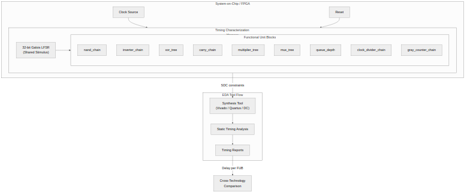

<!-- RTL Design Sherpa Documentation Header -->
<table>
<tr>
<td width="80">
  
</td>
<td>
  <strong>RTL Design Sherpa</strong> · <em>Learning Hardware Design Through Practice</em> 
  
    <a href="https://github.com/sean-galloway/RTLDesignSherpa">GitHub</a> ·
    <a href="https://github.com/sean-galloway/RTLDesignSherpa/blob/main/docs/DOCUMENTATION_INDEX.md">Documentation Index</a> ·
    <a href="https://github.com/sean-galloway/RTLDesignSherpa/blob/main/LICENSE">MIT License</a>
  
</td>
</tr>
</table>

---

<!-- End Header -->

# 2.3 System Context

## Operational Context

The Timing Characterization harness is **not a functional datapath**. It exists
purely as a synthesis target.

### Figure 2.1: System Context

The diagram shows the two operational contexts: synthesis (primary) and simulation (verification). The primary consumer of `char_top` is a synthesis tool; the primary output is timing and utilization reports.

## Simulation Context

For functional verification, the design is simulated using CocoTB with
pytest driving Verilator or Icarus Verilog. The simulation instantiates
`char_top` and verifies that outputs toggle correctly and the LFSR sequence
matches the reference model. Simulation verifies functional correctness
(data propagates through the pipeline). It does **not** measure timing --
that is the exclusive domain of synthesis.

## Relationship to Other Components

The Timing Characterization component is standalone. It does not depend on or
interface with other RTL Design Sherpa components at the system level. It does
reuse common building blocks (`counter_bin`, `gaxi_fifo_sync`, structural
multipliers) as internal dependencies.
