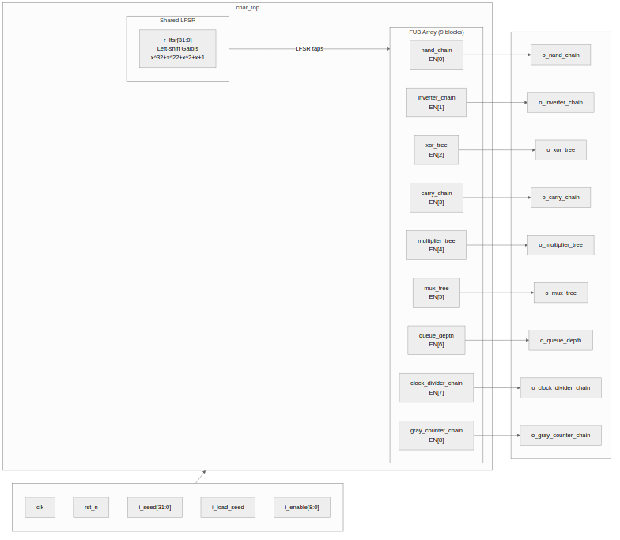
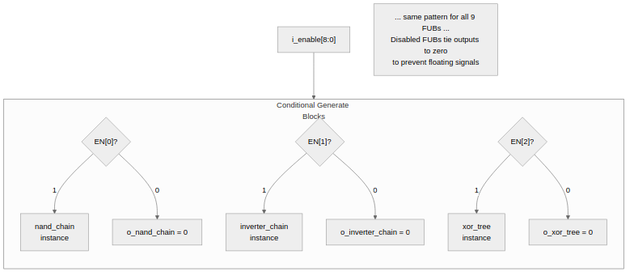

<!-- RTL Design Sherpa Documentation Header -->
<table>
<tr>
<td width="80">
  <a href="https://github.com/sean-galloway/RTLDesignSherpa">
    
  </a>
</td>
<td>
  <strong>RTL Design Sherpa</strong> · <em>Learning Hardware Design Through Practice</em><br>
  <sub>
    <a href="https://github.com/sean-galloway/RTLDesignSherpa">GitHub</a> ·
    <a href="https://github.com/sean-galloway/RTLDesignSherpa/blob/main/docs/DOCUMENTATION_INDEX.md">Documentation Index</a> ·
    <a href="https://github.com/sean-galloway/RTLDesignSherpa/blob/main/LICENSE">MIT License</a>
  </sub>
</td>
</tr>
</table>

---

<!-- End Header -->

# 3.1 Block Diagram

### Figure 3.1: char_top Block Diagram



The diagram shows the complete char_top module with its shared LFSR driving all nine FUBs, each independently enableable via i_enable[8:0].

## Block Summary

The design consists of three layers:

1. **LFSR Engine** -- Shared 32-bit pseudo-random data source
2. **FUB Array** -- Nine independently-enableable characterization blocks
3. **Output Ports** -- Direct routing from FUB output flops to top-level pins

Each FUB is wrapped in a conditional generate block controlled by its `EN_*`
parameter. When disabled, the block emits a tie-to-zero assignment and
consumes zero logic resources.

### Figure 3.2: Enable Control Flow



## Generate Block Structure

```systemverilog
generate
    if (EN_CARRY_CHAIN) begin : gen_carry
        // Input flops, combinational logic, output flops
        carry_chain #(.WIDTH(CARRY_WIDTH)) u_carry (...);
    end else begin : gen_carry
        assign o_carry = '0;
    end
endgenerate
```

This pattern repeats for all nine FUBs.
