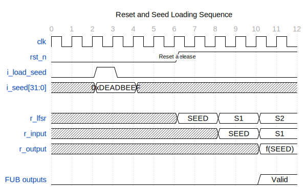

<!-- RTL Design Sherpa Documentation Header -->
<table>
<tr>
<td width="80">
  <a href="https://github.com/sean-galloway/RTLDesignSherpa">
    
  </a>
</td>
<td>
  <strong>RTL Design Sherpa</strong> · <em>Learning Hardware Design Through Practice</em><br>
  <sub>
    <a href="https://github.com/sean-galloway/RTLDesignSherpa">GitHub</a> ·
    <a href="https://github.com/sean-galloway/RTLDesignSherpa/blob/main/docs/DOCUMENTATION_INDEX.md">Documentation Index</a> ·
    <a href="https://github.com/sean-galloway/RTLDesignSherpa/blob/main/LICENSE">MIT License</a>
  </sub>
</td>
</tr>
</table>

---

<!-- End Header -->

# 4.3 Clock and Reset

## Clock

The design operates in a single clock domain (`clk`). All flip-flops --
LFSR, FUB inputs, and FUB outputs -- are clocked on the rising edge of `clk`.

There are no clock domain crossings and no internally generated clocks
(the clock_divider_chain FUB generates divided clock *signals*, not actual
clock domains -- its outputs are registered data, not clocks).

## Reset

Reset is active-low asynchronous (`rst_n`), implemented using the repository's
standard reset macros:

```systemverilog
`ALWAYS_FF_RST(clk, rst_n,
    if (`RST_ASSERTED(rst_n)) begin
        r_lfsr <= 32'hDEAD_BEEF;
    end else begin
        // normal operation
    end
)
```

### Reset Behavior

| Signal | Reset Value | Notes |
|--------|-------------|-------|
| `r_lfsr` | `0xDEAD_BEEF` | Default LFSR seed |
| FUB input flops | `'0` | All zeros |
| FUB output flops | `'0` | All zeros |
| FIFO pointers (queue_depth) | `'0` | Empty FIFO state |
| Counter values (gray, clk_div) | `'0` | Zero count |

### Figure 4.1: Reset Timing



### Reset in SDC

The SDC declares `rst_n` as a false path:

```tcl
set_false_path -from [get_ports rst_n]
```

This is appropriate because:
1. Reset is asynchronous and not timing-critical
2. All interesting paths are synchronous register-to-register
3. Reset recovery/removal is not a characterization target
