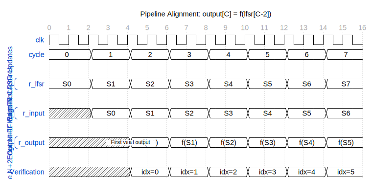

# 5.2 LFSR Reference Model

## Location

The LFSR reference model is in `dv/tbclasses/timing_char_tb.py`, alongside
the `TimingCharTB` base class.

## Functions

### `lfsr_step(state, poly=0x0040_0007)`

Single step of the 32-bit left-shift Galois LFSR:

```python
def lfsr_step(state, poly=CHAR_TOP_LFSR_POLY):
    feedback = (state >> 31) & 1
    shifted = (state << 1) & 0xFFFF_FFFF
    if feedback:
        shifted ^= poly
    return shifted
```

Matches the RTL: `r_lfsr <= {r_lfsr[30:0], 1'b0} ^ (r_lfsr[31] ? poly : 0)`

### `lfsr_sequence(seed, count, poly=0x0040_0007)`

Builds a list of LFSR states starting from a given seed:

```python
def lfsr_sequence(seed, count, poly=CHAR_TOP_LFSR_POLY):
    states = [seed]
    s = seed
    for _ in range(count - 1):
        s = lfsr_step(s, poly)
        states.append(s)
    return states
```

### `bit(val, idx)`

Extracts a single bit from an integer:

```python
def bit(val, idx):
    return (val >> idx) & 1
```

## Pipeline Alignment

### Figure 5.2: Pipeline Alignment for Verification



The output at cycle C corresponds to f(lfsr[C-2]). The verification index formula is: lfsr_idx = settle_cycles + cyc - 2.

When computing expected outputs from the LFSR sequence, account for the
3-edge pipeline latency:

```
Edge N:   r_lfsr updates to state[N]
Edge N+1: FUB input flop captures combinational from state[N]
Edge N+2: FUB output flop captures result
```

The output sampled after rising edge at cycle `C` reflects LFSR state from
cycle `C-2`:

```python
# In test_char_top.py:
lfsr_idx = settle_cycles + cyc - 2
state = lfsr_states[lfsr_idx]

# Compute expected carry output from this LFSR state
input_a = sum(bit(state, b % 32) << b for b in range(width))
input_b = sum(bit(state, (b + 16) % 32) << b for b in range(width))
expected_carry = (input_a + input_b) & ((1 << (width + 1)) - 1)
```

## Important: Not Compatible with val/common LFSR

The right-shift tap-based Galois LFSR in `val/common/test_shifter_lfsr_galois.py`
uses a fundamentally different architecture. Do **not** import or reuse that
model for timing characterization tests. Always use the functions from
`timing_char_tb.py`.
