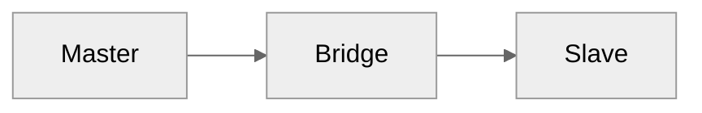
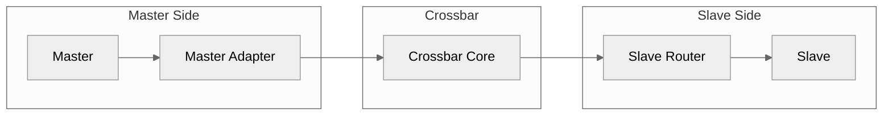
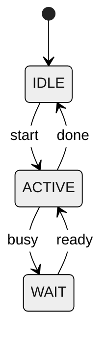
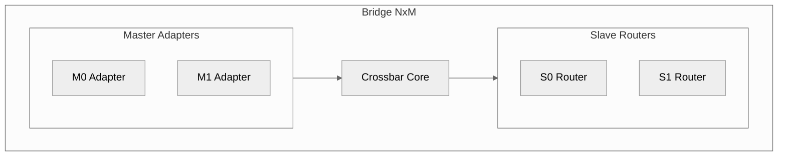
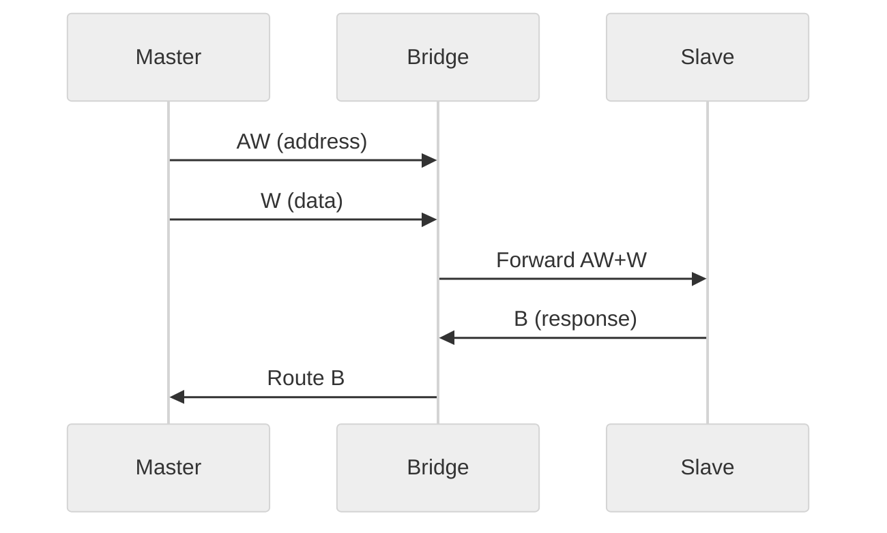

<!-- RTL Design Sherpa Documentation Header -->
<table>
<tr>
<td width="80">
  <a href="https://github.com/sean-galloway/RTLDesignSherpa">
    
  </a>
</td>
<td>
  <strong>RTL Design Sherpa</strong> · <em>Learning Hardware Design Through Practice</em><br>
  <sub>
    <a href="https://github.com/sean-galloway/RTLDesignSherpa">GitHub</a> ·
    <a href="https://github.com/sean-galloway/RTLDesignSherpa/blob/main/docs/DOCUMENTATION_INDEX.md">Documentation Index</a> ·
    <a href="https://github.com/sean-galloway/RTLDesignSherpa/blob/main/LICENSE">MIT License</a>
  </sub>
</td>
</tr>
</table>

---

<!-- End Header -->

# Component Documentation Standards

This document defines standards for all component HAS/MAS documentation (Stream, Bridge, etc.).

---

## MANDATORY REQUIREMENTS

**These requirements are NON-NEGOTIABLE. Documentation that violates these requirements will be rejected.**

### Unacceptable Practices

The following are **NEVER acceptable** in HAS/MAS documentation:

#### 1. ASCII Art Diagrams

ASCII box diagrams using characters like `+`, `-`, `|`, etc. are **UNACCEPTABLE**:

```
UNACCEPTABLE - DO NOT USE:
+------------------+     +------------------+
|   Component A    |---->|   Component B    |
+------------------+     +------------------+
```

**Why:** ASCII diagrams render poorly in PDFs, are difficult to maintain, and look unprofessional.

**Required:** Convert all diagrams to Mermaid format with **PNG output** (see Diagram Standards).

#### 2. Black/Unreadable Diagrams in PDF

Diagrams that render as black boxes, blank areas, or are otherwise unreadable in the generated PDF are **UNACCEPTABLE**.

**Common causes:**
- SVG files with embedded CSS (LibreOffice/pandoc may not render CSS correctly)
- Transparent background not supported by PDF renderer
- Incorrect theme colors with low contrast
- Missing font embedding

**Solution:** Use **PNG format** instead of SVG. PNG is a rasterized format that renders reliably in all PDF generators. Always verify diagrams render correctly in the final PDF before committing.

#### 3. Missing Table/Figure Captions

Tables and figures without proper captions are **UNACCEPTABLE**. They will not appear in the List of Tables/Figures.

**Required:** Use proper caption format (see Table Standards and Figure Caption Format sections).

#### 4. PDF Generation Script Missing Required Options

Generation scripts that omit **MANDATORY options** are **UNACCEPTABLE**. Every PDF generation script MUST include ALL of the following options.

**MANDATORY md_to_docx.py Options:**

| Option | Purpose | Consequence if Missing |
|--------|---------|------------------------|
| `--expand-index` | Process index file and inline chapters | Chapters not included |
| `--skip-index-content` | Exclude index boilerplate from output | Duplicate content in PDF |
| `--toc` | Generate Table of Contents | No navigation |
| `--number-sections` | Number sections (1, 1.1, 1.1.1) | No section numbers |
| `--title-page` | Auto-generate title page with metadata | No title page |
| `--pdf` | Generate PDF output | No PDF generated |
| `--lof` | Include List of Figures | Missing figure index |
| `--lot` | Include List of Tables | Missing table index |
| `--style FILE` | Apply corporate styling from YAML | Inconsistent formatting |

: Table: MANDATORY md_to_docx.py Options

**Minimum Required Command:**

```bash
python3 bin/md_to_docx.py \
  input_index.md \
  output.docx \
  --style styles.yaml \
  --expand-index \
  --skip-index-content \
  --toc \
  --number-sections \
  --title-page \
  --pdf \
  --lof \
  --lot
```

**Optional but Recommended:**

| Option | Purpose |
|--------|---------|
| `--narrow-margins` | More content per page (0.75in margins) |
| `--pagebreak` | Page breaks between chapters |
| `--quiet` | Reduce output verbosity |
| `--pdf-engine=lualatex` | Better font support |

: Table: Recommended md_to_docx.py Options

**DO NOT create generation scripts without ALL mandatory options. This is a HARD REQUIREMENT.**

#### 5. Styles YAML File Missing Required Sections

**CRITICAL:** The command-line options `--title-page`, `--lof`, and `--lot` only work if the styles YAML file has the corresponding sections configured. A minimal styles file will result in **missing title page and lists even with correct command-line options!**

**MANDATORY Styles File Sections:**

The styles YAML file MUST include these sections for title page and lists to work:

```yaml
# MANDATORY: Company info (used in headers/footers)
company:
  name: "RTL Design Sherpa"
  confidential_text: "Open Source - Apache 2.0 License"

# MANDATORY: Colors (used by title page and headings)
colors:
  primary: "#228B22"
  secondary: "#404040"
  light_gray: "#808080"
  white: "#FFFFFF"
  black: "#000000"

# MANDATORY: List configuration (required for --lof and --lot to work!)
lists:
  lot: true    # List of Tables
  lof: true    # List of Figures
  low: false   # List of Waveforms (optional)

# MANDATORY: Title page configuration (required for --title-page to work!)
title_page:
  enabled: true
  logo: "assets/images/logo.png"
  logo_width: 2.5
  company: "RTL Design Sherpa"
  title: "Component Name"
  subtitle: "Hardware/Micro-Architecture Specification 1.0"
  date: "January 4, 2026"
  company_color: primary
  title_color: secondary
```

**Consequence of Missing Sections:**
| Missing Section | Result |
|-----------------|--------|
| `title_page` | No title page generated (even with `--title-page`) |
| `lists.lot` | No List of Tables (even with `--lot`) |
| `lists.lof` | No List of Figures (even with `--lof`) |
| `company` | Missing header/footer metadata |
| `colors` | Title page may render incorrectly |

: Table: Consequences of Missing Styles Sections

**Reference Implementation:**

See `/projects/components/bridge/docs/bridge_has/bridge_has_styles.yaml` for a complete, working styles file.

**DO NOT use minimal styles files. This is a HARD REQUIREMENT.**

### Pre-Commit Verification Checklist

Before committing any HAS/MAS documentation changes, verify:

- [ ] **No ASCII diagrams** - Search for `+--` or `|  |` patterns
- [ ] **All diagrams readable** - Open the PDF and visually inspect EVERY diagram
- [ ] **Tables have captions** - Check List of Tables in PDF shows all tables
- [ ] **Figures have captions** - Check List of Figures in PDF shows all figures
- [ ] **No blank pages** - Scroll through entire PDF
- [ ] **Links work** - Test any cross-references
- [ ] **Title page present** - PDF has auto-generated title page with document info
- [ ] **Section numbers present** - All sections numbered (1, 1.1, 1.1.1, etc.)
- [ ] **Generation script complete** - Script includes ALL mandatory options (see above)
- [ ] **Styles file complete** - Styles YAML has `title_page` and `lists` sections (see #5 above)

### Script Validation Command

Before committing a generation script, verify it includes all mandatory options:

```bash
# Check for mandatory options in script
grep -E "(--expand-index|--skip-index-content|--toc|--number-sections|--title-page|--pdf|--lof|--lot|--style)" generate_*.sh
```

All 9 mandatory options must be present. If any are missing, the script is non-compliant.

### Enforcement

Documentation PRs will be rejected if:
1. ASCII diagrams are present
2. Any diagram renders as black/unreadable
3. List of Tables/Figures is incomplete
4. PDF has rendering artifacts
5. Title page is missing
6. Section numbers are missing
7. Generation script omits mandatory options
8. Styles YAML file missing `title_page` or `lists` sections

---

## Diagram Standards

### Mermaid Diagram Workflow

Component documentation uses **Mermaid diagrams rendered to PNG** for all architectural and flow diagrams. This ensures:
- Consistent visual style
- **Reliable PDF rendering** (PNG is rasterized, no CSS compatibility issues)
- Version-controlled source files (`.mmd` files)
- Easy maintenance and updates

**CRITICAL: Always use PNG for markdown references, not SVG!**

SVG files with embedded CSS do not render reliably in PDF generators (LibreOffice, pandoc, etc.). They often appear as black boxes. PNG files are rasterized and render correctly in all contexts.

### File Organization

```
{component}_has/                    # e.g., stream_has/, bridge_has/
  assets/
    mermaid/
      block_diagram.mmd            # Mermaid source (version controlled)
      block_diagram.svg            # SVG output (for editing/reference)
      block_diagram.png            # PNG output (USED IN MARKDOWN!)
      data_flow.mmd
      data_flow.svg
      data_flow.png                # <- Reference this in markdown!
```

**Note:** Both SVG and PNG are generated. SVG is useful for editing and high-quality scaling, but **PNG must be referenced in markdown** for reliable PDF generation.

### Creating New Diagrams

#### Step 1: Create Mermaid Source File

Create a `.mmd` file in the appropriate `assets/mermaid/` directory:



#### Step 2: Render to PNG (and SVG)

Use Mermaid CLI (`mmdc`) to render the diagram to **both PNG and SVG**:

```bash
# Generate PNG (REQUIRED for markdown references)
mmdc -i diagram.mmd -o diagram.png -t neutral -b white -p puppeteer.json

# Optionally generate SVG (for editing/high-quality scaling)
mmdc -i diagram.mmd -o diagram.svg -t neutral -b white -p puppeteer.json
```

**CRITICAL: Generate PNG files! Reference PNG in markdown!**

SVG files with embedded CSS often render as black boxes in PDF generators. PNG files are rasterized images that render reliably everywhere.

**Puppeteer Configuration:**

If running on Ubuntu 23.10+ or systems with AppArmor restrictions, create a `puppeteer.json` file:

```json
{"args": ["--no-sandbox"]}
```

Pass it with the `-p` flag or use inline:

```bash
mmdc -i diagram.mmd -o diagram.png -t neutral -b white -p /dev/stdin <<< '{"args": ["--no-sandbox"]}'
```

**Rendering Options:**
- `-t neutral` - Use neutral theme for consistent colors
- `-b white` - White background (recommended)
- `-w 1200` - Set width (optional, for larger diagrams)
- Output to `.png` - **REQUIRED for PDF compatibility**

#### Step 3: Reference PNG in Markdown

Use standard image syntax with a figure heading, **referencing the PNG file**:

```markdown
### Figure X.X: Diagram Title


```

**IMPORTANT:** Always use `.png` extension, not `.svg`!

### Diagram Types

#### Flowchart (Data Flow)

Use for data paths, signal flows, and pipeline diagrams:



#### State Diagram (FSM)

Use for finite state machines and control logic:



#### Block Diagram (Architecture)

Use for hierarchical system views:



#### Sequence Diagram (Transactions)

Use for protocol timing and transaction flows:



### Batch Rendering Script

For rendering multiple diagrams, use this pattern to generate **both SVG and PNG**:

```bash
#!/bin/bash
cd assets/mermaid

# Puppeteer config for sandbox bypass (Ubuntu 23.10+)
PCONFIG='{"args": ["--no-sandbox"]}'

for f in *.mmd; do
    base="${f%.mmd}"
    echo "Rendering $f..."

    # Generate PNG (REQUIRED for markdown/PDF)
    mmdc -i "$f" -o "${base}.png" -t neutral -b white -p /dev/stdin <<< "$PCONFIG"

    # Generate SVG (optional, for editing)
    mmdc -i "$f" -o "${base}.svg" -t neutral -b white -p /dev/stdin <<< "$PCONFIG"
done

echo "Done! Remember to reference .png files in markdown, not .svg!"
```

### Style Guidelines

1. **Theme**: Always use `neutral` theme for consistency
2. **Output Format**: Generate **PNG** for markdown references (SVG optional for editing)
3. **Background**: Use white background (`-b white`) for best contrast
4. **Labels**: Use clear, concise labels (abbreviate if needed)
5. **Direction**:
   - Use `LR` (left-right) for data flows
   - Use `TB` (top-bottom) for hierarchies
6. **Subgraphs**: Group related components logically
7. **Colors**: Let Mermaid handle colors (don't override unless necessary)

### Migration from ASCII Diagrams

When converting ASCII diagrams to Mermaid:

1. Identify the diagram type (flow, state, block, sequence)
2. Extract the logical structure and connections
3. Create the Mermaid source file (`.mmd`)
4. Render to **PNG** (and optionally SVG)
5. Update the markdown to reference the **PNG file**
6. Remove the original ASCII art
7. Verify the diagram renders correctly in the final PDF

## Figure, Table, and Waveform Caption Standards

**CRITICAL:** These formatting requirements are MANDATORY for items to appear in List of Figures, List of Tables, and List of Waveforms. The `md_to_docx.py` tool uses regex patterns to detect captions. **Incorrect formatting = missing from lists!**

---

### Figure Format (MANDATORY)

Figures MUST use the `### Figure X.X: Title` heading format to appear in the List of Figures.

**CORRECT FORMAT:**

```markdown
### Figure 2.1: APB HPET Block Diagram


```

**INCORRECT (Will NOT appear in List of Figures):**

```markdown

```

**Detection Pattern:** `^(?:[\d.]+[\t\s]+)?Figure\s+([\d.]+)[:\s]+(.+)$`

**Key Requirements:**
1. Must be a markdown heading (`###` prefix)
2. Must start with `Figure` followed by a number (e.g., `1.1`, `2.3`)
3. Must have colon `:` or space between number and title
4. The `` image line comes AFTER the heading (separated by blank line)
5. Use `.png` format for images (not SVG - PDF rendering issues)

**Numbering Convention:**
- Chapter 1 figures: `Figure 1.1`, `Figure 1.2`, ...
- Chapter 2 figures: `Figure 2.1`, `Figure 2.2`, ...
- Use consecutive numbering within each chapter

---

### Table Format (MANDATORY)

Tables MUST use the `: Table X.X: Caption` format immediately after the table to appear in the List of Tables.

**CORRECT FORMAT:**

```markdown
| Column 1 | Column 2 | Column 3 |
|----------|----------|----------|
| Data     | Data     | Data     |
| Data     | Data     | Data     |

: Table 3.1: GPIO Pin Configuration
```

**INCORRECT (Will NOT appear in List of Tables):**

```markdown
| Column 1 | Column 2 |
|----------|----------|
| Data     | Data     |

Table 3.1: GPIO Pin Configuration
```

**Detection Method:** Pandoc assigns "Table Caption" style to lines starting with `: `

**Key Requirements:**
1. Caption line starts with `: ` (colon followed by space)
2. Caption appears immediately after the table (no blank line between)
3. Use `Table X.X:` format for consistent numbering
4. Keep table markdown format (pipe tables work best)

**Numbering Convention:**
- Chapter 1 tables: `Table 1.1`, `Table 1.2`, ...
- Chapter 2 tables: `Table 2.1`, `Table 2.2`, ...

---

### Waveform Format (MANDATORY)

Waveforms (timing diagrams from WaveDrom) MUST use the `### Waveform X.X: Title` heading format to appear in the List of Waveforms.

**CORRECT FORMAT:**

```markdown
### Waveform 2.3: HPET One-Shot Timer Fire


```

**INCORRECT (Will NOT appear in List of Waveforms):**

```markdown

```

**Detection Pattern:** `^(?:[\d.]+[\t\s]+)?Waveform\s+([\d.]+)[:\s]+(.+)$`

**Key Requirements:**
1. Must be a markdown heading (`###` prefix)
2. Must start with `Waveform` followed by a number (e.g., `2.3`)
3. Must have colon `:` or space between number and title
4. The `` image line comes AFTER the heading (separated by blank line)
5. Use `.svg` format for WaveDrom timing diagrams

**When to Use Waveform vs Figure:**
- **Waveform:** Timing diagrams showing clock, signals, transactions (WaveDrom output)
- **Figure:** Block diagrams, architecture diagrams, flowcharts (Mermaid/Graphviz output)

---

### Quick Reference

| Element | Heading Format | Detection | List |
|---------|---------------|-----------|------|
| **Figure** | `### Figure X.X: Title` | Heading with "Figure" | List of Figures |
| **Table** | `: Table X.X: Title` | Paragraph after table | List of Tables |
| **Waveform** | `### Waveform X.X: Title` | Heading with "Waveform" | List of Waveforms |

: Table: Caption Format Quick Reference

### Complete Example

```markdown
## Module Architecture

This section describes the module architecture.

### Figure 2.1: APB GPIO Module Hierarchy


The figure shows the module hierarchy with the APB interface at the top.

### Block Summary

| Block | File | Description |
|-------|------|-------------|
| GPIO Top | apb_gpio.sv | Top-level module |
| Register File | apb_gpio_regs.sv | PeakRDL-generated registers |

: Table 2.1: GPIO Block Summary

### Timing Diagrams

This section shows timing for GPIO operations.

### Waveform 2.1: GPIO Direction Write


The waveform shows the APB write transaction to set GPIO direction.
```

---

### Styles YAML Requirements for Lists

The styles YAML file MUST enable the lists for them to be generated:

```yaml
# MANDATORY: Enable lists (in styles YAML file)
lists:
  lot: true    # List of Tables
  lof: true    # List of Figures
  low: true    # List of Waveforms (enable if you have timing diagrams)
```

If `lists.low: false` (or missing), waveforms will NOT appear in any list even if formatted correctly.

## PDF Generation

### Generate PDFs

Each component has generation scripts in its `docs/` directory:

```bash
# Example for Bridge
cd projects/components/bridge/docs
./generate_has_pdf.sh
./generate_mas_pdf.sh

# Example for Stream
cd projects/components/stream/docs
./generate_has_pdf.sh
./generate_pdf.sh  # For spec document

# Example for Converters
cd projects/components/converters/docs
./generate_mas_pdf.sh
```

### Using md_to_docx.py Directly

The `bin/md_to_docx.py` script converts markdown to DOCX/PDF. Here's the correct usage:

```bash
python3 bin/md_to_docx.py \
    path/to/index.md \
    output.docx \
    --style path/to/styles.yaml \
    --expand-index \
    --skip-index-content \
    --toc \
    --number-sections \
    --title-page \
    --pdf \
    --lof \
    --lot \
    --narrow-margins \
    --quiet
```

**Key Options:**

| Option | Description |
|--------|-------------|
| `--style FILE` | YAML style config for corporate DOCX styling |
| `--expand-index` | Parse index file and inline linked chapter .md files |
| `--skip-index-content` | Don't include index file content (only chapters) |
| `--toc` | Include table of contents |
| `--number-sections` | Number sections (1, 1.1, 1.1.1, etc.) |
| `--title-page` | Auto-generate a title page |
| `--pdf` | Also generate PDF with same basename |
| `--lof` | Include List of Figures after TOC |
| `--lot` | Include List of Tables after TOC |
| `--narrow-margins` | Use narrow margins (0.75in) for more content |
| `--quiet` | Reduce output verbosity |

: Table: md_to_docx.py Common Options

**Style YAML - WARNING:**

**DO NOT use minimal styles files!** The styles YAML file MUST include `title_page` and `lists` sections for title pages and lists to generate correctly. See MANDATORY REQUIREMENT #5 above for the complete required structure.

**Reference Implementation:** Copy and modify `/projects/components/bridge/docs/bridge_has/bridge_has_styles.yaml` as your starting point.

**Generation Script Template:**

```bash
#!/bin/bash
set -e

SCRIPT_DIR="$(cd "$(dirname "${BASH_SOURCE[0]}")" && pwd)"
REPO_ROOT="$(cd "$SCRIPT_DIR/../../../.." && pwd)"
DOC_DIR="$SCRIPT_DIR/component_mas"
OUTPUT_DIR="$SCRIPT_DIR"

DOCX_FILE="$OUTPUT_DIR/Component_MAS_v1.0.docx"
PDF_FILE="$OUTPUT_DIR/Component_MAS_v1.0.pdf"
STYLES_FILE="$DOC_DIR/component_mas_styles.yaml"
ASSETS="$DOC_DIR/assets"

# Verify styles file exists
if [[ ! -f "$STYLES_FILE" ]]; then
    echo "ERROR: Styles file not found: $STYLES_FILE"
    echo "Copy from: bridge/docs/bridge_has/bridge_has_styles.yaml"
    exit 1
fi

# Verify logo exists (required for title page)
if [[ ! -f "$ASSETS/images/logo.png" ]]; then
    echo "ERROR: Logo not found: $ASSETS/images/logo.png"
    echo "Copy from: bridge/docs/bridge_has/assets/images/logo.png"
    exit 1
fi

python3 "$REPO_ROOT/bin/md_to_docx.py" \
    "$DOC_DIR/component_mas_index.md" \
    "$DOCX_FILE" \
    --style "$STYLES_FILE" \
    --expand-index \
    --skip-index-content \
    --toc \
    --number-sections \
    --title-page \
    --pdf \
    --lof \
    --lot \
    --pagebreak \
    --narrow-margins \
    --pdf-engine=lualatex \
    --mainfont "Noto Serif" \
    --monofont "Noto Sans Mono" \
    --sansfont "Noto Sans" \
    --mathfont "Noto Serif" \
    --assets-dir "$ASSETS" \
    --assets-dir "$ASSETS/images" \
    --assets-dir "$ASSETS/mermaid" \
    --assets-dir "$ASSETS/wavedrom" \
    --quiet

echo "Created: $DOCX_FILE"
[[ -f "$PDF_FILE" ]] && echo "Created: $PDF_FILE"
```

### Verify Output

After generation, verify:
- Table of Contents is populated
- List of Tables shows all tables
- List of Figures shows all figures
- Images render correctly
- No broken references

## Checklist for New Documentation

- [ ] Diagrams created as Mermaid source (`.mmd` files)
- [ ] Diagrams rendered to **PNG** (and optionally SVG)
- [ ] Markdown references **PNG files** (not SVG!)
- [ ] Figure captions use `### Figure X.X:` format
- [ ] Table captions use `: Table X.X:` format
- [ ] No ASCII art diagrams (use Mermaid instead)
- [ ] Consistent numbering within chapters
- [ ] PDF generated and **diagrams verified to render correctly**
