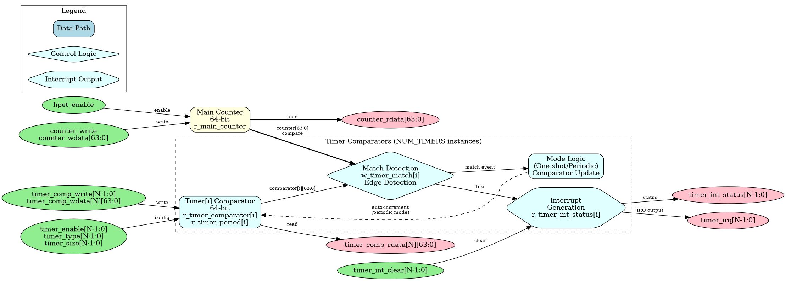
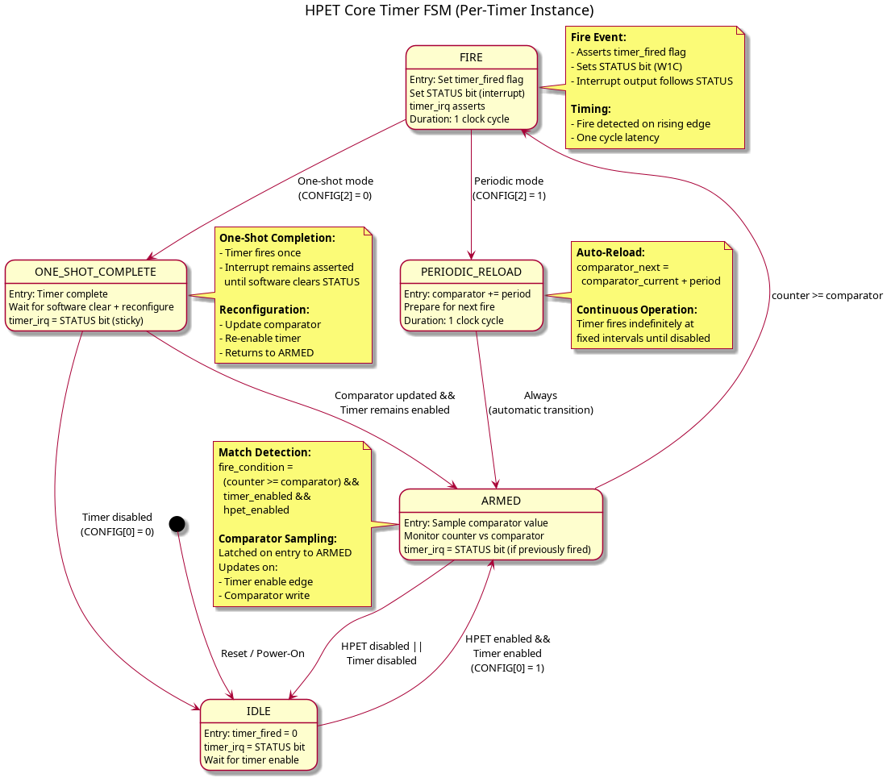

### HPET Core - Timer Logic

#### Overview

The HPET core (`hpet_core.sv`) implements the fundamental timer functionality: a 64-bit free-running counter, per-timer comparators, and interrupt generation. This module operates entirely in the `hpet_clk` domain and contains all timing-critical logic.

**Block Diagram:**



*Figure: HPET Core architecture showing main counter, timer comparators, match detection, and interrupt generation. [Source: assets/graphviz/hpet_core.gv](../assets/graphviz/hpet_core.gv) | [SVG](../assets/svg/hpet_core.svg)*

#### Key Features

- **64-bit Free-Running Counter**: Increments every HPET clock cycle, provides timestamp base
- **Configurable Timer Array**: 2, 3, or 8 independent timers (compile-time parameter)
- **64-bit Comparators**: Per-timer comparison values with full counter range
- **Dual Operating Modes**: One-shot and periodic modes per timer
- **Automatic Period Reload**: Periodic mode auto-increments comparator after each fire
- **Individual Interrupts**: Separate fire flag and interrupt output per timer
- **Counter Read/Write Access**: Software can read and write counter value via config registers

#### Interface Specification

##### Parameters

| Parameter | Type | Default | Range | Description |
|-----------|------|---------|-------|-------------|
| `NUM_TIMERS` | int | 2 | 2, 3, 8 | Number of independent timers in array |

##### Clock and Reset

| Signal Name | Type | Width | Direction | Description |
|-------------|------|-------|-----------|-------------|
| **hpet_clk** | logic | 1 | Input | HPET timer clock (counter increment) |
| **hpet_rst_n** | logic | 1 | Input | Active-low asynchronous reset |

##### Configuration Interface (from hpet_config_regs)

| Signal Name | Type | Width | Direction | Description |
|-------------|------|-------|-----------|-------------|
| **hpet_enable** | logic | 1 | Input | Global HPET enable (from HPET_CONFIG[0]) |
| **counter_write_enable** | logic | 1 | Input | Write strobe for counter |
| **counter_write_data** | logic | 64 | Input | New counter value (from HPET_COUNTER_LO/HI) |
| **timer_enable[NUM_TIMERS-1:0]** | logic | NUM_TIMERS | Input | Per-timer enable (from TIMER_CONFIG[0]) |
| **timer_int_enable[NUM_TIMERS-1:0]** | logic | NUM_TIMERS | Input | Per-timer interrupt enable (from TIMER_CONFIG[1]) |
| **timer_type[NUM_TIMERS-1:0]** | logic | NUM_TIMERS | Input | Per-timer mode: 0=One-shot, 1=Periodic |
| **timer_comparator_wr[NUM_TIMERS-1:0]** | logic | NUM_TIMERS | Input | Per-timer comparator write strobe |
| **timer_comparator_data[NUM_TIMERS-1:0]** | logic [63:0] | NUM_TIMERS×64 | Input | Per-timer comparator write data |

##### Status Interface (to hpet_config_regs)

| Signal Name | Type | Width | Direction | Description |
|-------------|------|-------|-----------|-------------|
| **counter_value** | logic | 64 | Output | Current main counter value (to HPET_COUNTER_LO/HI) |
| **timer_fired[NUM_TIMERS-1:0]** | logic | NUM_TIMERS | Output | Per-timer fire flags (to HPET_STATUS) |

##### Interrupt Interface

| Signal Name | Type | Width | Direction | Description |
|-------------|------|-------|-----------|-------------|
| **timer_irq[NUM_TIMERS-1:0]** | logic | NUM_TIMERS | Output | Per-timer interrupt outputs (active-high) |

#### Per-Timer State Machine

Each timer instance implements an identical FSM controlling its operation:



##### FSM States

| State | Encoding | Description |
|-------|----------|-------------|
| **IDLE** | Default | Timer disabled, waiting for enable signal |
| **ARMED** | Active | Timer enabled, monitoring counter vs comparator |
| **FIRE** | Transient | Timer match detected, asserting interrupt (1 cycle) |
| **PERIODIC_RELOAD** | Transient | Periodic mode: auto-increment comparator (1 cycle) |
| **ONE_SHOT_COMPLETE** | Sticky | One-shot mode: timer complete, waiting for reconfigure |

**Note:** FSM is **conceptual** - implementation uses combinational logic rather than explicit state registers for simplicity and timing.

##### State Transitions

**IDLE -> ARMED:**
- Condition: `hpet_enable && timer_enable[i]`
- Action: Latch current comparator value
- Duration: Immediate (next clock cycle)

**ARMED -> FIRE:**
- Condition: `counter_value >= timer_comparator[i]`
- Action: Assert `timer_fired[i]` flag
- Duration: 1 clock cycle (fire is edge-detected)

**FIRE -> PERIODIC_RELOAD:**
- Condition: `timer_type[i] == 1` (periodic mode)
- Action: `timer_comparator[i] <= timer_comparator[i] + timer_period[i]`
- Duration: 1 clock cycle

**FIRE -> ONE_SHOT_COMPLETE:**
- Condition: `timer_type[i] == 0` (one-shot mode)
- Action: Hold `timer_fired[i]` flag until software clears
- Duration: Until STATUS cleared or timer disabled

**PERIODIC_RELOAD -> ARMED:**
- Condition: Always (automatic)
- Action: Resume monitoring with new comparator value
- Duration: Immediate

**ONE_SHOT_COMPLETE -> ARMED:**
- Condition: Comparator updated while timer remains enabled
- Action: Resume monitoring with new comparator value
- Duration: Immediate on comparator write strobe

**ARMED/ONE_SHOT_COMPLETE -> IDLE:**
- Condition: `!hpet_enable || !timer_enable[i]`
- Action: Clear timer state, stop monitoring
- Duration: Immediate

#### Main Counter Logic

##### Counter Increment

```systemverilog
// 64-bit free-running counter
logic [63:0] r_main_counter;

always_ff @(posedge hpet_clk or negedge hpet_rst_n) begin
    if (!hpet_rst_n) begin
        r_main_counter <= 64'h0;
    end else if (counter_write_enable) begin
        // Software write to counter
        r_main_counter <= counter_write_data;
    end else if (hpet_enable) begin
        // Continuous increment when HPET enabled
        r_main_counter <= r_main_counter + 64'h1;
    end
    // else: Hold value when HPET disabled
end

// Output current counter value
assign counter_value = r_main_counter;
```

**Key Behavior:**
- **Reset**: Counter initializes to 0
- **Software Write**: Counter can be written via HPET_COUNTER_LO/HI registers
- **Increment**: Counter increments every clock when `hpet_enable = 1`
- **Overflow**: Counter wraps from 64'hFFFF_FFFF_FFFF_FFFF to 64'h0 naturally

##### Counter Timing

```
Clock:      --+ +-+ +-+ +-+ +-+ +-
hpet_clk      +-+ +-+ +-+ +-+ +-

Enable:     --------+
hpet_enable         +-------------

Counter:    [N] [N] [N+1][N+2][N+3]
r_main_counter

Latency: 1 cycle from enable to first increment
```

#### Timer Comparator Logic

##### Comparator Storage (Per-Timer)

```systemverilog
// Per-timer comparator and period storage
logic [63:0] r_timer_comparator [NUM_TIMERS-1:0];
logic [63:0] r_timer_period [NUM_TIMERS-1:0];

for (genvar i = 0; i < NUM_TIMERS; i++) begin : gen_timer_comparators
    always_ff @(posedge hpet_clk or negedge hpet_rst_n) begin
        if (!hpet_rst_n) begin
            r_timer_comparator[i] <= 64'h0;
            r_timer_period[i] <= 64'h0;
        end else if (timer_comparator_wr[i]) begin
            // Software write to comparator
            r_timer_comparator[i] <= timer_comparator_data[i];
            r_timer_period[i] <= timer_comparator_data[i];  // Store initial period
        end else if (timer_fired[i] && timer_type[i]) begin
            // Periodic mode auto-reload
            r_timer_comparator[i] <= r_timer_comparator[i] + r_timer_period[i];
        end
        // else: Hold value
    end
end
```

**Key Behavior:**
- **Reset**: Comparator and period clear to 0
- **Initial Write**: Both comparator and period latched from same write
- **Periodic Mode**: Comparator auto-increments by period value on each fire
- **One-Shot Mode**: Comparator remains constant after initial write

##### Match Detection

**64-bit Comparator Match Waveform:**


*Use [WaveDrom Editor](https://wavedrom.com/editor.html) to view/edit, or generate SVG with `wavedrom-cli`*

```systemverilog
// Per-timer match detection (combinational)
logic [NUM_TIMERS-1:0] w_timer_match;

for (genvar i = 0; i < NUM_TIMERS; i++) begin : gen_timer_match
    assign w_timer_match[i] = (r_main_counter >= r_timer_comparator[i]) &&
                              timer_enable[i] &&
                              hpet_enable;
end
```

**Match Conditions:**
- Counter value >= comparator value
- Timer individually enabled (`timer_enable[i] = 1`)
- HPET globally enabled (`hpet_enable = 1`)

#### Timer Fire Logic

##### Fire Detection (Rising Edge)

```systemverilog
// Per-timer previous match state for edge detection
logic [NUM_TIMERS-1:0] r_timer_match_prev;

always_ff @(posedge hpet_clk or negedge hpet_rst_n) begin
    if (!hpet_rst_n) begin
        r_timer_match_prev <= '0;
    end else begin
        r_timer_match_prev <= w_timer_match;
    end
end

// Rising edge detection: fire on transition from no-match to match
logic [NUM_TIMERS-1:0] w_timer_fire_edge;

for (genvar i = 0; i < NUM_TIMERS; i++) begin : gen_timer_fire_edge
    assign w_timer_fire_edge[i] = w_timer_match[i] && !r_timer_match_prev[i];
end
```

**Fire Edge Timing:**
```
Clock:      --+ +-+ +-+ +-+ +-+ +-
hpet_clk      +-+ +-+ +-+ +-+ +-

Counter:    [99][100][101][102][103]
r_main_counter

Comparator:      [100]
                (constant)

Match:      ------+
w_timer_match     +-----------

Match Prev: --------+
r_timer_match_prev  +---------

Fire Edge:  ----+ +-
w_timer_fire_edge +-

Fired Flag: ----+
timer_fired[i]  +-------------

Note: Fire edge is 1-cycle pulse on rising edge of match
```

##### Fire Flag Management

```systemverilog
// Per-timer fired flag (sticky in one-shot mode, pulse in periodic mode)
logic [NUM_TIMERS-1:0] r_timer_fired;

for (genvar i = 0; i < NUM_TIMERS; i++) begin : gen_timer_fired
    always_ff @(posedge hpet_clk or negedge hpet_rst_n) begin
        if (!hpet_rst_n || !timer_enable[i]) begin
            r_timer_fired[i] <= 1'b0;
        end else if (w_timer_fire_edge[i]) begin
            r_timer_fired[i] <= 1'b1;  // Set on fire edge
        end else if (!timer_type[i]) begin
            // One-shot mode: hold fired flag until software clears STATUS
            r_timer_fired[i] <= r_timer_fired[i];  // Sticky
        end else begin
            // Periodic mode: clear after 1 cycle (pulse)
            r_timer_fired[i] <= 1'b0;
        end
    end
end

// Output fire flags to config regs (connect to HPET_STATUS)
assign timer_fired = r_timer_fired;
```

**Fire Flag Behavior:**
- **One-Shot Mode**: Sticky (remains 1 until STATUS cleared by software)
- **Periodic Mode**: Pulse (1 cycle per fire, auto-clears)

#### Interrupt Generation

**Interrupt Generation and Acknowledgment Waveform:**


*Use [WaveDrom Editor](https://wavedrom.com/editor.html) to view/edit, or generate SVG with `wavedrom-cli`*

##### Interrupt Output Logic

```systemverilog
// Per-timer interrupt output (combinational, follows STATUS register)
for (genvar i = 0; i < NUM_TIMERS; i++) begin : gen_timer_irq
    assign timer_irq[i] = timer_fired[i] && timer_int_enable[i];
end
```

**Interrupt Behavior:**
- **Combinational**: Interrupt follows fire flag (no additional latency)
- **Maskable**: `timer_int_enable[i]` from TIMER_CONFIG[1] gates interrupt
- **Sticky (One-Shot)**: Interrupt remains asserted until STATUS cleared
- **Pulse (Periodic)**: Interrupt pulses on each fire event

**Interrupt Clearing:**
Software clears interrupts by writing 1 to corresponding HPET_STATUS bit (W1C). The `timer_fired` flag is managed in `hpet_config_regs` wrapper, not in hpet_core.

#### Periodic Mode Details

**Periodic Timer Waveform:**


*Use [WaveDrom Editor](https://wavedrom.com/editor.html) to view/edit, or generate SVG with `wavedrom-cli`*

##### Period Storage and Auto-Reload

**Initial Comparator Write:**
```
Software writes: TIMER0_COMPARATOR = 1000
Result:
  r_timer_comparator[0] = 1000
  r_timer_period[0] = 1000  (also latched)
```

**First Fire (at counter = 1000):**
```
Fire edge detected
-> timer_fired[0] asserts
-> Comparator auto-reloads:
  r_timer_comparator[0] = 1000 + 1000 = 2000
```

**Second Fire (at counter = 2000):**
```
Fire edge detected
-> timer_fired[0] asserts
-> Comparator auto-reloads:
  r_timer_comparator[0] = 2000 + 1000 = 3000
```

**Process repeats indefinitely until timer disabled**

##### Periodic Mode Timing Example

```
Clock Cycles:   0   1000 1001 2000 2001 3000 3001 ...

Counter:        0 -> 1000 1001 2000 2001 3000 3001 ...

Comparator:     [1000] [2000] [3000] [4000] ...
                   ↑      ↑      ↑
                Fire 1  Fire 2  Fire 3

timer_fired:    --+ +-+ +-+ +-...
                  +-+ +-+ +-

timer_irq:      --+ +-+ +-+ +-...
                  +-+ +-+ +-

Period = 1000 HPET clock cycles (constant)
```

#### One-Shot Mode Details

**One-Shot Timer Waveform:**


*Use [WaveDrom Editor](https://wavedrom.com/editor.html) to view/edit, or generate SVG with `wavedrom-cli`*

##### Fire-Once Behavior

**Initial Comparator Write:**
```
Software writes: TIMER0_COMPARATOR = 5000
Result:
  r_timer_comparator[0] = 5000
  (period not used in one-shot mode)
```

**Fire Event (at counter = 5000):**
```
Fire edge detected
-> timer_fired[0] asserts (sticky)
-> Comparator remains at 5000 (no auto-reload)
-> Interrupt remains asserted
```

**Interrupt Clearing:**
```
Software writes: HPET_STATUS[0] = 1 (W1C)
Result:
  timer_fired[0] clears
  timer_irq[0] clears
```

**Reconfiguration:**
```
Software writes: TIMER0_COMPARATOR = 10000
Result:
  r_timer_comparator[0] = 10000
  Timer re-arms, waits for counter = 10000
```

##### One-Shot Mode Timing Example

```
Clock Cycles:   0   5000 5001 5002 ...

Counter:        0 -> 5000 5001 5002 ...

Comparator:     [5000] [5000] [5000] ...
                   ↑
                Fire (once)

timer_fired:    --+
                  +-------------... (sticky until SW clear)

timer_irq:      --+
                  +-------------... (follows fired flag)

Software Write: ------+ +-
HPET_STATUS[0]=1      +-

timer_fired:    --+     +-
(after clear)     +-----+

Fire only once, interrupt sticky until software clear
```

#### Resource Utilization

**Per-Timer Resources (Estimated):**
- 64-bit comparator register: 64 flip-flops
- 64-bit period register: 64 flip-flops
- Match comparator: 64-bit >= comparison (~80 LUTs)
- Fire edge detection: 2 flip-flops + XOR gate
- Total per timer: ~128 flip-flops, ~85 LUTs

**Shared Resources:**
- 64-bit main counter: 64 flip-flops + 64-bit adder (~70 LUTs)
- Global enable logic: ~10 LUTs

**Total (NUM_TIMERS = 3):**
- Flip-flops: 64 + (128 × 3) = 448 FF
- LUTs: 80 + (85 × 3) = 335 LUTs

---

**Next:** [Chapter 2.2 - hpet_config_regs](02_hpet_config_regs.md)
